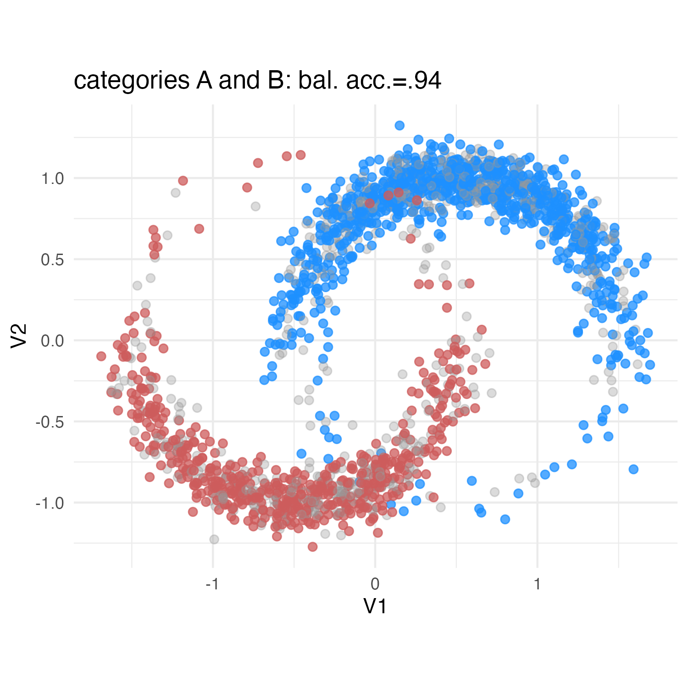
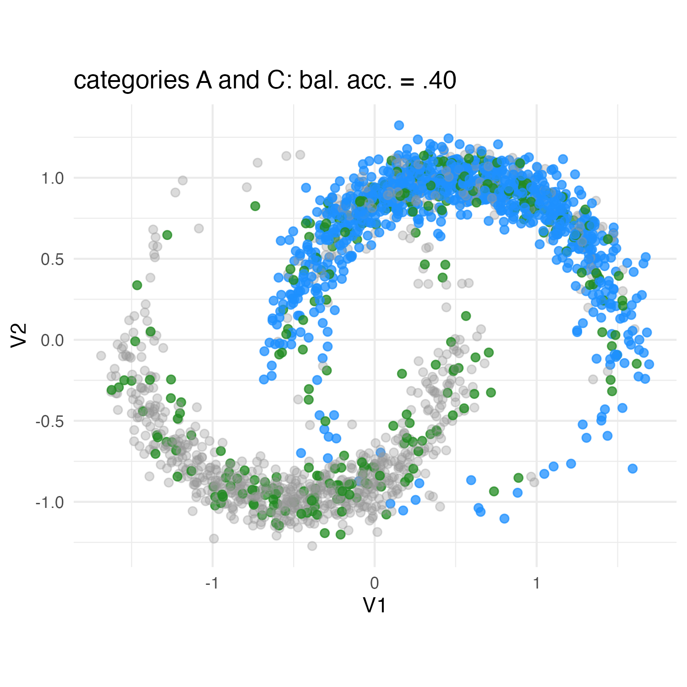
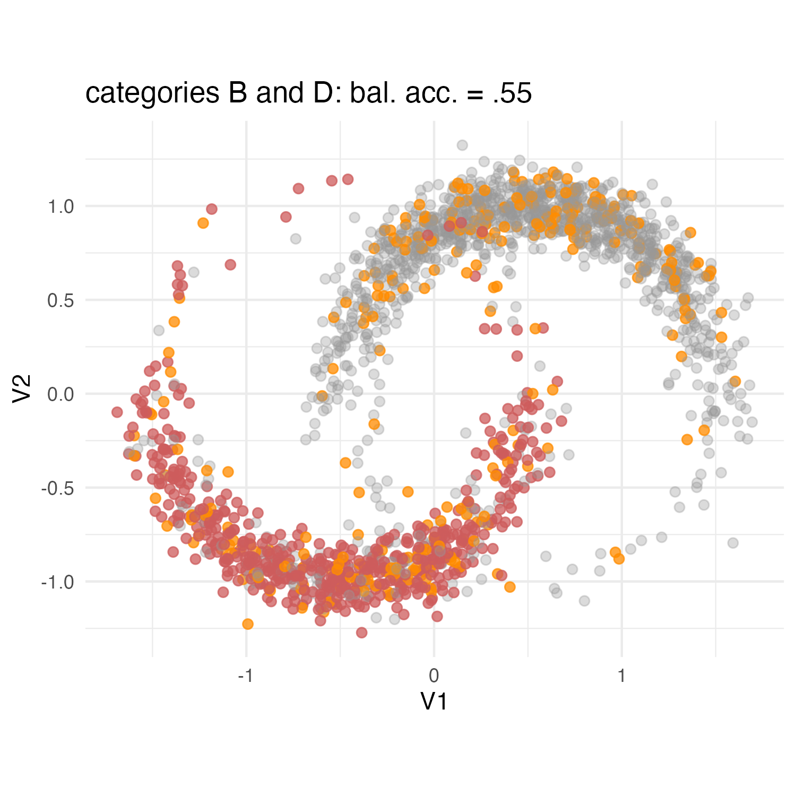
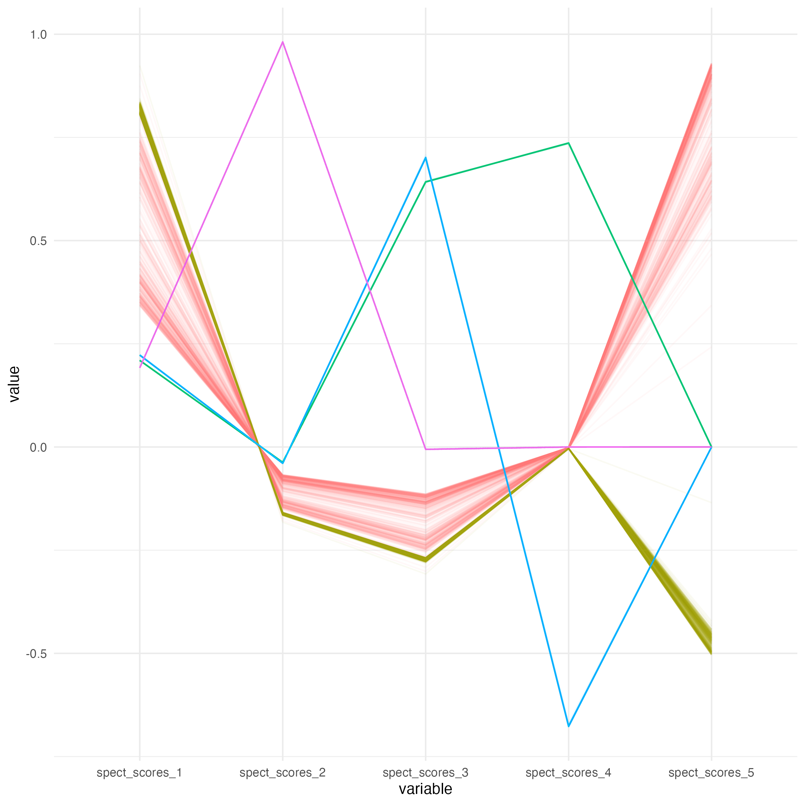
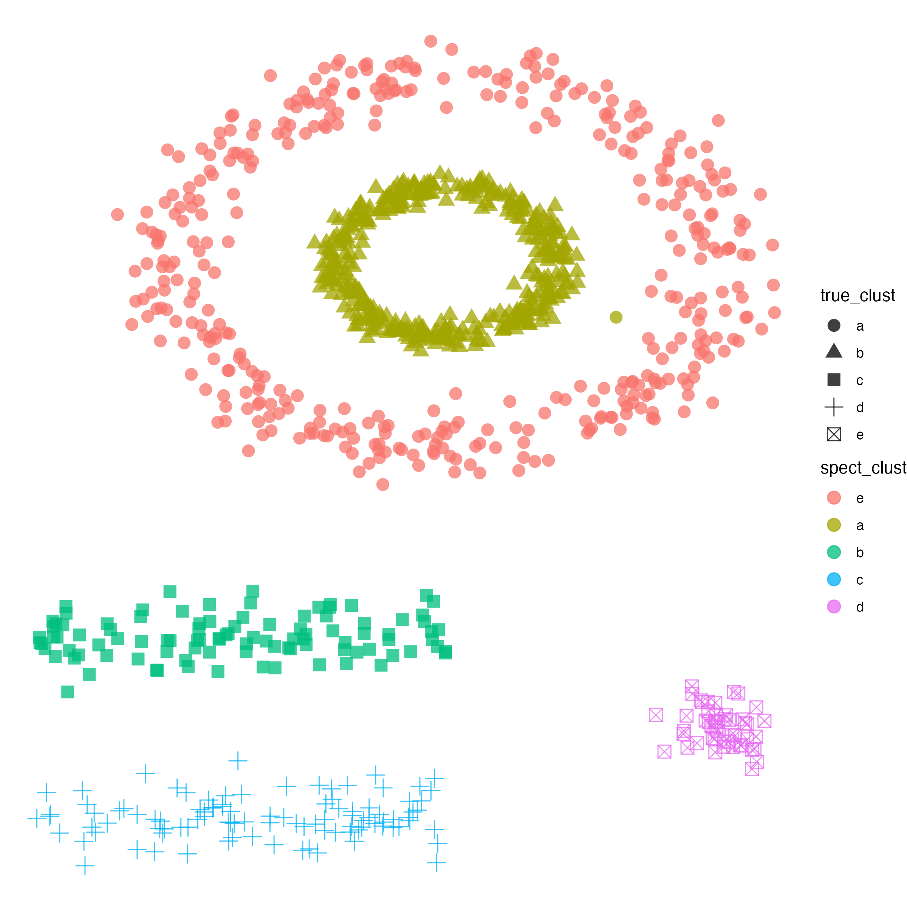
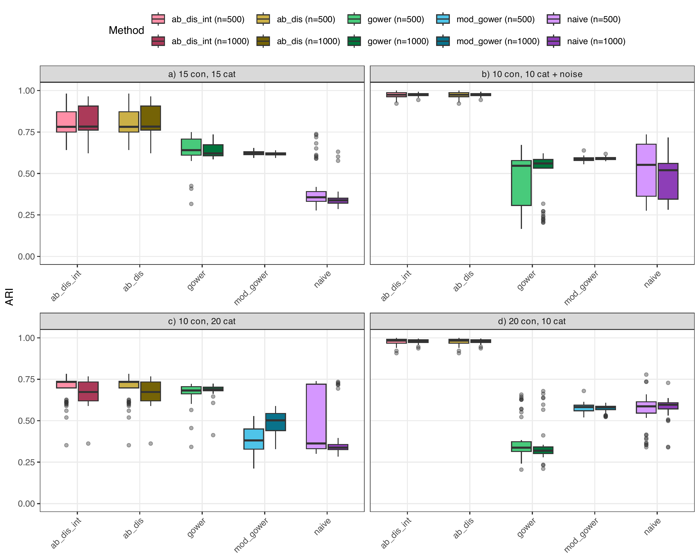
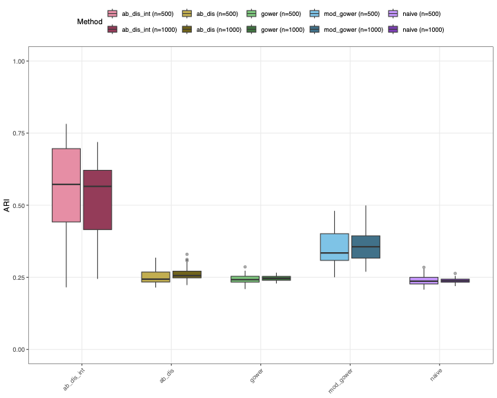
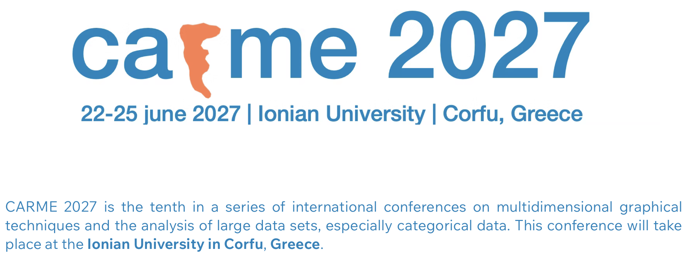

```{r}
#| include: false

library(tidyverse)
library(tidymodels)
library(ggrepel)
library(network)
library(sna)
library(GGally)
library(knitr)
library(kableExtra)
library(conflicted)
devtools::load_all("../manydist")

conflicts_prefer(dplyr::filter)
conflicts_prefer(dplyr::lag)
conflicts_prefer(base::attr)
```


## Distance-based learning with mixed data {.outline-slide}


### Line of work: increasing **awareness** in distance construction

::: {.outline-boxes}

::::: {.outline-grid-2x2}

::::{.fragment}
::: {.outline-box .outline-highlight}
**Scale/type-aware**  
Additivity, commensurability, and bias in mixed data
:::
::::

::::{.fragment}
::: {.outline-box .outline-highlight}
**Association-aware**  
Redundancy, correlations, and categorical associations
:::
::::

::::{.fragment}
::: {.outline-box .outline-highlight}
**Interaction-aware**  
Continuous–categorical relationships and local neighbourhood structure
:::
::::

::::{.fragment}
::: {.outline-box .outline-highlight}
**Response-aware**  
Supervised neighbourhoods and prediction-oriented distances
:::
::::

:::::

::::{.fragment}
::: {.outline-box .outline-4 .outline-highlight .outline-with-small-logo}
{.outline-small-logo}

::: {.outline-text}
**Building distance-based pipelines: `manydist`**^[@manydist]  
Distance construction, diagnostics, and learning workflows
:::
:::
::::
:::

## Today’s focus {.outline-slide}

### Line of work: increasing **awareness** in distance construction

::::: {.outline-boxes}

:::: {.outline-grid-2x2}

::: {.outline-box .outline-muted}
**Scale/type-aware**  
Additivity, commensurability, and bias in mixed data
:::

::: {.outline-box .outline-highlight}
**Association-aware**  
Redundancy, correlations, and categorical associations
:::

::: {.outline-box .outline-highlight}
**Interaction-aware**  
Continuous–categorical relationships and local neighbourhood structure
:::

::: {.outline-box .outline-muted .outline-with-note}
::: {.outline-text}
**Response-aware**  
Supervised neighbourhoods and prediction-oriented distances
:::

::: {.hand-note}
⤺ Carlo's talk
:::
:::

::::

::: {.outline-box .outline-muted .outline-with-small-logo .outline-with-note}


::: {.outline-text}
**Building distance-based pipelines: `manydist`^[@manydist]**  
Distance construction, diagnostics, and learning workflows
:::

::: {.hand-note}
⤺ Angelos' talk
:::
:::

:::::


# setup


<!-- ## Learning from mixed-type data -->

<!-- Many statistical learning methods rely, explicitly or implicitly, on **comparing observations**. -->


<!-- - If the data are mixed-type, then comparison is **not straightforward**: -->

<!-- &nbsp; -->

<!-- ::: {.columns} -->

<!-- ::: {.column width="33%"} -->

<!-- ::: {.callout-note appearance="simple" icon=false} -->
<!-- ## Scale -->

<!-- How do we compare variables measured in different units? -->
<!-- ::: -->

<!-- ::: -->

<!-- ::: {.column width="33%"} -->

<!-- ::: {.callout-tip appearance="simple" icon=false} -->
<!-- ## Type -->

<!-- How do we combine numerical differences with category mismatches? -->
<!-- ::: -->

<!-- ::: -->

<!-- ::: {.column width="33%"} -->

<!-- ::: {.callout-important appearance="simple" icon=false} -->
<!-- ## Structure -->

<!-- How do we avoid counting associated information multiple times? -->
<!-- ::: -->

<!-- ::: -->

<!-- ::: -->

<!-- &nbsp; -->


<!-- :::{.fragment .centered} -->
<!-- ### the aim is to compare observations while accounting for scale, type, and **structure** -->
<!-- ::: -->


## Learning from distances

Many learning methods can operate directly on a dissimilarity matrix.

::: {.columns}

::: {.column width="33%"}

::: {.callout-tip appearance="simple" icon=false}
## Dimension reduction

Multidimensional scaling (MDS)^[@borg2005modern]
:::

:::

::: {.column width="33%"}

::: {.callout-tip appearance="simple" icon=false}
## Clustering methods

Hierarchical clustering (HC), PAM^[@kaufman2009finding], and **spectral clustering**^[@ng2002spectral]
:::

:::

::: {.column width="33%"}

::: {.callout-tip appearance="simple" icon=false}
## Nearest-neighbour prediction

Nearest-neighbour classification and nearest-neighbour averaging for regression
:::

:::

:::


:::{.fragment .centered}
### choosing a different [distance]{.text-coral} can lead to a different downstream analysis result
:::


## Mixed-data setup

::: {.callout-tip appearance="simple" icon=false}
## a [mixed]{.text-teal} data set

-   $I$ observations described by $Q$ variables,  $Q_{n}$ numerical  and $Q_{c}$ categorical

-   the $I\times Q$ data matrix ${\bf X}=\left[{\bf X}_{n},{\bf X}_{c}\right]$ is column-wise partitioned
:::


A formulation for mixed distance between observations $i$ and $\ell$:

\begin{eqnarray}\label{genmixeddist_formula}
    d\left(\mathbf{x}_i,\mathbf{x}_\ell\right)&=& \sum_{j_n=1}^{Q_n} d_{j_n}\left(\mathbf{x}^n_i,\mathbf{x}^n_\ell\right)+ \sum_{j_c=1}^{Q_c} d_{j_c}\left(\mathbf{x}^c_i,\mathbf{x}^c_\ell\right)=\\
    &=& \sum_{j_n=1}^{Q_n} w_{j_n} \delta^n_{j_n}\left(\mathbf{x}^n_i,\mathbf{x}^n_\ell\right)+ \sum_{j_c=1}^{Q_c} w_{j_c}\delta^c_{j_c}\left(\mathbf{x}^c_i,\mathbf{x}^c_\ell\right)
\end{eqnarray}


:::{.fragment .centered}
### a by-variable weighted sum of dissimilarities
:::


## Independence-based distances

::: {.callout-note appearance="simple" icon=false}
## [Independence-based]{.text-teal} pairwise distance

No inter-variable relations are considered.

- in the continuous case: **Euclidean** or **Manhattan** distances

- in the categorical case: **Hamming** / matching distance, among many others

- in the mixed-data case: **Gower** dissimilarity index


:::


::: {.callout-tip appearance="simple" icon=false}
## Beyond commensurability
commensurability makes variable contributions comparable across **scales** and data **types**^[@vdv_jcgs].

- If variables are correlated or associated, the same information may contribute repeatedly to the distance: **redundancy**
:::


#  Association-aware distances

## by variable differences: **independence-based**


-  When variables are correlated or associated, shared information is
effectively counted multiple times 

- inflated dissimilarities may cause potential distortions in downstream unsupervised learning tasks.


```{r}
library(tidyverse)
library(ggrepel)

cars_sel <- c("Toyota Corolla", "Cadillac Fleetwood")

mtcars_tbl <- mtcars |>
  rownames_to_column("car") |>
  mutate(
    disp_z = as.numeric(scale(disp)),
    wt_z   = as.numeric(scale(wt))
  )

# standardized matrix (consistent baseline)
Z <- mtcars_tbl |> select(disp_z, wt_z) |> as.matrix()

# Euclidean distance between selected cars (on standardized data)
seg_eucl <- mtcars_tbl |>
  dplyr::filter(car %in% cars_sel) |>
  summarise(
    x    = disp_z[car == cars_sel[1]],
    y    = wt_z[car == cars_sel[1]],
    xend = disp_z[car == cars_sel[2]],
    yend = wt_z[car == cars_sel[2]],
    dist = sqrt((xend - x)^2 + (yend - y)^2)
  )

# Mahalanobis whitening (orientation-preserving) on standardized data
S <- cov(Z)
eig <- eigen(S)
U <- eig$vectors
D <- diag(eig$values)

W_pca <- Z %*% U %*% diag(1 / sqrt(diag(D))) %*% t(U)

whitened_tbl <- mtcars_tbl |>
  mutate(
    w1 = W_pca[, 1],
    w2 = W_pca[, 2]
  )

# segment in whitened space (Euclidean here == Mahalanobis in original standardized space)
seg_mah <- whitened_tbl |>
  dplyr::filter(car %in% cars_sel) |>
  summarise(
    x    = w1[car == cars_sel[1]],
    y    = w2[car == cars_sel[1]],
    xend = w1[car == cars_sel[2]],
    yend = w2[car == cars_sel[2]],
    dist = sqrt((xend - x)^2 + (yend - y)^2)
  )
```

```{r}
ggplot(mtcars_tbl, aes(x = disp, y = wt)) +
  geom_point(size = 2) +
  labs(
    x = "Displacement (cu. in.)",
    y = "Weight (1000 lbs)",
    title = "Redundant continuous variables: displacement and weight",
    subtitle = "Larger cars tend to have both higher displacement and weight"
  ) +
  theme_minimal(base_size = 10)
```


## by variable differences: **independence-based**


-  When variables are correlated or associated, shared information is
effectively counted multiple times 

- inflated dissimilarities may cause potential distortions in downstream unsupervised learning tasks.


```{r}
ggplot(mtcars_tbl, aes(x = disp_z, y = wt_z)) +
  geom_point(size = 2) +
  stat_ellipse(type = "norm", level = 0.68, linewidth = .5,alpha=.25,color="indianred") +
  coord_equal() +
  labs(
    x = "Displacement (z-score)",
    y = "Weight (z-score)",
    title = "Same data after standardization",
    subtitle = "Units removed, redundancy remains"
  ) +
  theme_minimal(base_size = 10)
```


## by variable differences: **independence-based**

The [Euclidean distance]{style="color:#2A9D8F"}   $\longrightarrow$  shared information is  over-counted

```{r}
ggplot(mtcars_tbl, aes(x = disp_z, y = wt_z)) +
  geom_point(size = 2, color = "grey70") +
  stat_ellipse(type = "norm", level = 0.68, linewidth = .5,alpha=.25,color="indianred") +
  geom_point(
    data = dplyr::filter(mtcars_tbl, car %in% cars_sel),
    aes(color = car),
    size = 3
  ) +
  geom_segment(
    data = seg_eucl,
    aes(x = x, y = y, xend = xend, yend = yend),
    linewidth = 1,
    arrow = arrow(length = unit(0.15, "cm")),
    inherit.aes = FALSE
  ) +
  geom_text_repel(
    data = dplyr::filter(mtcars_tbl, car %in% cars_sel),
    aes(label = car, color = car),
    size = 4,
    box.padding = 0.3,
    point.padding = 0.3,
    max.overlaps = Inf,
    show.legend = FALSE
  ) +
  geom_label(
    data = seg_eucl,
    aes(x = (x + xend)/2, y = (y + yend)/2, label = paste0("d_E = ", round(dist, 2))),
    inherit.aes = FALSE,
    label.size = 0,
    alpha = 0.85
  ) +
  coord_equal() +
  labs(
    x = "Displacement (z-score)",
    y = "Weight (z-score)",
    title = "Euclidean distance (standardized) overcounts redundant information",
    subtitle = "Differences along the shared 'size' direction are counted twice"
  ) +
  theme_minimal(base_size = 10) +
  theme(legend.position = "none")
```


## accounting for inter-variable relations: **association-based**

The **Mahalanobis distance**  $\longrightarrow$ shared information is not over-counted


```{r}
ggplot(whitened_tbl, aes(w1, w2)) +
  geom_point(size = 2, color = "grey70") +
  stat_ellipse(type = "norm", level = 0.68, linewidth = .5,alpha=.25,color="#2A9D8F") +
  geom_point(
    data = dplyr::filter(whitened_tbl, car %in% cars_sel),
    aes(color = car),
    size = 4
  ) +
  geom_segment(
    data = seg_mah,
    aes(x = x, y = y, xend = xend, yend = yend),
    linewidth = 1,
    arrow = arrow(length = unit(0.15, "cm")),
    inherit.aes = FALSE
  ) +
  geom_text_repel(
    data = dplyr::filter(whitened_tbl, car %in% cars_sel),
    aes(label = car, color = car),
    size = 4,
    box.padding = 0.35,
    point.padding = 0.3,
    max.overlaps = Inf,
    show.legend = FALSE
  ) +
  geom_label(
    data = seg_mah,
    aes(x = (x + xend)/2, y = (y + yend)/2, label = paste0("d_M = ", round(dist, 2))),
    inherit.aes = FALSE,
    label.size = 0,
    alpha = 0.85
  ) +
  labs(
    title = "Mahalanobis whitening",
    subtitle = "with preserved orientation (computed on standardized variables)",
    x = "whitened dim 1",
    y = "whitened dim 2"
  ) +
  coord_equal() +
  theme_minimal(base_size = 10) +
  theme(legend.position = "none")
```

:::{.fragment .centered}
this is an **association-based** distance for continuous data
:::

## **association-based** distance


:::{.callout-note  title="Association-based for continuous: <span style='color: #E76F51;'>Mahalanobis distance</span>" icon=false}
 
Let ${\bf X}_{n}$  be $I\times Q_{n}$ a data matrix of $I$ observations described by $Q_{n}$ continuous variables, and let $\bf S$ the sample covariance matrix, the Mahalanobis distance matrix is

$$
{\bf D}_{mah}
= \left[\operatorname{diag}({\bf G})\,{\bf 1}^{\sf T}
+ {\bf 1}\,\operatorname{diag}({\bf G})^{\sf T}
- 2{\bf G}\right]^{\odot 1/2}
$$
 where 
 
 - $[\cdot]^{\odot 1/2}$ denotes the element-wise square root and $\bf 1$ an $I$-dimensional vector of 1's. 
 
 - ${\bf G}=({\bf C}{\bf X}_{I}){\bf S}^{-1}({\bf C}{\bf X}_{I})^{\sf T}$ is the Mahalanobis Gram matrix 
 
 - ${\bf C}={\bf I}-\frac{1}{I}{\bf 1}{\bf 1}^{\sf T}$ is the centering operator, $\bf I$ is an identity matrix of size $I$  
 
:::


## **association-based** distance


:::{.callout-tip title = "Association-based for categorical: <span style='color: #E76F51;'>total variation distance (TVD)</span>^[@le2005association]" icon=false}
The distance matrix ${\bf D}_{tvd}$ can be defined via the  **delta framework**^[@vdv_pr] upon properly defining the block-diagonal matrix ${\bf \Delta}$

Let ${\bf X}_{cat}$ be $I\times Q_{c}$ a data matrix of $n$ observations described by $Q_{c}$ categorical variables.

 
$$
{\bf D} = {\bf Z}{\Delta}{\bf Z}^{\sf T} 
= \left[\begin{array}{ccc} {\bf Z}_{1} & \dots & {\bf Z}_{Q_{c}} \end{array} \right]\left[\begin{array}{ccc}
                                                                                          {\bf\Delta}_1  & & \\
                                                                                          & \ddots &\\
                                                                                          & & {\bf\Delta}_{Q_{c}} \end{array} \right] \left[ \begin{array}{c}
                                                                                                                                             {\bf Z}_{1}^{\sf T}\\
                                                                                                                                             \vdots \\
                                                                                                                                             {\bf Z}_{Q_{c}}^{\sf T}
                                                                                                                                             \end{array} \right]
$$
:::


- in the framework, setting ${\Delta}_j$ determines the categorical distance measure of choice (independent- or association-based)


## **association-based** distance


:::{.callout-tip title="Association-based for categorical: <span style='color: #E76F51;'>total variation distance (TVD)</span> ^[@le2005association] (2)" icon=false}

<!-- - In the [IB]{style="color: #2A9D8F"} case, the off-diagonal elements of ${\Delta}_j$ depend only on variable $j$.  -->

<!-- - In the [AB]{style="color: indianred"} case, they depend on the association of each category pair with all other categorical variables.  -->

Consider the empirical **joint probability** distributions stored in the off-diagonal blocks of  ${\bf P}$:

$$
{\bf P} = \frac{1}{n} 
\begin{bmatrix}
{\bf Z}_1^{\sf T}{\bf Z}_1 & {\bf Z}_1^{\sf T}{\bf Z}_2 & \cdots & {\bf Z}_1^{\sf T}{\bf Z}_{Q_c} \\
\vdots & \ddots & \vdots & \vdots \\
{\bf Z}_{Q_c}^{\sf T}{\bf Z}_1 & {\bf Z}_{Q_c}^{\sf T}{\bf Z}_2 & \cdots & {\bf Z}_{Q_c}^{\sf T}{\bf Z}_{Q_c}
\end{bmatrix}.
$$

The block matrix $\bf R$  refer to the **conditional probability** distributions for each variable $j$ given each variable $i$ ($i,j=1,\ldots,Q_c$, $i\neq j$),
stored in the block matrix

$$
{\bf R} = {\bf P}_z^{-1}({\bf P} - {\bf P}_z).
$$

where ${\bf P}_z = {\bf P} \odot {\bf I}_{Q^*}$, and ${\bf I}_{Q^*}$ is the $Q^*\times Q^*$ identity matrix.

:::


## **association-based** distance


:::{.callout-tip title="Association-based for categorical: <span style='color: #E76F51;'>total variation distance (TVD)</span>^[@le2005association] (3)" icon=false}

Let ${\bf r}^{ji}_a$ and ${\bf r}^{ji}_b$ be the rows of ${\bf R}_{ji}$, the $(j,i)$th off-diagonal block of ${\bf R}$.

The category dissimilarity between $a$ and $b$ for variable $j$ based on the total variation distance (TVD) is defined as

$$
\delta^{j}_{tvd}(a,b)
= \sum_{i\neq j}^{Q_c} w_{ji}
\Phi^{ji}({\bf r}^{ji}_{a},{\bf r}^{ji}_{b})
= \sum_{i\neq j}^{Q_c} w_{ji}
\left[\frac{1}{2}\sum_{\ell=1}^{q_i}
|{\bf r}^{ji}_{a\ell}-{\bf r}^{ji}_{b\ell}|\right],
\label{ab_delta}
$$

where $w_{ji}=1/(Q_c-1)$ for equal weighting  (can be user-defined). 

 TVD-based dissimilarity matrix is, therefore, 

$$
{\bf D}_{tvd}= {\bf Z}{\Delta}^{(tvd)}{\bf Z}^{\sf T}.
$$

:::

## **association-based** distance: a small example


::: {.columns}

::: {.column width="38%"}

::: {.callout-note appearance="simple" icon=false}
## Data

Consider two categorical variables:

- $X_1$ with categories $A,B,C$
- $X_2$ with categories $u,v$


```{r}
#| echo: false

toy_cat <- tibble::tibble(
  id = 1:10,
  X1 = factor(
    c("A","A","A","B","B","B","C","C","C","C"),
    levels = c("A","B","C")
  ),
  X2 = factor(
    c("u","u","v","u","u","v","u","v","v","v"),
    levels = c("u","v")
  )
)

toy_cat
```

:::

:::

::: {.column width="52%"}

::: {.callout-tip appearance="simple" icon=false}
## Indicator matrices

$$
{\bf Z}_1 =
\begin{pmatrix}
1&0&0\\
1&0&0\\
1&0&0\\
0&1&0\\
0&1&0\\
0&1&0\\
0&0&1\\
0&0&1\\
0&0&1\\
0&0&1
\end{pmatrix},
\qquad
{\bf Z}_2 =
\begin{pmatrix}
1&0\\
1&0\\
0&1\\
1&0\\
1&0\\
0&1\\
1&0\\
0&1\\
0&1\\
0&1
\end{pmatrix}.
$$

:::

:::

:::


## **association-based** distance: from ${\bf Z}$ to ${\bf P}$

Let

$$
{\bf Z} = [{\bf Z}_1,{\bf Z}_2].
$$

The empirical co-occurrence matrix is

$$
{\bf P}
=
\frac{1}{10}{\bf Z}^{\sf T}{\bf Z}.
$$

For this example,

$$
{\bf P}
=
\begin{pmatrix}
\color{#2A9D8F}{0.30} & \color{#2A9D8F}{0}    & \color{#2A9D8F}{0}    & \color{#E76F51}{0.20} & \color{#E76F51}{0.10}\\
\color{#2A9D8F}{0}    & \color{#2A9D8F}{0.30} & \color{#2A9D8F}{0}    & \color{#E76F51}{0.20} & \color{#E76F51}{0.10}\\
\color{#2A9D8F}{0}    & \color{#2A9D8F}{0}    & \color{#2A9D8F}{0.40} & \color{#E76F51}{0.10} & \color{#E76F51}{0.30}\\
\color{#E76F51}{0.20} & \color{#E76F51}{0.20} & \color{#E76F51}{0.10} & \color{#2A9D8F}{0.50} & \color{#2A9D8F}{0}\\
\color{#E76F51}{0.10} & \color{#E76F51}{0.10} & \color{#E76F51}{0.30} & \color{#2A9D8F}{0}    & \color{#2A9D8F}{0.50}
\end{pmatrix}.
$$

::: {.fragment .centered}
### diagonal blocks contain marginal information; off-diagonal blocks contain joint proportions
:::

## **association-based** distance: from ${\bf P}$ to ${\bf R}$

The diagonal part of ${\bf P}$ is

$$
{\bf P}_z
=
{\bf P} \odot {\bf I}_{Q^*}
=
\operatorname{diag}(0.30,0.30,0.40,0.50,0.50).
$$

The block matrix of conditional profiles is

$$
{\bf R}
=
{\bf P}_z^{-1}({\bf P}-{\bf P}_z).
$$

For this example,

$$
{\bf R}
=
\begin{pmatrix}
\color{#2A9D8F}{0} & \color{#2A9D8F}{0} & \color{#2A9D8F}{0} & \color{#E76F51}{0.67} & \color{#E76F51}{0.33}\\
\color{#2A9D8F}{0} & \color{#2A9D8F}{0} & \color{#2A9D8F}{0} & \color{#E76F51}{0.67} & \color{#E76F51}{0.33}\\
\color{#2A9D8F}{0} & \color{#2A9D8F}{0} & \color{#2A9D8F}{0} & \color{#E76F51}{0.25} & \color{#E76F51}{0.75}\\
\color{#E76F51}{0.40} & \color{#E76F51}{0.40} & \color{#E76F51}{0.20} & \color{#2A9D8F}{0} & \color{#2A9D8F}{0}\\
\color{#E76F51}{0.20} & \color{#E76F51}{0.20} & \color{#E76F51}{0.60} & \color{#2A9D8F}{0} & \color{#2A9D8F}{0}
\end{pmatrix}.
$$

::: {.fragment .centered}
### each off-diagonal block contains conditional profiles across variables
:::


## **association-based** distance: from $\Delta$ to ${\bf D}$

We collect the category dissimilarity matrices in a block-diagonal matrix:

$$
\Delta^{(tvd)}
=
\begin{pmatrix}
\color{#2A9D8F}{\Delta^{(tvd)}_1} & \color{#E76F51}{0}\\
\color{#E76F51}{0} & \color{#2A9D8F}{\Delta^{(tvd)}_2}
\end{pmatrix}.
$$

The observation-level categorical distance matrix is then

$$
{\bf D}_{tvd}
=
{\bf Z}\Delta^{(tvd)}{\bf Z}^{\sf T}
=
\begin{bmatrix}
{\bf Z}_1 & {\bf Z}_2
\end{bmatrix}
\begin{pmatrix}
\Delta^{(tvd)}_1 & 0\\
0 & \Delta^{(tvd)}_2
\end{pmatrix}
\begin{bmatrix}
{\bf Z}_1^{\sf T}\\
{\bf Z}_2^{\sf T}
\end{bmatrix}.
$$

Equivalently,

$$
{\bf D}_{tvd}
=
{\bf Z}_1\Delta^{(tvd)}_1{\bf Z}_1^{\sf T}
+
{\bf Z}_2\Delta^{(tvd)}_2{\bf Z}_2^{\sf T}.
$$

:::{.fragment .centered}
### category-level dissimilarities are translated into observation-level distances
:::


# Interaction-aware extensions

## Cross-type interactions

Association-aware distances account for relations **within** variable blocks:

- continuous--continuous relations;
- categorical--categorical relations.

::: {.callout-important appearance="simple" icon=false}
## Cross-type structure

In mixed data, categorical differences may be meaningful because they are reflected in the continuous variables.
:::

:::{.fragment .centered}
### the next step is to make distances [interaction-aware]{.text-coral}
:::

## How to measure interactions^[@iod2026_sc_mix]

Define $\Delta^{int}$ to account for continuous--categorical interactions and use it to augment $\Delta^{tvd}$.

The mixed dissimilarity becomes

$$
{\bf D}_{mix}^{(int)}
=
{\bf D}_{mah}
+
{\bf D}_{cat}^{(int)}.
$$

where

$$
{\bf D}_{cat}^{(int)}={\bf Z}\tilde{\Delta}{\bf Z}^\top
$$

and

$$
\tilde{\Delta} = (1-\alpha)\Delta^{tvd} + \alpha \Delta^{int},
\qquad
\alpha=\frac{1}{Q_c}.
$$

## What is $\Delta^{int}$?

The entry $\delta_{int}^{j}(a,b)$ measures how much the continuous variables help discriminate between observations choosing category $a$ and those choosing category $b$ for categorical variable $j$.

. . .

::: {.callout-tip appearance="simple" icon=false}
## Category-pair classification problem

For each pair $(a,b)$:

- use the continuous variables as predictors;
- classify observations belonging to categories $a$ and $b$;
- use a nearest-neighbour rule in the continuous space.
:::

## Computing $\Delta^{int}_{j}$

For each categorical variable $j$ and each category pair $(a,b)$:

1. use ${\bf D}_{mah}$ to identify neighbours among observations belonging to $a$ or $b$;
2. consider a proportion of neighbours, say $\pi_{nn}=0.1$;
3. classify observations using a prior-corrected decision rule;
4. compute balanced accuracy.

$$
\operatorname{BAcc}^{j}(a,b)
=
\frac{1}{2}
\left[
\operatorname{TPR}^{j}_{a}(a,b)
+
\operatorname{TPR}^{j}_{b}(a,b)
\right].
$$

::: {.fragment}

Map predictive performance onto a non-negative separability scale:

$$
\delta^{j}_{int}(a,b)
=
\max\left\{
0,\,
2\operatorname{BAcc}^{j}(a,b)-1
\right\}
\in[0,1].
$$


### $0$ means chance-level or worse; $1$ means perfect separation
:::
## Computing $\Delta^{int}_{j}$

For categorical variable $j$ with $q_j$ categories, compute  
$\frac{q_j(q_j -1)}{2}$ category-pair quantities.

::: columns
::: {.column width="55%"}
:::

::: {.column width="45%"}
$$
\Delta_{int} =
\begin{pmatrix}
0 & \cdot & \cdot & \cdot \\
\cdot & 0 & \cdot & \cdot \\
\cdot & \cdot & 0 &  \cdot\\
\cdot & \cdot & \cdot & 0
\end{pmatrix}
$$
:::
:::

## Computing $\Delta^{int}_{j}$

::: columns
::: {.column width="55%"}
{width=100%}
:::

::: {.column width="45%"}
$$
\Delta_{int} =
\begin{pmatrix}
0 & \color{#E76F51}{0.94} & \cdot & \cdot \\
\color{#E76F51}{0.94} & 0 & \cdot & \cdot \\
\cdot & \cdot & 0 &  \cdot\\
\cdot & \cdot & \cdot & 0
\end{pmatrix}
$$
:::
:::

## Computing $\Delta^{int}_{j}$

::: columns
::: {.column width="55%"}
{width=100%}
:::

::: {.column width="45%"}
$$
\Delta_{int} =
\begin{pmatrix}
0 & 0.94 & \color{#E76F51}{0.40} & \cdot \\
0.94 & 0 & \cdot & \cdot \\
\color{#E76F51}{0.40} & \cdot & 0 &  \cdot\\
\cdot & \cdot & \cdot & 0
\end{pmatrix}
$$
:::
:::

## Computing $\Delta^{int}_{j}$

::: columns
::: {.column width="55%"}
{width=100%}
:::

::: {.column width="45%"}
$$
\Delta_{int} =
\begin{pmatrix}
0 & 0.94 & 0.40 & \color{#E76F51}{0.39} \\
0.94 & 0 & \cdot & \cdot \\
0.40 & \cdot & 0 &  \cdot\\
\color{#E76F51}{0.39} & \cdot & \cdot & 0
\end{pmatrix}
$$
:::
:::

## Computing $\Delta^{int}_{j}$

::: columns
::: {.column width="55%"}
{width=100%}
:::

::: {.column width="45%"}
$$
\Delta_{int} =
\begin{pmatrix}
0 & 0.94 & 0.40 & 0.39 \\
0.94 & 0 & \color{#E76F51}{0.54} & \cdot \\
0.40 & \color{#E76F51}{0.54} & 0 & \cdot  \\
0.39 & \cdot & \cdot  & 0
\end{pmatrix}
$$
:::
:::

## Computing $\Delta^{int}_{j}$

::: columns
::: {.column width="55%"}
{width=100%}
:::

::: {.column width="45%"}
$$
\Delta_{int} =
\begin{pmatrix}
0 & 0.94 & 0.40 & 0.39 \\
0.94 & 0 & 0.54 & \color{#E76F51}{0.55} \\
0.40 & 0.54 & 0 & \cdot  \\
0.39 & \color{#E76F51}{0.55} & \cdot  & 0
\end{pmatrix}
$$
:::
:::

## Computing $\Delta^{int}_{j}$

::: columns
::: {.column width="55%"}
{width=100%}
:::

::: {.column width="45%"}
$$
\Delta_{int} =
\begin{pmatrix}
0 & 0.94 & 0.40 & 0.39 \\
0.94 & 0 & 0.54 & 0.55 \\
0.40 & 0.54 & 0 & \color{#E76F51}{0}  \\
0.39 & 0.55 & \color{#E76F51}{0}  & 0
\end{pmatrix}
$$
:::
:::

:::{.fragment}
### summarize category-pair separability in the continuous space
:::


## Just one-way interaction?

::: {.callout-note appearance="simple" icon=false}
## Factorization motivates the direction

Let ${\bf x}_i=\left({\bf x}_{i_{n}},{\bf x}_{i_{c}}\right).$

The joint distribution can always be written as

$$
f({\bf x}_{i_{n}},{\bf x}_{i_{c}})
=
f({\bf x}_{i_{n}})
f({\bf x}_{i_{c}}\mid{\bf x}_{i_{n}}).
$$
:::

::: {.fragment}

This motivates using the continuous variables to quantify categorical distinctions:

$$
{\bf X}_{n}
\quad\longrightarrow\quad
\delta^{j}_{int}(a,b).
$$

:::

::: {.fragment .centered}
### How can this result be connected to pairwise dissimilarities?
:::


## Just one-way interaction?

::: {.callout-tip appearance="simple" icon=false}
## Dissimilarity and reference density


Starting from a non-negative dissimilarity from a prototype,

$$
d_{{\bf S}_k}({\bf x}_i,{\bf c}_k)\geq0,
\qquad
d_{{\bf S}_k}({\bf c}_k,{\bf c}_k)=0,
$$

a distance-based probability model can be constructed, provided that
the exponential kernel is normalisable
^[@Hennig19; @ben2008probabilistic]:

$$
f({\bf x}_i;{\bf c}_k,{\bf S}_k)
=
g({\bf c}_k,{\bf S}_k,\eta)
\exp\left\{
-\eta d_{{\bf S}_k}({\bf x}_i,{\bf c}_k)
\right\},
\qquad \eta>0,
$$

where $g({\bf c}_k,{\bf S}_k,\eta)$ makes $f$ a proper density.
:::

## Just one-way interaction?

::: {.callout-tip appearance="simple" icon=false}
## Dissimilarity and reference density

Since the density is maximal at the reference point,

$$
M_k
=
\max_{\bf x}f({\bf x};{\bf c}_k,{\bf S}_k)
=
f({\bf c}_k;{\bf c}_k,{\bf S}_k)
=
g({\bf c}_k,{\bf S}_k,\eta).
$$

the **maximum-normalised kernel** is

$$
\overline K_k({\bf x}_i,{\bf c}_k)
=
\frac{
f({\bf x}_i;{\bf c}_k,{\bf S}_k)
}{
M_k
}
=
\exp\left\{
-\eta d_{{\bf S}_k}({\bf x}_i,{\bf c}_k)
\right\}.
$$

Therefore,

$$
d_{{\bf S}_k}({\bf x}_i,{\bf c}_k)
=
-\frac{1}{\eta}
\log\overline K_k({\bf x}_i,{\bf c}_k).
$$

:::

## Just one-way interaction?

::: {.callout-warning appearance="simple" icon=false}
## The pairwise continuous component

For pairwise comparison, let every observation act in turn as the
reference prototype:

$$
{\bf c}_k
\longrightarrow
{\bf x}_{i'_{n}},
\qquad
{\bf S}_k
\longrightarrow
{\bf S}.
$$

Use the ordinary Mahalanobis distance and choose $\eta=1$:

$$
f_{\mathrm{n}}
({\bf x}_{i_{n}};{\bf x}_{i'_{n}},{\bf S})
=
g_{\mathrm{n}}({\bf S})
\exp\left\{
-d_{\mathrm{mah}}
({\bf x}_{i_{n}},{\bf x}_{i'_{n}})
\right\}.
$$
Using the reference maximum
$M_{\mathrm{n}}=g_{\mathrm{n}}({\bf S})$
from the preceding construction 

the **maximum-normalised continuous kernel** is 

$$
\overline K_{\mathrm{n}}(i,i')
=
\frac{
f_{\mathrm{n}}
({\bf x}_{i_{n}};{\bf x}_{i'_{n}},{\bf S})
}{
M_{\mathrm{n}}
}
=
\exp\left\{
-d_{\mathrm{mah}}
({\bf x}_{i_{n}},{\bf x}_{i'_{n}})
\right\}.
$$
:::


::: {.fragment .centered}
### $-\log\overline K_{\mathrm{n}}(i,i')$ recovers the ordinary Mahalanobis distance
:::


## Just one-way interaction?

::: {.callout-tip appearance="simple" icon=false}
## The pairwise interaction-aware categorical component

For categorical variable $j$, let $x_{ij_{\mathrm c}}=a$ and $x_{i'j_{\mathrm c}}=b$.

The interaction-aware category dissimilarity is

$$
\widetilde{\delta}^{\,j}(a,b)
=
(1-\alpha)\delta^{j}_{tvd}(a,b)
+
\alpha\delta^{j}_{int}(a,b).
$$

Assume that $\widetilde{\delta}^{\,j}(a,b)\geq0$ and $\widetilde{\delta}^{\,j}(b,b)=0$.


:::

::: {.fragment}

Choosing $\eta_j=1$, define the categorical reference PMF

$$
p_j(a;b)
=
\operatorname{softmax}_{h\in\mathcal A_j}
\left\{
-\widetilde{\delta}^{\,j}(h,b)
\right\}_{a}
=
\frac{
\exp\left\{
-\widetilde{\delta}^{\,j}(a,b)
\right\}
}{
\displaystyle
\sum_{h\in\mathcal A_j}
\exp\left\{
-\widetilde{\delta}^{\,j}(h,b)
\right\}
}.
$$

:::

::: {.fragment .centered}
### smaller category dissimilarities receive larger reference probabilities
:::

## Just one-way interaction?

::: {.callout-tip appearance="simple" icon=false}
## The pairwise interaction-aware categorical component

Because $\widetilde{\delta}^{\,j}(b,b)=0$, the maximum reference
probability is

$$
M_j(b)
=
p_j(b;b)
=
\frac{1}{
\displaystyle
\sum_{h\in\mathcal A_j}
\exp\left\{
-\widetilde{\delta}^{\,j}(h,b)
\right\}
}.
$$

::: {.fragment}

The **maximum-normalised categorical kernel**

$$
\overline K_j(a,b)
=
\frac{p_j(a;b)}{M_j(b)}
=
\exp\left\{
-\widetilde{\delta}^{\,j}(a,b)
\right\},
$$


:::
:::

::: {.fragment .centered}
### $-\log\overline K_j(a,b)=\widetilde{\delta}^{\,j}(a,b)$ recovers the interaction-aware  dissimilarity 
:::


## Just one-way interaction?

::: {.callout-tip appearance="simple" icon=false}
## Combining the kernels

For the whole categorical vector, define the separable maximum-normalised kernel

$$
\begin{aligned}
\overline K_{\mathrm{c}}^{(int)}(i,i')
&=
\prod_{j=1}^{Q_c}
\overline K_j
(x_{ij_{c}},x_{i'j_{c}})
\\
&=
\exp\left\{
-\sum_{j=1}^{Q_c}
\widetilde{\delta}^{\,j}
(x_{ij_{c}},x_{i'j_{c}})
\right\}
\\
&=
\exp\left\{
-d_{\mathrm{c}}^{(int)}
({\bf x}_{i_{c}},{\bf x}_{i'_{c}})
\right\}.
\end{aligned}
$$
:::

## Just one-way interaction?

::: {.callout-tip appearance="simple" icon=false}
## Combining the kernels

Combine the continuous and categorical kernels:

$$
\overline K_{\mathrm{mix}}^{(int)}(i,i')
=
\overline K_{\mathrm{n}}(i,i')
\,
\overline K_{\mathrm{c}}^{(int)}(i,i')=
\exp\left\{
-
d_{\mathrm{mah}}
({\bf x}_{i_{n}},{\bf x}_{i'_{n}})
-
d_{\mathrm{c}}^{(int)}
({\bf x}_{i_{c}},{\bf x}_{i'_{c}})
\right\}
$$

:::

::: {.fragment .centered}
### $-log \overline{K}_{\mathrm{mix}}^{(int)}(i,i')=d_{\mathrm{mah}}({\bf x}_{i_{n}},{\bf x}_{i'_{n}})
+d_{\mathrm{c}}^{(int)}({\bf x}_{i_{c}},{\bf x}_{i'_{c}})$

### recovers the overall dissimilarity 
:::


&nbsp;

::: {.fragment}

### in algebraic form

::: {.centered}

**${\bf D}_{mix}^{(int)} ={\bf D}_{mah}+{\bf Z}\widetilde{\Delta}{\bf Z}^{\sf T}.$**

:::

:::

# downstream analysis

## Spectral clustering: a graph partitioning problem

::: {.callout-note appearance="simple" icon=false}

## Graph representation

A graph representation of the data matrix ${\bf X}$: the aim is to cut it into $K$ groups, or clusters.

```{r, warning=FALSE, message=FALSE, fig.align="center", out.width="35%"}

set.seed(123)

net <- rgraph(4, mode = "graph", tprob = .75)

net <- network(net, directed = FALSE)

network.vertex.names(net) <- letters[1:4]

ggnet2(
  net,
  size = 12,
  color = "#2A9D8F",
  label = TRUE,
  label.size = 8,
  label.color = "white",
  edge.label = c("w_ac", "w_cb", "w_bd", "w_cd"),
  edge.label.color = "#E76F51",
  edge.label.size = 12
)
```

The **affinity matrix ${\bf A}$**

The elements ${\bf w}_{ij}$ of ${\bf A}$ are high when observations $i$ and $j$ are likely to belong to the same group, and low otherwise.
:::

  


## Spectral clustering: making the graph easy to cut

An approximate solution to the graph partitioning problem [@ng2001spectral]:

::: {.callout-note appearance="simple" icon=false}
## From distances to affinities

Start from the pairwise distance matrix ${\bf D}$ and build the affinity matrix

$$
{\bf A}
=
\exp\left(-\frac{{\bf D}^{2}}{2\sigma^{2}}\right),
\qquad a_{ii}=0.
$$

The parameter $\sigma$ controls the neighbourhood scale.
:::

::: {.callout-tip appearance="simple" icon=false}
## Normalized graph Laplacian


$$
{\bf L}
=
{\bf D}_{r}^{-1/2}
{\bf A}
{\bf D}_{r}^{-1/2}
=
{\bf Q}{\Lambda}{\bf Q}^{\sf T},
$$

where ${\bf D}_{r}=\operatorname{diag}({\bf r})$, ${\bf r}={\bf A}{\bf 1}$, ${\bf 1}$ is an $I$-dimensional vector of ones.
:::


::: {.callout-important appearance="simple" icon=false}
## Spectral embedding

apply $K$-means to the rows of  ${\bf \tilde Q}$, containing the first $K$ eigenvectors of ${\bf L}$.
:::

## Why spectral clustering here?

::: {.callout-tip appearance="simple" icon=false}
Interaction-aware distances can encode local connectivity and non-convex structure.
:::

{width=45%}
{width=45%}

# Synthetic experiments

## Simulation 1: associated mixed variables

::: {.callout-note appearance="simple" icon=false}
## General design

- two sample sizes: $I = 1000$ and $I = 2000$
- number of clusters fixed to $K = 3$
- 50 datasets generated for each configuration
- spectral clustering applied to each dissimilarity matrix
- performance measured by adjusted Rand index
:::

::: {.columns}

::: {.column width="50%"}

::: {.callout-tip appearance="simple" icon=false}
## Variable composition

Four scenarios were considered:

1. $Q_n = 15$, $Q_c = 15$
2. $Q_n = 10$, $Q_c = 20$
3. $Q_n = 20$, $Q_c = 10$
4. $Q_n = 10$, $Q_c = 10$  plus  noise
:::

:::

::: {.column width="50%"}

::: {.callout-important appearance="simple" icon=false}
## Aim

The simulation creates mixed data with:

- correlated numerical variables;
- associated categorical variables;
- categorical variables depending on numerical variables;
- an additional noise scenario.

:::

:::

:::


## Simulation 1: associated mixed variables

::: {.callout-note appearance="simple" icon=false}
## Data-generating idea

1. Generate numerical variables from cluster-specific multivariate normal distributions.

   - different cluster means;
   - different correlation structures.

2. Generate binary categorical variables conditionally on the numerical variables.

   - the first categorical variable depends on the numerical block;
   - later categorical variables depend on the numerical block and on previous categorical variables.
:::

::: {.fragment .centered}
### the design induces numerical correlations, categorical associations, and numerical--categorical dependence
:::

## Simulation 1: results

{.r-stretch fig-align="center"}


## Simulation 1: results

:::: {.columns}

::: {.column width="55%"}

{width=100% fig-align="center"}

:::

::: {.column width="45%"}

&nbsp;

&nbsp;

- Association-based distances are generally the most accurate.
- When continuous variables dominate, AB distances achieve almost perfect recovery.
- Standard mixed-data distances are more sensitive to variable composition and noise.

:::

::::

## Simulation 2: interaction-driven clusters

::: {.columns}

::: {.column width="48%"}

::: {.callout-note appearance="simple" icon=false}
## Design

- $I = 500, 1000$
- six continuous variables and three categorical variables
- $V_4,V_5,V_6$ generated independently from $N(0,1)$
- $V_1,V_2,V_3$ generated conditionally on $C_1$ and $C_2$
:::

:::

::: {.column width="48%"}

::: {.callout-important appearance="simple" icon=false}
## Main feature

The clusters are not defined by continuous variables alone or categorical variables alone.

They are defined by their **cross-type interaction**.
:::

:::

:::

:::{.fragment .centered}
### this is the setting where $\Delta^{int}$ should matter
:::

## Simulation 2: results

{.r-stretch fig-align="center"}


## Simulation 2: results

:::: {.columns}

::: {.column width="55%"}

{width=100% fig-align="center"}

:::

::: {.column width="45%"}


&nbsp;

&nbsp;

- `ab_dis_int`  outperforms the competitors.
- distances that do not account for cross-type provide almost a chance-level performance.

:::

::::


## Wrap-up

::: {.fragment}
::: {.callout-important appearance="simple" icon=false}
## Association structure matters

Mahalanobis and TVD-based components account for redundancy within the numerical and categorical blocks.
:::
:::

&nbsp;

::: {.fragment}
::: {.callout-tip appearance="simple" icon=false}
## Cross-type interactions must be encoded

$\Delta^{int}$ translates category separability in the numerical space into categorical dissimilarities; the maximum-normalised kernel representation makes the additive mixed construction coherent.
:::
:::

&nbsp;

::: {.fragment}
::: {.callout-note appearance="simple" icon=false}
## The distance determines what spectral clustering can recover

The simulations favour association-aware distances and show a clear gain from $\Delta^{int}$ when clusters are interaction-driven.
:::
:::


## Main references {.smaller}


::: {#refs}

:::


## Contact, and other stories

::: {.centered}
**Alfonso Iodice D'Enza** ·
[iodicede@unina.it](mailto:iodicede@unina.it) ·
[https://alfonsoiodicede.github.io](https://alfonsoiodicede.github.io)
:::

:::: {.columns}

::: {.column width="72%"}

{width=100% fig-align="center"}

:::

::: {.column width="28%"}

{width=78% fig-align="center"}

::: {.centered}
[Package website](https://alfonsoiodicede.github.io/manydist_package/)
:::

:::

::::

:::: {.columns}

::: {.column width="72%"}

{width=100% fig-align="center"}

:::

::: {.column width="28%"}

{width=78% fig-align="center"}

::: {.centered}
[Conference website](https://carme2027corfu.wixsite.com/conference)
:::

:::

::::

# Backup slides

## Simulation 1: data generation


::: {.callout-note appearance="simple" icon=false}
## Numerical variables

Numerical variables are generated from cluster-specific multivariate normal distributions:

$$
{\bf X}_{n}\mid C_k \sim N({\boldsymbol \mu}_k,{\boldsymbol \Sigma}_k).
$$

Cluster proportions:

$$
P(C_1)=0.20,\qquad P(C_2)=0.30,\qquad P(C_3)=0.50.
$$

Cluster-specific structure:

- $C_1$: means equal to $0$, correlations $0.5$;
- $C_2$: means equal to $4$, correlations $0.8$;
- $C_3$: means $-1$ for odd variables and $5$ for even variables, correlations $-0.5$.

All variances are set to $1$.
:::

## Simulation 1: data generation

::: {.callout-tip appearance="simple" icon=false}
## Categorical variables

Categorical variables are binary and generated recursively.

For categorical variable $X^c_j$,

$$
X^c_j \mid C_k \sim \mathrm{Bernoulli}(p_{jk}),
$$

with

$$
p_{jk}
=
\left[
1+\exp\left({\boldsymbol\beta}_k^\top \tilde{\bf X}_j\right)
\right]^{-1}.
$$

For $j=1$,

$$
\tilde{\bf X}_j=(1,{\bf X}_n),
$$

while for $j>1$,

$$
\tilde{\bf X}_j=(1,{\bf X}_n,X^c_1,\ldots,X^c_{j-1}).
$$

:::


##  The Gaussian special case

::: {.callout-warning appearance="simple" icon=false}
## Gaussian reference model

Assume

$$
\begin{aligned}
&f({\bf x}_{i_{con}}
   \mid{\bf x}_{i'_{con}},{\bf S})
\\
&\quad=
\frac{1}{(2\pi)^{Q_d/2}}
|{\bf S}|^{-1/2}
\exp\left\{
-\frac{1}{2}
({\bf x}_{i_{con}}-{\bf x}_{i'_{con}})
{\bf S}^{-1}
({\bf x}_{i_{con}}-{\bf x}_{i'_{con}})^{\sf T}
\right\}.
\end{aligned}
$$

The maximum occurs at

$$
{\bf x}_{i_{con}}={\bf x}_{i'_{con}},
$$

and hence

$$
M
=
f({\bf x}_{i'_{con}}
  \mid{\bf x}_{i'_{con}},{\bf S})
=
\frac{1}{(2\pi)^{Q_d/2}}
|{\bf S}|^{-1/2}.
$$
:::

::: {.fragment}

The reference-normalized log-density is therefore

$$
\begin{aligned}
\log
\frac{
M
}{
f({\bf x}_{i_{con}}
  \mid{\bf x}_{i'_{con}},{\bf S})
}
&=
\frac{1}{2}
({\bf x}_{i_{con}}-{\bf x}_{i'_{con}})
{\bf S}^{-1}
({\bf x}_{i_{con}}-{\bf x}_{i'_{con}})^{\sf T}
\\[0.4em]
&=
\boxed{
\frac{1}{2}
d_{\mathrm{mah}}^2
({\bf x}_{i_{con}},{\bf x}_{i'_{con}})
}.
\end{aligned}
$$

:::

::: {.fragment .centered}
### Gaussian model: $\frac{1}{2}d_{\mathrm{mah}}^2$  
### model used in the main derivation: $d_{\mathrm{mah}}$
:::
