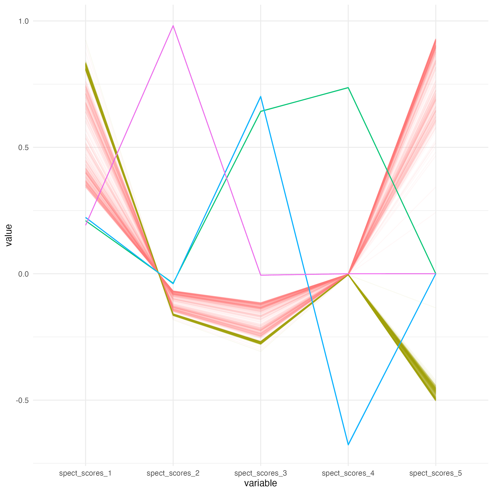
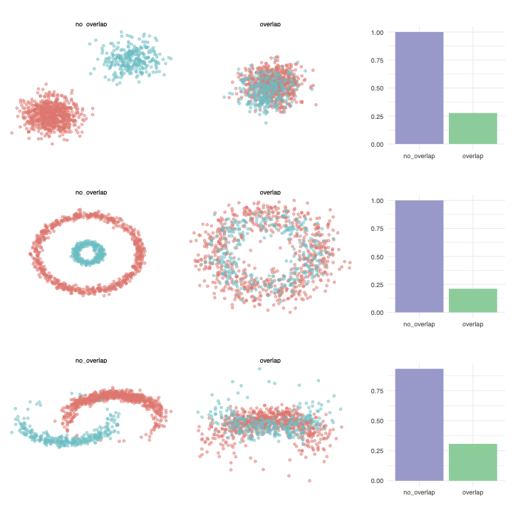
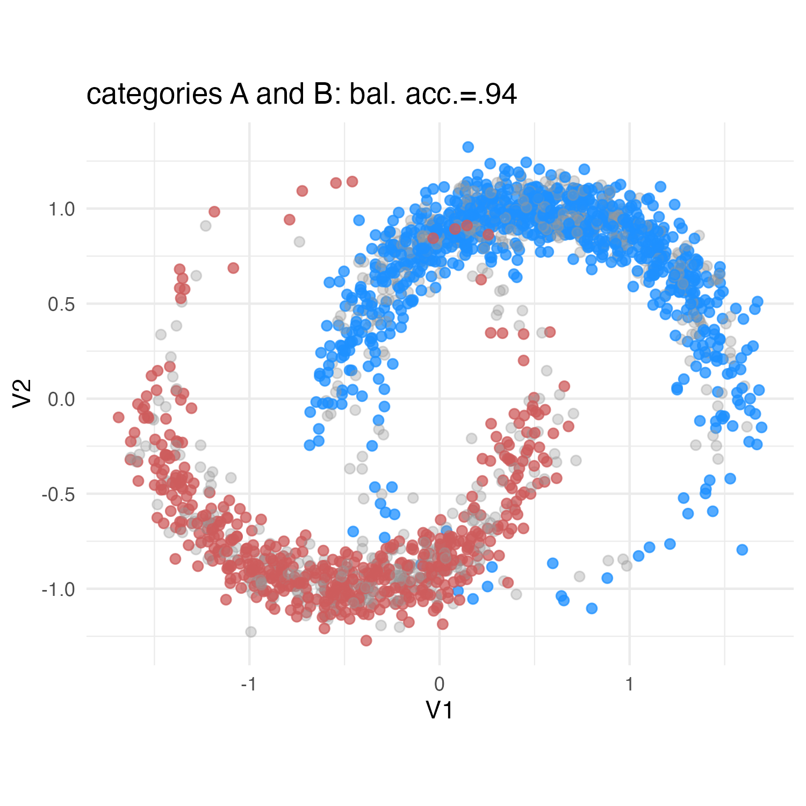
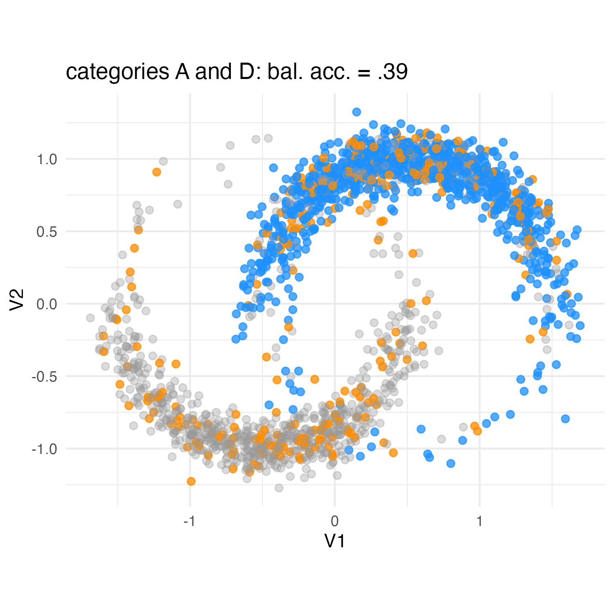
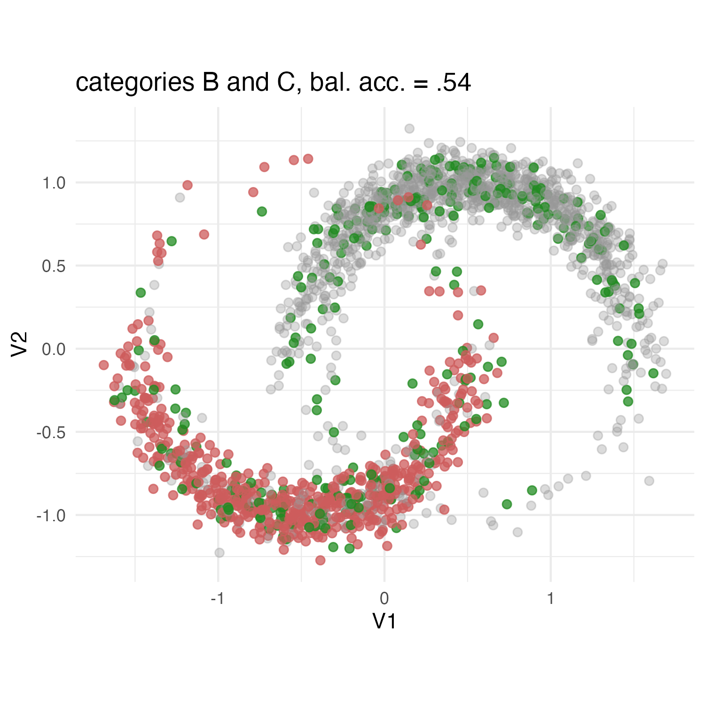
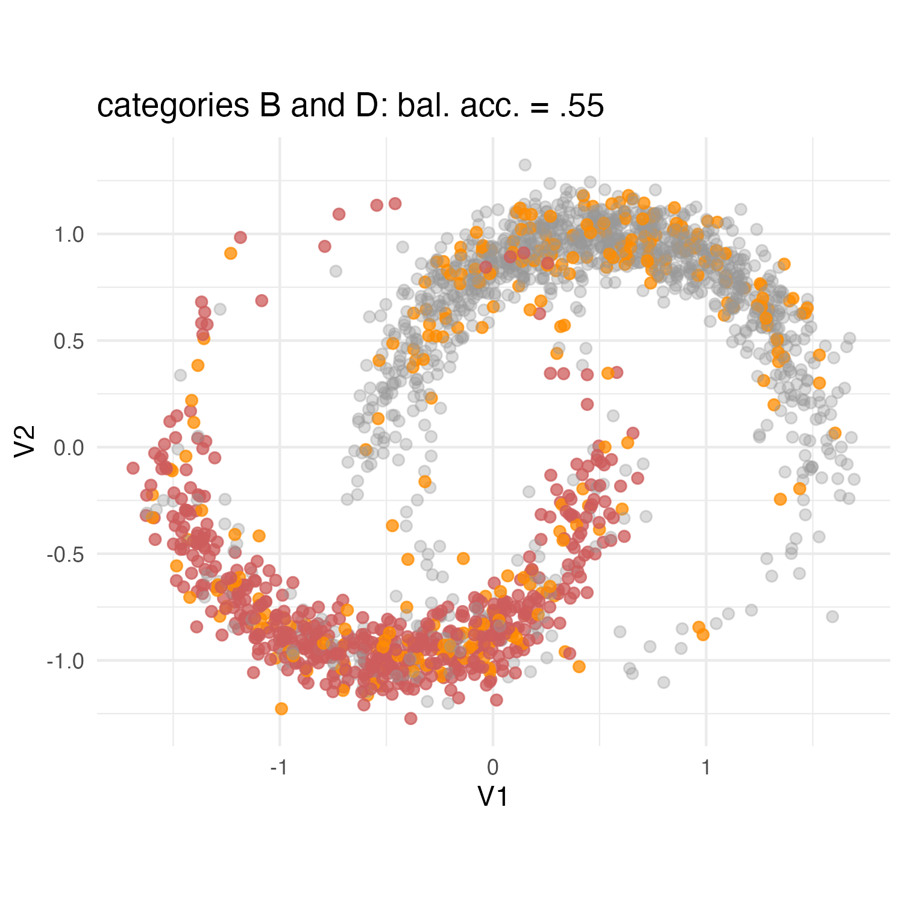
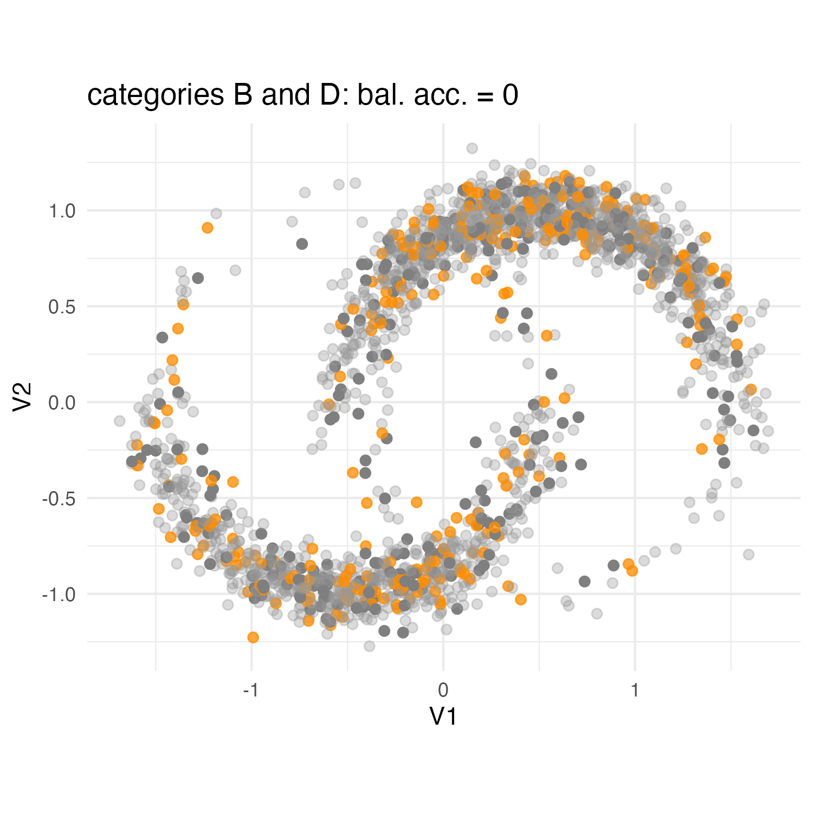
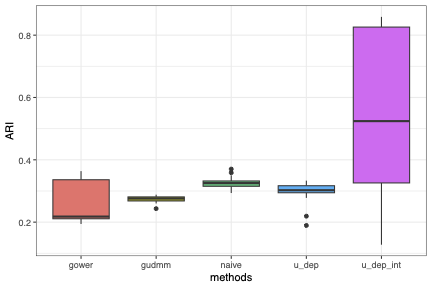

```{r, warning=FALSE,message=FALSE}
library(FactoMineR)
library(GGally)
library("gganimate")
library(ggrepel)
library(magick)
library(palmerpenguins)
library("tidyverse")
library("fpc")
library("factoextra")
library("dbscan")
library("mclust")
library(fastDummies)
library(mlbench)
library(tidyverse)
library(tidymodels)
library(purrr)
library(ca)
library("magick")
library(tidymodels)
library(discrim)
library(clustrd)
library(flipbookr)
library(kableExtra)
library(janitor)
library(patchwork)
library(mvtnorm)
library("ggraph")
library("tidygraph")
library("GGally")
library("tidyverse")
library("network")
library("sna")
library("ggplot2")
library("kableExtra")
library("RefManageR")
source("R/core_spectral.R")
BibOptions(check.entries = FALSE,
       bib.style = "authoryear",
       cite.style = "authoryear",
       style = "markdown",
       hyperlink = FALSE,
       dashed = FALSE)
cladag_25_bib <- ReadBib("cladag_25_references.bib", check = FALSE)

```

## {.center}

:::: {.columns}

::: {.column width="20%" .center}

&nbsp;

&nbsp;

&nbsp;

&nbsp;

[outline]{style="color:indianred"}

:::

::: {.column  width="80%" }

:::{.callout-tip appearance="minimal" icon=false title=""}


&nbsp;

### spectral clustering

&nbsp;

### association-based distances for mixed data

&nbsp;

### taking into account continuous/categorical interactions

&nbsp;

### example and future work

&nbsp;

:::

:::

::::


## {.center}

[**cluster analysis** ]{style="color:indianred"}

the general aim is to find homogeneous groups of observations
  

- observations from the same group are similar to each other    

- observations from different groups are not similar to each other

- multiple clustering approaches exist

```{r,fig.align='center', out.width="40%", include=FALSE}
set.seed(1)

cl1 = rmvnorm(100,c(3,4),sigma= matrix(c(.05,0,0,.05),nrow=2)) %>% as_tibble() %>% mutate(true_clust="a")
cl2 = rmvnorm(75,c(2,1),sigma= matrix(c(.1,0,0,.1),nrow=2))%>% as_tibble() %>% mutate(true_clust="b")
cl3 = rmvnorm(100,c(-2,2),sigma= matrix(c(.25,.2,.2,.25),nrow=2))%>% as_tibble() %>% mutate(true_clust="c")
cl4 = rmvnorm(75,c(-4,-2),sigma= matrix(c(1,0,0,.01),nrow=2))%>% as_tibble() %>% mutate(true_clust="d")
cl5 = rmvnorm(75,c(-5,4),sigma= matrix(c(.1,-.05,-.05,.1),nrow=2))%>% as_tibble() %>% mutate(true_clust="e")

easy_clusters =  rbind(cl1,cl2,cl3,cl4,cl5) %>%
  rename(x=V1,y=V2) %>% 
  mutate(kmeans_clust = kmeans(tibble(x,y),centers = 5,
                               nstart = 100)$cluster,
         kmeans_clust = fct(letters[kmeans_clust]),
         hiera_clust = cutree(hclust(dist(tibble(x,y)),
                                     method = "single"),k=5),
         hiera_clust = fct(letters[hiera_clust]),
         gmix_clust = Mclust(tibble(x,y),G = 5)$classification,
         gmix_clust = fct(letters[gmix_clust]),
         dbs_clust = fpc::dbscan(tibble(x,y),eps=1)$cluster,
         dbs_clust = fct(letters[dbs_clust+1]),
         spect_clust = core_spectral(Dist = dist(tibble(x,y)) %>% as.matrix(), K = 5)$labels,
         spect_clust = fct(letters[spect_clust])
  )

easy_clusters %>%
  ggplot(aes(x=x,y=y,shape = true_clust)) + 
  theme_void() + geom_point(size=3.5,alpha=.75)
```

## {.center}

[**clustering approaches**]{style="color:indianred"}

- If a cluster structure does underlie the observations at hand, any approach will work

```{r,fig.align='center'}
easy_clusters %>%
  ggplot(aes(x=x,y=y,shape = true_clust)) + 
  theme_void() + geom_point(size=3.5,alpha=.75)
```

## {.center}

[**clustering approaches**]{style="color:indianred"}

::::{.columns}

:::{.column width="20%"}
<!-- partitioning^[MacQueen (1967).] -->
partitioning^[`r Citet(bib=cladag_25_bib,"MacQueen")`]
:::

:::{.column width="80%"}
```{r,fig.align='center'}
easy_clusters %>%
  ggplot(aes(x=x,y=y,shape = true_clust,color = kmeans_clust)) + 
  theme_void() + geom_point(size=3.5,alpha=.75)
```
:::

::::


## {.center}

[**clustering approaches**]{style="color:indianred"}

::::{.columns}

:::{.column width="20%"}

agglomerative^[`r Citet(bib=cladag_25_bib,"kaufman2009finding")`]

:::


:::{.column width="80%"}

```{r,fig.align='center'}
easy_clusters %>%
  ggplot(aes(x=x,y=y,shape = true_clust,color = hiera_clust)) + 
  theme_void() + geom_point(size=3.5,alpha=.75)
```

:::

::::


## {.center}

[**clustering approaches**]{style="color:indianred"}

::::{.columns}

:::{.column width="20%"}
model-based^[`r Citet(bib=cladag_25_bib,"mclachlan1988mixture")`]
:::


:::{.column width="80%"}

```{r,fig.align='center'}
easy_clusters %>%
  ggplot(aes(x=x,y=y,shape = true_clust,color = gmix_clust)) + 
  theme_void() + geom_point(size=3.5,alpha=.75)
```

:::

::::


## {.center}

[**clustering approaches**]{style="color:indianred"}

::::{.columns}

:::{.column width="20%"}
density-based^[`r Citet(bib=cladag_25_bib,"ester1996density", before="DBSCAN, ")`]
:::

:::{.column width="80%"}
```{r,fig.align='center'}
easy_clusters %>%
  ggplot(aes(x=x,y=y,shape = true_clust,color = dbs_clust)) + 
  theme_void() + geom_point(size=3.5,alpha=.75)
```

:::

::::


## {.center}

[**clustering approaches**]{style="color:indianred"}

:::: {.columns}

::: {.column width="20%"}
spectral^[`r Citet(bib=cladag_25_bib,"ng2001spectral", before="NJW, ")`]
:::


::: {.column width="80%"}

```{r,fig.align='center'}
easy_clusters %>%
  ggplot(aes(x=x,y=y,shape = true_clust,color = spect_clust)) + 
  theme_void() + geom_point(size=3.5,alpha=.75)
```

:::

::::


## {.center}

[**clustering approaches**]{style="color:indianred"}

If a cluster structure does underlie the observations at hand, any approach will work

```{r}
multi_s_clusters = multishapes %>% as_tibble() %>% filter(shape!=5) %>%
  mutate(true_clust = fct(letters[shape]),
         true_clust = fct_recode(.f = true_clust,e ="f"),
         kmeans_clust = kmeans(tibble(x,y),
                               centers = 5,nstart=100)$cluster,
         kmeans_clust = fct(letters[kmeans_clust]),
         hiera_clust = cutree(hclust(dist(tibble(x,y))),k=5),
         hiera_clust = fct(letters[hiera_clust]),
         gmix_clust = Mclust(tibble(x,y),G = 5)$classification,
         gmix_clust = fct(letters[gmix_clust]),
         dbs_clust = fpc::dbscan(tibble(x,y),eps=.2)$cluster,
         dbs_clust = fct(letters[dbs_clust]),
         spect_clust = core_spectral(Dist = dist(tibble(x,y)) %>% as.matrix(), K = 5)$labels,
         spect_clust = fct(letters[spect_clust])
  )

multi_s_clusters = multi_s_clusters %>% 
  mutate(spect_scores = core_spectral(Dist = dist(tibble(x,y)) %>%
                                        as.matrix(), K = 5)$spectral_scores)

multi_s_clusters = cbind(multi_s_clusters %>% dplyr::select(-spect_scores),
                         as.matrix(multi_s_clusters %>% dplyr::select(spect_scores))
                         ) %>% as_tibble() %>%  clean_names()


```

&nbsp;

::::{.columns}

:::{.column width="20%"}

&nbsp;

&nbsp;

&nbsp;

::: {.fragment}
[OR NOT?]{style="color:indianred"}
:::

:::


:::{.column width="80%"}

```{r,fig.align='center'}
multi_s_clusters %>%
  ggplot(aes(x=x,y=y,shape = true_clust)) + 
  theme_void() + geom_point(size=3.5,alpha=.75)
```

:::

::::


## {.center}

[**clustering approaches**]{style="color:indianred"}

::::{.columns}

:::{.column width="20%"}

 partitioning
 (Kmeans)

:::

:::{.column width="80%"}
```{r,fig.align='center'}
multi_s_clusters %>%
  ggplot(aes(x=x,y=y,shape = true_clust,color = kmeans_clust)) + 
  theme_void() + geom_point(size=3.5,alpha=.75)
```
:::

::::


## {.center}

[**clustering approaches**]{style="color:indianred"}

::::{.columns}

:::{.column width="20%"}

 agglomerative

:::

:::{.column width="80%"}


```{r,fig.align='center'}
multi_s_clusters %>%
  ggplot(aes(x=x,y=y,shape = true_clust,color = hiera_clust)) + 
  theme_void() + geom_point(size=3.5,alpha=.75)
```
:::

::::

## {.center}

[**clustering approaches**]{style="color:indianred"}

::::{.columns}

:::{.column width="20%"}

model-based
(GMM)

:::

:::{.column width="80%"}

```{r,fig.align='center'}
multi_s_clusters %>%
  ggplot(aes(x=x,y=y,shape = true_clust,color = gmix_clust)) + 
  theme_void() + geom_point(size=3.5,alpha=.75)
```
:::

::::

## {.center}

[**clustering approaches**]{style="color:indianred"}

::::{.columns}

:::{.column width="20%"}

density-based
(dbscan)

:::

:::{.column width="80%"}

```{r,fig.align='center'}
multi_s_clusters %>%
  ggplot(aes(x=x,y=y,shape = true_clust,color = dbs_clust)) + 
  theme_void() + geom_point(size=3.5,alpha=.75)
```
:::

::::


## {.center}

[**clustering approaches**]{style="color:indianred"}

::::{.columns}

:::{.column width="20%"}
spectral
:::


:::{.column width="80%"}
```{r,fig.align='center'}
multi_s_clusters %>%
  ggplot(aes(x=x,y=y,shape = true_clust,color = spect_clust)) + 
  theme_void() + geom_point(size=3.5,alpha=.75)

```
:::

::::

# spectral clustering in a nutshell

## {.center}

[**Spectral clustering: a graph partitioning problem**]{style="color:indianred"}


::: {.callout-note  appearence="simple" icon=false}
## Graph representation

a graph representation of the data matrix $\bf X$: the aim is then to cut it into K groups (clusters)

```{r, warning=FALSE,message=FALSE,fig.align="center",out.width="35%"}
set.seed(123)
net = rgraph(4, mode = "graph", tprob = .75)
net = network(net, directed = FALSE)
# vertex names
network.vertex.names(net) = letters[1:4]
ggnet2(net, size = 12,color="dodgerblue", label = TRUE, label.size = 8,label.color = "white",edge.label = c("w_ac","w_cb","w_bd","w_cd"),
       edge.label.color = "indianred",edge.label.size = 12)
```

:::

. . .


::: {.callout-tip  appearence="simple" icon=false}
## the affinity matrix <span style = "color:dodgerblue"> ${\bf A}$ </span>
the elements <span style = "color:dodgerblue"> $\bf w_{ij}$ </span> of  <span style = "color:dodgerblue"> $\bf A$ </span> are high (low) if $i$ and $j$ are in the same (different) groups
```{r}
tib_graph = tibble(.=letters[1:4],a=c("0","0","w_ca","0"),b=c("0","0","w_cb","w_db"),c = c("w_ac","w_cb","0","w_dc"), d = c("0","w_bd","w_cd","0"))
tib_graph |> kbl(align = 'c')  |> kable_styling(full_width = F,font_size = 16) |> kable_minimal() |>   
 column_spec(c(1:5),
    border_right = T,
    border_left = T) |> 
  column_spec(c(2:5), color = "indianred") 
```

:::


## {.center} 

[**Spectral clustering: making the graph easy to cut**]{style="color:indianred"}


An approximated solution to the graph partitioning problem:

-  <span style = "color:dodgerblue"> spectral decomposition </span> of the graph Laplacian matrix, that is a [normalized]{style="color:dodgerblue"} version of the [affinity matrix ${\bf A}$]{style="color:dodgerblue"}:


$$\color{dodgerblue}{\bf{L}} = {\bf D}_{r}^{-1/2}\underset{\color{grey}{\text{affinity matrix } {\bf A}}}{\color{dodgerblue}{exp(-{\bf D}^{2}(2\sigma^{2})^{-1})}}{\bf D}_{r}^{-1/2} =\color{dodgerblue}{{\bf Q}{\Lambda}{\bf Q}^{\sf T}}$$


-  <span style = "color:dodgerblue"> $\bf D$ </span> be the $n\times n$ matrix of pairwise Euclidean distances
  
- the <span style = "color:dodgerblue"> $\sigma$ </span> parameter dictates the number of neighbors each observation is linked to (rule of thumb: median distance to the 20th nearest neighbor)
  
- diagonal terms of $\bf A$ are set to zero: <span style = "color:dodgerblue"> $a_{ii}=0$ </span>, $i=1,\ldots,n$ 
  
- <span style = "color:dodgerblue"> ${\bf D}_{r}=diag({\bf r})$ </span>,
  <span style = "color:dodgerblue"> ${\bf r}={\bf A}{\bf 1}$ </span> and
  <span style = "color:dodgerblue"> ${\bf 1}$ </span> is an $n$-dimensional vector of 1's 


. . .

- the spectral clustering of the $n$ original objects is a <span style = "color:dodgerblue"> $K$-means</span> applied on the rows of the matrix <span style = "color:dodgerblue"> ${\bf{\tilde Q}}$</span>, containing the first $K$ columns of $\bf Q$

<!-- ## {.center} -->

<!-- [**Spectral clustering: the NJW  procedure**]{style="color:indianred"} -->

<!-- - step 1: compute the pairwise distances matrix $\bf D$ -->

<!-- - step 2: switch to the affinity matrix $\bf A$ -->

<!-- - step 3: normalize the affinity matrix to obtain the Laplacian matrix $\bf L$ -->

<!-- - step 4: decompose $\bf L$ and obtain ${\bf {\tilde Q}}$, matrix of the $K$-dimensional spectral scores  -->

<!-- - step 5: apply the $K$-means on ${\bf {\tilde Q}}$ to obtain the cluster allocation vector -->


<!-- ## {.center} -->

<!-- [**scatterplot matrix of the spectral scores**]{style="color:indianred"} -->

<!-- ```{r,fig.align='center', echo=FALSE,out.width = "70%"} -->
<!-- p12 = multi_s_clusters %>% -->
<!--   ggplot(aes(x=spect_scores_1,y=spect_scores_2,color=spect_clust,shape=true_clust))+ -->
<!--   theme_minimal()+geom_point() + theme(legend.position = "none")+ xlab("")+ylab("")+xlim(c(-1,1))+ylim(c(-1,1)) -->

<!-- p13 = multi_s_clusters %>% -->
<!--   ggplot(aes(x=spect_scores_1,y=spect_scores_3,color=spect_clust,shape=true_clust))+ -->
<!--   theme_minimal()+geom_point() + theme(legend.position = "none")+ xlab("")+ylab("")+xlim(c(-1,1))+ylim(c(-1,1)) -->

<!-- p14 = multi_s_clusters %>% -->
<!--   ggplot(aes(x=spect_scores_1,y=spect_scores_4,color=spect_clust,shape=true_clust))+ -->
<!--   theme_minimal()+geom_point() + theme(legend.position = "none")+ xlab("")+ylab("")+xlim(c(-1,1))+ylim(c(-1,1)) -->

<!-- p15 = multi_s_clusters %>% -->
<!--   ggplot(aes(x=spect_scores_1,y=spect_scores_5,color=spect_clust,shape=true_clust))+ -->
<!--   theme_minimal()+geom_point() + theme(legend.position = "none")+ xlab("")+ylab("")+xlim(c(-1,1))+ylim(c(-1,1)) -->

<!-- p23 = multi_s_clusters %>% -->
<!--   ggplot(aes(x=spect_scores_2,y=spect_scores_3,color=spect_clust,shape=true_clust))+ -->
<!--   theme_minimal()+geom_point() + theme(legend.position = "none")+ xlab("")+ylab("")+xlim(c(-1,1))+ylim(c(-1,1)) -->

<!-- p24 = multi_s_clusters %>% -->
<!--   ggplot(aes(x=spect_scores_2,y=spect_scores_4,color=spect_clust,shape=true_clust))+ -->
<!--   theme_minimal()+geom_point() + theme(legend.position = "none")+ xlab("")+ylab("")+xlim(c(-1,1))+ylim(c(-1,1)) -->

<!-- p25 = multi_s_clusters %>% -->
<!--   ggplot(aes(x=spect_scores_2,y=spect_scores_5,color=spect_clust,shape=true_clust))+ -->
<!--   theme_minimal()+geom_point() + theme(legend.position = "none")+ xlab("")+ylab("")+xlim(c(-1,1))+ylim(c(-1,1)) -->

<!-- p34 = multi_s_clusters %>% -->
<!--   ggplot(aes(x=spect_scores_3,y=spect_scores_4,color=spect_clust,shape=true_clust))+ -->
<!--   theme_minimal()+geom_point() + theme(legend.position = "none")+ xlab("")+ylab("")+xlim(c(-1,1))+ylim(c(-1,1)) -->

<!-- p35 = multi_s_clusters %>% -->
<!--   ggplot(aes(x=spect_scores_3,y=spect_scores_5,color=spect_clust,shape=true_clust))+ -->
<!--   theme_minimal()+geom_point() + theme(legend.position = "none")+ xlab("")+ylab("")+xlim(c(-1,1))+ylim(c(-1,1)) -->

<!-- p45 = multi_s_clusters %>% -->
<!--   ggplot(aes(x=spect_scores_4,y=spect_scores_5,color=spect_clust,shape=true_clust))+ -->
<!--   theme_minimal()+geom_point() + theme(legend.position = "none")+ xlab("")+ylab("")+xlim(c(-1,1))+ylim(c(-1,1)) -->

<!-- blank_p = ggplot(data=tibble(x=0,y=0),mapping=aes(x,y))+ -->
<!--   theme_void()+xlim(c(-1,1))+ylim(c(-1,1)) -->

<!-- blank_p1 = ggplot(data=tibble(x=0,y=0),mapping=aes(x,y))+ -->
<!--   theme_void()+geom_text(label="spectral score 1",size=4)+ -->
<!--   xlim(c(-1,1))+ylim(c(-1,1)) -->

<!-- blank_p2 = ggplot(data=tibble(x=0,y=0),mapping=aes(x,y))+ -->
<!--   theme_void()+geom_text(label="spectral score 2",size=4)+xlim(c(-1,1))+ylim(c(-1,1)) -->

<!-- blank_p3 = ggplot(data=tibble(x=0,y=0),mapping=aes(x,y))+ -->
<!--   theme_void()+geom_text(label="spectral score 3",size=4)+xlim(c(-1,1))+ylim(c(-1,1)) -->

<!-- blank_p4 = ggplot(data=tibble(x=0,y=0),mapping=aes(x,y))+ -->
<!--   theme_void()+geom_text(label="spectral score 4",size=4)+xlim(c(-1,1))+ylim(c(-1,1)) -->

<!-- blank_p5 = ggplot(data=tibble(x=0,y=0),mapping=aes(x,y))+ -->
<!--   theme_void()+geom_text(label="spectral score 5",size=4)+xlim(c(-1,1))+ylim(c(-1,1)) -->

<!-- (blank_p1 | blank_p | blank_p |  blank_p | blank_p) /  -->
<!-- (p12 | blank_p2 | blank_p | blank_p | blank_p) / -->
<!-- (p13 | p23 | blank_p3 |  blank_p | blank_p) / -->
<!-- (p14 | p24 | p34 |  blank_p4 | blank_p) / -->
<!-- (p15 | p25 | p35 |  p45 | blank_p5)  -->


<!-- ``` -->

##

[**Spectral clustering: solution and performance**]{style="color:indianred"}

Recent benchmarking studies^[`r Citet(bib=cladag_25_bib,"murugesan2021benchmarking", before="e.g., ")`]:
SC works well, particularly in case of non-convex and overlapping clusters 

::: {layout-ncol=2}
{width=50%}

{width=50%}

:::

## {.center}

[SC for mixed data?]{style="color:indianred;font-size:2em;"}

. . .

 the distance measure definition for mixed data is key


## 

[**intuition**]{style="color:indianred"}

2 continuous variables: add up by-variable  (absolute value or squared) differences 

```{r}
toy_data <- tibble(
  X1 = c(5, 3, 7),     
  X2 = c(1, 4, 2),     
  X3   = factor(c("purple", "blue", "gold")), 
  X4   = factor(c("A", "B", "C")) 
)  
```


```{r}
toy_data |> 
  ggplot(aes(x=X1,y=X2,label=X4)) +
  geom_point(size=8) + geom_text(color="white") +
  geom_point(inherit.aes = FALSE,aes(x=X1,y=0),color="dodgerblue",size=4,alpha=.001)+
  geom_point(inherit.aes = FALSE,aes(x=0,y=X2),color="forestgreen",size=4,alpha=.001)

```


## 

[**intuition**]{style="color:indianred"}

2 continuous variables: add up by-variable  (absolute value or squared) differences

```{r}
toy_data |> 
  ggplot(aes(x=X1,y=X2,label=X4)) +
  geom_point(size=8) + geom_text(color="white") +
  geom_point(inherit.aes = FALSE,aes(x=X1,y=0),color="dodgerblue",size=4)+
  geom_point(inherit.aes = FALSE,aes(x=0,y=X2),color="forestgreen",size=4)
```


## 

[**intuition**]{style="color:indianred"}

2 continuous variables: add up by-variable  (absolute value or squared) differences 

```{r}
toy_data |> 
  ggplot(aes(x=X1,y=X2,label=X4)) +
  geom_point(size=8) + geom_text(color="white") +
  # geom_point(inherit.aes = FALSE,aes(x=X1,y=0),color="dodgerblue",size=4)+
  # geom_point(inherit.aes = FALSE,aes(x=0,y=X2),color="forestgreen",size=4)+
  geom_line(data=toy_data |> filter(X4 %in%c("A","B")), 
               inherit.aes = FALSE,aes(x=X1,y=0),color="dodgerblue",size=2)+
  geom_line(data=toy_data |> filter(X4 %in%c("A","B")), 
               inherit.aes = FALSE,aes(y=X2,x=0),color="forestgreen",size=2)+
  annotate("label",x=2, y=2,label="d(A,B)",size=10)
  
```


## 

[**intuition**]{style="color:indianred"}

2 continuous variables: add up by-variable  (absolute value or squared) differences 

```{r}
toy_data |> 
  ggplot(aes(x=X1,y=X2,label=X4)) +
  geom_point(size=8) + geom_text(color="white") +
  # geom_point(inherit.aes = FALSE,aes(x=X1,y=0),color="dodgerblue",size=4)+
  # geom_point(inherit.aes = FALSE,aes(x=0,y=X2),color="forestgreen",size=4)+
  geom_line(data=toy_data |> filter(X4 %in%c("A","C")), 
               inherit.aes = FALSE,aes(x=X1,y=0),color="dodgerblue",size=2)+
  geom_line(data=toy_data |> filter(X4 %in%c("A","C")), 
               inherit.aes = FALSE,aes(y=X2,x=0),color="forestgreen",size=2)+
  annotate("label",x=2, y=2,label="d(A,C)",size=10)
  
```


## 

[**intuition**]{style="color:indianred"}

2 continuous variables: add up by-variable  (absolute value or squared) differences 

```{r}
toy_data |> 
  ggplot(aes(x=X1,y=X2,label=X4)) +
  geom_point(size=8) + geom_text(color="white") +
  # geom_point(inherit.aes = FALSE,aes(x=X1,y=0),color="dodgerblue",size=4)+
  # geom_point(inherit.aes = FALSE,aes(x=0,y=X2),color="forestgreen",size=4)+
  geom_line(data=toy_data |> filter(X4 %in%c("B","C")), 
               inherit.aes = FALSE,aes(x=X1,y=0),color="dodgerblue",size=2)+
  geom_line(data=toy_data |> filter(X4 %in%c("B","C")), 
               inherit.aes = FALSE,aes(y=X2,x=0),color="forestgreen",size=2)+
  annotate("label",x=2, y=2,label="d(B,C)",size=10)
  
```

<!-- ##  -->

<!-- [**intuition**]{style="color:indianred"} -->

<!-- 2 continuous and 1 categorical variables  -->

<!-- ```{r} -->
<!-- toy_data |>  -->
<!--   ggplot(aes(x=X1,y=X2,label=X4,color=as.character(X3))) + -->
<!--   geom_point(size=8) + geom_text(color="white") + -->
<!--   geom_point(inherit.aes = FALSE,aes(x=X1,y=0),color="dodgerblue",size=4,alpha=.001)+ -->
<!--   geom_point(inherit.aes = FALSE,aes(x=0,y=X2),color="forestgreen",size=4,alpha=.001)+ -->
<!--   scale_color_identity()+ -->
<!--   theme(legend.position="none") -->


<!-- ``` -->


## 

[**intuition**]{style="color:indianred"}

2 continuous and 1 categorical variables 

```{r}
toy_data |> 
  ggplot(aes(x=X1,y=X2,label=X4,color=as.character(X3))) +
  geom_point(size=8) + geom_text(color="white") +
  geom_point(inherit.aes = FALSE,aes(x=X1,y=0),color="dodgerblue",size=4,alpha=.001)+
  geom_point(inherit.aes = FALSE,aes(x=0,y=X2),color="forestgreen",size=4,alpha=.001)+
  scale_color_identity()+
  theme(legend.position="none")


```

## 

[**intuition**]{style="color:indianred"}

one might consider [purple]{style="color:purple"} and [blue]{style="color:blue"}  *closer* than e.g. [purple]{style="color:purple"} and [yellow]{style="color:gold"}

```{r}
toy_data |> 
  ggplot(aes(x=X1,y=X2,label=X4,color=as.character(X3))) +
  geom_point(size=8) + geom_text(color="white") +
  geom_point(inherit.aes = FALSE,aes(x=X1,y=0),color="dodgerblue",size=4,alpha=.001)+
  geom_point(inherit.aes = FALSE,aes(x=0,y=X2),color="forestgreen",size=4,alpha=.001)+
  scale_color_identity()+
  theme(legend.position="none")


```


## 

[**desirable properties**]{style="color:indianred"} ^[`r Citet(bib=cladag_25_bib,"vdv_jcgs")`]

::: {.callout-tip appearence="simple" icon="false"}
## Multivariate Additivity

Let $\mathbf{x}_i=\left(x_{i1}, \dots, x_{iQ}\right)$ denote a $Q-$dimensional vector. A distance function $d\left(\mathbf{x}_i,\mathbf{x}_\ell\right)$ between observations $i$ and $\ell$ is multivariate [additive]{style="color:indianred"} if

$$
      d\left(\mathbf{x}_i,\mathbf{x}_\ell\right)=\sum_{j=1}^{Q} d_j\left(\mathbf{x}_i,\mathbf{x}_\ell\right),
$$

  where $d_j\left(\mathbf{x}_i,\mathbf{x}_\ell\right)$ denotes the $j-$th variable specific distance.

:::

- Manhattan distance satisfies the additivity property; the Euclidean distance does not


. . .

If additivity holds, by-variable distances are added together: they should be on equivalent scales


::: {.callout-note appearence="simple" icon="false"}
## Commensurability

Let ${\boldsymbol X}_i =\left(X_{i1}, \dots, X_{iQ}\right)$ denote a $Q-$dimensional random variable corresponding to an observation $i$. Furthermore, let $d_{j}$ denote the distance function corresponding to the $j-$th variable. We have [commensurability]{style="color:indianred"} if,
for all $j$, and $i \neq \ell$, 

$$
    E[d_{j}({ X}_{ij}, {X}_{\ell j})] = c,
$$

where $c$ is some constant. 
:::


## {.center}


If the multivariate distance function $d(\cdot,\cdot)$ satisfies [additivity]{style="color:forestgreen"} and 
[commensurability]{style="color:dodgerblue"},  
*ad hoc* distance functions can be used for each variable and then aggregated:

:::{.columns}

::::{.column width=10%}
&nbsp;

then
::::

::::{.column width=90%}
>
>   one can pick the appropriate $d_{j}(\cdot,\cdot)$, given the nature of $X_{j}$ 
>
>   - well suited in the mixed data case 
>
::::

:::

##

[**mixed-data setup**]{style="color:indianred"}

::: {.callout-tip appearence="simple" icon="false"}
## a [mixed]{style="color: dodgerblue"} data set

-   $I$ observations described by $Q$ variables,  $Q_{n}$ numerical  and $Q_{c}$ categorical

-   the $I\times Q$ data matrix ${\bf X}=\left[{\bf X}_{n},{\bf X}_{c}\right]$ is column-wise partitioned
:::


A formulation for mixed distance between observations $i$ and $\ell$:

\begin{eqnarray}\label{genmixeddist_formula}
    d\left(\mathbf{x}_i,\mathbf{x}_\ell\right)&=& \sum_{j_n=1}^{Q_n} d_{j_n}\left(\mathbf{x}^n_i,\mathbf{x}^n_\ell\right)+ \sum_{j_c=1}^{Q_c} d_{j_c}\left(\mathbf{x}^c_i,\mathbf{x}^c_\ell\right)=\\
    &=& \sum_{j_n=1}^{Q_n} w_{j_n} \delta^n_{j_n}\left(\mathbf{x}^n_i,\mathbf{x}^n_\ell\right)+ \sum_{j_c=1}^{Q_c} w_{j_c}\delta^c_{j_c}\left(\mathbf{x}^c_i,\mathbf{x}^c_\ell\right)
\end{eqnarray}

:::{.columns}
::::{.column width=45%}

:::{.callout-note appearence="simple" icon="false"}
## numeric case
- $\delta^n_{j_n}$ is a function quantifying the dissimilarity between observations on the $j_n-$th numerical variable

- $w_{j_n}$ is a  weight for the $j_n-$th variable.
:::
::::

::::{.column width=45%}
:::{.callout-important appearence="simple" icon="false"}
## categorical case
 dissimilarity between the categories chosen by subjects $i$ and $\ell$ for categorical variable $j_c$

- $w_{j_c}$ is a  weight for the $j_c-$th variable
:::
::::
:::

## {.center}

[association-based (AB) distances?]{style="color:indianred;font-size:2em;"}

. . .

not all differences weighs the same

##

::: {.callout-note appearence="simple" icon="false"}
##  distances for categorical data

[the general (delta) framework]{style="color:indianred"}^[`r Citet(bib=cladag_25_bib,"vdv_pr")`]

Let ${\bf Z}=\left[{\bf Z}_{1},{\bf Z}_{2},\ldots,{\bf Z}_{Q_c}\right]$ be the one-hot encoding ${\bf X}_{c}$

The pair-wise distances between categorical observations are given by

$${\bf D}_{c}={\bf Z}{\bf \Delta}{\bf Z}^{\sf T}= 
\left[\begin{array}{ccc} {\bf Z}_{1} & \dots & {\bf Z}_{Q_{c}} \end{array} \right]\left[\begin{array}{ccc}
{\bf\Delta}_1  & & \\ 
& \ddots &\\
& & {\bf\Delta}_{Q_{c}} \end{array} \right] \left[ \begin{array}{c}
{\bf Z}_{1}^{\sf T}\\
\vdots \\
{\bf Z}_{Q_{c}}^{\sf T}
\end{array} \right]$$

-   the definition of ${\bf \Delta}$ determines the distance in use

  - if the off-diagonal terms of the $\Delta_{j}$'s only depend on the $j^{th}$ variable, then ${\bf D}_{c}$ is [independence-based]{style="color: indianred"}
  
  - if the off-diagonal terms of the $\Delta_{j}$'s depend on the $j^{th}$ variable AND on the relation of variable $j$ with the other $Q_{c}-1$ variables, then ${\bf D}_{c}$ is [association-based]{style="color: indianred"}


:::


##  

[**$\Delta_{j}$'s for association-based distances**]{style="color:indianred"}

the matrix co-occurrence proportions is


$$
{\bf P} =\frac{1}{I} \begin{bmatrix}
{\bf Z}_{1}^{\sf T}{\bf Z}_{1} & {\bf Z}_{1}^{\sf T}{\bf Z}_{2}&\ldots &{\bf Z}_{1}^{\sf T}{\bf Z}_{Q_{c}}\\
\vdots                         & \ddots                        &\vdots & \vdots                       \\
% {\bf Z}_{2}^{\sf T}{\bf Z}_{1} & {\bf Z}_{2}^{\sf T}{\bf Z}_{2}&\ldots &{\bf Z}_{2}^{\sf T}{\bf Z}_{Q}\\
\vdots                         & \vdots                        &\ddots & \vdots                       \\
{\bf Z}_{Q_{c}}^{\sf T}{\bf Z}_{1} & {\bf Z}_{Q_{c}}^{\sf T}{\bf Z}_{2}&\ldots &{\bf Z}_{Q_{c}}^{\sf T}{\bf Z}_{Q_{c}}\\
\end{bmatrix}
$$


- ${\bf R} = {\bf P}_{d}^{-1}\left({\bf P}-{\bf P}_{d}\right)$, with ${\bf P}_{d}=diag({\bf P})$, is a block matrix such that 
 
- the general off-diagonal block is ${\bf R}_{ij}$ ( $q_{i}\times q_{j}$ )

- the $a^{th}$ row of ${\bf R}_{ij}$, ${\bf r}^{ij}_{a}$, is the  conditional distribution of the $j^{th}$ variable, given the $a^{th}$ category of the $i^{th}$ variable  

## 

[**Total variation distance (TVD): pair-wise dissimilarity between categories**]{style="color:indianred"}^[`r Cite(bib=cladag_25_bib,"le2005association")`]

consider any pair of categories $a$ and $b$ from the $i^{th}$ categorical variable,
their overall dissimilarity is $\delta^{i}(a,b)$, that is
$$\delta^{i}(a,b)=\sum_{i\neq j}^{q}w_{ij}\Phi^{ij}({\bf r}^{ij}_{a},{\bf r}^{ij}_{b})$$
 upon defining  $$\Phi^{ij}({\bf r}^{ij}_{a},{\bf r}^{ij}_{b})=\frac{1}{2}\sum_{\ell=1}^{q_{j}}|{\bf r}^{ij}_{\ell a}-{\bf r}^{ij}_{\ell b}|$$ 
then $\Phi^{ij}()$ corresponds the [total variation distance]{style="color:dodgerblue"} between two discrete probability distributions


## 

[**independence- vs association-based** ]{style="color:indianred"}


::: {.callout-note appearence="simple" icon="false"}
## [independence-based]{style="color: indianred"} pairwise distance

No inter-variable relations are considered

-   in the continuous case: Euclidean or Manhattan distances

-   in the categorical case: Hamming (matching) distance (among MANY others) 

-   in the mixed data case:  Gower dissimilarity

:::

. . . 

&nbsp;

&nbsp;

:::{.callout-important appearence="simple" icon="false"}
## [association-based]{style="color: dodgerblue"} pairwise distance

-   differences in line with the inter-variables association/correlation are downweighted

:::


## {.center}

[AB spectral clustering for mixed data]{style="color:indianred;font-size:2em;"}


<!-- ## {.center} -->

<!-- **pairwise object distances (TVD-based)** -->

<!-- - For the $i^{th}$ categorical variable, compute $\delta^{i}(a,b)$ for all the possible categories pairs, and store them in the $q_{i}\times q_{i}$ matrix ${\bf \Delta}_{i}$ -->

<!-- - define the block-diagonal matrix -->

<!-- $${\bf \Delta}=\begin{bmatrix} -->
<!-- {\bf \Delta}_{1}&             & & & \\ -->
<!--                 &{\bf \Delta}_{2} & & & \\ -->
<!--                 &                 & \ddots & &  \\ -->
<!--           &                 & & & {\bf \Delta}_{q}\\ -->
<!-- \end{bmatrix}$$ -->
<!-- - the pairwise object distances matrix is -->
<!-- $${\bf D}_{cat} = {\bf Z}{\bf \Delta}{\bf Z}^{\sf T}$$ -->

## 
[*naive* spectral clustering for mixed data]{style="color:indianred"}

the [SC for mixed data]{style="color:dodgerblue"}  proposed by `r Citet(bib=cladag_25_bib,"mbuga21")`
is the NSW procedure for SC  applied on the  convex combination of the numerical and categorical distances:

$${\bf D}^{*} =\alpha{\bf {D}}_{n}^{*}+(1-\alpha){\bf {D}}^{*}_{c}$$
where

-  for continuous variables: ${\bf D}^{*}_{n}$ is the Euclidean distance

-  for categorical variables: ${\bf D}^{*}_{c}$ is the Hamming distance

- $\alpha$  can be tuned, its default is [$\alpha=.5$]{style="color:dodgerblue"}


## 
**from**  [SC for mixed data]{style="color:dodgerblue"} **to** [AB SC for mixed data]{style="color:indianred"}

building upon the proposal by `r Citet(bib=cladag_25_bib,"mbuga21")`, we replace the independence-based ${\bf D}^{*}_{n}$ and ${\bf D}^{*}_{c}$ with an association-based version. In particular:

- for continuous variables:  ${\bf D}_{n}$ is the [*commensurable* whithened Manhattan]{style="color:forestgreen"} distance (L1 equivalent of Mahalanobis distance)

- for categorical variables: ${\bf D}_{c}$ is [*commensurable* total variation]{style="color:forestgreen"} distance.

Since  additivity and commensurability hold, the considered general distance becomes:

$${\bf D} ={\bf {D}}_{n}+{\bf {D}}_{c}$$

<!-- ## -->

<!-- #### The aim: extend SC to mixed data via association-based distances -->

<!-- ::: {.callout-note  appearence="simple" icon=false} -->
<!-- ## association-based for categorical data: total variation distance (TVD) `r Citet(bib=cladag_25_bib,"le2005association", before="see, e.g. , ")` -->

<!-- the weight assigned to the difference between a pair of categories [$a$]{style="color: dodgerblue"} and [$b$]{style="color: dodgerblue"} depends on the distributions of the other attributes conditional to $a$ and $b$: the higher the similarity, the lower the weight -->

<!-- $$\Phi^{ij}({\bf r}^{ij}_{a},{\bf r}^{ij}_{b})=\frac{1}{2}\sum_{\ell=1}^{q_{j}}|{\bf r}^{ij}_{\ell a}-{\bf r}^{ij}_{\ell b}|$$  -->

<!-- - ${\bf r}^{ij}_{a}$ is the $a^{th}$ row of ${\bf R}_{ij}$, $q_{i}\times q_{j}$ general off-diagonal block of ${\bf R}$ -->
<!-- - ${\bf r}^{ij}_{a}$ is the conditional distribution of the $j^{th}$ variable, given the $a^{th}$ category of the $i^{th}$ variable -->

<!-- - ${\bf R} = {\bf P}_{d}^{-1}\left({\bf P}-{\bf P}_{d}\right)$  -->
<!--   - ${\bf P}_{d}=diag({\bf P})$  -->


<!-- ::: -->


<!-- # Methodology and main results -->

##

[**interactions?**]{style="color: indianred"}

- both ${\bf D}_{n}$ and ${\bf D}_{c}$ take into account the inter-variable relations within the two blocks of variables

- the interaction between the two blocks of variables is not taken into account

. . .

::: {.callout-note appearence="simple" icon="false"}
## Aim
define  $\Delta_{int}$ so that it accounts for the interaction  

- the general entry for the $j^{th}$ diagonal block is $\delta_{int}^{j}(a,b)$ accounts for the interaction by measuring how the continuous variables help in discriminating between the observations choosing category $a$ and those choosing category $b$ for the $j^{th}$ categorical variable  

:::

. . .

- a straightforward option is to compare the continuous variables means, conditional to $a$ and $b$ 

  - not suited for non-spherical clusters 

. . .

- consider the computation of  $\delta_{int}^{ij}\left({ab}\right)$  as a two-class ($a/b$) classification problem, with the continuous variables as predictors
  -  use a distance-based classifier: [nearest-neighbors]{style="color:dodgerblue"}


<!-- \frac{1}{2}\left(\right) -->

##

[**NN based computation of $\delta_{int}^{j}(a,b)$**]{style="color: indianred"}

{fig-align="center"}


##

:::{.callout-tip appearence="simple" icon="false"}
##  $\Delta_{int}^{j}$ computation

- consider $D_{n}$ and sort it  row-wise (or, column-wise) to identify the neighbors for each observation.

- set a proportion of neighbors to consider, say $\hat{\pi}_{nn}=0.1$
 

- for each pair of categories $(a,b)$, $a,b=1,\ldots,q_{j}$, $a\neq b$ of the $j^{th}$ categorical variable:


- classify the observations using the [prior corrected]{style="color:dodgerblue"}^[`r Citet(bib=cladag_25_bib,"duda2001pattern")`] decision rule
    
    $$
     \text{if $i$ is such that }\ \ \ \frac{\hat{\pi}_{nn}(a)}{\hat{\pi}(a)}\geq\frac{\hat{\pi}_{nn}(b)}{\hat{\pi}(b)} \ \ \ \text{ then assign $i$ to class $a$ else to class $b$}
    $$
    
  
- compute $\delta_{int}^{j}(a,b)$ as the [balanced accuracy]{style="color:dodgerblue"}^[`r Citet(bib=cladag_25_bib,"brodersen2010balanced")`] (average of class-wise sensitivities)
    $$
    \Phi_{int}^{j}(a,b)=\frac{1}{2}\left(\frac{\texttt{true } a}{\texttt{true } a + \texttt{false }a}+\frac{\texttt{true } b}{\texttt{true } b + \texttt{false }b}\right)
    $$

:::

. . .

finally the pairwise dissimilarity matrix is ${\bf {D}}_{int}={\bf {Z}}\Delta_{int}{\bf {Z}}^{\sf T}$ and is added to ${\bf {D}}_{n}$ and ${\bf {D}}_{c}$


##

[**computing $\Delta_{int}$**]{style="color:indianred"}

{fig-align="center" width="70%"}


##

[**computing $\Delta_{int}$**]{style="color:indianred"}

{fig-align="center" width="70%"}


##

[**computing $\Delta_{int}$**]{style="color:indianred"}

{fig-align="center" width="70%"}

##

[**computing $\Delta_{int}$**]{style="color:indianred"}

{fig-align="center" width="70%"}


##

[**computing $\Delta_{int}$**]{style="color:indianred"}

{fig-align="center" width="70%"}

##

[**computing $\Delta_{int}$**]{style="color:indianred"}

{fig-align="center" width="70%"}


##

[**toy experiment**]{style="color:indianred"}

does $\delta_{int}^{j}(a,b)$  of help?

:::{.callout-note appearence="simple" icon="false"}
## a toy scenario


- a latent cluster membership

- 1 signal categorical variable partially associated to the latent clusters

- 4  categorical variables: 1 signal, 3 noise, mutually independent

- 2 continuous variables, unrelated to the latent clusters, but with discriminant power for some categories of the signal categorical variable
:::

:::{.callout-tip appearence="simple" icon="false"}
## compared methods

-  [gower dissimilarity]{style="color: dodgerblue"}: a straightforward option

- [naive SC for mixed-type]{style="color: dodgerblue"} ^[`r Citet(bib=cladag_25_bib,"mbuga21")`]
  
- [GUDMM]{style="color: dodgerblue"}^[`r Citet(bib=cladag_25_bib,"mousavi2023generalized")`]: an entropy based approach that takes into account inter- and intra-variable relation

- [unbiased association-based approach]{style="color: dodgerblue"}^[`r Citet(bib=cladag_25_bib,"vdv_jcgs")`]: association-based, but no interactions considered
:::


##


[**toy experiment**]{style="color:indianred"}

{fig-align="center" width="70%"}

## {.center}

[**Final considerations and future work**]{style="color:indianred"}

- [association-based measures aim to go beyond match/mismatch of categories]{style="color:forestgreen"}

- [when the signal is limited to few variables, retrieving information from cont/cat interaction may be useful]{style="color:forestgreen"}

- [measuring interactions via non-parametric approach NN-based approach is suitable for non-convex/oddly shaped clusters]{style="color:forestgreen"}

- [commensurability makes the by-variable contributions to distance even]{style="color:forestgreen"}


- [computationally demanding (but it can be made bearable)]{style="color:dodgerblue"}

- [$\pi_{nn}$ tuning and regularization of $\delta_{int}$'s to reduce variability]{style="color:dodgerblue"}


## {.center}


<h2>[an R package to compute distances: anydist?]{style="color:darkorange"}</h2>


## {.center}

<h2> [an R package to compute distances: [m]{style="color:dodgerblue"}anydist!]{style="color:darkorange"} (it's on CRAN!)</h2>


## {.center}

**main references**

```{r ,echo=FALSE, results='asis', size='tiny'}
PrintBibliography(cladag_25_bib[c("le2005association","mbuga21","mousavi2023generalized","murugesan2021benchmarking","ng2001spectral","vdv_pr","vdv_jcgs")] )
```


<!-- . . . -->

<!-- <p align="right">slides available at [https://alfonsoiodicede.github.io/](https://alfonsoiodicede.github.io/talks.html) -->
<!-- </p> -->


