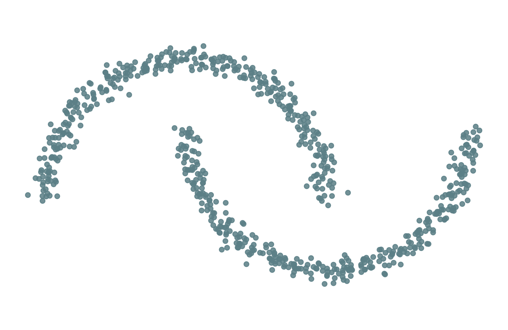
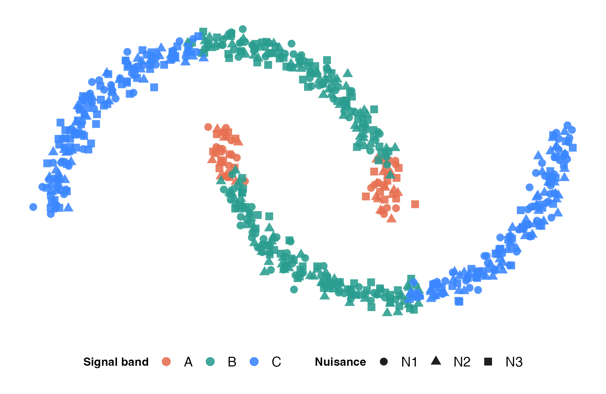
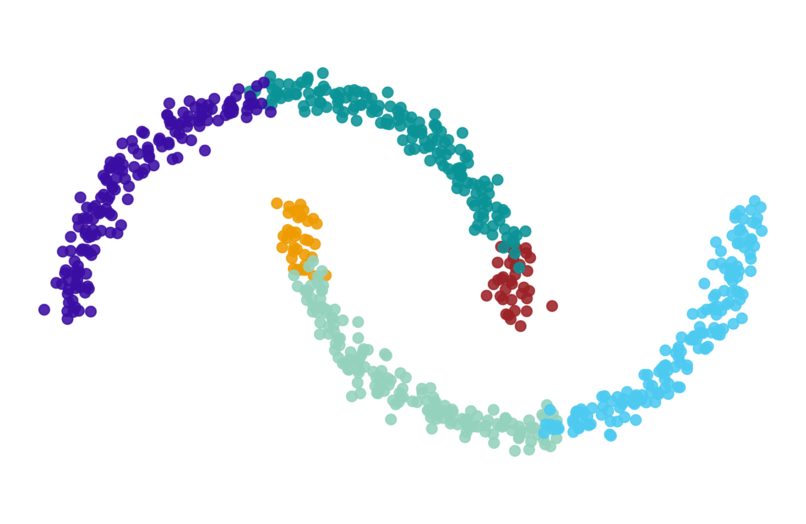
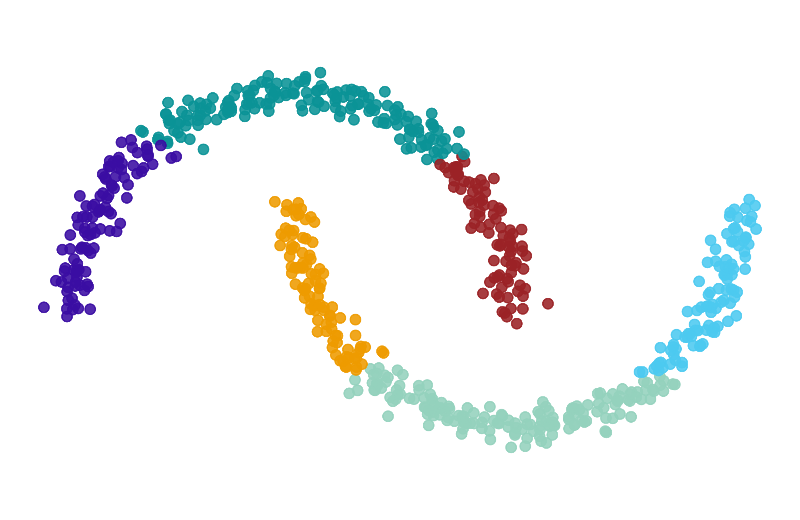
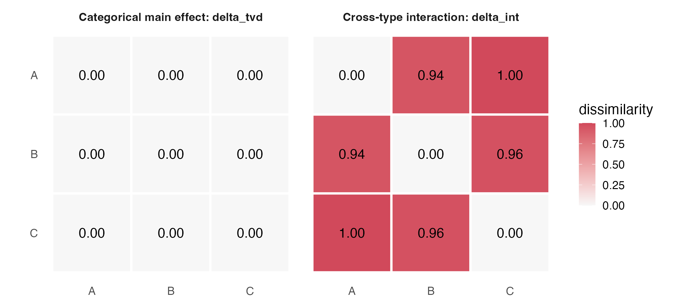
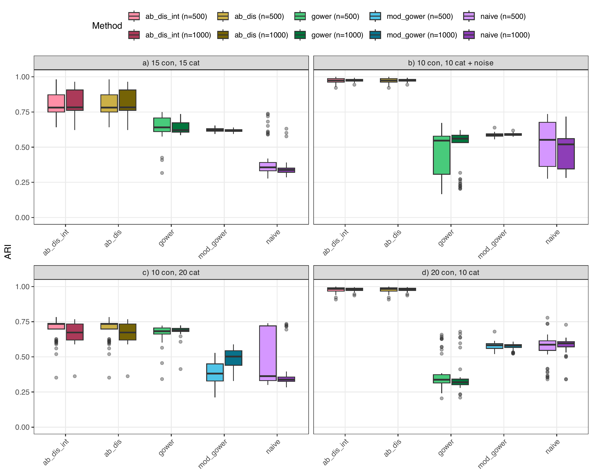

## Outline {.outline-slide}

::: {.outline-boxes}

::: {.outline-box .outline-1 .outline-highlight}
**Spectral clustering in a nutshell**  
From pairwise distances to a graph partition
:::

::: {.outline-box .outline-2 .outline-highlight}
**Feature-aware distances for mixed data**  
Which numerical and categorical differences enter the graph?
:::

::: {.outline-box .outline-3 .outline-highlight}
**Association- and interaction-aware construction**  
Encoding redundancy and continuous--categorical structure
:::

::: {.outline-box .outline-4 .outline-highlight}
**Synthetic evidence and interpretation**  
What spectral clustering can recover from each representation
:::

:::

## {.center}

[**cluster analysis** ]{style="color:indianred"}

the general aim is to find homogeneous groups of observations
  

- observations from the same group are similar to each other    

- observations from different groups are not similar to each other

- multiple clustering approaches exist


```{r,fig.align='center', out.width="40%", include=FALSE}
library(tidyverse)
library(mclust)
data("multishapes", package = "factoextra")

set.seed(1)

cl1 = mvtnorm::rmvnorm(100,c(3,4),sigma= matrix(c(.05,0,0,.05),nrow=2)) |> as_tibble() |> mutate(true_clust="a")
cl2 = mvtnorm::rmvnorm(75,c(2,1),sigma= matrix(c(.1,0,0,.1),nrow=2))|> as_tibble() |> mutate(true_clust="b")
cl3 = mvtnorm::rmvnorm(100,c(-2,2),sigma= matrix(c(.25,.2,.2,.25),nrow=2))|> as_tibble() |> mutate(true_clust="c")
cl4 = mvtnorm::rmvnorm(75,c(-4,-2),sigma= matrix(c(1,0,0,.01),nrow=2))|> as_tibble() |> mutate(true_clust="d")
cl5 = mvtnorm::rmvnorm(75,c(-5,4),sigma= matrix(c(.1,-.05,-.05,.1),nrow=2))|> as_tibble() |> mutate(true_clust="e")

easy_clusters =  rbind(cl1,cl2,cl3,cl4,cl5) |>
  rename(x=V1,y=V2) |> 
  mutate(kmeans_clust = kmeans(tibble(x,y),centers = 5,
                               nstart = 100)$cluster,
         kmeans_clust = fct(letters[kmeans_clust]),
         hiera_clust = cutree(hclust(dist(tibble(x,y)),
                                     method = "single"),k=5),
         hiera_clust = fct(letters[hiera_clust]),
         gmix_clust = mclust::Mclust(tibble(x,y),G = 5)$classification,
         gmix_clust = fct(letters[gmix_clust]),
         dbs_clust = fpc::dbscan(tibble(x,y),eps=1)$cluster,
         dbs_clust = fct(letters[dbs_clust+1]),
         spect_clust = manydist::spectral_from_dist(
           D = dist(tibble(x,y)) |> as.matrix(), k = 5),
         spect_clust = fct(letters[spect_clust])
  )

easy_clusters |>
  ggplot(aes(x=x,y=y,shape = true_clust)) + 
  theme_void() + geom_point(size=3.5,alpha=.75)
```

## {.center}

[**clustering approaches**]{style="color:indianred"}

- If a cluster structure does underlie the observations at hand, any approach will work

```{r,fig.align='center'}
easy_clusters |>
  ggplot(aes(x=x,y=y,shape = true_clust)) + 
  theme_void() + geom_point(size=3.5,alpha=.75)
```

## {.center}

[**clustering approaches**]{style="color:indianred"}

::::{.columns}

:::{.column width="20%"}
partitioning^[MacQueen's $K$-means; @MacQueen]
:::

:::{.column width="80%"}
```{r,fig.align='center'}
easy_clusters |>
  ggplot(aes(x=x,y=y,shape = true_clust,color = kmeans_clust)) + 
  theme_void() + geom_point(size=3.5,alpha=.75)
```
:::

::::


## {.center}

[**clustering approaches**]{style="color:indianred"}

::::{.columns}

:::{.column width="20%"}

agglomerative^[@kaufman2009finding]

:::


:::{.column width="80%"}

```{r,fig.align='center'}
easy_clusters |>
  ggplot(aes(x=x,y=y,shape = true_clust,color = hiera_clust)) + 
  theme_void() + geom_point(size=3.5,alpha=.75)
```

:::

::::


## {.center}

[**clustering approaches**]{style="color:indianred"}

::::{.columns}

:::{.column width="20%"}
model-based^[@mclachlan1988mixture]
:::


:::{.column width="80%"}

```{r,fig.align='center'}
easy_clusters |>
  ggplot(aes(x=x,y=y,shape = true_clust,color = gmix_clust)) + 
  theme_void() + geom_point(size=3.5,alpha=.75)
```

:::

::::


## {.center}

[**clustering approaches**]{style="color:indianred"}

::::{.columns}

:::{.column width="20%"}
density-based^[DBSCAN; @ester1996density]
:::

:::{.column width="80%"}
```{r,fig.align='center'}
easy_clusters |>
  ggplot(aes(x=x,y=y,shape = true_clust,color = dbs_clust)) + 
  theme_void() + geom_point(size=3.5,alpha=.75)
```

:::

::::


## {.center}

[**clustering approaches**]{style="color:indianred"}

:::: {.columns}

::: {.column width="20%"}
spectral^[NJW; @ng2001spectral]
:::


::: {.column width="80%"}

```{r,fig.align='center'}
easy_clusters |>
  ggplot(aes(x=x,y=y,shape = true_clust,color = spect_clust)) + 
  theme_void() + geom_point(size=3.5,alpha=.75)
```

:::

::::


## {.center}

[**clustering approaches**]{style="color:indianred"}

If a cluster structure does underlie the observations at hand, any approach will work

```{r}
multi_s_clusters = multishapes |> as_tibble() |> filter(shape!=5) |>
  mutate(true_clust = fct(letters[shape]),
         true_clust = fct_recode(.f = true_clust,e ="f"),
         kmeans_clust = kmeans(tibble(x,y),
                               centers = 5,nstart=100)$cluster,
         kmeans_clust = fct(letters[kmeans_clust]),
         hiera_clust = cutree(hclust(dist(tibble(x,y))),k=5),
         hiera_clust = fct(letters[hiera_clust]),
         gmix_clust = mclust::Mclust(tibble(x,y),G = 5)$classification,
         gmix_clust = fct(letters[gmix_clust]),
         dbs_clust = fpc::dbscan(tibble(x,y),eps=.2)$cluster,
         dbs_clust = fct(letters[dbs_clust]),
         spect_clust = manydist::spectral_from_dist(
           D = dist(tibble(x,y)) |> as.matrix(), k = 5),
         spect_clust = fct(letters[spect_clust])
  )


```

&nbsp;

::::{.columns}

:::{.column width="20%"}

&nbsp;

&nbsp;

&nbsp;

::: {.fragment}
[OR NOT?]{style="color:indianred"}
:::

:::


:::{.column width="80%"}

```{r,fig.align='center'}
multi_s_clusters |>
  ggplot(aes(x=x,y=y,shape = true_clust)) + 
  theme_void() + geom_point(size=3.5,alpha=.75)
```

:::

::::


## {.center}

[**clustering approaches**]{style="color:indianred"}

::::{.columns}

:::{.column width="20%"}

 partitioning
 (Kmeans)

:::

:::{.column width="80%"}
```{r,fig.align='center'}
multi_s_clusters |>
  ggplot(aes(x=x,y=y,shape = true_clust,color = kmeans_clust)) + 
  theme_void() + geom_point(size=3.5,alpha=.75)
```
:::

::::


## {.center}

[**clustering approaches**]{style="color:indianred"}

::::{.columns}

:::{.column width="20%"}

 agglomerative

:::

:::{.column width="80%"}


```{r,fig.align='center'}
multi_s_clusters |>
  ggplot(aes(x=x,y=y,shape = true_clust,color = hiera_clust)) + 
  theme_void() + geom_point(size=3.5,alpha=.75)
```
:::

::::

## {.center}

[**clustering approaches**]{style="color:indianred"}

::::{.columns}

:::{.column width="20%"}

model-based
(GMM)

:::

:::{.column width="80%"}

```{r,fig.align='center'}
multi_s_clusters |>
  ggplot(aes(x=x,y=y,shape = true_clust,color = gmix_clust)) + 
  theme_void() + geom_point(size=3.5,alpha=.75)
```
:::

::::

## {.center}

[**clustering approaches**]{style="color:indianred"}

::::{.columns}

:::{.column width="20%"}

density-based
(dbscan)

:::

:::{.column width="80%"}

```{r,fig.align='center'}
multi_s_clusters |>
  ggplot(aes(x=x,y=y,shape = true_clust,color = dbs_clust)) + 
  theme_void() + geom_point(size=3.5,alpha=.75)
```
:::

::::


## {.center}

[**clustering approaches**]{style="color:indianred"}

::::{.columns}

:::{.column width="20%"}
spectral
:::


:::{.column width="80%"}
```{r,fig.align='center'}
multi_s_clusters |>
  ggplot(aes(x=x,y=y,shape = true_clust,color = spect_clust)) + 
  theme_void() + geom_point(size=3.5,alpha=.75)

```
:::

::::


# spectral clustering in a nutshell


## Spectral clustering: a graph partitioning problem

::: {.callout-note appearance="simple" icon=false}
## Graph representation

Represent the data matrix ${\bf X}$ as a graph and cut it into $K$ groups, or clusters.

- observations are vertices;
- pairwise similarities are edge weights;
- large ${w}_{i\ell}$ indicates that observations $i$ and $\ell$ should remain connected.

:::

::: {.fragment .centered}
### the distance determines the graph that is available to partition
:::


## From distances to affinities

Start from the $I\times I$ pairwise distance matrix ${\bf D}$ and construct

$$
{\bf A}
=
\exp\left(-\frac{{\bf D}^{2}}{2\sigma^{2}}\right),
\qquad a_{ii}=0.
$$

::: {.columns}

::: {.column width="48%"}

::: {.callout-tip appearance="simple" icon=false}
## Affinity

The elements ${a}_{i\ell}$ are high when observations $i$ and $\ell$ are close under the chosen distance.
:::

:::

::: {.column width="48%"}

::: {.callout-important appearance="simple" icon=false}
## Neighbourhood scale

The parameter $\sigma$ controls which pairwise relationships remain visible in the graph.
:::

:::

:::


## Making the graph easy to cut

An approximate solution to the graph partitioning problem^[@ng2001spectral]:

::: {.callout-note appearance="simple" icon=false}
## Normalized graph Laplacian

$$
{\bf L}
=
{\bf D}_{r}^{-1/2}
{\bf A}
{\bf D}_{r}^{-1/2}
=
{\bf Q}{\Lambda}{\bf Q}^{\sf T},
$$

where ${\bf D}_{r}=\operatorname{diag}({\bf r})$, ${\bf r}={\bf A}{\bf 1}$, and ${\bf 1}$ is an $I$-dimensional vector of ones.
:::

::: {.fragment}

::: {.callout-important appearance="simple" icon=false}
## Spectral embedding

Apply $K$-means to the rows of ${\bf \widetilde Q}$, containing the first $K$ eigenvectors of ${\bf L}$.
:::

:::


## Why spectral clustering?

::: {.callout-tip appearance="simple" icon=false}
Spectral clustering works on the connectivity encoded by the graph and can recover non-convex structure.
:::

<div style="display:flex;justify-content:center;align-items:center;gap:1.2em;">


</div>


# feature-aware distances for mixed data


## Mixed-data setup

::: {.callout-tip appearance="simple" icon=false}
## A mixed data set

- $I$ observations described by $Q$ variables;
- $Q_n$ numerical variables and $Q_c$ categorical variables;
- the $I\times Q$ data matrix is column-wise partitioned:

$$
{\bf X}=\left[{\bf X}_{n},{\bf X}_{c}\right].
$$
:::

A general mixed distance between observations $i$ and $\ell$ is

$$
\begin{aligned}
d\left(\mathbf{x}_i,\mathbf{x}_\ell\right)
&=
\sum_{j_n=1}^{Q_n}
w_{j_n}\delta^n_{j_n}
\left(\mathbf{x}^n_i,\mathbf{x}^n_\ell\right)
\\
&\quad+
\sum_{j_c=1}^{Q_c}
w_{j_c}\delta^c_{j_c}
\left(\mathbf{x}^c_i,\mathbf{x}^c_\ell\right).
\end{aligned}
$$

## The numerical geometry suggests two groups

:::: {.columns}

::: {.column width="66%"}
{width=100% fig-alt="Two interlocking half-moons shown without categorical labels."}
:::

::: {.column width="31%"}

::: {style="font-size:4.8em;font-weight:750;line-height:.95;color:#E76F51;"}
2
:::

### connected shapes

A numerical distance can recover the **upper** and **lower** moon.

::: {.callout-note appearance="simple" icon=false}
## Geometry alone

There is no preferred subdivision within either moon.
:::

:::

::::


## One factor is structured; the other is deliberately neutral

:::: {.columns}

::: {.column width="62%"}
{width=100% fig-alt="Half-moons with signal band mapped to colour and nuisance category mapped to shape."}
:::

::: {.column width="35%"}

**Signal band**

- colour: $A,B,C$
- unequal arc lengths: $10\%,45\%,45\%$
- repeated on both moons

**Nuisance factor**

- shape: $N_1,N_2,N_3$
- balanced within every band
- spatially random

:::

::::

::: {.fragment .centered}
### only the signal factor has a systematic relationship with the numerical geometry
:::


## The target is the moon **AND** the signal category

:::: {.columns}

::: {.column width="39%"}

::: {style="padding:.35em .5em;border-left:8px solid #E76F51;background:#FAF8F3;font-size:1.15em;text-align:center;"}
$$
\text{cluster}
=
\text{moon}\times\text{band}
$$
:::

The desired partition contains six groups:

$$
\begin{aligned}
&U\!A,\ U\!B,\ U\!C,\\
&L\!A,\ L\!B,\ L\!C.
\end{aligned}
$$

::: {.callout-important appearance="simple" icon=false}
## The six-way intersection

Moon alone gives two groups. Band alone gives three.
:::

:::

::: {.column width="59%"}
{width=100% fig-alt="The six target groups formed by crossing upper and lower moon with bands A, B, and C."}
:::

::::


## Without interaction, the graph follows geometry

:::: {.columns}

::: {.column width="65%"}
{width=100% fig-alt="Six-cluster spectral partition obtained without the continuous-categorical interaction."}
:::

::: {.column width="32%"}

::: {style="font-size:2.1em;font-weight:750;line-height:1.05;color:#E76F51;"}
ARI = 0.490
:::

Spectral clustering is asked for $K=6$, but the graph does not know where $A$, $B$, and $C$ change.

::: {.callout-note appearance="simple" icon=false}
## The wrong boundaries

The moons are subdivided according to numerical geometry—not the signal factor.
:::

:::

::::


## With interaction, the graph recovers the six intersections

:::: {.columns}

::: {.column width="65%"}
{width=100% fig-alt="The exact six-group spectral partition obtained with the continuous-categorical interaction."}
:::

::: {.column width="32%"}

::: {style="font-size:2.1em;font-weight:750;line-height:1.05;color:#2A9D8F;"}
ARI = 1.000
:::

The numerical distance preserves the two moons.

$\Delta_{\mathrm{int}}$ adds barriers at the $A/B/C$ boundaries.

::: {.callout-tip appearance="simple" icon=false}
## Exact recovery

The graph now encodes the required **moon AND category** structure.
:::

:::

::::


## The distance determines what spectral clustering can recover

::: {style="margin-top:1.1em;font-size:.92em;text-align:center;color:#5B7F86;"}
$$
\begin{aligned}
&\text{numerical geometry}
\;+\;
\text{categorical association}\\[0.25em]
&\qquad+\;
\text{cross-type interaction}
\;\Longrightarrow\;
\text{graph structure}
\end{aligned}
$$
:::

::: {style="max-width:1200px;margin:1.1em auto 0;font-size:1.08em;font-weight:620;line-height:1.32;text-align:center;"}
If clusters are defined jointly by numerical and categorical information,  
the distance must make that joint structure visible **before** the graph is partitioned.
:::

::: {.fragment .centered}
### this motivates an interaction-aware construction for mixed-data dissimilarities
:::


## Independence-based distances

::: {.callout-note appearance="simple" icon=false}
## Independence-based pairwise distance

No inter-variable relations are considered.

- continuous variables: **Euclidean** or **Manhattan** distances;
- categorical variables: **Hamming** / matching distance, among many others;
- mixed data: **Gower** dissimilarity index.
:::

::: {.fragment}

::: {.callout-tip appearance="simple" icon=false}
## Beyond commensurability

Commensurability makes variable contributions comparable across **scales** and data **types**^[@vdv_jcgs].

If variables are correlated or associated, shared information may still enter the distance repeatedly: **redundancy**.
:::

:::


## The graph inherits the feature representation

::: {.columns}

::: {.column width="31%"}

::: {.callout-note appearance="simple" icon=false}
## Scale and type

Are contributions comparable across measurement scales and data types?
:::

:::

::: {.column width="31%"}

::: {.callout-tip appearance="simple" icon=false}
## Association

Is shared information within the numerical or categorical block counted repeatedly?
:::

:::

::: {.column width="31%"}

::: {.callout-important appearance="simple" icon=false}
## Interaction

Do numerical features make some categorical distinctions more meaningful than others?
:::

:::

:::

::: {.fragment .centered}
### feature-based interpretation starts with the components used to construct ${\bf D}$
:::


# association-based distances


## Continuous features: Mahalanobis distance

::: {.callout-note title="Association-aware continuous component" icon=false}

Let ${\bf X}_{n}$ be an $I\times Q_n$ matrix and let ${\bf S}$ be its sample covariance matrix. The Mahalanobis distance matrix is

$$
{\bf D}_{mah}
=
\left[
\operatorname{diag}({\bf G}){\bf 1}^{\sf T}
+
{\bf 1}\operatorname{diag}({\bf G})^{\sf T}
-
2{\bf G}
\right]^{\odot 1/2},
$$

where

$$
{\bf G}
=
({\bf C}{\bf X}_{n})
{\bf S}^{-1}
({\bf C}{\bf X}_{n})^{\sf T},
\qquad
{\bf C}
=
{\bf I}-\frac{1}{I}{\bf 1}{\bf 1}^{\sf T}.
$$

:::

::: {.fragment .centered}
### correlations are represented through ${\bf S}^{-1}$ rather than counted as separate independent directions
:::


## Categorical features: the delta framework

Let ${\bf X}_{c}$ be an $I\times Q_c$ categorical data matrix, and let

$$
{\bf Z}=\left[{\bf Z}_{1},\ldots,{\bf Z}_{Q_c}\right]
$$

be its one-hot encoding.

::: {.callout-tip appearance="simple" icon=false}

$$
{\bf D}_{c}
=
{\bf Z}{\Delta}{\bf Z}^{\sf T},
\qquad
\Delta
=
\operatorname{bdiag}
\left(
\Delta_1,\ldots,\Delta_{Q_c}
\right).
$$

Setting the category-dissimilarity blocks $\Delta_j$ determines the categorical distance measure^[@vdv_pr].
:::

::: {.fragment .centered}
### category-level distinctions are translated into observation-level distances
:::


## From co-occurrences to conditional profiles

The empirical co-occurrence matrix is

$$
{\bf P}
=
\frac{1}{I}{\bf Z}^{\sf T}{\bf Z}.
$$

Its off-diagonal blocks contain joint proportions between categorical variables.

::: {.fragment}

Let

$$
{\bf P}_{z}
=
{\bf P}\odot{\bf I}_{Q^*}.
$$

The block matrix

$$
{\bf R}
=
{\bf P}_{z}^{-1}
\left(
{\bf P}-{\bf P}_{z}
\right)
$$

contains conditional profiles across variables.

:::


## Total variation distance between categories

Let ${\bf r}^{ji}_a$ and ${\bf r}^{ji}_b$ be rows of the $(j,i)$th off-diagonal block of ${\bf R}$.

::: {.callout-tip title="Association-aware categorical component" icon=false}

For categories $a$ and $b$ of variable $j$,

$$
\begin{aligned}
\delta^{j}_{tvd}(a,b)
&=
\sum_{i\neq j}^{Q_c}
w_{ji}
\Phi^{ji}
\left(
{\bf r}^{ji}_{a},
{\bf r}^{ji}_{b}
\right)
\\
&=
\sum_{i\neq j}^{Q_c}
w_{ji}
\left[
\frac{1}{2}
\sum_{\ell=1}^{q_i}
\left|
{\bf r}^{ji}_{a\ell}
-
{\bf r}^{ji}_{b\ell}
\right|
\right],
\end{aligned}
$$

with $w_{ji}=1/(Q_c-1)$ under equal weighting^[@le2005association].
:::


## From category dissimilarities to ${\bf D}_{tvd}$

Collect the category-dissimilarity matrices in

$$
\Delta^{(tvd)}
=
\operatorname{bdiag}
\left(
\Delta^{(tvd)}_1,\ldots,\Delta^{(tvd)}_{Q_c}
\right).
$$

Then

$$
\begin{aligned}
{\bf D}_{tvd}
&=
{\bf Z}
\Delta^{(tvd)}
{\bf Z}^{\sf T}
\\
&=
\sum_{j=1}^{Q_c}
{\bf Z}_j
\Delta^{(tvd)}_j
{\bf Z}_j^{\sf T}.
\end{aligned}
$$

::: {.fragment .centered}
### categorical mismatches are weighted by how differently their categories relate to the other categorical features
:::


## Association-aware mixed representation

Within each variable block:

::: {.columns}

::: {.column width="48%"}

::: {.callout-note appearance="simple" icon=false}
## Numerical block

${\bf D}_{mah}$ accounts for covariance and redundancy among continuous variables.
:::

:::

::: {.column width="48%"}

::: {.callout-tip appearance="simple" icon=false}
## Categorical block

${\bf D}_{tvd}$ accounts for associations among categorical variables.
:::

:::

:::

::: {.fragment}

$$
{\bf D}_{mix}^{(assoc)}
=
{\bf D}_{mah}
+
{\bf D}_{tvd}.
$$

:::

::: {.fragment .centered}
### within-block structure is represented, but cross-type structure is still missing
:::


# interaction-aware extensions


## Cross-type interactions

Association-aware distances account for relations

- among continuous variables;
- among categorical variables.

::: {.callout-important appearance="simple" icon=false}
## Cross-type structure

In mixed data, categorical differences may be meaningful because they are reflected in the continuous variables.
:::

::: {.fragment .centered}
### the next step is to make the distance [interaction-aware]{.text-coral}
:::


## How to measure interactions^[@iod2026_sc_mix]

Define $\Delta^{int}$ to encode continuous--categorical interactions and augment $\Delta^{tvd}$:

$$
\widetilde{\Delta}
=
(1-\alpha)\Delta^{tvd}
+
\alpha\Delta^{int},
\qquad
\alpha=\frac{1}{Q_c}.
$$

The mixed dissimilarity becomes

$$
{\bf D}_{mix}^{(int)}
=
{\bf D}_{mah}
+
{\bf D}_{cat}^{(int)},
\qquad
{\bf D}_{cat}^{(int)}
=
{\bf Z}\widetilde{\Delta}{\bf Z}^{\sf T}.
$$


## What is $\Delta^{int}$?

The entry $\delta_{int}^{j}(a,b)$ measures how much the continuous variables help discriminate between observations choosing category $a$ and those choosing category $b$ for categorical variable $j$.

. . .

::: {.callout-tip appearance="simple" icon=false}
## Category-pair classification problem

For each pair $(a,b)$:

- use the continuous variables as predictors;
- classify observations belonging to categories $a$ and $b$;
- use a nearest-neighbour rule in the continuous space.
:::

## Computing $\Delta^{int}_{j}$

For each categorical variable $j$ and each category pair $(a,b)$:

1. use ${\bf D}_{mah}$ to identify neighbours among observations belonging to $a$ or $b$;
2. consider a proportion of neighbours, say $\pi_{nn}=0.1$;
3. classify observations using a prior-corrected decision rule;
4. compute balanced accuracy.

$$
\operatorname{BAcc}^{j}(a,b)
=
\frac{1}{2}
\left[
\operatorname{TPR}^{j}_{a}(a,b)
+
\operatorname{TPR}^{j}_{b}(a,b)
\right].
$$

::: {.fragment}

Map predictive performance onto a non-negative separability scale:

$$
\delta^{j}_{int}(a,b)
=
\max\left\{
0,\,
2\operatorname{BAcc}^{j}(a,b)-1
\right\}
\in[0,1].
$$


### $0$ means chance-level or worse; $1$ means perfect separation
:::
## Computing $\Delta^{int}_{j}$

For categorical variable $j$ with $q_j$ categories, compute  
$\frac{q_j(q_j -1)}{2}$ category-pair quantities.

::: columns
::: {.column width="55%"}
:::

::: {.column width="45%"}
$$
\Delta_{int} =
\begin{pmatrix}
0 & \cdot & \cdot & \cdot \\
\cdot & 0 & \cdot & \cdot \\
\cdot & \cdot & 0 &  \cdot\\
\cdot & \cdot & \cdot & 0
\end{pmatrix}
$$
:::
:::

## Computing $\Delta^{int}_{j}$

::: columns
::: {.column width="55%"}
{width=100%}
:::

::: {.column width="45%"}
$$
\Delta_{int} =
\begin{pmatrix}
0 & \color{#E76F51}{0.94} & \cdot & \cdot \\
\color{#E76F51}{0.94} & 0 & \cdot & \cdot \\
\cdot & \cdot & 0 &  \cdot\\
\cdot & \cdot & \cdot & 0
\end{pmatrix}
$$
:::
:::

## Computing $\Delta^{int}_{j}$

::: columns
::: {.column width="55%"}
{width=100%}
:::

::: {.column width="45%"}
$$
\Delta_{int} =
\begin{pmatrix}
0 & 0.94 & \color{#E76F51}{0.40} & \cdot \\
0.94 & 0 & \cdot & \cdot \\
\color{#E76F51}{0.40} & \cdot & 0 &  \cdot\\
\cdot & \cdot & \cdot & 0
\end{pmatrix}
$$
:::
:::

## Computing $\Delta^{int}_{j}$

::: columns
::: {.column width="55%"}
{width=100%}
:::

::: {.column width="45%"}
$$
\Delta_{int} =
\begin{pmatrix}
0 & 0.94 & 0.40 & \color{#E76F51}{0.39} \\
0.94 & 0 & \cdot & \cdot \\
0.40 & \cdot & 0 &  \cdot\\
\color{#E76F51}{0.39} & \cdot & \cdot & 0
\end{pmatrix}
$$
:::
:::

## Computing $\Delta^{int}_{j}$

::: columns
::: {.column width="55%"}
{width=100%}
:::

::: {.column width="45%"}
$$
\Delta_{int} =
\begin{pmatrix}
0 & 0.94 & 0.40 & 0.39 \\
0.94 & 0 & \color{#E76F51}{0.54} & \cdot \\
0.40 & \color{#E76F51}{0.54} & 0 & \cdot  \\
0.39 & \cdot & \cdot  & 0
\end{pmatrix}
$$
:::
:::

## Computing $\Delta^{int}_{j}$

::: columns
::: {.column width="55%"}
{width=100%}
:::

::: {.column width="45%"}
$$
\Delta_{int} =
\begin{pmatrix}
0 & 0.94 & 0.40 & 0.39 \\
0.94 & 0 & 0.54 & \color{#E76F51}{0.55} \\
0.40 & 0.54 & 0 & \cdot  \\
0.39 & \color{#E76F51}{0.55} & \cdot  & 0
\end{pmatrix}
$$
:::
:::

## Computing $\Delta^{int}_{j}$

::: columns
::: {.column width="55%"}
{width=100%}
:::

::: {.column width="45%"}
$$
\Delta_{int} =
\begin{pmatrix}
0 & 0.94 & 0.40 & 0.39 \\
0.94 & 0 & 0.54 & 0.55 \\
0.40 & 0.54 & 0 & \color{#E76F51}{0}  \\
0.39 & 0.55 & \color{#E76F51}{0}  & 0
\end{pmatrix}
$$
:::
:::

:::{.fragment}
### summarize category-pair separability in the continuous space
:::


## Back to the motivating example

{width=78% fig-align="center" fig-alt="Heatmaps comparing a zero TVD dissimilarity matrix with a high interaction dissimilarity matrix for categories A, B, and C."}

:::: {.columns}

::: {.column width="46%"}

::: {style="padding:.25em .45em;border-left:7px solid #5B7F86;background:#FAF8F3;text-align:center;"}
$$
\Delta_{\mathrm{tvd}}=0
$$
:::

Band and nuisance are independent.

:::

::: {.column width="50%"}

::: {style="padding:.25em .45em;border-left:7px solid #E76F51;background:#FAF8F3;text-align:center;"}
$$
\delta^{\mathrm{int}}(a,b)
=
\max\{0,\ 2\,\mathrm{BAcc}(a,b)-1\}
$$
:::

Numerical neighbours discriminate every band pair.

:::

::::

::: {.centered style="font-size:.9em;font-weight:650;color:#5B7F86;"}
$\delta^{\mathrm{int}}_{AB}=0.94\qquad
\delta^{\mathrm{int}}_{AC}=1.00\qquad
\delta^{\mathrm{int}}_{BC}=0.96$
:::


## A feature-based decomposition of pairwise dissimilarity

For observations $i$ and $\ell$,

$$
\begin{aligned}
d_{mix}^{(int)}(i,\ell)
&=
d_{mah}
\left(
{\bf x}_{i_n},
{\bf x}_{\ell_n}
\right)
\\
&\quad+
\sum_{j=1}^{Q_c}
\left[
(1-\alpha)
\delta^{j}_{tvd}
\left(
x_{ij_c},
x_{\ell j_c}
\right)
+
\alpha
\delta^{j}_{int}
\left(
x_{ij_c},
x_{\ell j_c}
\right)
\right].
\end{aligned}
$$

::: {.fragment .centered}
### every graph edge is built from continuous association, categorical association, and cross-type interaction components
:::


## The additive construction is coherent

Define the maximum-normalised continuous and categorical kernels:

$$
\overline K_{\mathrm n}(i,\ell)
=
\exp
\left\{
-
d_{mah}
\left(
{\bf x}_{i_n},
{\bf x}_{\ell_n}
\right)
\right\},
$$

$$
\overline K_{\mathrm c}^{(int)}(i,\ell)
=
\exp
\left\{
-
d_{\mathrm c}^{(int)}
\left(
{\bf x}_{i_c},
{\bf x}_{\ell_c}
\right)
\right\}.
$$

Their product satisfies

$$
-\log
\left[
\overline K_{\mathrm n}(i,\ell)
\overline K_{\mathrm c}^{(int)}(i,\ell)
\right]
=
d_{mix}^{(int)}(i,\ell).
$$


## From feature relations to a spectral solution

::: {.columns}

::: {.column width="28%"}

::: {.callout-note appearance="simple" icon=false}
## 1. Features

Numerical, categorical, and cross-type relations
:::

:::

::: {.column width="6%"}

::: {.centered}

<span style="font-size:2.2em;">$\rightarrow$</span>

:::

:::

::: {.column width="28%"}

::: {.callout-tip appearance="simple" icon=false}
## 2. Distance

${\bf D}_{mah}+{\bf Z}\widetilde{\Delta}{\bf Z}^{\sf T}$
:::

:::

::: {.column width="6%"}

::: {.centered}

<span style="font-size:2.2em;">$\rightarrow$</span>

:::

:::

::: {.column width="28%"}

::: {.callout-important appearance="simple" icon=false}
## 3. Graph

Affinities, spectral embedding, and partition
:::

:::

:::

::: {.fragment .centered}
### interpreting the solution means tracing which feature relations made observations close
:::


# synthetic experiments


## Simulation 1: associated mixed variables

::: {.columns}

::: {.column width="48%"}

::: {.callout-note appearance="simple" icon=false}
## General design

- $I=1000$ and $I=2000$;
- $K=3$ clusters;
- 50 datasets per configuration;
- spectral clustering applied to each dissimilarity matrix;
- performance measured by adjusted Rand index.
:::

:::

::: {.column width="48%"}

::: {.callout-important appearance="simple" icon=false}
## Feature structure

- correlated numerical variables;
- associated categorical variables;
- categorical variables depending on numerical variables;
- an additional noise scenario.
:::

:::

:::


## Simulation 1: variable composition

Four mixed-data scenarios:

1. $Q_n=15$, $Q_c=15$;
2. $Q_n=10$, $Q_c=20$;
3. $Q_n=20$, $Q_c=10$;
4. $Q_n=10$, $Q_c=10$, plus noise variables.

::: {.fragment .centered}
### the design induces numerical correlations, categorical associations, and numerical--categorical dependence
:::


## Simulation 1: results

::: {.columns}

::: {.column width="58%"}

{width=100% fig-align="center"}

:::

::: {.column width="40%"}

- Association-based distances are generally the most accurate.
- When continuous variables dominate, association-based distances achieve almost perfect recovery.
- Standard mixed-data distances are more sensitive to variable composition and noise.

:::

:::


## Simulation 2: interaction-driven clusters

::: {.columns}

::: {.column width="48%"}

::: {.callout-note appearance="simple" icon=false}
## Design

- $I=500$ and $I=1000$;
- six continuous and three categorical variables;
- $V_4,V_5,V_6$ generated independently from $N(0,1)$;
- $V_1,V_2,V_3$ generated conditionally on $C_1$ and $C_2$.
:::

:::

::: {.column width="48%"}

::: {.callout-important appearance="simple" icon=false}
## Main feature

The clusters are not defined by the continuous variables alone or the categorical variables alone.

They are defined by their **cross-type interaction**.
:::

:::

:::

::: {.fragment .centered}
### this is the setting where $\Delta^{int}$ should matter
:::


## Simulation 2: results

::: {.columns}

::: {.column width="58%"}

{width=100% fig-align="center"}

:::

::: {.column width="40%"}

- `ab_dis_int` outperforms the competitors.
- Distances that do not account for cross-type structure provide almost chance-level performance.

:::

:::


# interpretation and conclusions


## Reading a spectral solution through its features

::: {.columns}

::: {.column width="31%"}

::: {.callout-note appearance="simple" icon=false}
## ${\bf D}_{mah}$

Which numerical differences remain after accounting for covariance?
:::

:::

::: {.column width="31%"}

::: {.callout-tip appearance="simple" icon=false}
## $\Delta^{tvd}$

Which categorical distinctions are supported by their relations with other categorical features?
:::

:::

::: {.column width="31%"}

::: {.callout-important appearance="simple" icon=false}
## $\Delta^{int}$

Which categorical distinctions are expressed in the continuous feature space?
:::

:::

:::

::: {.fragment .centered}
### these components explain the representation supplied to spectral clustering—not a post-hoc relabelling of the clusters
:::


## What the experiments support

::: {.fragment}

::: {.callout-important appearance="simple" icon=false}
## Association structure matters

Mahalanobis and TVD-based components account for redundancy within the numerical and categorical blocks.
:::

:::

::: {.fragment}

::: {.callout-tip appearance="simple" icon=false}
## Cross-type interactions must be encoded

$\Delta^{int}$ translates category separability in the numerical space into categorical dissimilarities.
:::

:::

::: {.fragment}

::: {.callout-note appearance="simple" icon=false}
## The distance determines what spectral clustering can recover

The simulations favour association-aware distances and show a clear gain from $\Delta^{int}$ when clusters are interaction-driven.
:::

:::


## Main message

::: {.centered}

<div style="font-size:1.45em;font-weight:700;color:#5B7F86;">
A spectral clustering solution is only as informative as the pairwise representation supplied to it.
</div>

:::

::: {.fragment .centered}

### For mixed data, feature-based interpretation requires distances that make scale, association, and cross-type interaction explicit.

:::


## Main references {.smaller}

::: {#refs}

:::


<!-- ## Contact -->

<!-- ::: {.centered} -->
<!-- **Alfonso Iodice D'Enza** · -->
<!-- [iodicede@unina.it](mailto:iodicede@unina.it) · -->
<!-- [https://alfonsoiodicede.github.io](https://alfonsoiodicede.github.io) -->
<!-- ::: -->

<!-- :::: {.columns} -->

<!-- ::: {.column width="72%"} -->

<!-- {width=100% fig-align="center"} -->

<!-- ::: -->

<!-- ::: {.column width="28%"} -->

<!-- {width=78% fig-align="center"} -->

<!-- ::: {.centered} -->
<!-- [Package website](https://alfonsoiodicede.github.io/manydist_package/) -->
<!-- ::: -->

<!-- ::: -->

<!-- :::: -->


<!-- # Backup slides -->


<!-- ## Categorical example: data and indicator matrices -->

<!-- Consider two categorical variables: -->

<!-- - $X_1$ with categories $A,B,C$; -->
<!-- - $X_2$ with categories $u,v$. -->

<!-- $$ -->
<!-- {\bf Z}_1 = -->
<!-- \begin{pmatrix} -->
<!-- 1&0&0\\ -->
<!-- 1&0&0\\ -->
<!-- 1&0&0\\ -->
<!-- 0&1&0\\ -->
<!-- 0&1&0\\ -->
<!-- 0&1&0\\ -->
<!-- 0&0&1\\ -->
<!-- 0&0&1\\ -->
<!-- 0&0&1\\ -->
<!-- 0&0&1 -->
<!-- \end{pmatrix}, -->
<!-- \qquad -->
<!-- {\bf Z}_2 = -->
<!-- \begin{pmatrix} -->
<!-- 1&0\\ -->
<!-- 1&0\\ -->
<!-- 0&1\\ -->
<!-- 1&0\\ -->
<!-- 1&0\\ -->
<!-- 0&1\\ -->
<!-- 1&0\\ -->
<!-- 0&1\\ -->
<!-- 0&1\\ -->
<!-- 0&1 -->
<!-- \end{pmatrix}. -->
<!-- $$ -->


<!-- ## Categorical example: from ${\bf Z}$ to ${\bf P}$ -->

<!-- Let ${\bf Z}=[{\bf Z}_1,{\bf Z}_2]$. Then -->

<!-- $$ -->
<!-- {\bf P} -->
<!-- = -->
<!-- \frac{1}{10}{\bf Z}^{\sf T}{\bf Z} -->
<!-- = -->
<!-- \begin{pmatrix} -->
<!-- \color{#2A9D8F}{0.30} & \color{#2A9D8F}{0} & \color{#2A9D8F}{0} & \color{#E76F51}{0.20} & \color{#E76F51}{0.10}\\ -->
<!-- \color{#2A9D8F}{0} & \color{#2A9D8F}{0.30} & \color{#2A9D8F}{0} & \color{#E76F51}{0.20} & \color{#E76F51}{0.10}\\ -->
<!-- \color{#2A9D8F}{0} & \color{#2A9D8F}{0} & \color{#2A9D8F}{0.40} & \color{#E76F51}{0.10} & \color{#E76F51}{0.30}\\ -->
<!-- \color{#E76F51}{0.20} & \color{#E76F51}{0.20} & \color{#E76F51}{0.10} & \color{#2A9D8F}{0.50} & \color{#2A9D8F}{0}\\ -->
<!-- \color{#E76F51}{0.10} & \color{#E76F51}{0.10} & \color{#E76F51}{0.30} & \color{#2A9D8F}{0} & \color{#2A9D8F}{0.50} -->
<!-- \end{pmatrix}. -->
<!-- $$ -->

<!-- ::: {.centered} -->
<!-- ### diagonal blocks contain marginal information; off-diagonal blocks contain joint proportions -->
<!-- ::: -->


<!-- ## Categorical example: from ${\bf P}$ to ${\bf R}$ -->

<!-- $$ -->
<!-- {\bf P}_z -->
<!-- = -->
<!-- {\bf P}\odot{\bf I}_{Q^*} -->
<!-- = -->
<!-- \operatorname{diag}(0.30,0.30,0.40,0.50,0.50). -->
<!-- $$ -->

<!-- $$ -->
<!-- {\bf R} -->
<!-- = -->
<!-- {\bf P}_z^{-1}({\bf P}-{\bf P}_z) -->
<!-- = -->
<!-- \begin{pmatrix} -->
<!-- 0&0&0&0.67&0.33\\ -->
<!-- 0&0&0&0.67&0.33\\ -->
<!-- 0&0&0&0.25&0.75\\ -->
<!-- 0.40&0.40&0.20&0&0\\ -->
<!-- 0.20&0.20&0.60&0&0 -->
<!-- \end{pmatrix}. -->
<!-- $$ -->

<!-- ::: {.centered} -->
<!-- ### each off-diagonal block contains conditional profiles across variables -->
<!-- ::: -->


<!-- ## Factorization motivates the interaction direction -->

<!-- Let ${\bf x}_i=({\bf x}_{i_n},{\bf x}_{i_c})$. The joint distribution can always be written as -->

<!-- $$ -->
<!-- f({\bf x}_{i_n},{\bf x}_{i_c}) -->
<!-- = -->
<!-- f({\bf x}_{i_n}) -->
<!-- f({\bf x}_{i_c}\mid{\bf x}_{i_n}). -->
<!-- $$ -->

<!-- ::: {.fragment} -->

<!-- This motivates using the continuous variables to quantify categorical distinctions: -->

<!-- $$ -->
<!-- {\bf X}_n -->
<!-- \quad\longrightarrow\quad -->
<!-- \delta^{j}_{int}(a,b). -->
<!-- $$ -->

<!-- ::: -->


<!-- ## Dissimilarity and a reference density -->

<!-- Starting from a non-negative dissimilarity from a prototype, -->

<!-- $$ -->
<!-- d_{{\bf S}_k}({\bf x}_i,{\bf c}_k)\geq0, -->
<!-- \qquad -->
<!-- d_{{\bf S}_k}({\bf c}_k,{\bf c}_k)=0, -->
<!-- $$ -->

<!-- a distance-based probability model can be constructed^[@Hennig19; @ben2008probabilistic]: -->

<!-- $$ -->
<!-- f({\bf x}_i;{\bf c}_k,{\bf S}_k) -->
<!-- = -->
<!-- g({\bf c}_k,{\bf S}_k,\eta) -->
<!-- \exp -->
<!-- \left\{ -->
<!-- -\eta -->
<!-- d_{{\bf S}_k}({\bf x}_i,{\bf c}_k) -->
<!-- \right\}, -->
<!-- \qquad \eta>0. -->
<!-- $$ -->

<!-- The maximum-normalised kernel satisfies -->

<!-- $$ -->
<!-- d_{{\bf S}_k}({\bf x}_i,{\bf c}_k) -->
<!-- = -->
<!-- -\frac{1}{\eta} -->
<!-- \log\overline K_k({\bf x}_i,{\bf c}_k). -->
<!-- $$ -->


<!-- ## Simulation 1: numerical data generation -->

<!-- Numerical variables are generated from cluster-specific multivariate normal distributions: -->

<!-- $$ -->
<!-- {\bf X}_{n}\mid C_k -->
<!-- \sim -->
<!-- N({\boldsymbol \mu}_k,{\boldsymbol \Sigma}_k). -->
<!-- $$ -->

<!-- Cluster proportions: -->

<!-- $$ -->
<!-- P(C_1)=0.20,\qquad -->
<!-- P(C_2)=0.30,\qquad -->
<!-- P(C_3)=0.50. -->
<!-- $$ -->

<!-- - $C_1$: means $0$, correlations $0.5$; -->
<!-- - $C_2$: means $4$, correlations $0.8$; -->
<!-- - $C_3$: means $-1$ for odd variables and $5$ for even variables, correlations $-0.5$; -->
<!-- - all variances are $1$. -->


<!-- ## Simulation 1: categorical data generation -->

<!-- Categorical variables are binary and generated recursively: -->

<!-- $$ -->
<!-- X^c_j\mid C_k -->
<!-- \sim -->
<!-- \operatorname{Bernoulli}(p_{jk}), -->
<!-- $$ -->

<!-- with -->

<!-- $$ -->
<!-- p_{jk} -->
<!-- = -->
<!-- \left[ -->
<!-- 1+\exp -->
<!-- \left( -->
<!-- {\boldsymbol\beta}_k^\top -->
<!-- \widetilde{\bf X}_j -->
<!-- \right) -->
<!-- \right]^{-1}. -->
<!-- $$ -->

<!-- For $j=1$, -->

<!-- $$ -->
<!-- \widetilde{\bf X}_j -->
<!-- = -->
<!-- (1,{\bf X}_n), -->
<!-- $$ -->

<!-- while for $j>1$, -->

<!-- $$ -->
<!-- \widetilde{\bf X}_j -->
<!-- = -->
<!-- (1,{\bf X}_n,X^c_1,\ldots,X^c_{j-1}). -->
<!-- $$ -->
