```{r}
#| include: false


library(tidyverse)
library(tidymodels)
library(ggrepel)
library(network)
library(sna)
library(GGally)
library(knitr)
library(kableExtra)
library(conflicted)
devtools::load_all("../manydist")

conflicts_prefer(dplyr::filter)
conflicts_prefer(dplyr::lag)
conflicts_prefer(base::attr)
```

## A collaborative project

```{r}
#| echo: false
#| warning: false
#| message: false
#| fig-height: 6

# library(tidyverse)
library(maps)
library(ggrepel)

affiliations <- tibble::tibble(
  label = c(
    "Michel van de Velden\nCarlo Cavicchia\nErasmus University Rotterdam",
    "Francesco Palumbo\nUniversity of Naples Federico II",
    "Angelos Markos\nDemocritus University of Thrace",
    "Cristina Tortora\nSan José State University"
  ),
  lon = c(4.4777, 14.2681, 25.4055, -121.8863),
  lat = c(51.9244, 40.8518, 41.1186, 37.3382)
)

world_map <- ggplot2::map_data("world")

ggplot() +
  geom_polygon(
    data = world_map,
    aes(x = long, y = lat, group = group),
    fill = "grey92",
    color = "white",
    linewidth = 0.2
  ) +
  geom_point(
    data = affiliations,
    aes(x = lon, y = lat),
    size = 4.5,
    color = "#E76F51"
  ) +
  geom_text_repel(
    data = affiliations,
    aes(x = lon, y = lat, label = label),
    size = 4.2,
    color = "#1F2D33",
    box.padding = 0.5,
    point.padding = 0.35,
    min.segment.length = 0,
    segment.color = "#5B7F86",
    max.overlaps = Inf
  ) +
  coord_quickmap(
    xlim = c(-130, 35),
    ylim = c(25, 62)
  ) +
  labs(
    # title = "A collaborative project",
    subtitle = "Italy, the Netherlands, Greece, and the United States"
  ) +
  theme_void(base_size = 16) +
  theme(
    plot.title = element_text(
      face = "bold",
      color = "#1F2D33",
      size = 24
    ),
    plot.subtitle = element_text(
      color = "#5B7F86",
      size = 17
    ),
    plot.margin = margin(10, 10, 10, 10)
  )
```

## Increasing awareness in distance construction {.outline-slide}

### A line of work for distance-based learning with mixed data

::: {.outline-boxes}

::::: {.outline-grid-2x2}

::::{.fragment}
::: {.outline-box .outline-1}
**Scale/type-aware**  
Additivity, commensurability, and bias in mixed data
:::
::::

::::{.fragment}
::: {.outline-box .outline-2}
**Association-aware**  
Redundancy, correlations, and categorical associations
:::
::::

::::{.fragment}
::: {.outline-box .outline-3}
**Interaction-aware**  
Continuous–categorical relationships and local neighbourhood structure
:::
::::

::::{.fragment}
::: {.outline-box .outline-4}
**Response-aware**  
Supervised neighbourhoods and prediction-oriented distances
:::
::::

:::::

::::{.fragment}
::: {.outline-box .outline-5 .outline-with-small-logo}
{.outline-small-logo}

::: {.outline-text}
**Building distance-based pipelines: `manydist`**  
Distance construction, diagnostics, and reproducible learning workflows
:::
:::
::::


::: {.notes}
We started working on distances for categorical data and then shifted to mixed:

Improving awareness is two-fold:

- build distances that take some data characteristics into account

- make practitioners aware of the different choices they make
:::

:::

# 1. Learning from distances

<!-- ## Mixed-type data  -->

<!-- Most real data applications do not contain only numerical variables. -->

<!-- &nbsp; -->

<!-- ::: {.callout-tip appearance="simple" icon=false} -->
<!-- ## Tabular data -->

<!-- In socio-economic applications, observations are often described by a mixture of   -->
<!-- **measurements**, **counts**, **categories**, and **ordered scales**. -->
<!-- ::: -->

<!-- &nbsp; -->

<!-- ::: {.columns} -->

<!-- ::: {.column width="50%"} -->

<!-- ::: {.callout-note appearance="simple" icon=false} -->
<!-- ## Numerical variables -->

<!-- - income -->
<!-- - age -->
<!-- - prices -->
<!-- - growth rates -->
<!-- - emissions -->
<!-- - employment rates -->
<!-- ::: -->

<!-- ::: -->

<!-- ::: {.column width="50%"} -->

<!-- ::: {.callout-important appearance="simple" icon=false} -->
<!-- ## Categorical variables -->

<!-- - region -->
<!-- - education level -->
<!-- - occupation -->
<!-- - sector -->
<!-- - household type -->
<!-- - policy regime -->
<!-- ::: -->

<!-- ::: -->

<!-- ::: -->


## Learning from mixed-type data

Many statistical learning methods rely, explicitly or implicitly, on **comparing observations**.

::: {.callout-important appearance="simple" icon=false}
## [Terminology alert!]{.text-coral}

I will often use **distance** as shorthand for pairwise dissimilarity.

Some measures discussed here are not metrics in the strict mathematical sense,  
but they all quantify how different two observations are.
:::


- If the data are mixed-type, then comparison is **not straightforward**:


::: {.fragment}
Many learning methods can operate directly on a dissimilarity matrix.

::: {.columns}

::: {.column width="33%"}

::: {.callout-tip appearance="simple" icon=false}
## Dimension reduction

Multidimensional scaling (MDS)^[@borg2005modern]
:::

:::

::: {.column width="33%"}

::: {.callout-tip appearance="simple" icon=false}
## Clustering methods

Hierarchical clustering (HC), PAM^[@kaufman2009finding], and spectral clustering^[@ng2002spectral]
:::

:::

::: {.column width="33%"}

::: {.callout-tip appearance="simple" icon=false}
## Nearest-neighbour prediction

Nearest-neighbour classification and nearest-neighbour averaging for regression
:::

:::

:::

:::


## building pairwise dissimilarities: **intuition**

2 continuous variables: add up by-variable  (absolute value or squared) differences 

```{r}
toy_data <- tibble(
  X1 = c(5, 3, 7),     
  X2 = c(1, 4, 2),     
  X3   = factor(c("purple", "blue", "gold")), 
  X4   = factor(c("A", "B", "C")) 
)  
```


```{r}
toy_data |> 
  ggplot(aes(x=X1,y=X2,label=X4)) +
  geom_point(size=8) + geom_text(color="white") +
  geom_point(inherit.aes = FALSE,aes(x=X1,y=0),color="#2A9D8F",size=4,alpha=.001)+
  geom_point(inherit.aes = FALSE,aes(x=0,y=X2),color="forestgreen",size=4,alpha=.001)+theme_void()

```


## building pairwise dissimilarities: **intuition**

2 continuous variables: add up by-variable  (absolute value or squared) differences

```{r}
toy_data |> 
  ggplot(aes(x=X1,y=X2,label=X4)) +
  geom_point(size=8) + geom_text(color="white") +
  geom_point(inherit.aes = FALSE,aes(x=X1,y=0),color="#2A9D8F",size=4)+
  geom_point(inherit.aes = FALSE,aes(x=0,y=X2),color="forestgreen",size=4)+theme_void()
```


## building pairwise dissimilarities: **intuition**


2 continuous variables: add up by-variable  (absolute value or squared) differences 

```{r}
toy_data |> 
  ggplot(aes(x=X1,y=X2,label=X4)) +
  geom_point(size=8) + geom_text(color="white") +
  # geom_point(inherit.aes = FALSE,aes(x=X1,y=0),color="#2A9D8F",size=4)+
  # geom_point(inherit.aes = FALSE,aes(x=0,y=X2),color="forestgreen",size=4)+
  geom_line(data=toy_data |> dplyr::filter(X4 %in%c("A","B")), 
               inherit.aes = FALSE,aes(x=X1,y=0),color="#2A9D8F",size=2)+
  geom_line(data=toy_data |> dplyr::filter(X4 %in%c("A","B")), 
               inherit.aes = FALSE,aes(y=X2,x=0),color="forestgreen",size=2)+
  annotate("label",x=2, y=2,label="d(A,B)",size=10)+theme_void()
  
```


## building pairwise dissimilarities: **intuition**


2 continuous variables: add up by-variable  (absolute value or squared) differences 

```{r}
toy_data |> 
  ggplot(aes(x=X1,y=X2,label=X4)) +
  geom_point(size=8) + geom_text(color="white") +
  # geom_point(inherit.aes = FALSE,aes(x=X1,y=0),color="#2A9D8F",size=4)+
  # geom_point(inherit.aes = FALSE,aes(x=0,y=X2),color="forestgreen",size=4)+
  geom_line(data=toy_data |> dplyr::filter(X4 %in%c("A","C")), 
               inherit.aes = FALSE,aes(x=X1,y=0),color="#2A9D8F",size=2)+
  geom_line(data=toy_data |> dplyr::filter(X4 %in%c("A","C")), 
               inherit.aes = FALSE,aes(y=X2,x=0),color="forestgreen",size=2)+
  annotate("label",x=2, y=2,label="d(A,C)",size=10)+theme_void()
  
```


## building pairwise dissimilarities: **intuition**  


2 continuous variables: add up by-variable  (absolute value or squared) differences 

```{r}
toy_data |> 
  ggplot(aes(x=X1,y=X2,label=X4)) +
  geom_point(size=8) + geom_text(color="white") +
  # geom_point(inherit.aes = FALSE,aes(x=X1,y=0),color="#2A9D8F",size=4)+
  # geom_point(inherit.aes = FALSE,aes(x=0,y=X2),color="forestgreen",size=4)+
  geom_line(data=toy_data |> dplyr::filter(X4 %in%c("B","C")), 
               inherit.aes = FALSE,aes(x=X1,y=0),color="#2A9D8F",size=2)+
  geom_line(data=toy_data |> dplyr::filter(X4 %in%c("B","C")), 
               inherit.aes = FALSE,aes(y=X2,x=0),color="forestgreen",size=2)+
  annotate("label",x=2, y=2,label="d(B,C)",size=10)+theme_void()
  
```


## building pairwise dissimilarities: **intuition**


2 continuous and 1 categorical variables 

```{r}
toy_data |> 
  ggplot(aes(x=X1,y=X2,label=X4,color=as.character(X3))) +
  geom_point(size=8) + geom_text(color="white") +
  geom_point(inherit.aes = FALSE,aes(x=X1,y=0),color="#2A9D8F",size=4,alpha=.001)+
  geom_point(inherit.aes = FALSE,aes(x=0,y=X2),color="forestgreen",size=4,alpha=.001)+
  scale_color_identity()+theme_void()+
  theme(legend.position="none")


```

## building pairwise dissimilarities: **intuition**


one might consider [purple]{style="color:purple"} and [blue]{style="color:blue"}  *closer* than e.g. [purple]{style="color:purple"} and [yellow]{style="color:gold"}

```{r}
toy_data |> 
  ggplot(aes(x=X1,y=X2,label=X4,color=as.character(X3))) +
  geom_point(size=8) + geom_text(color="white") +
  geom_point(inherit.aes = FALSE,aes(x=X1,y=0),color="#2A9D8F",size=4,alpha=.001)+
  geom_point(inherit.aes = FALSE,aes(x=0,y=X2),color="forestgreen",size=4,alpha=.001)+
  scale_color_identity()+theme_void()+
  theme(legend.position="none")


```

# 2. Desirable properties and general setup

## Desirable properties^[@vdv_jcgs]

::: {.callout-tip appearance="simple" icon=false}
## Multivariate Additivity

Let $\mathbf{x}_i=\left(x_{i1}, \dots, x_{iQ}\right)$ denote a $Q-$dimensional vector. A distance function $d\left(\mathbf{x}_i,\mathbf{x}_\ell\right)$ between observations $i$ and $\ell$ is multivariate [additive]{.text-coral} if

$$
      d\left(\mathbf{x}_i,\mathbf{x}_\ell\right)=\sum_{j=1}^{Q} d_j\left(\mathbf{x}_i,\mathbf{x}_\ell\right),
$$

  where $d_j\left(\mathbf{x}_i,\mathbf{x}_\ell\right)$ denotes the $j-$th variable specific distance.

:::

- **Manhattan** distance satisfies the additivity property; the **Euclidean** distance does not


## Desirable properties^[@vdv_jcgs]

If additivity holds, by-variable distances are added together: they should be on equivalent scales

. . .

::: {.callout-note appearance="simple" icon=false}
## Commensurability

Let ${\boldsymbol X}_i =\left(X_{i1}, \dots, X_{iQ}\right)$ denote a $Q-$dimensional random variable corresponding to an observation $i$. Furthermore, let $d_{j}$ denote the distance function corresponding to the $j-$th variable. 

We have [commensurability]{.text-coral} if,
for all $j$, and $i \neq \ell$, 

$$
    E[d_{j}({ X}_{ij}, {X}_{\ell j})] = c,
$$

where $c$ is some constant. 
:::


## Mixed-data setup

::: {.callout-tip appearance="simple" icon=false}
## a [mixed]{.text-teal} data set

-   $n$ observations described by $Q$ variables,  $Q_{n}$ numerical  and $Q_{c}$ categorical

-   the $n\times Q$ data matrix ${\bf X}=\left[{\bf X}_{n},{\bf X}_{c}\right]$ is column-wise partitioned
:::


A formulation for mixed distance between observations $i$ and $\ell$:

\begin{eqnarray}\label{genmixeddist_formula}
    d\left(\mathbf{x}_i,\mathbf{x}_\ell\right)&=& \sum_{j_n=1}^{Q_n} d_{j_n}\left(\mathbf{x}_i^{(n)},\mathbf{x}_\ell^{(n)}\right)+ \sum_{j_c=1}^{Q_c} d_{j_c}\left(\mathbf{x}_i^{(c)},\mathbf{x}_\ell^{(c)}\right)=\\
    &=& \sum_{j_n=1}^{Q_n} w_{j_n} \delta^{(n)}_{j_n}\left(\mathbf{x}_i^{(n)},\mathbf{x}_\ell^{(n)}\right)+ \sum_{j_c=1}^{Q_c} w_{j_c}\delta^{(c)}_{j_c}\left(\mathbf{x}_i^{(c)},\mathbf{x}_\ell^{(c)}\right)
\end{eqnarray}

:::{.columns}
::::{.column width=45%}

:::{.callout-note appearance="simple" icon=false}
## numeric case
- $\delta^n_{j_n}$ is a function quantifying the dissimilarity between observations on the $j_n-$th numerical variable

- $w_{j_n}$ is a  weight for the $j_n-$th variable.
:::
::::

::::{.column width=45%}
:::{.callout-important appearance="simple" icon=false}
## categorical case
 dissimilarity between the categories chosen by subjects $i$ and $\ell$ for categorical variable $j_c$

- $w_{j_c}$ is a  weight for the $j_c-$th variable
:::
::::
:::

# Scale/type-induced biases

## Distributions, scaling and bias: the numeric case


::: {.notes}

- $n=500$ observations from `normal`, `uniform`, `skewed`, and `bimodal` distributions

- `skewed` refers to a $\chi^2_{1/2}$ distribution 

- `bimodal`: $n/2$ draws from $\chi^2_{1/2}$, censored at $10$, and $n/2$ draws from $10-\chi^2_{1/2}$, censored at $0$

:::


```{r, fig.height=7}

tibble(
  normal  = c(1.13, 0.19, 0.84),
  uniform = c(1.15, 0.33, 0.67),
  skewed  = c(0.77, 0.09, 1.49),
  bimodal = c(1.06, 0.49, 0.50),
  scaling = c("std", "range", "robust")
) |> 
  pivot_longer(
    cols = 1:4,
    names_to = "distribution",
    values_to = "average_distance"
  ) |> 
  mutate(
    distribution = fct_inorder(distribution),
    scaling = fct_inorder(scaling)
  ) |> 
  ggplot(aes(
    x = distribution,
    y = average_distance,
    fill = distribution
  )) + 
  geom_col(alpha = 0.75, width = 0.7) +
  facet_grid(scaling ~ .) +
  scale_fill_manual(
    values = c(
      "normal"  = "#5B7F86",
      "uniform" = "#2A9D8F",
      "skewed"  = "#E76F51",
      "bimodal" = "#E9C46A"
    )
  ) +
  labs(
    x = NULL,
    y = "Expected distance"
  ) +
  theme_minimal(base_size = 16) +
  theme(
    legend.position = "none",
    strip.text = element_text(face = "bold", color = "#5B7F86"),
    axis.title.y = element_text(face = "bold", color = "#1F2D33"),
    axis.text.x = element_text(color = "#1F2D33"),
    axis.text.y = element_text(color = "#1F2D33"),
    panel.grid.major.x = element_blank(),
    panel.grid.minor = element_blank()
  )
```


:::{.incremental}

as long as variables have the same underlying distribution and scaling, commensurability holds

- skewed variables may be under- or over-contributing to the distance, depending on the scaling (range and robust, respectively)

  - the contribution of a variable to the overall distance may be [biased]{.text-coral}

:::


<!-- ## Categorical distances: the delta framework^[@vdv_pr] -->

<!-- ::: {.callout-note appearance="simple" icon=false} -->
<!-- ## From categories to distances -->

<!-- Let ${\bf Z}=[{\bf Z}_1,\ldots,{\bf Z}_{Q_c}]$ be the one-hot encoding of the categorical variables. -->

<!-- The pairwise categorical distance matrix can be written as -->

<!-- $${\bf D}_{c}={\bf Z}{\bf \Delta}{\bf Z}^{\sf T}=  -->
<!-- \left[\begin{array}{ccc} {\bf Z}_{1} & \dots & {\bf Z}_{Q_{c}} \end{array} \right]\left[\begin{array}{ccc} -->
<!-- {\bf\Delta}_1  & & \\  -->
<!-- & \ddots &\\ -->
<!-- & & {\bf\Delta}_{Q_{c}} \end{array} \right] \left[ \begin{array}{c} -->
<!-- {\bf Z}_{1}^{\sf T}\\ -->
<!-- \vdots \\ -->
<!-- {\bf Z}_{Q_{c}}^{\sf T} -->
<!-- \end{array} \right]$$ -->
<!-- ::: -->

<!-- - each ${\bf \Delta}_j$ defines the dissimilarity between the categories of variable \(j\) -->

<!-- - different choices of ${\bf \Delta}_j$ imply different categorical distance measures -->

<!-- - therefore, categorical distances can also suffer from scale and frequency-driven bias -->


## distributions, scaling and bias: the categorical case

```{r}
#| echo: false
library(knitr)
library(kableExtra)

# Create the table data
data <- tibble(
  Distance = c(
    "Matching", "Eskin", "Occurrence frequency (OF)", "Inverse OF",
    "no scaling", "Hennig-Liao scaling",
    "St. dev. scaling", "Cat. dissim. scaling",
    "Total Variance", "Kullback-Leibler (Le & Ho)"
  ),
  `Cat. dissimilarity` = c(
    "$\\boldsymbol{\\Delta}_m = \\mathbf{1} \\mathbf{1}^{\\top} - \\mathbf{I}$",
    "$\\boldsymbol{\\Delta}_e = \\frac{2}{q^2}\\boldsymbol{\\Delta}_m$",
    "$\\boldsymbol{\\Delta}_{OF} = \\log^2(q)\\boldsymbol{\\Delta}_m$",
    "$\\boldsymbol{\\Delta}_{IOF} = \\log^2\\left(\\frac{I}{q}\\right) \\boldsymbol{\\Delta}_m$",
    "$\\boldsymbol{\\Delta}_{d}=2\\boldsymbol{\\Delta}_m$",
    "$\\boldsymbol{\\Delta}_{HL} = \\sqrt{\\frac{2q}{q-1}}\\boldsymbol{\\Delta}_m$",
    "$\\boldsymbol{\\Delta}_{s}=2\\sqrt{\\frac{q}{q-1}}\\boldsymbol{\\Delta}_m$",
    "$\\boldsymbol{\\Delta}_{cds}=\\frac{q}{q-1}\\boldsymbol{\\Delta}_m$",
    "$\\boldsymbol{\\Delta}_{tvd} = \\boldsymbol{\\Delta}_m$",
    "$\\boldsymbol{\\Delta}_{KL} = \\kappa\\boldsymbol{\\Delta}_m$"
  ),
  `$E[d(X_i, X_{\\ell})]$` = c(
    "$\\frac{q-1}{q}$", "$\\frac{2(q-1)}{q^3}$",
    "$\\log^2(q)\\frac{q-1}{q}$", "$\\log^2\\left(\\frac{I}{q}\\right)\\frac{q-1}{q}$",
    "$\\frac{2(q-1)}{q}$", "$\\sqrt{\\frac{2\\left(q-1\\right)}{q}}$",
    "$2\\sqrt{\\frac{(q-1)}{q}}$", "$1$", "$\\frac{q-1}{q}$",
    "$\\kappa\\frac{q-1}{q}$"
  ),
  `$q=2$` = c(
    "0.5", "0.250", "0.240", "9.601", "1", "1", "1.414", "1", "0.5", "8.305"
  ),
  `$q=5$` = c(
    "0.8", "0.064", "2.072", "9.610", "1.6", "1.265", "1.789", "1", "0.8", "13.288"
  )
)
```


::: {.notes}
<!-- ## flat frequency distribution  -->

`r data |> slice(1:4) |> kable(format = "html" ) |> kable_styling(font_size = 14)`
::::

::: {.callout-tip appearence="simple" icon="false"}
## skewed frequency distribution 


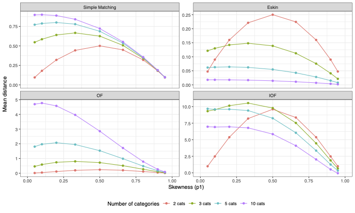{width=80%, fig-align="center"}

- $q\in \{2,3,5,10\}$
- $p_1 \in \{0.05,0.1,0.2,0.33, 0.5,0.66, 0.8,0.9,0.95\}$
- $p_j = (1-p_1)/(q-1)$, with $j=2,\dots,q$,

:::

The expected distance increases with the heterogeneity of the distribution and  with the number of categories 


## Independence-based distances

::: {.callout-note appearance="simple" icon=false}
## [Independence-based]{.text-teal} pairwise distance

No inter-variable relations are considered.

- in the continuous case: **Euclidean** or **Manhattan** distances

- in the categorical case: **Hamming** / matching distance, among many others

- in the mixed-data case: **Gower** dissimilarity index

:::{.fragment .centered}
variable contributions may be balanced, but still treated as separate sources of information
:::

:::


. . .

::: {.callout-tip appearance="simple" icon=false}
## Beyond commensurability
commensurability makes variable contributions comparable across **scales** and data **types**.

- If variables are correlated or associated, the same information may contribute repeatedly to the distance: **redundancy**
:::


:::{.fragment .centered}
### the next step is to account for the **structure** among variables
:::

# 3. Association-aware distances

## by variable differences: **independence-based**


-  When variables are correlated or associated, shared information is
effectively counted multiple times 

- inflated dissimilarities may cause potential distortions in downstream unsupervised learning tasks.


```{r}
library(tidyverse)
library(ggrepel)

cars_sel <- c("Toyota Corolla", "Cadillac Fleetwood")

mtcars_tbl <- mtcars |>
  rownames_to_column("car") |>
  mutate(
    disp_z = as.numeric(scale(disp)),
    wt_z   = as.numeric(scale(wt))
  )

# standardized matrix (consistent baseline)
Z <- mtcars_tbl |> select(disp_z, wt_z) |> as.matrix()

# Euclidean distance between selected cars (on standardized data)
seg_eucl <- mtcars_tbl |>
  dplyr::filter(car %in% cars_sel) |>
  summarise(
    x    = disp_z[car == cars_sel[1]],
    y    = wt_z[car == cars_sel[1]],
    xend = disp_z[car == cars_sel[2]],
    yend = wt_z[car == cars_sel[2]],
    dist = sqrt((xend - x)^2 + (yend - y)^2)
  )

# Mahalanobis whitening (orientation-preserving) on standardized data
S <- cov(Z)
eig <- eigen(S)
U <- eig$vectors
D <- diag(eig$values)

W_pca <- Z %*% U %*% diag(1 / sqrt(diag(D))) %*% t(U)

whitened_tbl <- mtcars_tbl |>
  mutate(
    w1 = W_pca[, 1],
    w2 = W_pca[, 2]
  )

# segment in whitened space (Euclidean here == Mahalanobis in original standardized space)
seg_mah <- whitened_tbl |>
  dplyr::filter(car %in% cars_sel) |>
  summarise(
    x    = w1[car == cars_sel[1]],
    y    = w2[car == cars_sel[1]],
    xend = w1[car == cars_sel[2]],
    yend = w2[car == cars_sel[2]],
    dist = sqrt((xend - x)^2 + (yend - y)^2)
  )
```

```{r}
ggplot(mtcars_tbl, aes(x = disp, y = wt)) +
  geom_point(size = 2) +
  labs(
    x = "Displacement (cu. in.)",
    y = "Weight (1000 lbs)",
    title = "Redundant continuous variables: displacement and weight",
    subtitle = "Larger cars tend to have both higher displacement and weight"
  ) +
  theme_minimal(base_size = 10)
```


## by variable differences: **independence-based**


-  When variables are correlated or associated, shared information is
effectively counted multiple times 

- inflated dissimilarities may cause potential distortions in downstream unsupervised learning tasks.


```{r}
ggplot(mtcars_tbl, aes(x = disp_z, y = wt_z)) +
  geom_point(size = 2) +
  stat_ellipse(type = "norm", level = 0.68, linewidth = .5,alpha=.25,color="indianred") +
  coord_equal() +
  labs(
    x = "Displacement (z-score)",
    y = "Weight (z-score)",
    title = "Same data after standardization",
    subtitle = "Units removed, redundancy remains"
  ) +
  theme_minimal(base_size = 10)
```


## by variable differences: **independence-based**

The [Euclidean distance]{style="color:#2A9D8F"}   $\longrightarrow$  shared information is  over-counted

```{r}
ggplot(mtcars_tbl, aes(x = disp_z, y = wt_z)) +
  geom_point(size = 2, color = "grey70") +
  stat_ellipse(type = "norm", level = 0.68, linewidth = .5,alpha=.25,color="indianred") +
  geom_point(
    data = dplyr::filter(mtcars_tbl, car %in% cars_sel),
    aes(color = car),
    size = 3
  ) +
  geom_segment(
    data = seg_eucl,
    aes(x = x, y = y, xend = xend, yend = yend),
    linewidth = 1,
    arrow = arrow(length = unit(0.15, "cm")),
    inherit.aes = FALSE
  ) +
  geom_text_repel(
    data = dplyr::filter(mtcars_tbl, car %in% cars_sel),
    aes(label = car, color = car),
    size = 4,
    box.padding = 0.3,
    point.padding = 0.3,
    max.overlaps = Inf,
    show.legend = FALSE
  ) +
  geom_label(
    data = seg_eucl,
    aes(x = (x + xend)/2, y = (y + yend)/2, label = paste0("d_E = ", round(dist, 2))),
    inherit.aes = FALSE,
    label.size = 0,
    alpha = 0.85
  ) +
  coord_equal() +
  labs(
    x = "Displacement (z-score)",
    y = "Weight (z-score)",
    title = "Euclidean distance (standardized) overcounts redundant information",
    subtitle = "Differences along the shared 'size' direction are counted twice"
  ) +
  theme_minimal(base_size = 10) +
  theme(legend.position = "none")
```


## accounting for inter-variable relations: **association-based**

The [Mahalanobis distance]{style="color:#2A9D8F"}  $\longrightarrow$ shared information is not over-counted


```{r}
ggplot(whitened_tbl, aes(w1, w2)) +
  geom_point(size = 2, color = "grey70") +
  stat_ellipse(type = "norm", level = 0.68, linewidth = .5,alpha=.25,color="#2A9D8F") +
  geom_point(
    data = dplyr::filter(whitened_tbl, car %in% cars_sel),
    aes(color = car),
    size = 4
  ) +
  geom_segment(
    data = seg_mah,
    aes(x = x, y = y, xend = xend, yend = yend),
    linewidth = 1,
    arrow = arrow(length = unit(0.15, "cm")),
    inherit.aes = FALSE
  ) +
  geom_text_repel(
    data = dplyr::filter(whitened_tbl, car %in% cars_sel),
    aes(label = car, color = car),
    size = 4,
    box.padding = 0.35,
    point.padding = 0.3,
    max.overlaps = Inf,
    show.legend = FALSE
  ) +
  geom_label(
    data = seg_mah,
    aes(x = (x + xend)/2, y = (y + yend)/2, label = paste0("d_M = ", round(dist, 2))),
    inherit.aes = FALSE,
    label.size = 0,
    alpha = 0.85
  ) +
  labs(
    title = "Mahalanobis whitening",
    subtitle = "with preserved orientation (computed on standardized variables)",
    x = "whitened dim 1",
    y = "whitened dim 2"
  ) +
  coord_equal() +
  theme_minimal(base_size = 10) +
  theme(legend.position = "none")
```

:::{.fragment .centered}
this is an **association-based** distance for continuous data
:::

## **association-based** distance


:::{.callout-note  title="Association-based for continuous: <span style='color: #E76F51;'>Mahalanobis distance</span>" icon=false}
 
Let ${\bf X}_{con}$  be $n\times Q_{d}$ a data matrix of $n$ observations described by $Q_{d}$ continuous variables, and let $\bf S$ the sample covariance matrix, the Mahalanobis distance matrix is

$$
{\bf D}_{mah}
= \left[\operatorname{diag}({\bf G})\,{\bf 1}_{n}^{\sf T}
+ {\bf 1}_{n}\,\operatorname{diag}({\bf G})^{\sf T}
- 2{\bf G}\right]^{\odot 1/2}
$$
 where 
 
 - $[\cdot]^{\odot 1/2}$ denotes the element-wise square root  
 
 - ${\bf G}=({\bf C}{\bf X}_{con}){\bf S}^{-1}({\bf C}{\bf X}_{con})^{\sf T}$ is the Mahalanobis Gram matrix 
 
 - ${\bf C}={\bf I}_{n}-\tfrac{1}{n}{\bf 1}_{n}{\bf 1}_{n}^{\sf T}$ is the centering operator 
 
:::


## **association-based** distance


:::{.callout-tip title = "Association-based for categorical: <span style='color: #E76F51;'>total variation distance (TVD)</span>[@le2005association]" icon=false}
The distance matrix ${\bf D}_{tvd}$ can be defined via the  **delta framework**^[@vdv_pr] upon properly defining the block-diagonal matrix ${\bf \Delta}$

Let ${\bf X}_{cat}$ be $n\times Q_{c}$ a data matrix of $n$ observations described by $Q_{c}$ categorical variables.

 
$$
{\bf D} = {\bf Z}{\Delta}{\bf Z}^{\sf T} 
= \left[\begin{array}{ccc} {\bf Z}_{1} & \dots & {\bf Z}_{Q_{c}} \end{array} \right]\left[\begin{array}{ccc}
                                                                                          {\bf\Delta}_1  & & \\
                                                                                          & \ddots &\\
                                                                                          & & {\bf\Delta}_{Q_{c}} \end{array} \right] \left[ \begin{array}{c}
                                                                                                                                             {\bf Z}_{1}^{\sf T}\\
                                                                                                                                             \vdots \\
                                                                                                                                             {\bf Z}_{Q_{c}}^{\sf T}
                                                                                                                                             \end{array} \right]
$$
:::


- in the framework, setting ${\Delta}_j$ determines the categorical distance measure of choice (independent- or association-based)


## **association-based** distance


:::{.callout-tip title="Association-based for categorical: <span style='color: #E76F51;'>total variation distance (TVD)</span> [@le2005association] (2)" icon=false}

<!-- - In the [IB]{style="color: #2A9D8F"} case, the off-diagonal elements of ${\Delta}_j$ depend only on variable $j$.  -->

<!-- - In the [AB]{style="color: indianred"} case, they depend on the association of each category pair with all other categorical variables.  -->

Consider the empirical **joint probability** distributions stored in the off-diagonal blocks of  ${\bf P}$:

$$
{\bf P} = \frac{1}{n} 
\begin{bmatrix}
{\bf Z}_1^{\sf T}{\bf Z}_1 & {\bf Z}_1^{\sf T}{\bf Z}_2 & \cdots & {\bf Z}_1^{\sf T}{\bf Z}_{Q_c} \\
\vdots & \ddots & \vdots & \vdots \\
{\bf Z}_{Q_c}^{\sf T}{\bf Z}_1 & {\bf Z}_{Q_c}^{\sf T}{\bf Z}_2 & \cdots & {\bf Z}_{Q_c}^{\sf T}{\bf Z}_{Q_c}
\end{bmatrix}.
$$

The block matrix $\bf R$  refer to the **conditional probability** distributions for each variable $j$ given each variable $i$ ($i,j=1,\ldots,Q_c$, $i\neq j$),
stored in the block matrix

$$
{\bf R} = {\bf P}_z^{-1}({\bf P} - {\bf P}_z).
$$

where ${\bf P}_z = {\bf P} \odot {\bf I}_{Q^*}$, and ${\bf I}_{Q^*}$ is the $Q^*\times Q^*$ identity matrix.

:::


## **association-based** distance


:::{.callout-tip title="Association-based for categorical: <span style='color: #E76F51;'>total variation distance (TVD)</span>[@le2005association] (3)" icon=false}

Let ${\bf r}^{ji}_a$ and ${\bf r}^{ji}_b$ be the rows of ${\bf R}_{ji}$, the $(j,i)$th off-diagonal block of ${\bf R}$.

The category dissimilarity between $a$ and $b$ for variable $j$ based on the total variation distance (TVD) is defined as

$$
\delta^{j}_{tvd}(a,b)
= \sum_{i\neq j}^{Q_c} w_{ji}
\Phi^{ji}({\bf r}^{ji}_{a},{\bf r}^{ji}_{b})
= \sum_{i\neq j}^{Q_c} w_{ji}
\left[\frac{1}{2}\sum_{\ell=1}^{q_i}
|{\bf r}^{ji}_{a\ell}-{\bf r}^{ji}_{b\ell}|\right],
\label{ab_delta}
$$

where $w_{ji}=1/(Q_c-1)$ for equal weighting  (can be user-defined). 

 TVD-based dissimilarity matrix is, therefore, 

$$
{\bf D}_{tvd}= {\bf Z}{\Delta}^{(tvd)}{\bf Z}^{\sf T}.
$$

:::

## **association-based** distance: a small example


::: {.columns}

::: {.column width="38%"}

::: {.callout-note appearance="simple" icon=false}
## Data

Consider two categorical variables:

- $X_1$ with categories $A,B,C$
- $X_2$ with categories $u,v$


```{r}
#| echo: false

toy_cat <- tibble::tibble(
  id = 1:10,
  X1 = factor(
    c("A","A","A","B","B","B","C","C","C","C"),
    levels = c("A","B","C")
  ),
  X2 = factor(
    c("u","u","v","u","u","v","u","v","v","v"),
    levels = c("u","v")
  )
)

toy_cat
```

:::

:::

::: {.column width="52%"}

::: {.callout-tip appearance="simple" icon=false}
## Indicator matrices

$$
{\bf Z}_1 =
\begin{pmatrix}
1&0&0\\
1&0&0\\
1&0&0\\
0&1&0\\
0&1&0\\
0&1&0\\
0&0&1\\
0&0&1\\
0&0&1\\
0&0&1
\end{pmatrix},
\qquad
{\bf Z}_2 =
\begin{pmatrix}
1&0\\
1&0\\
0&1\\
1&0\\
1&0\\
0&1\\
1&0\\
0&1\\
0&1\\
0&1
\end{pmatrix}.
$$

:::

:::

:::


## **association-based** distance: from ${\bf Z}$ to ${\bf P}$

Let

$$
{\bf Z} = [{\bf Z}_1,{\bf Z}_2].
$$

The empirical co-occurrence matrix is

$$
{\bf P}
=
\frac{1}{10}{\bf Z}^{\sf T}{\bf Z}.
$$

For this example,

$$
{\bf P}
=
\begin{pmatrix}
\color{#2A9D8F}{0.30} & \color{#2A9D8F}{0}    & \color{#2A9D8F}{0}    & \color{#E76F51}{0.20} & \color{#E76F51}{0.10}\\
\color{#2A9D8F}{0}    & \color{#2A9D8F}{0.30} & \color{#2A9D8F}{0}    & \color{#E76F51}{0.20} & \color{#E76F51}{0.10}\\
\color{#2A9D8F}{0}    & \color{#2A9D8F}{0}    & \color{#2A9D8F}{0.40} & \color{#E76F51}{0.10} & \color{#E76F51}{0.30}\\
\color{#E76F51}{0.20} & \color{#E76F51}{0.20} & \color{#E76F51}{0.10} & \color{#2A9D8F}{0.50} & \color{#2A9D8F}{0}\\
\color{#E76F51}{0.10} & \color{#E76F51}{0.10} & \color{#E76F51}{0.30} & \color{#2A9D8F}{0}    & \color{#2A9D8F}{0.50}
\end{pmatrix}.
$$

::: {.fragment .centered}
### diagonal blocks contain marginal information; off-diagonal blocks contain joint proportions
:::

## **association-based** distance: from ${\bf P}$ to ${\bf R}$

The diagonal part of ${\bf P}$ is

$$
{\bf P}_z
=
{\bf P} \odot {\bf I}_{Q^*}
=
\operatorname{diag}(0.30,0.30,0.40,0.50,0.50).
$$

The block matrix of conditional profiles is

$$
{\bf R}
=
{\bf P}_z^{-1}({\bf P}-{\bf P}_z).
$$

For this example,

$$
{\bf R}
=
\begin{pmatrix}
\color{#2A9D8F}{0} & \color{#2A9D8F}{0} & \color{#2A9D8F}{0} & \color{#E76F51}{0.67} & \color{#E76F51}{0.33}\\
\color{#2A9D8F}{0} & \color{#2A9D8F}{0} & \color{#2A9D8F}{0} & \color{#E76F51}{0.67} & \color{#E76F51}{0.33}\\
\color{#2A9D8F}{0} & \color{#2A9D8F}{0} & \color{#2A9D8F}{0} & \color{#E76F51}{0.25} & \color{#E76F51}{0.75}\\
\color{#E76F51}{0.40} & \color{#E76F51}{0.40} & \color{#E76F51}{0.20} & \color{#2A9D8F}{0} & \color{#2A9D8F}{0}\\
\color{#E76F51}{0.20} & \color{#E76F51}{0.20} & \color{#E76F51}{0.60} & \color{#2A9D8F}{0} & \color{#2A9D8F}{0}
\end{pmatrix}.
$$

::: {.fragment .centered}
### each off-diagonal block contains conditional profiles across variables
:::


## **association-based** distance: reading ${\bf R}_{12}$

For the categories of $X_1$, the relevant block is

$$
{\bf R}_{12}
=
\begin{pmatrix}
0.67 & 0.33\\
0.67 & 0.33\\
0.25 & 0.75
\end{pmatrix}.
$$

::: {.callout-note appearance="simple" icon=false}
## Interpretation

Rows of ${\bf R}_{12}$ describe the distribution of $X_2$ within each category of $X_1$:

- $P(X_2=u \mid X_1=A)=\color{#E76F51}{\mathbf{0.67}}$, $P(X_2=v \mid X_1=A)=\color{#E76F51}{\mathbf{0.33}}$
- $P(X_2=u \mid X_1=B)=\color{#E76F51}{\mathbf{0.67}}$, $P(X_2=v \mid X_1=B)=\color{#E76F51}{\mathbf{0.33}}$
- $P(X_2=u \mid X_1=C)=\color{#E76F51}{\mathbf{0.25}}$, $P(X_2=v \mid X_1=C)=\color{#E76F51}{\mathbf{0.75}}$
:::

:::{.fragment .centered}
### categories are compared through their association profiles
:::

## **association-based** distance: from ${\bf R}$ to $\Delta_1^{(tvd)}$

Compare the rows of ${\bf R}_{12}$ using TVD.

$$
\delta^{1}_{tvd}(A,B)
=
\frac{1}{2}
\left(
|0.67-0.67| + |0.33-0.33|
\right)
=
0.
$$

$$
\delta^{1}_{tvd}(A,C)
=
\frac{1}{2}
\left(
|0.67-0.25| + |0.33-0.75|
\right)
=
0.42.
$$

$$
\delta^{tvd}_{1}(B,C)
=
0.42.
$$

Therefore,

$$
\Delta^{(tvd)}_1
=
\begin{pmatrix}
0 & 0 & 0.42\\
0 & 0 & 0.42\\
0.42 & 0.42 & 0
\end{pmatrix}.
$$

:::{.fragment .centered}
### $A$ and $B$ are close because they have the same profile with respect to $X_2$
:::

## **association-based** distance: reading ${\bf R}_{21}$

For the categories of $X_2$, the relevant block is

$$
{\bf R}_{21}
=
\begin{pmatrix}
0.40 & 0.40 & 0.20\\
0.20 & 0.20 & 0.60
\end{pmatrix}.
$$

::: {.callout-note appearance="simple" icon=false}
## Interpretation

Rows of ${\bf R}_{21}$ describe the distribution of $X_1$ within each category of $X_2$:

- $P(X_1=A \mid X_2=u)=\color{#E76F51}{\mathbf{0.40}}$, $P(X_1=B \mid X_2=u)=\color{#E76F51}{\mathbf{0.40}}$, $P(X_1=C \mid X_2=u)=\color{#E76F51}{\mathbf{0.20}}$
- $P(X_1=A \mid X_2=v)=\color{#E76F51}{\mathbf{0.20}}$, $P(X_1=B \mid X_2=v)=\color{#E76F51}{\mathbf{0.20}}$, $P(X_1=C \mid X_2=v)=\color{#E76F51}{\mathbf{0.60}}$
:::

:::{.fragment .centered}
### categories of $X_2$ are compared through their association profiles with respect to $X_1$
:::


## **association-based** distance: from ${\bf R}_{21}$ to $\Delta_2^{(tvd)}$

Compare the rows of ${\bf R}_{21}$ using TVD.

$$
\delta^{tvd}_{1}(u,v)
=
\frac{1}{2}
\left(
|0.40-0.20| + |0.40-0.20| + |0.20-0.60|
\right)
=
0.40.
$$

Therefore,

$$
\Delta^{(tvd)}_2
=
\begin{pmatrix}
0 & 0.40\\
0.40 & 0
\end{pmatrix}.
$$

:::{.fragment .centered}
### $u$ and $v$ are different because they imply different profiles over $X_1$
:::


## **association-based** distance: from $\Delta$ to ${\bf D}$

We collect the category dissimilarity matrices in a block-diagonal matrix:

$$
\Delta^{(tvd)}
=
\begin{pmatrix}
\color{#2A9D8F}{\Delta^{(tvd)}_1} & \color{#E76F51}{0}\\
\color{#E76F51}{0} & \color{#2A9D8F}{\Delta^{(tvd)}_2}
\end{pmatrix}.
$$

The observation-level categorical distance matrix is then

$$
{\bf D}_{tvd}
=
{\bf Z}\Delta^{(tvd)}{\bf Z}^{\sf T}
=
\begin{bmatrix}
{\bf Z}_1 & {\bf Z}_2
\end{bmatrix}
\begin{pmatrix}
\Delta^{(tvd)}_1 & 0\\
0 & \Delta^{(tvd)}_2
\end{pmatrix}
\begin{bmatrix}
{\bf Z}_1^{\sf T}\\
{\bf Z}_2^{\sf T}
\end{bmatrix}.
$$

Equivalently,

$$
{\bf D}_{tvd}
=
{\bf Z}_1\Delta^{(tvd)}_1{\bf Z}_1^{\sf T}
+
{\bf Z}_2\Delta^{(tvd)}_2{\bf Z}_2^{\sf T}.
$$

:::{.fragment .centered}
### category-level dissimilarities are translated into observation-level distances
:::


<!-- {.center style="text-align:center;"} -->

## No one-size-fits-all distance  {.center}

### The need for diagnostics


## From distances to data representation

Different distance definitions induce different **distance-based representations** of the same data.

::: {.callout-tip appearance="simple" icon=false}
## Same data, different representation

Changing the distance changes the **global dissimilarity structure** on which downstream learning methods rely.
:::

::: {.callout-important appearance="simple" icon=false}
## [Leave-one-variable-out]{.text-coral} diagnostics

How can we measure the contribution of each variable to this structure?

- compare the dissimilarity matrix computed with and without the variable in question
:::

## LOVO-based benchmark: evaluated distances

The benchmark compares distance definitions that differ in how they treat
**scale**, **type**, **additivity**, and **association**.

:::{.columns}

::::{.column width="50%"}

::: {.callout-tip appearance="simple" icon=false}
## Additive distances

- `gower`: classical Gower dissimilarity

- `mod_gower`: modified Gower coefficients [@LYNCLP:2024]

- `hl_add`: additive version of Hennig--Liao scaling [@HennigLiao2013]

- `u_ind`: unbiased independence-based distance

- `u_dep`: unbiased association-based distance

- `u_mix`: unbiased Manhattan and TVD
:::

::::

::::{.column width="50%"}

::: {.callout-important appearance="simple" icon=false}
## Non-additive distances

- `naive`: Euclidean distance on scaled numerical variables and one-hot-encoded

- `hl`: Hennig--Liao scaling with Euclidean distance 

- `gudmm`: generalized multi-aspect distance metric for mixed-type data [@mousavi2023generalized]

- `dkps`: distance using kernel product similarity [@GT:2024]
:::

::::

:::

## LOVO-based diagnostics: what is evaluated?

For each distance and each variable $X_j$, we compare the full-data representation ${\bf D}$ with the representation obtained after removing $X_j$, that is ${\bf D}_{-j}$.

:::{.columns}

::::{.column width="50%"}

::: {.callout-note appearance="simple" icon=false}
## 1. Distance level

Numeric comparision between ${\bf D}$ and  ${\bf D}_{-j}$.

&nbsp;


- **mean absolute difference** between distance matrices.
:::

::::

::::{.column width="50%"}

::: {.callout-tip appearance="simple" icon=false}
## 2. MDS level

Compute MDS from ${\bf D}$ and from ${\bf D}_{-j}$, then compare the resulting configurations.

&nbsp;


- **alienation coefficient** between MDS representations.
:::

::::

:::

:::{.fragment .centered}
### LOVO diagnostics assess how each variable contributes to the dissimilarity structure
:::


## LOVO diagnostics: distance-level effect

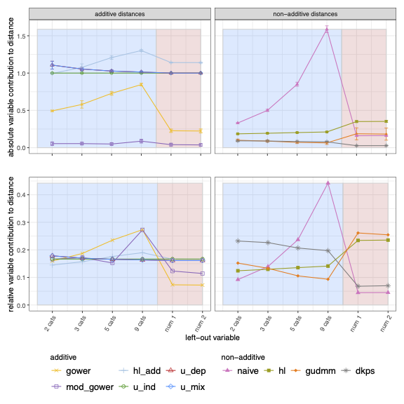{width=100%, fig-align="center"}


## LOVO diagnostics: MDS-level effect


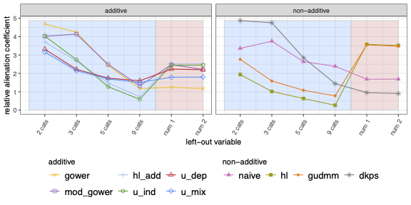{width=100%, fig-align="center"}

:::{.fragment}
- commensurability balances expected distance contributions, not necessarily the role of variables in every downstream representation
:::


## From diagnostics to downstream learning

LOVO diagnostics show how variables affect the distance matrix and the MDS representation.

&nbsp;

But we also want to know whether distance biases affect a downstream learning task.

::: {.callout-important appearance="simple" icon=false}
## Clustering experiment

Use each distance matrix as input to PAM and evaluate how well the resulting partition recovers the known cluster structure.
:::

## Clustering experiment

::: {.callout-note appearance="simple" icon=false}
## Data generation

- \(n = 200\) observations from \(4\) equal-sized clusters
- data generated with `genRandomClust`
- each dataset contains \(8\) numerical and \(8\) categorical variables
- categorical variables are obtained by discretizing numerical variables into \(9\) categories
- scenarios vary the number of signal and noise variables within each type
- \(100\) datasets are generated for each scenario
:::

::: {.callout-tip appearance="simple" icon=false}
## Evaluation

For each mixed-data distance, PAM is applied to the dissimilarity matrix with \(K = 4\).  
Recovery of the true cluster labels is measured using the adjusted Rand index.
:::


## PAM-based clustering results

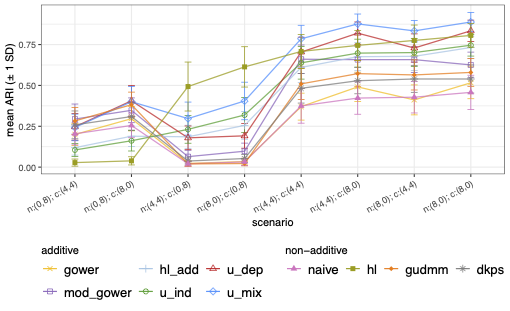{width=82%, fig-align="center"}

:::{.fragment}
- `hl` performs well when categorical variables are noise, but poorly when numerical variables are noise
- `gower` tends to show the opposite pattern
- `u_mix` and `u_dep`  are comparatively stable in the mixed signal/noise scenarios
:::

# 4. Interaction-aware extensions

## Cross-type interactions

Association-aware distances account for relations **within** variable blocks:

- continuous--continuous relations;
- categorical--categorical relations.

::: {.callout-important appearance="simple" icon=false}
## Cross-type structure

In mixed data, categorical differences may be meaningful because they are reflected in the continuous variables.
:::

:::{.fragment .centered}
### the next step is to make distances [interaction-aware]{.text-coral}
:::

## The numerical geometry suggests two groups

:::: {.columns}

::: {.column width="66%"}
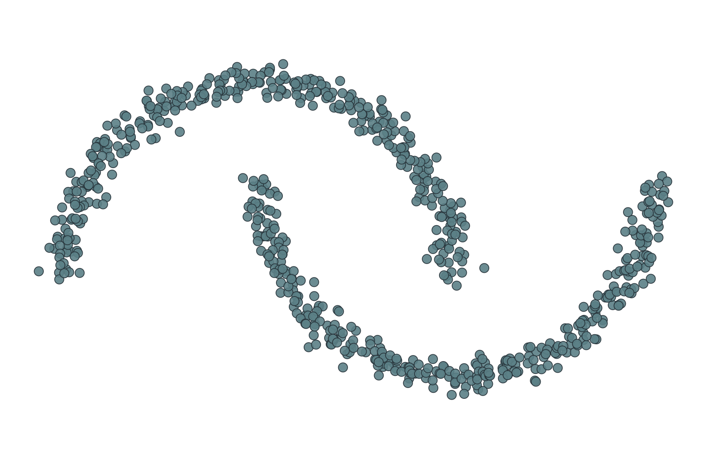{width=100% fig-alt="Two interlocking half-moons shown without categorical labels."}
:::

::: {.column width="31%"}

::: {style="font-size:4.8em;font-weight:750;line-height:.95;color:#E76F51;"}
2
:::

### connected shapes

A numerical distance can recover the **upper (U)** and **lower (L)** moon.

::: {.callout-note appearance="simple" icon=false}
## Geometry alone

There is no preferred subdivision within either moon.
:::

:::

::::


## One factor is structured; the other is deliberately neutral

:::: {.columns}

::: {.column width="62%"}
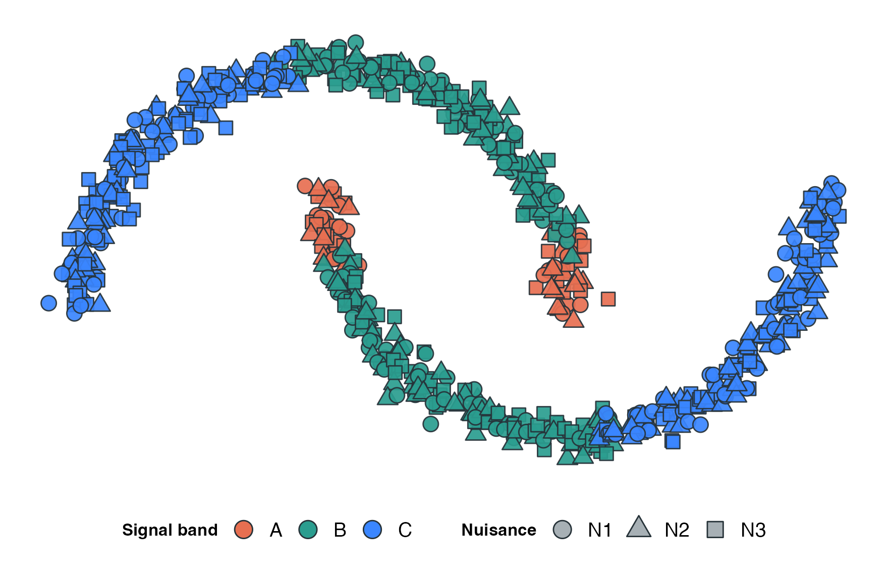{width=100% fig-alt="Half-moons with signal band mapped to colour and noise category mapped to shape."}
:::

::: {.column width="35%"}

**Signal band**

- colour: $A,B,C$
- unequal arc lengths: $10\%,45\%,45\%$
- repeated on both moons

**Noise factor**

- shape: $N_1,N_2,N_3$
- balanced within every band
- spatially random

:::

::::

::: {.fragment .centered}
### only the signal factor has a systematic relationship with the numerical geometry
:::


## The target is the moon **AND** the signal category

:::: {.columns}

::: {.column width="39%"}

::: {style="padding:.35em .5em;border-left:8px solid #E76F51;background:#FAF8F3;font-size:1.15em;text-align:center;"}
$$
\text{cluster}
=
\text{moon}\times\text{band}
$$
:::

The desired partition contains six groups:

$$
\begin{aligned}
&U\!A,\ U\!B,\ U\!C,\\
&L\!A,\ L\!B,\ L\!C.
\end{aligned}
$$

::: {.callout-important appearance="simple" icon=false}
## The six-way intersection

Moon alone gives two groups. Band alone gives three.
:::

:::

::: {.column width="59%"}
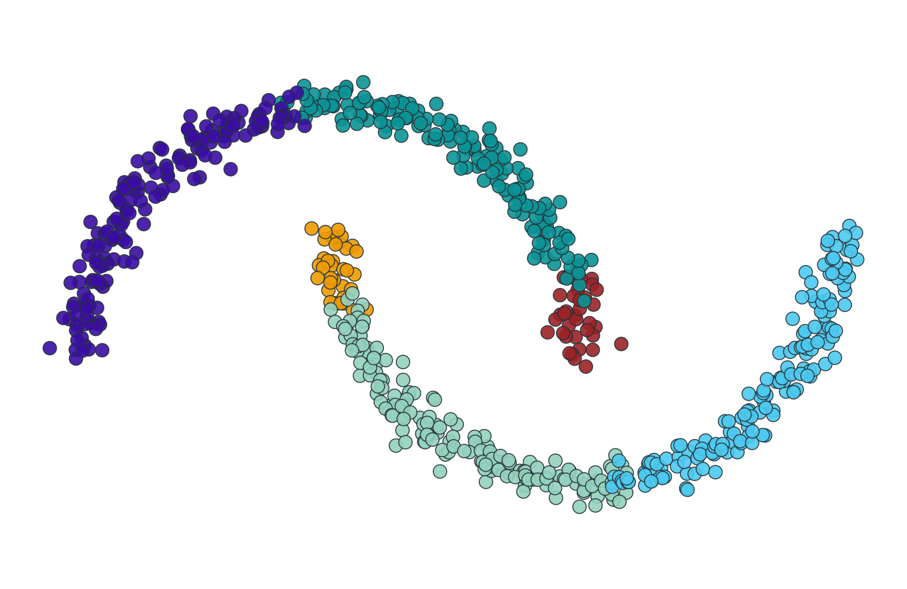{width=100% fig-alt="The six target groups formed by crossing upper and lower moon with bands A, B, and C."}
:::

::::


## Without interaction, the graph follows geometry

:::: {.columns}

::: {.column width="65%"}
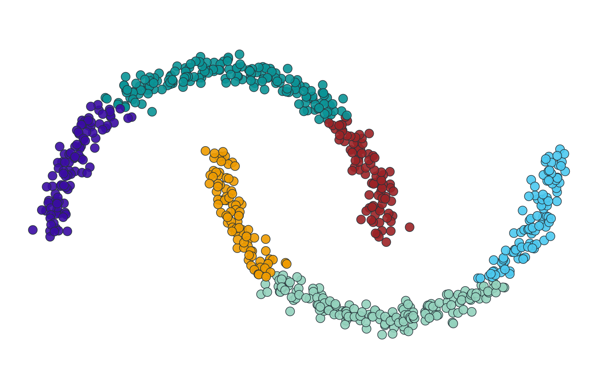{width=100% fig-alt="Six-cluster spectral partition obtained without the continuous-categorical interaction."}
:::

::: {.column width="32%"}

::: {style="font-size:2.1em;font-weight:750;line-height:1.05;color:#E76F51;"}
ARI = 0.490
:::

Spectral clustering is asked for $K=6$, but the graph does not know where $A$, $B$, and $C$ change.

::: {.callout-note appearance="simple" icon=false}
## The wrong boundaries

The moons are subdivided according to numerical geometry—not the signal factor.
:::

:::

::::


## With interaction, the graph recovers the six intersections

:::: {.columns}

::: {.column width="65%"}
{width=100% fig-alt="The exact six-group spectral partition obtained with the continuous-categorical interaction."}
:::

::: {.column width="32%"}

::: {style="font-size:2.1em;font-weight:750;line-height:1.05;color:#2A9D8F;"}
ARI = 1.000
:::

The numerical distance preserves the two moons.

$\Delta_{\mathrm{int}}$ adds barriers at the $A/B/C$ boundaries.

::: {.callout-tip appearance="simple" icon=false}
## Exact recovery

The graph now encodes the required **moon AND category** structure.
:::

:::

::::


<!-- ## The distance determines what spectral clustering can recover -->

<!-- ::: {style="margin-top:1.1em;font-size:.92em;text-align:center;color:#5B7F86;"} -->
<!-- $$ -->
<!-- \begin{aligned} -->
<!-- &\text{numerical geometry} -->
<!-- \;+\; -->
<!-- \text{categorical association}\\[0.25em] -->
<!-- &\qquad+\; -->
<!-- \text{cross-type interaction} -->
<!-- \;\Longrightarrow\; -->
<!-- \text{graph structure} -->
<!-- \end{aligned} -->
<!-- $$ -->
<!-- ::: -->

<!-- ::: {style="max-width:1200px;margin:1.1em auto 0;font-size:1.08em;font-weight:620;line-height:1.32;text-align:center;"} -->
<!-- If clusters are defined jointly by numerical and categorical information,   -->
<!-- the distance must make that joint structure visible **before** the graph is partitioned. -->
<!-- ::: -->

<!-- ::: {.fragment .centered} -->
<!-- ### this motivates an interaction-aware construction for mixed-data dissimilarities -->
<!-- ::: -->

## How to measure interactions^[@iod2026_sc_mix]

Define $\Delta^{int}$ to account for continuous--categorical interactions and use it to augment $\Delta^{tvd}$.

The mixed dissimilarity becomes

$$
{\bf D}_{mix}^{(int)}
=
{\bf D}_{mah}
+
{\bf D}_{cat}^{(int)}.
$$

where

$$
{\bf D}_{cat}^{(int)}={\bf Z}\tilde{\Delta}{\bf Z}^\top
$$

and

$$
\tilde{\Delta} = (1-\alpha)\Delta^{tvd} + \alpha \Delta^{int},
\qquad
\alpha=\frac{1}{Q_c}.
$$

## What is $\Delta^{int}$?

The entry $\delta_{int}^{j}(a,b)$ measures how much the continuous variables help discriminate between observations choosing category $a$ and those choosing category $b$ for categorical variable $j$.

. . .

::: {.callout-tip appearance="simple" icon=false}
## Category-pair classification problem

For each pair $(a,b)$:

- use the continuous variables as predictors;
- classify observations belonging to categories $a$ and $b$;
- use a nearest-neighbour rule in the continuous space.
:::

## Computing $\Delta^{int}_{j}$

For each categorical variable $j$ and each category pair $(a,b)$:

1. use ${\bf D}_{mah}$ to identify neighbours among observations belonging to $a$ or $b$;
2. consider a proportion of neighbours, say $\pi_{nn}=0.1$;
3. classify observations using a prior-corrected decision rule;
4. compute balanced accuracy.

$$
\operatorname{BAcc}^{j}(a,b)
=
\frac{1}{2}
\left[
\operatorname{TPR}^{j}_{a}(a,b)
+
\operatorname{TPR}^{j}_{b}(a,b)
\right].
$$

::: {.fragment}

Map predictive performance onto a non-negative separability scale:

$$
\delta^{j}_{int}(a,b)
=
\max\left\{
0,\,
2\operatorname{BAcc}^{j}(a,b)-1
\right\}
\in[0,1].
$$


### $0$ means chance-level or worse; $1$ means perfect separation
:::
## Computing $\Delta^{int}_{j}$

For categorical variable $j$ with $q_j$ categories, compute  
$\frac{q_j(q_j -1)}{2}$ category-pair quantities.

::: columns
::: {.column width="55%"}
:::

::: {.column width="45%"}
$$
\Delta_{int} =
\begin{pmatrix}
0 & \cdot & \cdot & \cdot \\
\cdot & 0 & \cdot & \cdot \\
\cdot & \cdot & 0 &  \cdot\\
\cdot & \cdot & \cdot & 0
\end{pmatrix}
$$
:::
:::

## Computing $\Delta^{int}_{j}$

::: columns
::: {.column width="55%"}
{width=100%}
:::

::: {.column width="45%"}
$$
\Delta_{int} =
\begin{pmatrix}
0 & \color{#E76F51}{0.94} & \cdot & \cdot \\
\color{#E76F51}{0.94} & 0 & \cdot & \cdot \\
\cdot & \cdot & 0 &  \cdot\\
\cdot & \cdot & \cdot & 0
\end{pmatrix}
$$
:::
:::

## Computing $\Delta^{int}_{j}$

::: columns
::: {.column width="55%"}
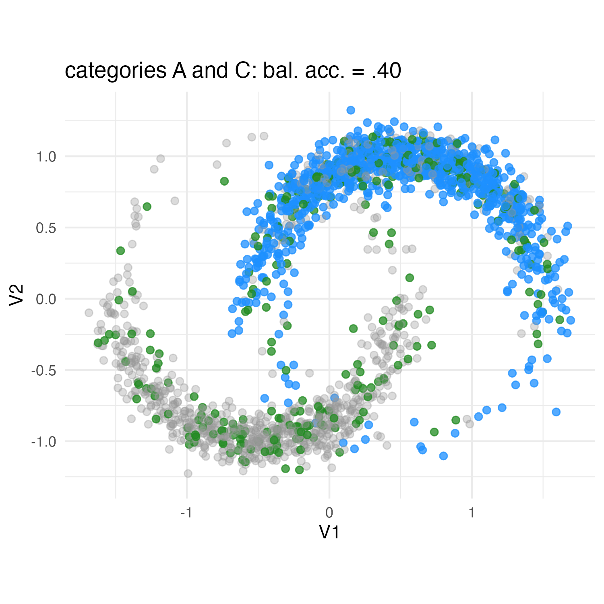{width=100%}
:::

::: {.column width="45%"}
$$
\Delta_{int} =
\begin{pmatrix}
0 & 0.94 & \color{#E76F51}{0.40} & \cdot \\
0.94 & 0 & \cdot & \cdot \\
\color{#E76F51}{0.40} & \cdot & 0 &  \cdot\\
\cdot & \cdot & \cdot & 0
\end{pmatrix}
$$
:::
:::

## Computing $\Delta^{int}_{j}$

::: columns
::: {.column width="55%"}
{width=100%}
:::

::: {.column width="45%"}
$$
\Delta_{int} =
\begin{pmatrix}
0 & 0.94 & 0.40 & \color{#E76F51}{0.39} \\
0.94 & 0 & \cdot & \cdot \\
0.40 & \cdot & 0 &  \cdot\\
\color{#E76F51}{0.39} & \cdot & \cdot & 0
\end{pmatrix}
$$
:::
:::

## Computing $\Delta^{int}_{j}$

::: columns
::: {.column width="55%"}
{width=100%}
:::

::: {.column width="45%"}
$$
\Delta_{int} =
\begin{pmatrix}
0 & 0.94 & 0.40 & 0.39 \\
0.94 & 0 & \color{#E76F51}{0.54} & \cdot \\
0.40 & \color{#E76F51}{0.54} & 0 & \cdot  \\
0.39 & \cdot & \cdot  & 0
\end{pmatrix}
$$
:::
:::

## Computing $\Delta^{int}_{j}$

::: columns
::: {.column width="55%"}
{width=100%}
:::

::: {.column width="45%"}
$$
\Delta_{int} =
\begin{pmatrix}
0 & 0.94 & 0.40 & 0.39 \\
0.94 & 0 & 0.54 & \color{#E76F51}{0.55} \\
0.40 & 0.54 & 0 & \cdot  \\
0.39 & \color{#E76F51}{0.55} & \cdot  & 0
\end{pmatrix}
$$
:::
:::

## Computing $\Delta^{int}_{j}$

::: columns
::: {.column width="55%"}
{width=100%}
:::

::: {.column width="45%"}
$$
\Delta_{int} =
\begin{pmatrix}
0 & 0.94 & 0.40 & 0.39 \\
0.94 & 0 & 0.54 & 0.55 \\
0.40 & 0.54 & 0 & \color{#E76F51}{0}  \\
0.39 & 0.55 & \color{#E76F51}{0}  & 0
\end{pmatrix}
$$
:::
:::

:::{.fragment}
### summarize category-pair separability in the continuous space
:::


## Just one-way interaction? {style="font-size:0.85em;"}

:::: {.columns}

::: {.column width="43%"}

::: {.callout-note appearance="simple" icon=false}
## Factorization motivates the direction

For ${\bf x}_i=({\bf x}_{i_n},{\bf x}_{i_c})$,

$$
f({\bf x}_{i_n},{\bf x}_{i_c})
=
f({\bf x}_{i_n})
f({\bf x}_{i_c}\mid {\bf x}_{i_n}).
$$

We therefore use the numerical block as the reference representation for categorical distinctions.
:::

:::

::: {.column width="55%"}

::: {.callout-tip appearance="simple" icon=false}
## Dissimilarity and a reference density

For a non-negative dissimilarity to a prototype, when the exponential kernel is normalisable,

$$
f({\bf x};{\bf c},{\bf S})
=
g({\bf c},{\bf S},\eta)
\exp\{-\eta d_{\bf S}({\bf x},{\bf c})\}.
$$

Since $M=f({\bf c};{\bf c},{\bf S})=g({\bf c},{\bf S},\eta)$,

$$
\begin{aligned}
\overline K({\bf x},{\bf c})
&=\frac{f({\bf x};{\bf c},{\bf S})}{M}
=\exp\{-\eta d_{\bf S}({\bf x},{\bf c})\},\\
d_{\bf S}({\bf x},{\bf c})
&=-\frac{1}{\eta}\log\overline K({\bf x},{\bf c}).
\end{aligned}
$$
:::

:::

::::

::: {.callout-important appearance="simple" icon=false}
## Pairwise consequence

Take another observation as the reference prototype, ${\bf c}\leftarrow{\bf x}_{i'}$, and set $\eta=1$:

$$
\begin{aligned}
\overline K_{\mathrm{mix}}(i,i')
&=
\overline K_{\mathrm n}(i,i')\,\overline K_{\mathrm c\mid n}(i,i')
\\
-\log\overline K_{\mathrm{mix}}(i,i')
&=
d_{\mathrm n}(i,i')+d_{\mathrm c\mid n}(i,i').
\end{aligned}
$$
:::

::: {.centered style="font-size:0.62em; margin-top:0.2em;"}
Distance-to-prototype construction: [@ben2008probabilistic; @Hennig19]. Full mixed-data derivation: [@iod2026_sc_mix].
:::

# downstream analysis

## Spectral clustering: a graph partitioning problem

::: {.callout-note appearance="simple" icon=false}

## Graph representation

A graph representation of the data matrix ${\bf X}$: the aim is to cut it into $K$ groups, or clusters.

```{r, warning=FALSE, message=FALSE, fig.align="center", out.width="35%"}

set.seed(123)

net <- rgraph(4, mode = "graph", tprob = .75)

net <- network(net, directed = FALSE)

network.vertex.names(net) <- letters[1:4]

ggnet2(
  net,
  size = 12,
  color = "#2A9D8F",
  label = TRUE,
  label.size = 8,
  label.color = "white",
  edge.label = c("w_ac", "w_cb", "w_bd", "w_cd"),
  edge.label.color = "#E76F51",
  edge.label.size = 12
)
```

The **affinity matrix ${\bf A}$**

The elements ${\bf w}_{ij}$ of ${\bf A}$ are high when observations $i$ and $j$ are likely to belong to the same group, and low otherwise.
:::

  


## Spectral clustering: making the graph easy to cut

An approximate solution to the graph partitioning problem [@ng2001spectral]:

::: {.callout-note appearance="simple" icon=false}
## From distances to affinities

Start from the pairwise distance matrix ${\bf D}$ and build the affinity matrix

$$
{\bf A}
=
\exp\left(-\frac{{\bf D}^{2}}{2\sigma^{2}}\right),
\qquad a_{ii}=0.
$$

The parameter $\sigma$ controls the neighbourhood scale.
:::

::: {.callout-tip appearance="simple" icon=false}
## Normalized graph Laplacian


$$
{\bf L}
=
{\bf D}_{r}^{-1/2}
{\bf A}
{\bf D}_{r}^{-1/2}
=
{\bf Q}{\Lambda}{\bf Q}^{\sf T},
$$

where ${\bf D}_{r}=\operatorname{diag}({\bf r})$, ${\bf r}={\bf A}{\bf 1}$, ${\bf 1}$ is an $I$-dimensional vector of ones.
:::


::: {.callout-important appearance="simple" icon=false}
## Spectral embedding

apply $K$-means to the rows of  ${\bf \tilde Q}$, containing the first $K$ eigenvectors of ${\bf L}$.
:::

## Why spectral clustering here?

::: {.callout-tip appearance="simple" icon=false}
Interaction-aware distances can encode local connectivity and non-convex structure.
:::

{width=45%}
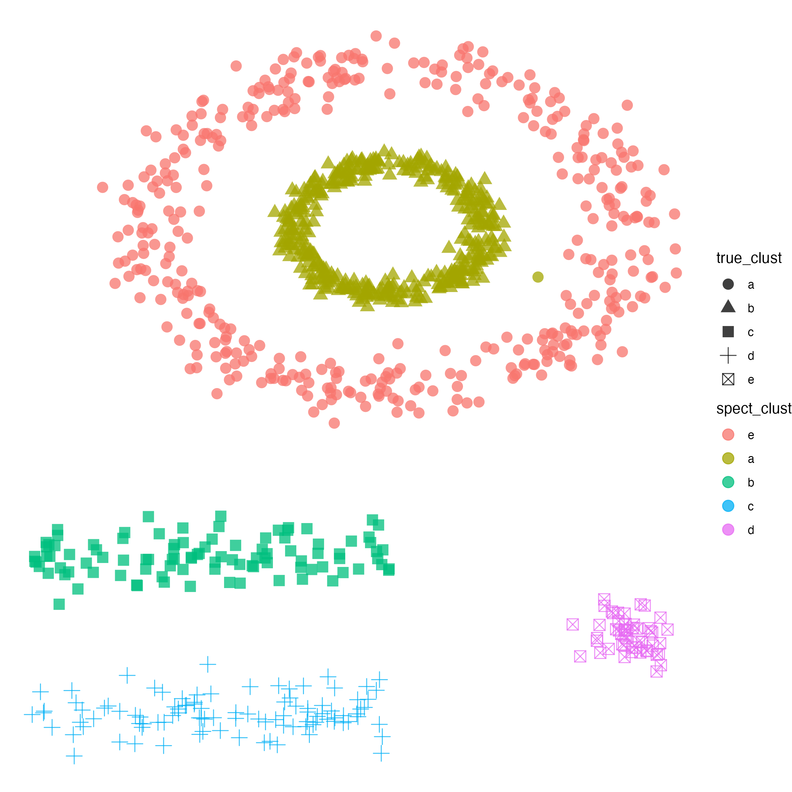{width=45%}

# Synthetic experiments

## Simulation 1: associated mixed variables

::: {.callout-note appearance="simple" icon=false}
## General design

- two sample sizes: $I = 1000$ and $I = 2000$
- number of clusters fixed to $K = 3$
- 50 datasets generated for each configuration
- spectral clustering applied to each dissimilarity matrix
- performance measured by adjusted Rand index
:::

::: {.columns}

::: {.column width="50%"}

::: {.callout-tip appearance="simple" icon=false}
## Variable composition

Four scenarios were considered:

1. $Q_n = 15$, $Q_c = 15$
2. $Q_n = 10$, $Q_c = 20$
3. $Q_n = 20$, $Q_c = 10$
4. $Q_n = 10$, $Q_c = 10$  plus  noise
:::

:::

::: {.column width="50%"}

::: {.callout-important appearance="simple" icon=false}
## Aim

The simulation creates mixed data with:

- correlated numerical variables;
- associated categorical variables;
- categorical variables depending on numerical variables;
- an additional noise scenario.

:::

:::

:::


## Simulation 1: associated mixed variables

::: {.callout-note appearance="simple" icon=false}
## Data-generating idea

1. Generate numerical variables from cluster-specific multivariate normal distributions.

   - different cluster means;
   - different correlation structures.

2. Generate binary categorical variables conditionally on the numerical variables.

   - the first categorical variable depends on the numerical block;
   - later categorical variables depend on the numerical block and on previous categorical variables.
:::

::: {.fragment .centered}
### the design induces numerical correlations, categorical associations, and numerical--categorical dependence
:::

## Simulation 1: results

{.r-stretch fig-align="center"}


::: {.notes}


- Association-based distances are generally the most accurate.
- When continuous variables dominate, AB distances achieve almost perfect recovery.
- Standard mixed-data distances are more sensitive to variable composition and noise.

:::


## Simulation 2: interaction-driven clusters

::: {.columns}

::: {.column width="48%"}

::: {.callout-note appearance="simple" icon=false}
## Design

- $I = 500, 1000$
- six continuous variables and three categorical variables
- $V_4,V_5,V_6$ generated independently from $N(0,1)$
- $V_1,V_2,V_3$ generated conditionally on $C_1$ and $C_2$
:::

:::

::: {.column width="48%"}

::: {.callout-important appearance="simple" icon=false}
## Main feature

The clusters are not defined by continuous variables alone or categorical variables alone.

They are defined by their **cross-type interaction**.
:::

:::

:::

:::{.fragment .centered}
### this is the setting where $\Delta^{int}$ should matter
:::

## Simulation 2: results

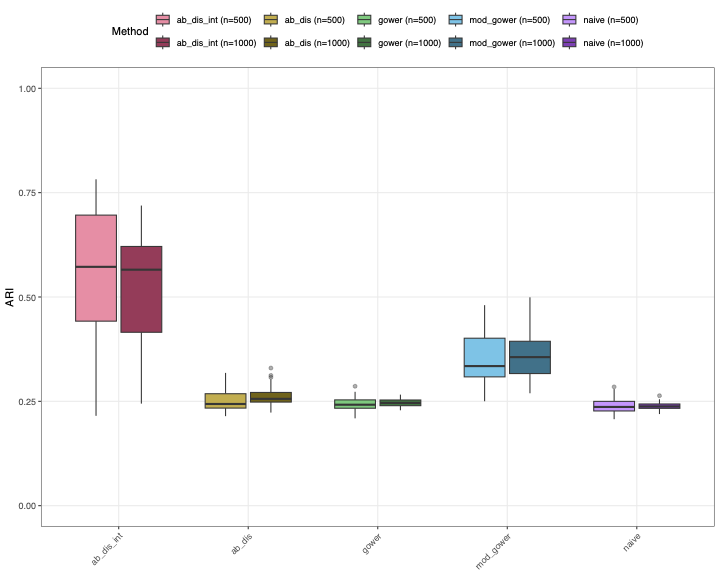{.r-stretch fig-align="center"}


::: {.notes}


- `ab_dis_int`  outperforms the competitors.
- distances that do not account for cross-type provide almost a chance-level performance.

:::


# 5. Response-aware extensions

## Response-aware distances for KNN

KNN is usually described as a lazy learner:

- store the training data;
- compute distances from a new observation to the training observations;
- predict from the responses of the nearest neighbours.

::: {.callout-note appearance="simple" icon=false}
## Reframing KNN

The distance is not just a preprocessing choice.  
It determines the neighbourhoods used for classification or regression.
:::

:::{.fragment .centered}
### in supervised learning, the response can help define these neighbourhoods
:::


## Response-aware mixed distance

For mixed-type predictors, use a supervised distance with two components:

$$
D_{i\ell}
=
D^{(n)}\!\left({\bf x}_i^{(n)},{\bf x}_\ell^{(n)}\right)
+
D^{(c)}\!\left({\bf x}_i^{(c)},{\bf x}_\ell^{(c)}\right).
$$

::: {.columns}
::: {.column width="50%"}

::: {.callout-note appearance="simple" icon=false}
## Numerical part

Use discriminant information from $y$  
to weight numerical differences.
:::

:::

::: {.column width="50%"}

::: {.callout-tip appearance="simple" icon=false}
## Categorical part

Use the association between categories and $y$  
to define category dissimilarities.
:::

:::
:::


## Numerical part: discriminant weighting^[@hastie1995dann]

For continuous predictors, use the response to weight directions or variables.

::: {.callout-note appearance="simple" icon=false}
## Single-variable discriminant weighting

For numerical variable $j$, define the Fisher score

$$
\omega_j = \frac{B_j}{W_j},
$$

where $B_j$ and $W_j$ are the between- and within-group variances.
:::

Then a supervised Manhattan-type distance is

$$
D^{(n)}\!\left({\bf x}_i^{(n)},{\bf x}_\ell^{(n)}\right)
=
\sum_{j=1}^{Q_n}
\sqrt{\omega_j}
\left|x_{ij}^{(n)}-x_{\ell j}^{(n)}\right|.
$$

## Categorical part: supervised TVD

For categorical predictors, compare categories through their response profiles.

Let ${\bf Z}_y$ be the indicator matrix of the response.  
The supervised profile matrix is

$$
{\bf R}_s
=
{\bf P}_d^{-1}
{\bf Z}^{\sf T}{\bf Z}_y.
$$

The supervised category dissimilarity is

$$
\delta_s^j(a,b)
=
\frac{1}{2}
\sum_{\ell=1}^{q_y}
\left|
{\bf r}_{a\ell}^{j y}
-
{\bf r}_{b\ell}^{j y}
\right|.
$$

:::{.fragment .centered}
### categories are close if they show similar response distributions
:::


## Response-aware KNN: Carseats example

::: {.callout-note appearance="simple" icon=false}
## Data

The `Carseats` data are used to predict whether sales are high.

- 7 numerical predictors
- 3 categorical predictors
- categorical predictors with 2 or 3 categories
- binary response: high vs. low sales
:::

::: {.callout-tip appearance="simple" icon=false}
## Compared distances

- `gower`: robust Manhattan + matching
- `naive`: Euclidean on scaled numerical variables and dummies
- `sup`: supervised numerical weighting + supervised TVD
- `sup_add`: additive supervised version
- `supf`: full supervised version
:::


## Response-aware KNN: Carseats results

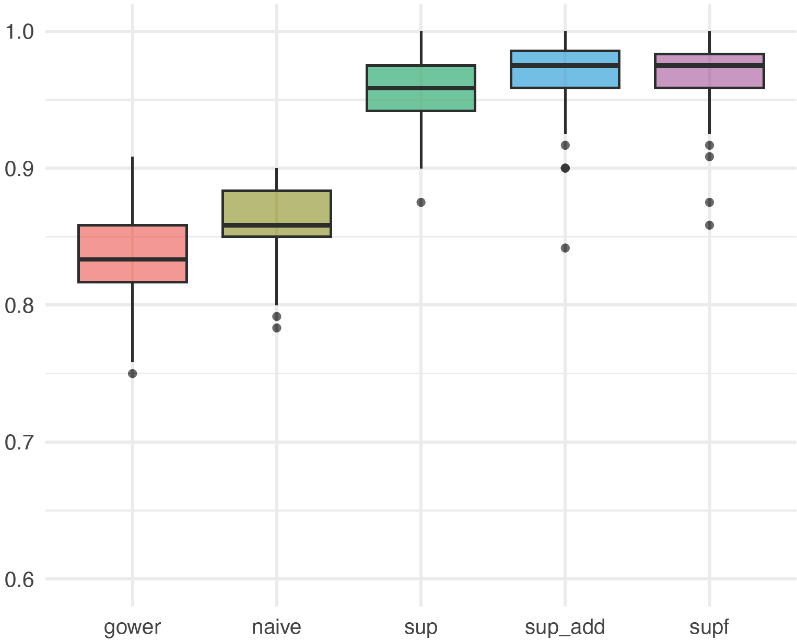{width=82%, fig-align="center"}

:::{.fragment}
- response-aware distances improve nearest-neighbour classification accuracy
- `sup`, `sup_add`, and `supf` are clearly above `gower` and `naive`
- the response helps define neighbourhoods that better reflect the class structure
:::


# Building distance-based pipelines

::: {.fragment .centered}
{width=35%}
:::

<!-- :::{.fragment .centered} -->
<!-- ### from distance construction to reproducible learning workflows -->
<!-- ::: -->

## Building distance-based pipelines

{.slide-logo-small}


::: {.callout-tip appearance="simple" icon=false}
## `manydist`

A package to construct, diagnose, and use distances for continuous, categorical, and mixed-type data.
:::

::: {.columns}

::: {.column width="33%"}

::: {.callout-note appearance="simple" icon=false}
## Distance construction

- `mdist()`
  - presets and custom specifications
  - response-aware distances

- `step_mdist()`
  - integrates distance construction into `tidymodels` workflows
:::

:::

::: {.column width="33%"}

::: {.callout-tip appearance="simple" icon=false}
## Diagnostics

- `lovo_mdist()`
- `compare_lovo_mdist()`
- `benchmark_mdist()`
:::

:::

::: {.column width="33%"}

::: {.callout-important appearance="simple" icon=false}
## Learning: model specs

**Unsupervised learning**

- `pam_dist()`
- `spectral_dist()`

**Supervised learning**

- `nearest_neighbor_dist()`
:::

:::

:::


## `manydist`: socio-economic country profiles

{.slide-logo-small}

::: {.callout-note appearance="simple" icon=false}
## Data

A 2022 World Bank / WDI snapshot of country-level socio-economic indicators.

- observations: countries
- numerical variables: GDP per capita, life expectancy, unemployment, urban population, population growth
- categorical variables: world region and income group
:::

::: {.callout-tip appearance="simple" icon=false}
## 

Use `manydist` to build a mixed-type distance between countries and diagnose which variables shape the resulting dissimilarity structure.
:::

## Preparing the WDI data

```{r}
#| echo: false

load("data/wdi_socio_2022.RData")
set.seed(123)
wdi_data |> 
  dplyr::slice_sample(n = 8) |> 
  dplyr::rename_with(~ wdi_labels[.x], .cols = dplyr::everything()) |> 
  knitr::kable(format = "html") |> 
  kableExtra::kable_styling(
    full_width = FALSE,
    font_size = 15
  )
```
## Constructing a mixed-type distance using a preset

{.slide-logo-small}

::: {.columns}

::: {.column width="50%"}

::: {.callout-note appearance="simple" icon=false}
## Directly with `mdist()`

```{r}
#| echo: true

wdi_x <- wdi_data |> 
  dplyr::select(-country)

d_preset <- mdist(
  wdi_x,
  preset = "u_dep"
)
```
:::

:::

::: {.column width="50%"}

::: {.callout-tip appearance="simple" icon=false}
## Inside a recipe with `step_mdist()`

```{r}
#| echo: true

rec_preset <- recipe(~ ., data = wdi_x) |>
  step_mdist(
    all_predictors(),
    preset = "u_dep"
  )

d_preset_step <- rec_preset |>
  prep(training = wdi_x) |>
  bake(new_data = NULL)
```
:::

:::

:::

```{r}
#| echo: true

all.equal(
  unname(as.matrix(d_preset$distance)),
  unname(as.matrix(d_preset_step))
)
```

:::{.fragment .centered}
### `step_mdist()` embeds the same distance specification into a modelling workflow
:::


## Constructing a custom mixed-type distance

{.slide-logo-small}

::: {.columns}

::: {.column width="50%"}

::: {.callout-note appearance="simple" icon=false}
## Directly with `mdist()`

```{r}
#| echo: true

wdi_x <- wdi_data |> 
  dplyr::select(-country)

d_custom <- mdist(
  wdi_x,
  method_cat  = "eskin",
  method_num  = "std",
  commensurable = FALSE
)
```
:::

:::

::: {.column width="50%"}

::: {.callout-tip appearance="simple" icon=false}
## Inside a recipe with `step_mdist()`

```{r}
#| echo: true

rec_custom <- recipe(~ ., data = wdi_x) |>
  step_mdist(
    all_predictors(),
    method_cat  = "eskin",
    method_num  = "std",
    commensurable = FALSE
  )

d_custom_step <- rec_custom |>
  prep(training = wdi_x) |>
  bake(new_data = NULL)
```
:::

:::

:::

```{r}
#| echo: true

all.equal(
  unname(as.matrix(d_custom$distance)),
  unname(as.matrix(d_custom_step))
)
```


## Comparing distance constructions {.smaller}

{.slide-logo-small}


```{r}
#| warning: false

lovo_wdi_compare <- compare_lovo_mdist(
  x = wdi_x,
  methods = list(
    gower = list(preset = "gower",commensurable=FALSE),
     u_indep = list(preset = "u_indep"),
    hl = list(preset = "hl"),
    u_dep = list(preset = "u_dep"),
    custom = list(
      method_num = "std",
      method_cat = "matching",
      commensurable = FALSE
    )
  ),
  cluster_k = 4
)

autoplot(lovo_wdi_compare, metric = "relative_distance")

```


::: {.callout-note appearance="simple" icon=false}
## `lovo_mdist_compare()`

The same leave-one-variable-out diagnostic can be computed for several distance definitions and compared in one display.
:::


## Distance-based classification pipeline

{.slide-logo-small}

```{r}
#| include: false

set.seed(123)

wdi_region <- wdi_data |>
  dplyr::filter(region != "North America") |>
  dplyr::mutate(
    region = droplevels(region)
  )

wdi_split <- initial_split(
  wdi_region,
  strata = region
)

wdi_train <- training(wdi_split)
wdi_test  <- testing(wdi_split)

wdi_rec <- recipe(region ~ ., data = wdi_train) |>
  update_role(country, new_role = "id") |>
  step_mdist(
    all_predictors(),
    preset = "u_dep"
  )

knn_spec <- nearest_neighbor_dist(
  mode = "classification",
  neighbors = tune()
)

wdi_wf <- workflow() |>
  add_recipe(wdi_rec) |>
  add_model(knn_spec)
```

::: {.columns}

::: {.column width="58%"}

::: {.code-large .pipeline-code}

```r {code-line-numbers="1-6"}
set.seed(123)
wdi_region <- wdi_data |>
  dplyr::filter(region != "North America") |>
  dplyr::mutate(
    region = droplevels(region)
  )
wdi_split <- initial_split(
  wdi_region,
  strata = region
)
wdi_train <- training(wdi_split)
wdi_test  <- testing(wdi_split)
wdi_rec <- recipe(region ~ ., data = wdi_train) |>
  update_role(country, new_role = "id") |>
  step_mdist(
    all_predictors(),
    preset = "u_dep"
  )
knn_spec <- nearest_neighbor_dist(
  mode = "classification",
  neighbors = tune()
)
wdi_wf <- workflow() |>
  add_recipe(wdi_rec) |>
  add_model(knn_spec)
```

:::

:::

::: {.column width="42%"}


::: {.callout-note .pipeline-step .pipeline-active appearance="simple" icon=false}
## Data

Prepare the classification task.
:::

:::

:::


## Distance-based classification pipeline

{.slide-logo-small}

::: {.columns}

::: {.column width="58%"}

::: {.code-large .pipeline-code}

```r {code-line-numbers="7-12"}
set.seed(123)
wdi_region <- wdi_data |>
  dplyr::filter(region != "North America") |>
  dplyr::mutate(
    region = droplevels(region)
  )
wdi_split <- initial_split(
  wdi_region,
  strata = region
)
wdi_train <- training(wdi_split)
wdi_test  <- testing(wdi_split)
wdi_rec <- recipe(region ~ ., data = wdi_train) |>
  update_role(country, new_role = "id") |>
  step_mdist(
    all_predictors(),
    preset = "u_dep"
  )
knn_spec <- nearest_neighbor_dist(
  mode = "classification",
  neighbors = tune()
)
wdi_wf <- workflow() |>
  add_recipe(wdi_rec) |>
  add_model(knn_spec)
```

:::

:::

::: {.column width="42%"}


::: {.callout-note .pipeline-step appearance="simple" icon=false}
## Data

Prepare the classification task.
:::


::: {.callout-tip .pipeline-step .pipeline-active appearance="simple" icon=false}
## Split

Create training and test sets.
:::


:::

:::


## Distance-based classification pipeline

{.slide-logo-small}

::: {.columns}

::: {.column width="58%"}

::: {.code-large .pipeline-code}

```r {code-line-numbers="13-18"}
set.seed(123)
wdi_region <- wdi_data |>
  dplyr::filter(region != "North America") |>
  dplyr::mutate(
    region = droplevels(region)
  )
wdi_split <- initial_split(
  wdi_region,
  strata = region
)
wdi_train <- training(wdi_split)
wdi_test  <- testing(wdi_split)
wdi_rec <- recipe(region ~ ., data = wdi_train) |>
  update_role(country, new_role = "id") |>
  step_mdist(
    all_predictors(),
    preset = "u_dep"
  )
knn_spec <- nearest_neighbor_dist(
  mode = "classification",
  neighbors = tune()
)
wdi_wf <- workflow() |>
  add_recipe(wdi_rec) |>
  add_model(knn_spec)
```

:::

:::

::: {.column width="42%"}

::: {.callout-note .pipeline-step appearance="simple" icon=false}
## Data

Prepare the classification task.
:::

::: {.callout-tip .pipeline-step appearance="simple" icon=false}
## Split

Create training and test sets.
:::

::: {.callout-important .pipeline-step .pipeline-active appearance="simple" icon=false}
## Recipe

Use `step_mdist()` to construct the distance representation.
:::

:::

:::


## Distance-based classification pipeline

{.slide-logo-small}

::: {.columns}

::: {.column width="58%"}

::: {.code-large .pipeline-code}

```r {code-line-numbers="19-22"}
set.seed(123)
wdi_region <- wdi_data |>
  dplyr::filter(region != "North America") |>
  dplyr::mutate(
    region = droplevels(region)
  )
wdi_split <- initial_split(
  wdi_region,
  strata = region
)
wdi_train <- training(wdi_split)
wdi_test  <- testing(wdi_split)
wdi_rec <- recipe(region ~ ., data = wdi_train) |>
  update_role(country, new_role = "id") |>
  step_mdist(
    all_predictors(),
    preset = "u_dep"
  )
knn_spec <- nearest_neighbor_dist(
  mode = "classification",
  neighbors = tune()
)
wdi_wf <- workflow() |>
  add_recipe(wdi_rec) |>
  add_model(knn_spec)
```

:::

:::

::: {.column width="42%"}

::: {.callout-note .pipeline-step appearance="simple" icon=false}
## Data

Prepare the classification task.
:::

::: {.callout-tip .pipeline-step appearance="simple" icon=false}
## Split

Create training and test sets.
:::

::: {.callout-important .pipeline-step appearance="simple" icon=false}
## Recipe

Use `step_mdist()` to construct the distance representation.
:::

::: {.callout-tip .pipeline-step .pipeline-active appearance="simple" icon=false}
## Model

Specify a distance-based KNN classifier.
:::

:::

:::


## Distance-based classification pipeline

{.slide-logo-small}

::: {.columns}

::: {.column width="58%"}

::: {.code-large .pipeline-code}

```r {code-line-numbers="23-25"}
set.seed(123)
wdi_region <- wdi_data |>
  dplyr::filter(region != "North America") |>
  dplyr::mutate(
    region = droplevels(region)
  )
wdi_split <- initial_split(
  wdi_region,
  strata = region
)
wdi_train <- training(wdi_split)
wdi_test  <- testing(wdi_split)
wdi_rec <- recipe(region ~ ., data = wdi_train) |>
  update_role(country, new_role = "id") |>
  step_mdist(
    all_predictors(),
    preset = "u_dep"
  )
knn_spec <- nearest_neighbor_dist(
  mode = "classification",
  neighbors = tune()
)
wdi_wf <- workflow() |>
  add_recipe(wdi_rec) |>
  add_model(knn_spec)
```

:::

:::

::: {.column width="42%"}

::: {.callout-note .pipeline-step appearance="simple" icon=false}
## Data

Prepare the classification task.
:::

::: {.callout-tip .pipeline-step appearance="simple" icon=false}
## Split

Create training and test sets.
:::

::: {.callout-important .pipeline-step appearance="simple" icon=false}
## Recipe

Use `step_mdist()` to construct the distance representation.
:::

::: {.callout-tip .pipeline-step appearance="simple" icon=false}
## Model

Specify a distance-based KNN classifier.
:::

::: {.callout-note .pipeline-step .pipeline-active appearance="simple" icon=false}
## Workflow

Combine preprocessing and model specification.
:::

:::

:::

  

## Tuning a distance-based KNN pipeline {.tuning-pipeline-slide}

{.slide-logo-small}

```{r}
#| include: false

set.seed(123)

wdi_folds <- vfold_cv(
  wdi_train,
  v = 5,
  strata = region
)

knn_grid <- tibble(
  neighbors = c(1, 3, 5, 7, 9, 11, 15)
)

knn_tuned <- tune_grid(
  wdi_wf,
  resamples = wdi_folds,
  grid = knn_grid,
  metrics = metric_set(accuracy)
)

best_k <- select_best(
  knn_tuned,
  metric = "accuracy"
)

final_wf <- finalize_workflow(
  wdi_wf,
  best_k
)

final_res <- last_fit(
  final_wf,
  split = wdi_split,
  metrics = metric_set(accuracy)
)
```

::: {.columns}

::: {.column width="58%"}

::: {.code-large .pipeline-code}

```r {code-line-numbers="1-6"}
set.seed(123)
wdi_folds <- vfold_cv(
  wdi_train,
  v = 5,
  strata = region
)
knn_grid <- tibble(
  neighbors = c(1, 3, 5, 7, 9, 11, 15)
)
knn_tuned <- tune_grid(
  wdi_wf,
  resamples = wdi_folds,
  grid = knn_grid,
  metrics = metric_set(accuracy)
)
best_k <- select_best(
  knn_tuned,
  metric = "accuracy"
)
final_wf <- finalize_workflow(
  wdi_wf,
  best_k
)
final_res <- last_fit(
  final_wf,
  split = wdi_split,
  metrics = metric_set(accuracy)
)
```

:::

:::

::: {.column .tuning-steps width="42%"}

::: {.callout-note .pipeline-step .pipeline-active appearance="simple" icon=false}
## Resample

Create cross-validation folds on the training set.
:::

:::

:::

## Tuning a distance-based KNN pipeline {.tuning-pipeline-slide}

{.slide-logo-small}

::: {.columns}

::: {.column width="58%"}

::: {.code-large .pipeline-code}

```r {code-line-numbers="7-9"}
set.seed(123)
wdi_folds <- vfold_cv(
  wdi_train,
  v = 5,
  strata = region
)
knn_grid <- tibble(
  neighbors = c(1, 3, 5, 7, 9, 11, 15)
)
knn_tuned <- tune_grid(
  wdi_wf,
  resamples = wdi_folds,
  grid = knn_grid,
  metrics = metric_set(accuracy)
)
best_k <- select_best(
  knn_tuned,
  metric = "accuracy"
)
final_wf <- finalize_workflow(
  wdi_wf,
  best_k
)
final_res <- last_fit(
  final_wf,
  split = wdi_split,
  metrics = metric_set(accuracy)
)
```

:::

:::

::: {.column .tuning-steps width="42%"}

::: {.callout-note .pipeline-step appearance="simple" icon=false}
## Resample

Create cross-validation folds on the training set.
:::

::: {.callout-tip .pipeline-step .pipeline-active appearance="simple" icon=false}
## Grid

Define candidate values for the number of neighbours.
:::

:::

:::

## Tuning a distance-based KNN pipeline {.tuning-pipeline-slide}

{.slide-logo-small}

::: {.columns}

::: {.column width="58%"}

::: {.code-large .pipeline-code}

```r {code-line-numbers="10-15"}
set.seed(123)
wdi_folds <- vfold_cv(
  wdi_train,
  v = 5,
  strata = region
)
knn_grid <- tibble(
  neighbors = c(1, 3, 5, 7, 9, 11, 15)
)
knn_tuned <- tune_grid(
  wdi_wf,
  resamples = wdi_folds,
  grid = knn_grid,
  metrics = metric_set(accuracy)
)
best_k <- select_best(
  knn_tuned,
  metric = "accuracy"
)
final_wf <- finalize_workflow(
  wdi_wf,
  best_k
)
final_res <- last_fit(
  final_wf,
  split = wdi_split,
  metrics = metric_set(accuracy)
)
```

:::

:::

::: {.column .tuning-steps width="42%"}

::: {.callout-note .pipeline-step appearance="simple" icon=false}
## Resample

Create cross-validation folds on the training set.
:::

::: {.callout-tip .pipeline-step appearance="simple" icon=false}
## Grid

Define candidate values for the number of neighbours.
:::

::: {.callout-important .pipeline-step .pipeline-active appearance="simple" icon=false}
## Tune

Evaluate each candidate value by cross-validation.
:::

:::

:::

## Tuning a distance-based KNN pipeline {.tuning-pipeline-slide}

{.slide-logo-small}

::: {.columns}

::: {.column width="58%"}

::: {.code-large .pipeline-code}

```r {code-line-numbers="16-19"}
set.seed(123)
wdi_folds <- vfold_cv(
  wdi_train,
  v = 5,
  strata = region
)
knn_grid <- tibble(
  neighbors = c(1, 3, 5, 7, 9, 11, 15)
)
knn_tuned <- tune_grid(
  wdi_wf,
  resamples = wdi_folds,
  grid = knn_grid,
  metrics = metric_set(accuracy)
)
best_k <- select_best(
  knn_tuned,
  metric = "accuracy"
)
final_wf <- finalize_workflow(
  wdi_wf,
  best_k
)
final_res <- last_fit(
  final_wf,
  split = wdi_split,
  metrics = metric_set(accuracy)
)
```

:::

:::

::: {.column .tuning-steps width="42%"}

::: {.callout-note .pipeline-step appearance="simple" icon=false}
## Resample

Create cross-validation folds on the training set.
:::

::: {.callout-tip .pipeline-step appearance="simple" icon=false}
## Grid

Define candidate values for the number of neighbours.
:::

::: {.callout-important .pipeline-step appearance="simple" icon=false}
## Tune

Evaluate each candidate value by cross-validation.
:::

::: {.callout-tip .pipeline-step .pipeline-active appearance="simple" icon=false}
## Select

Choose the best-performing number of neighbours.
:::

:::

:::

## Tuning a distance-based KNN pipeline {.tuning-pipeline-slide}

{.slide-logo-small}

::: {.columns}

::: {.column width="58%"}

::: {.code-large .pipeline-code}

```r {code-line-numbers="20-23"}
set.seed(123)
wdi_folds <- vfold_cv(
  wdi_train,
  v = 5,
  strata = region
)
knn_grid <- tibble(
  neighbors = c(1, 3, 5, 7, 9, 11, 15)
)
knn_tuned <- tune_grid(
  wdi_wf,
  resamples = wdi_folds,
  grid = knn_grid,
  metrics = metric_set(accuracy)
)
best_k <- select_best(
  knn_tuned,
  metric = "accuracy"
)
final_wf <- finalize_workflow(
  wdi_wf,
  best_k
)
final_res <- last_fit(
  final_wf,
  split = wdi_split,
  metrics = metric_set(accuracy)
)
```

:::

:::

::: {.column .tuning-steps width="42%"}

::: {.callout-note .pipeline-step appearance="simple" icon=false}
## Resample

Create cross-validation folds on the training set.
:::

::: {.callout-tip .pipeline-step appearance="simple" icon=false}
## Grid

Define candidate values for the number of neighbours.
:::

::: {.callout-important .pipeline-step appearance="simple" icon=false}
## Tune

Evaluate each candidate value by cross-validation.
:::

::: {.callout-tip .pipeline-step appearance="simple" icon=false}
## Select

Choose the best-performing number of neighbours.
:::

::: {.callout-note .pipeline-step .pipeline-active appearance="simple" icon=false}
## Finalize

Insert the selected value into the workflow.
:::

:::

:::

## Tuning a distance-based KNN pipeline {.tuning-pipeline-slide}

{.slide-logo-small}

::: {.columns}

::: {.column width="58%"}

::: {.code-large .pipeline-code}

```r {code-line-numbers="24-28"}
set.seed(123)
wdi_folds <- vfold_cv(
  wdi_train,
  v = 5,
  strata = region
)
knn_grid <- tibble(
  neighbors = c(1, 3, 5, 7, 9, 11, 15)
)
knn_tuned <- tune_grid(
  wdi_wf,
  resamples = wdi_folds,
  grid = knn_grid,
  metrics = metric_set(accuracy)
)
best_k <- select_best(
  knn_tuned,
  metric = "accuracy"
)
final_wf <- finalize_workflow(
  wdi_wf,
  best_k
)
final_res <- last_fit(
  final_wf,
  split = wdi_split,
  metrics = metric_set(accuracy)
)
```

:::

:::

::: {.column .tuning-steps width="42%"}

::: {.callout-note .pipeline-step appearance="simple" icon=false}
## Resample

Create cross-validation folds on the training set.
:::

::: {.callout-tip .pipeline-step appearance="simple" icon=false}
## Grid

Define candidate values for the number of neighbours.
:::

::: {.callout-important .pipeline-step appearance="simple" icon=false}
## Tune

Evaluate each candidate value by cross-validation.
:::

::: {.callout-tip .pipeline-step appearance="simple" icon=false}
## Select

Choose the best-performing number of neighbours.
:::

::: {.callout-note .pipeline-step appearance="simple" icon=false}
## Finalize

Insert the selected value into the workflow.
:::

::: {.callout-important .pipeline-step .pipeline-active appearance="simple" icon=false}
## Test

Fit the finalized workflow on the training set and evaluate it on the test set.
:::

:::

:::

## Tuning results

{.slide-logo-small}

::: {.columns}

::: {.column width="60%"}

```{r}
#| echo: false
#| warning: false
#| message: false
#| fig-height: 5

autoplot(knn_tuned) +
  labs(
    x = "Number of neighbours",
    y = "Cross-validated accuracy"
  ) +
  theme_minimal(base_size = 16) +
  theme(
    legend.position = "none",
    panel.grid.minor = element_blank()
  )
```

:::

::: {.column width="40%"}

::: {.callout-tip appearance="simple" icon=false}
## Test-set performance

```{r}
#| echo: false
#| warning: false
#| message: false

final_res |>
  collect_metrics() |>
  mutate(.estimate = round(.estimate, 3)) |>
  select(.metric, .estimate) |>
  knitr::kable(
    format = "html",
    col.names = c("Metric", "Accuracy")
  ) |>
  kableExtra::kable_styling(
    full_width = FALSE,
    font_size = 18
  )
```
:::

::: {.callout-note appearance="simple" icon=false}
## Workflow

`last_fit()` fits the finalized workflow on the full training set and evaluates it once on the held-out test set.
:::

:::

:::

## Wrap-up

Increasing awareness works in two directions.

::: {.fragment}
::: {.callout-important appearance="simple" icon=false}
## Distances must be data-aware

Construct distances that reflect the structure of the data they are applied to, including variable types, associations, and interactions.
:::
:::

&nbsp;

::: {.fragment}
::: {.callout-tip appearance="simple" icon=false}
## Practitioners must be distance-aware

Understand what a chosen distance emphasizes or suppresses, and how that choice shapes downstream results.
:::
:::

&nbsp;

::: {.fragment}
::: {.callout-note appearance="simple" icon=false}
## A package makes this practical

**manydist** makes distance construction easy to use in learning pipelines. During resampling, `step_mdist()` fits the transformation on each analysis fold and applies it to the assessment fold, helping avoid data leakage.
:::
:::


## Main references {.smaller}


::: {#refs}

:::


## CARME 2027 in Corfu {style="font-size:0.88em;"}

### Correspondence Analysis and Related Methods

::: {.columns}

::: {.column width="34%"}

::: {.carme-logo-crop}
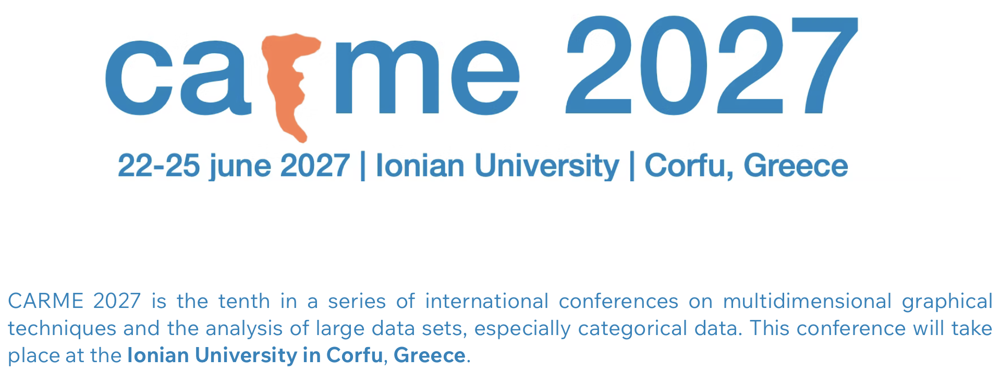{fig-alt="CARME 2027 logo"}
:::

::: {.callout-important appearance="simple" icon=false}
## June 22–25, 2027

**Ionian University**<br>
Corfu, Greece
:::

The tenth international CARME conference brings together work on correspondence analysis, categorical data, visualization, clustering, and related methods.

:::

::: {.column width="64%"}

::: {.callout-tip appearance="simple" icon=false}
## Invited speakers

::: {.columns}

::: {.column width="50%"}

**Mikael Börjesson**<br>
Uppsala University

**Paul Eilers**<br>
Erasmus University Medical Center

**Patrick J. F. Groenen**<br>
Erasmus School of Economics

:::

::: {.column width="50%"}

**Trevor Hastie**<br>
Stanford University

**Heungsun Hwang**<br>
McGill University

**Ndèye Niang**<br>
CNAM Paris

:::

:::

:::

:::

:::

::: {.centered style="margin-top:0.35em;font-size:0.78em;"}
[carme2027corfu.wixsite.com/conference](https://carme2027corfu.wixsite.com/conference)
:::

::: {.notes}
Conference dates, venue, and invited-speaker list checked on September 15, 2026, from the [official CARME 2027 website](https://carme2027corfu.wixsite.com/conference) and its [Invited Speakers page](https://carme2027corfu.wixsite.com/conference/invited-speakers).
:::


## Contact and slides

::: {.columns}

::: {.column width="36%"}


### Contact

Alfonso Iodice D'Enza  
[iodicede@unina.it](mailto:iodicede@unina.it)

### GitHub Pages

<https://alfonsoiodicede.github.io>


:::

::: {.column width="32%"}
### Package website

[{width=90% fig-align="center" fig-alt="QR code for the manydist package website"}](https://alfonsoiodicede.github.io/manydist_package/)

::: {.centered}
[Open package website](https://alfonsoiodicede.github.io/manydist_package/)
:::

:::

::: {.column width="32%"}
### Slides

[{width=100% fig-align="center" fig-alt="QR code for the SFC26 presentation slides"}](https://alfonsoiodicede.github.io/sfc26_talk.html#/title-slide)

::: {.centered}
[Open slides](https://alfonsoiodicede.github.io/sfc26_talk.html#/title-slide)
:::

:::

:::

# Backup: distance--density derivation

## Just one-way interaction?

::: {.callout-note appearance="simple" icon=false}
## Factorization motivates the direction

Let ${\bf x}_i=\left({\bf x}_{i_{n}},{\bf x}_{i_{c}}\right).$

The joint distribution can always be written as

$$
f({\bf x}_{i_{n}},{\bf x}_{i_{c}})
=
f({\bf x}_{i_{n}})
f({\bf x}_{i_{c}}\mid{\bf x}_{i_{n}}).
$$
:::

::: {.fragment}

This motivates using the continuous variables to quantify categorical distinctions:

$$
{\bf X}_{n}
\quad\longrightarrow\quad
\delta^{j}_{int}(a,b).
$$

:::

::: {.fragment .centered}
### How can this result be connected to pairwise dissimilarities?
:::


## Just one-way interaction?

::: {.callout-tip appearance="simple" icon=false}
## Dissimilarity and reference density


Starting from a non-negative dissimilarity from a prototype,

$$
d_{{\bf S}_k}({\bf x}_i,{\bf c}_k)\geq0,
\qquad
d_{{\bf S}_k}({\bf c}_k,{\bf c}_k)=0,
$$

a distance-based probability model can be constructed, provided that
the exponential kernel is normalisable
^[@Hennig19; @ben2008probabilistic]:

$$
f({\bf x}_i;{\bf c}_k,{\bf S}_k)
=
g({\bf c}_k,{\bf S}_k,\eta)
\exp\left\{
-\eta d_{{\bf S}_k}({\bf x}_i,{\bf c}_k)
\right\},
\qquad \eta>0,
$$

where $g({\bf c}_k,{\bf S}_k,\eta)$ makes $f$ a proper density.
:::

## Just one-way interaction?

::: {.callout-tip appearance="simple" icon=false}
## Dissimilarity and reference density

Since the density is maximal at the reference point,

$$
M_k
=
\max_{\bf x}f({\bf x};{\bf c}_k,{\bf S}_k)
=
f({\bf c}_k;{\bf c}_k,{\bf S}_k)
=
g({\bf c}_k,{\bf S}_k,\eta).
$$

the **maximum-normalised kernel** is

$$
\overline K_k({\bf x}_i,{\bf c}_k)
=
\frac{
f({\bf x}_i;{\bf c}_k,{\bf S}_k)
}{
M_k
}
=
\exp\left\{
-\eta d_{{\bf S}_k}({\bf x}_i,{\bf c}_k)
\right\}.
$$

Therefore,

$$
d_{{\bf S}_k}({\bf x}_i,{\bf c}_k)
=
-\frac{1}{\eta}
\log\overline K_k({\bf x}_i,{\bf c}_k).
$$

:::

## Just one-way interaction?

::: {.callout-warning appearance="simple" icon=false}
## The pairwise continuous component

For pairwise comparison, let every observation act in turn as the
reference prototype:

$$
{\bf c}_k
\longrightarrow
{\bf x}_{i'_{n}},
\qquad
{\bf S}_k
\longrightarrow
{\bf S}.
$$

Use the ordinary Mahalanobis distance and choose $\eta=1$:

$$
f_{\mathrm{n}}
({\bf x}_{i_{n}};{\bf x}_{i'_{n}},{\bf S})
=
g_{\mathrm{n}}({\bf S})
\exp\left\{
-d_{\mathrm{mah}}
({\bf x}_{i_{n}},{\bf x}_{i'_{n}})
\right\}.
$$
Using the reference maximum
$M_{\mathrm{n}}=g_{\mathrm{n}}({\bf S})$
from the preceding construction 

the **maximum-normalised continuous kernel** is 

$$
\overline K_{\mathrm{n}}(i,i')
=
\frac{
f_{\mathrm{n}}
({\bf x}_{i_{n}};{\bf x}_{i'_{n}},{\bf S})
}{
M_{\mathrm{n}}
}
=
\exp\left\{
-d_{\mathrm{mah}}
({\bf x}_{i_{n}},{\bf x}_{i'_{n}})
\right\}.
$$
:::


::: {.fragment .centered}
### $-\log\overline K_{\mathrm{n}}(i,i')$ recovers the ordinary Mahalanobis distance
:::


## Just one-way interaction?

::: {.callout-tip appearance="simple" icon=false}
## The pairwise interaction-aware categorical component

For categorical variable $j$, let $x_{ij_{\mathrm c}}=a$ and $x_{i'j_{\mathrm c}}=b$.

The interaction-aware category dissimilarity is

$$
\widetilde{\delta}^{\,j}(a,b)
=
(1-\alpha)\delta^{j}_{tvd}(a,b)
+
\alpha\delta^{j}_{int}(a,b).
$$

Assume that $\widetilde{\delta}^{\,j}(a,b)\geq0$ and $\widetilde{\delta}^{\,j}(b,b)=0$.


:::

::: {.fragment}

Choosing $\eta_j=1$, define the categorical reference PMF

$$
p_j(a;b)
=
\operatorname{softmax}_{h\in\mathcal A_j}
\left\{
-\widetilde{\delta}^{\,j}(h,b)
\right\}_{a}
=
\frac{
\exp\left\{
-\widetilde{\delta}^{\,j}(a,b)
\right\}
}{
\displaystyle
\sum_{h\in\mathcal A_j}
\exp\left\{
-\widetilde{\delta}^{\,j}(h,b)
\right\}
}.
$$

:::

::: {.fragment .centered}
### smaller category dissimilarities receive larger reference probabilities
:::

## Just one-way interaction?

::: {.callout-tip appearance="simple" icon=false}
## The pairwise interaction-aware categorical component

Because $\widetilde{\delta}^{\,j}(b,b)=0$, the maximum reference
probability is

$$
M_j(b)
=
p_j(b;b)
=
\frac{1}{
\displaystyle
\sum_{h\in\mathcal A_j}
\exp\left\{
-\widetilde{\delta}^{\,j}(h,b)
\right\}
}.
$$

::: {.fragment}

The **maximum-normalised categorical kernel**

$$
\overline K_j(a,b)
=
\frac{p_j(a;b)}{M_j(b)}
=
\exp\left\{
-\widetilde{\delta}^{\,j}(a,b)
\right\},
$$


:::
:::

::: {.fragment .centered}
### $-\log\overline K_j(a,b)=\widetilde{\delta}^{\,j}(a,b)$ recovers the interaction-aware  dissimilarity 
:::


## Just one-way interaction?

::: {.callout-tip appearance="simple" icon=false}
## Combining the kernels

For the whole categorical vector, define the separable maximum-normalised kernel

$$
\begin{aligned}
\overline K_{\mathrm{c}}^{(int)}(i,i')
&=
\prod_{j=1}^{Q_c}
\overline K_j
(x_{ij_{c}},x_{i'j_{c}})
\\
&=
\exp\left\{
-\sum_{j=1}^{Q_c}
\widetilde{\delta}^{\,j}
(x_{ij_{c}},x_{i'j_{c}})
\right\}
\\
&=
\exp\left\{
-d_{\mathrm{c}}^{(int)}
({\bf x}_{i_{c}},{\bf x}_{i'_{c}})
\right\}.
\end{aligned}
$$
:::

## Just one-way interaction?

::: {.callout-tip appearance="simple" icon=false}
## Combining the kernels

Combine the continuous and categorical kernels:

$$
\overline K_{\mathrm{mix}}^{(int)}(i,i')
=
\overline K_{\mathrm{n}}(i,i')
\,
\overline K_{\mathrm{c}}^{(int)}(i,i')=
\exp\left\{
-
d_{\mathrm{mah}}
({\bf x}_{i_{n}},{\bf x}_{i'_{n}})
-
d_{\mathrm{c}}^{(int)}
({\bf x}_{i_{c}},{\bf x}_{i'_{c}})
\right\}
$$

:::

::: {.fragment .centered}
### $-log \overline{K}_{\mathrm{mix}}^{(int)}(i,i')=d_{\mathrm{mah}}({\bf x}_{i_{n}},{\bf x}_{i'_{n}})
+d_{\mathrm{c}}^{(int)}({\bf x}_{i_{c}},{\bf x}_{i'_{c}})$

### recovers the overall dissimilarity 
:::


&nbsp;

::: {.fragment}

### in algebraic form

::: {.centered}

**${\bf D}_{mix}^{(int)} ={\bf D}_{mah}+{\bf Z}\widetilde{\Delta}{\bf Z}^{\sf T}.$**

:::

:::
