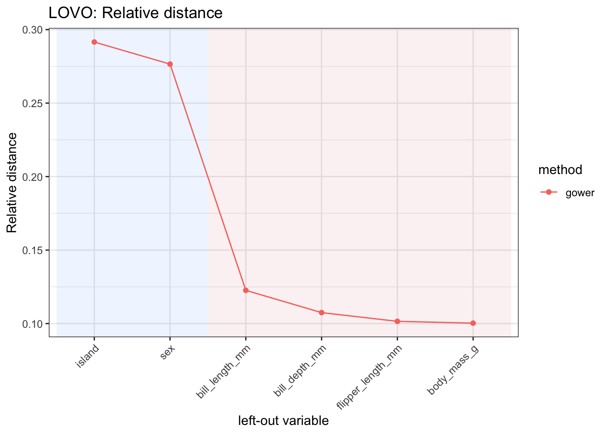

# manydist: distance-based learning with mixed-type data

## 1 Overview

`manydist` provides tools for constructing dissimilarities for
numerical, categorical, and mixed-type data.

The main function is
[`mdist()`](https://alfonsoiodicede.github.io/manydist_package/reference/mdist.md).
It computes a dissimilarity object that can be used in distance-based
learning workflows, including clustering, nearest-neighbour prediction,
and diagnostic analyses.

The package supports both preset specifications and custom
specifications. In the current interface:

- `method_cat` controls the categorical dissimilarity;
- `method_num` controls the preprocessing of numerical variables;
- `commensurable` controls whether variable-wise contributions are
  placed on a comparable scale;
- `preset` selects a predefined distance specification.

The numerical metric is no longer a user-facing argument. For most
presets, numerical variables are compared through Manhattan-type
contributions. The exceptions are presets such as `"hl"` and
`"euclidean"`, where the Euclidean structure is part of the definition.

The `"euclidean"` preset replaces the former `"euclidean_onehot"` name.
It computes Euclidean distances after one-hot encoding categorical
variables.

## 2 Setup

``` r

library(manydist)
library(dplyr)
library(tidyr)
library(recipes)
```

We use the `palmerpenguins` data for illustration.

``` r

if (requireNamespace("palmerpenguins", quietly = TRUE)) {
  data("penguins", package = "palmerpenguins")

  penguins_small <- palmerpenguins::penguins |>
    dplyr::select(
      species,
      bill_length_mm,
      bill_depth_mm,
      flipper_length_mm,
      body_mass_g,
      island,
      sex
    ) |>
    tidyr::drop_na()
}
```

The data contain numerical variables, such as bill length and body mass,
and categorical variables, such as island and sex.

``` r

dplyr::glimpse(penguins_small)
```

    Rows: 333
    Columns: 7
    $ species           <fct> Adelie, Adelie, Adelie, Adelie, Adelie, Adelie, Adel…
    $ bill_length_mm    <dbl> 39.1, 39.5, 40.3, 36.7, 39.3, 38.9, 39.2, 41.1, 38.6…
    $ bill_depth_mm     <dbl> 18.7, 17.4, 18.0, 19.3, 20.6, 17.8, 19.6, 17.6, 21.2…
    $ flipper_length_mm <int> 181, 186, 195, 193, 190, 181, 195, 182, 191, 198, 18…
    $ body_mass_g       <int> 3750, 3800, 3250, 3450, 3650, 3625, 4675, 3200, 3800…
    $ island            <fct> Torgersen, Torgersen, Torgersen, Torgersen, Torgerse…
    $ sex               <fct> male, female, female, female, male, female, male, fe…

## 3 Computing a mixed-type dissimilarity

The simplest way to compute a mixed-type dissimilarity is to use a
preset.

For example, the `"gower"` preset computes a Gower-type dissimilarity
for mixed numerical and categorical data.

``` r

d_gower <- mdist(
  penguins_small |> dplyr::select(-species),
  preset = "gower"
)

d_gower
```

    MDist object
      preset : gower
      number of observations : 333
      number of continuous variables   : 4
      number of categorical variables   : 2
      parameters:
        - commensurability adjustment: FALSE

The resulting object stores the dissimilarity matrix and metadata about
the distance specification.

``` r

class(d_gower)
```

    [1] "MDist" "R6"   

The distance matrix can be extracted with `to_dist()`.

``` r

as.matrix(d_gower$to_dist())[1:5, 1:5]
```

               1          2          3          4          5
    1 0.00000000 0.21132367 0.25052445 0.24090408 0.06896389
    2 0.21132367 0.00000000 0.06763994 0.09064582 0.24961473
    3 0.25052445 0.06763994 0.00000000 0.06252081 0.25695739
    4 0.24090408 0.09064582 0.06252081 0.00000000 0.22595173
    5 0.06896389 0.24961473 0.25695739 0.22595173 0.00000000

## 4 Response-aware dissimilarities

Some categorical dissimilarities can use a response variable. When a
response is supplied to
[`mdist()`](https://alfonsoiodicede.github.io/manydist_package/reference/mdist.md),
it is used for response-aware distance construction and is removed from
the predictors.

Therefore, in the following example, `species` is used as the response
and is not also treated as a predictor.

``` r

d_response <- mdist(
  penguins_small,
  response = species,
  preset = "u_dep"
)

d_response
```

    MDist object
      preset : u_dep
      number of observations : 333
      number of continuous variables   : 4
      number of categorical variables   : 2
      parameters:
        - categorical method: tvd
        - numerical preprocessing: pc_scores
        - commensurability adjustment: TRUE

The same can be written by passing the response as a character string.

``` r

d_response_chr <- mdist(
  penguins_small,
  response = "species",
  preset = "u_dep"
)

d_response_chr
```

    MDist object
      preset : u_dep
      number of observations : 333
      number of continuous variables   : 4
      number of categorical variables   : 2
      parameters:
        - categorical method: tvd
        - numerical preprocessing: pc_scores
        - commensurability adjustment: TRUE

## 5 Custom distance specifications

Presets are convenient, but users can also define custom specifications.

In a custom specification, `method_cat` controls the categorical
dissimilarity and `method_num` controls the preprocessing applied to
numerical variables.

``` r

d_custom <- mdist(
  penguins_small |> dplyr::select(-species),
  preset = "custom",
  method_cat = "matching",
  method_num = "std",
  commensurable = TRUE
)

d_custom
```

    MDist object
      preset : custom
      number of observations : 333
      number of continuous variables   : 4
      number of categorical variables   : 2
      parameters:
        - categorical method: matching
        - numerical preprocessing: std
        - commensurability adjustment: TRUE
        - number of principal components: 6
        - inertia threshold: NULL

Here, categorical variables are compared using matching dissimilarities,
numerical variables are standardized, and variable-wise contributions
are made commensurable.

A response-aware custom specification can also be used.

``` r

d_custom_response <- mdist(
  penguins_small,
  response = species,
  preset = "custom",
  method_cat = "tvd",
  method_num = "std",
  commensurable = TRUE
)

d_custom_response
```

    MDist object
      preset : custom
      number of observations : 333
      number of continuous variables   : 4
      number of categorical variables   : 2
      parameters:
        - categorical method: tvd
        - numerical preprocessing: std
        - commensurability adjustment: TRUE
        - number of principal components: 6
        - inertia threshold: NULL

If only one categorical predictor is available, methods that require
more than one categorical variable may switch to a simpler alternative
internally.

## 6 Euclidean preset

The `"euclidean"` preset computes Euclidean distances after converting
categorical variables to one-hot dummy variables.

``` r

d_euclidean <- mdist(
  penguins_small |> dplyr::select(-species),
  preset = "euclidean"
)

d_euclidean
```

    MDist object
      preset : euclidean
      number of observations : 333
      number of continuous variables   : 4
      number of categorical variables   : 2
      parameters:
        - numerical preprocessing: std

This preset replaces the former `"euclidean_onehot"` name.

## 7 Comparing presets

Different presets encode different assumptions about how numerical and
categorical variables should contribute to the final dissimilarity.

``` r

d_u_indep <- mdist(
  penguins_small |> dplyr::select(-species),
  preset = "u_indep"
)

d_u_mix <- mdist(
  penguins_small |> dplyr::select(-species),
  preset = "u_mix"
)

d_hl <- mdist(
  penguins_small |> dplyr::select(-species),
  preset = "hl"
)

d_u_indep
```

    MDist object
      preset : u_indep
      number of observations : 333
      number of continuous variables   : 4
      number of categorical variables   : 2
      parameters:
        - categorical method: matching
        - numerical preprocessing: std
        - commensurability adjustment: TRUE

``` r

d_u_mix
```

    MDist object
      preset : u_mix
      number of observations : 333
      number of continuous variables   : 4
      number of categorical variables   : 2
      parameters:
        - categorical method: tvd
        - numerical preprocessing: std
        - commensurability adjustment: TRUE

``` r

d_hl
```

    MDist object
      preset : hl
      number of observations : 333
      number of continuous variables   : 4
      number of categorical variables   : 2
      parameters:
        - categorical method: HLeucl
        - numerical preprocessing: std
        - commensurability adjustment: FALSE

The available presets include:

``` r

c(
  "custom",
  "gower",
  "euclidean",
  "unbiased_dependent",
  "u_dep",
  "u_indep",
  "u_mix",
  "hl",
  "gudmm",
  "dkss",
  "mod_gower"
)
```

     [1] "custom"             "gower"              "euclidean"
     [4] "unbiased_dependent" "u_dep"              "u_indep"
     [7] "u_mix"              "hl"                 "gudmm"
    [10] "dkss"               "mod_gower"         

Some presets are intended mainly for train-train dissimilarities and may
not support distances from new observations to training observations.

## 8 Distances from new observations to training observations

[`mdist()`](https://alfonsoiodicede.github.io/manydist_package/reference/mdist.md)
can also compute distances from new observations to the training
observations through the `new_data` argument.

``` r

set.seed(123)

split_id <- sample(seq_len(nrow(penguins_small)), size = floor(0.75 * nrow(penguins_small)))

penguins_train <- penguins_small[split_id, ]
penguins_test  <- penguins_small[-split_id, ]

d_new <- mdist(
  x = penguins_train |> dplyr::select(-species),
  new_data = penguins_test |> dplyr::select(-species),
  preset = "gower"
)

d_new
```

    MDist object
      preset : gower
      number of training observations : 249
      number of test observations     : 84
      number of continuous variables   : 4
      number of categorical variables   : 2
      parameters:
        - commensurability adjustment: FALSE

The resulting dissimilarity is rectangular: rows correspond to test
observations and columns correspond to training observations.

``` r

dim(as.matrix(d_new$distance))
```

    [1]  84 249

## 9 Using `manydist` in recipe workflows

The function
[`step_mdist()`](https://alfonsoiodicede.github.io/manydist_package/reference/step_mdist.md)
provides a recipe interface to
[`mdist()`](https://alfonsoiodicede.github.io/manydist_package/reference/mdist.md).
It replaces selected predictors with a distance-based representation.

In supervised workflows, the response is defined on the left-hand side
of the recipe formula. Therefore, when we select
[`recipes::all_predictors()`](https://recipes.tidymodels.org/reference/has_role.html),
the response variable is not used as a predictor in the distance
computation.

``` r

rec <- recipes::recipe(species ~ ., data = penguins_small) |>
  step_mdist(
    recipes::all_predictors(),
    preset = "gower",
    output = "distance_to_training"
  )

rec_prep <- recipes::prep(rec, training = penguins_small)

baked <- recipes::bake(rec_prep, new_data = penguins_small)

baked |>
  dplyr::slice_head(n = 5)
```

    # A tibble: 5 × 334
      species dist_1 dist_2 dist_3 dist_4 dist_5 dist_6 dist_7 dist_8 dist_9 dist_10
      <fct>    <dbl>  <dbl>  <dbl>  <dbl>  <dbl>  <dbl>  <dbl>  <dbl>  <dbl>   <dbl>
    1 Adelie  0      0.211  0.251  0.241  0.0690 0.192  0.101  0.229  0.0832  0.153
    2 Adelie  0.211  0      0.0676 0.0906 0.250  0.0338 0.278  0.0527 0.262   0.331
    3 Adelie  0.251  0.0676 0      0.0625 0.257  0.0694 0.271  0.0518 0.277   0.324
    4 Adelie  0.241  0.0906 0.0625 0      0.226  0.0851 0.250  0.103  0.238   0.273
    5 Adelie  0.0690 0.250  0.257  0.226  0      0.251  0.0820 0.281  0.0259  0.0957
    # ℹ 323 more variables: dist_11 <dbl>, dist_12 <dbl>, dist_13 <dbl>,
    #   dist_14 <dbl>, dist_15 <dbl>, dist_16 <dbl>, dist_17 <dbl>, dist_18 <dbl>,
    #   dist_19 <dbl>, dist_20 <dbl>, dist_21 <dbl>, dist_22 <dbl>, dist_23 <dbl>,
    #   dist_24 <dbl>, dist_25 <dbl>, dist_26 <dbl>, dist_27 <dbl>, dist_28 <dbl>,
    #   dist_29 <dbl>, dist_30 <dbl>, dist_31 <dbl>, dist_32 <dbl>, dist_33 <dbl>,
    #   dist_34 <dbl>, dist_35 <dbl>, dist_36 <dbl>, dist_37 <dbl>, dist_38 <dbl>,
    #   dist_39 <dbl>, dist_40 <dbl>, dist_41 <dbl>, dist_42 <dbl>, …

The resulting data contain the outcome variable, `species`, together
with one distance column for each training observation. These columns
are named `dist_1`, `dist_2`, and so on.

## 10 Custom specifications in recipes

The same interface can be used with a custom distance specification.

``` r

rec_custom <- recipes::recipe(species ~ ., data = penguins_small) |>
  step_mdist(
    recipes::all_predictors(),
    preset = "custom",
    method_cat = "matching",
    method_num = "std",
    commensurable = TRUE,
    output = "distance_to_training"
  )

rec_custom_prep <- recipes::prep(rec_custom, training = penguins_small)

baked_custom <- recipes::bake(rec_custom_prep, new_data = penguins_small)

baked_custom |>
  dplyr::slice_head(n = 5)
```

    # A tibble: 5 × 334
      species dist_1 dist_2 dist_3 dist_4 dist_5 dist_6 dist_7 dist_8 dist_9 dist_10
      <fct>    <dbl>  <dbl>  <dbl>  <dbl>  <dbl>  <dbl>  <dbl>  <dbl>  <dbl>   <dbl>
    1 Adelie    0      3.01   3.93   3.73   1.55  2.57    2.31   3.47  1.87     3.56
    2 Adelie    3.01   0      1.56   2.11   3.87  0.779   4.55   1.25  4.14     5.84
    3 Adelie    3.93   1.56   0      1.50   4.07  1.60    4.45   1.18  4.55     5.73
    4 Adelie    3.73   2.11   1.50   0      3.40  1.96    4.00   2.42  3.66     4.49
    5 Adelie    1.55   3.87   4.07   3.40   0     3.90    1.90   4.61  0.605    2.30
    # ℹ 323 more variables: dist_11 <dbl>, dist_12 <dbl>, dist_13 <dbl>,
    #   dist_14 <dbl>, dist_15 <dbl>, dist_16 <dbl>, dist_17 <dbl>, dist_18 <dbl>,
    #   dist_19 <dbl>, dist_20 <dbl>, dist_21 <dbl>, dist_22 <dbl>, dist_23 <dbl>,
    #   dist_24 <dbl>, dist_25 <dbl>, dist_26 <dbl>, dist_27 <dbl>, dist_28 <dbl>,
    #   dist_29 <dbl>, dist_30 <dbl>, dist_31 <dbl>, dist_32 <dbl>, dist_33 <dbl>,
    #   dist_34 <dbl>, dist_35 <dbl>, dist_36 <dbl>, dist_37 <dbl>, dist_38 <dbl>,
    #   dist_39 <dbl>, dist_40 <dbl>, dist_41 <dbl>, dist_42 <dbl>, …

In this example, `method_cat = "matching"` specifies the categorical
dissimilarity, while `method_num = "std"` specifies standardization of
numerical variables.

## 11 Pairwise dissimilarities in recipes

For distance-based clustering workflows,
[`step_mdist()`](https://alfonsoiodicede.github.io/manydist_package/reference/step_mdist.md)
can return the within-training pairwise dissimilarity matrix by setting
`output = "pairwise"`.

In this case, the recipe is intended for training-only workflows.

``` r

penguins_predictors <- penguins_small |>
  dplyr::select(-species)

rec_pairwise <- recipes::recipe(~ ., data = penguins_predictors) |>
  step_mdist(
    recipes::all_predictors(),
    preset = "gower",
    output = "pairwise"
  )

rec_pairwise_prep <- recipes::prep(rec_pairwise, training = penguins_predictors)

pairwise_dist <- recipes::bake(
  rec_pairwise_prep,
  new_data = penguins_predictors
)

pairwise_dist |>
  dplyr::slice_head(n = 5)
```

    # A tibble: 5 × 333
      dist_1 dist_2 dist_3 dist_4 dist_5 dist_6 dist_7 dist_8 dist_9 dist_10 dist_11
       <dbl>  <dbl>  <dbl>  <dbl>  <dbl>  <dbl>  <dbl>  <dbl>  <dbl>   <dbl>   <dbl>
    1 0      0.211  0.251  0.241  0.0690 0.192  0.101  0.229  0.0832  0.153   0.213
    2 0.211  0      0.0676 0.0906 0.250  0.0338 0.278  0.0527 0.262   0.331   0.0330
    3 0.251  0.0676 0      0.0625 0.257  0.0694 0.271  0.0518 0.277   0.324   0.0755
    4 0.241  0.0906 0.0625 0      0.226  0.0851 0.250  0.103  0.238   0.273   0.0645
    5 0.0690 0.250  0.257  0.226  0      0.251  0.0820 0.281  0.0259  0.0957  0.255
    # ℹ 322 more variables: dist_12 <dbl>, dist_13 <dbl>, dist_14 <dbl>,
    #   dist_15 <dbl>, dist_16 <dbl>, dist_17 <dbl>, dist_18 <dbl>, dist_19 <dbl>,
    #   dist_20 <dbl>, dist_21 <dbl>, dist_22 <dbl>, dist_23 <dbl>, dist_24 <dbl>,
    #   dist_25 <dbl>, dist_26 <dbl>, dist_27 <dbl>, dist_28 <dbl>, dist_29 <dbl>,
    #   dist_30 <dbl>, dist_31 <dbl>, dist_32 <dbl>, dist_33 <dbl>, dist_34 <dbl>,
    #   dist_35 <dbl>, dist_36 <dbl>, dist_37 <dbl>, dist_38 <dbl>, dist_39 <dbl>,
    #   dist_40 <dbl>, dist_41 <dbl>, dist_42 <dbl>, dist_43 <dbl>, …

## 12 Euclidean distances in recipes

The `"euclidean"` preset can also be used inside a recipe. Categorical
predictors are one-hot encoded internally before the Euclidean distance
is computed.

``` r

rec_euclidean <- recipes::recipe(species ~ ., data = penguins_small) |>
  step_mdist(
    recipes::all_predictors(),
    preset = "euclidean",
    output = "distance_to_training"
  )

rec_euclidean_prep <- recipes::prep(rec_euclidean, training = penguins_small)

baked_euclidean <- recipes::bake(rec_euclidean_prep, new_data = penguins_small)

baked_euclidean |>
  dplyr::slice_head(n = 5)
```

    # A tibble: 5 × 334
      species dist_1 dist_2 dist_3 dist_4 dist_5 dist_6 dist_7 dist_8 dist_9 dist_10
      <fct>    <dbl>  <dbl>  <dbl>  <dbl>  <dbl>  <dbl>  <dbl>  <dbl>  <dbl>   <dbl>
    1 Adelie    0     2.92   3.09   3.02    1.17  2.87    1.59  2.98   1.46     2.07
    2 Adelie    2.92  0      0.997  1.28    3.28  0.477   3.29  0.856  3.44     3.69
    3 Adelie    3.09  0.997  0      0.975   3.18  1.14    3.44  0.963  3.36     3.69
    4 Adelie    3.02  1.28   0.975  0       2.96  1.23    3.25  1.45   3.04     3.24
    5 Adelie    1.17  3.28   3.18   2.96    0     3.23    1.42  3.32   0.386    1.41
    # ℹ 323 more variables: dist_11 <dbl>, dist_12 <dbl>, dist_13 <dbl>,
    #   dist_14 <dbl>, dist_15 <dbl>, dist_16 <dbl>, dist_17 <dbl>, dist_18 <dbl>,
    #   dist_19 <dbl>, dist_20 <dbl>, dist_21 <dbl>, dist_22 <dbl>, dist_23 <dbl>,
    #   dist_24 <dbl>, dist_25 <dbl>, dist_26 <dbl>, dist_27 <dbl>, dist_28 <dbl>,
    #   dist_29 <dbl>, dist_30 <dbl>, dist_31 <dbl>, dist_32 <dbl>, dist_33 <dbl>,
    #   dist_34 <dbl>, dist_35 <dbl>, dist_36 <dbl>, dist_37 <dbl>, dist_38 <dbl>,
    #   dist_39 <dbl>, dist_40 <dbl>, dist_41 <dbl>, dist_42 <dbl>, …

## 13 Distance-based nearest-neighbour prediction

The distance representation produced by
[`step_mdist()`](https://alfonsoiodicede.github.io/manydist_package/reference/step_mdist.md)
can be used in downstream supervised learning workflows.

Here we illustrate a nearest-neighbour classifier using the
distance-to-training representation. The recipe first converts the
original mixed-type predictors into distances from each observation to
the training observations. The model is then tuned over the number of
neighbours.

``` r

library(tidymodels)

set.seed(123)

penguin_split <- rsample::initial_split(
  penguins_small,
  prop = 0.75,
  strata = species
)

penguin_train <- rsample::training(penguin_split)
penguin_test  <- rsample::testing(penguin_split)

set.seed(123)

penguin_folds <- rsample::vfold_cv(
  penguin_train,
  v = 5,
  strata = species
)
```

``` r

rec_knn <- recipes::recipe(species ~ ., data = penguin_train) |>
  step_mdist(
    recipes::all_predictors(),
    preset = "gower",
    output = "distance_to_training"
  )
```

``` r

knn_spec <- nearest_neighbor_dist(
  neighbors = tune::tune()
) |>
  parsnip::set_mode("classification")
```

``` r

knn_wf <- workflows::workflow() |>
  workflows::add_recipe(rec_knn) |>
  workflows::add_model(knn_spec)

knn_grid <- tibble::tibble(
  neighbors = c(1, 3, 5, 7, 9)
)

set.seed(123)

knn_res <- tune::tune_grid(
  knn_wf,
  resamples = penguin_folds,
  grid = knn_grid,
  metrics = yardstick::metric_set(accuracy)
)

knn_res |>
  tune::collect_metrics()
```

    # A tibble: 5 × 7
      neighbors .metric  .estimator  mean     n std_err .config
          <dbl> <chr>    <chr>      <dbl> <int>   <dbl> <chr>
    1         1 accuracy multiclass 0.996     5 0.00392 pre0_mod1_post0
    2         3 accuracy multiclass 1         5 0       pre0_mod2_post0
    3         5 accuracy multiclass 0.992     5 0.00485 pre0_mod3_post0
    4         7 accuracy multiclass 0.992     5 0.00485 pre0_mod4_post0
    5         9 accuracy multiclass 0.988     5 0.00798 pre0_mod5_post0

``` r

best_knn <- knn_res |>
  tune::select_best(metric = "accuracy")

best_knn
```

    # A tibble: 1 × 2
      neighbors .config
          <dbl> <chr>
    1         3 pre0_mod2_post0

``` r

final_knn_wf <- knn_wf |>
  tune::finalize_workflow(best_knn)

final_knn_fit <- final_knn_wf |>
  parsnip::fit(data = penguin_train)

knn_pred <- predict(final_knn_fit, new_data = penguin_test) |>
  dplyr::bind_cols(penguin_test |> dplyr::select(species))

yardstick::accuracy(knn_pred, truth = species, estimate = .pred_class)
```

    # A tibble: 1 × 3
      .metric  .estimator .estimate
      <chr>    <chr>          <dbl>
    1 accuracy multiclass     0.988

This example uses `preset = "gower"`, but the same workflow can be used
with any
[`mdist()`](https://alfonsoiodicede.github.io/manydist_package/reference/mdist.md)
preset or with a custom specification based on `method_cat`,
`method_num`, and `commensurable`.

## 14 Distance-based PAM clustering

The same dissimilarities can be used for clustering. For clustering
workflows,
[`step_mdist()`](https://alfonsoiodicede.github.io/manydist_package/reference/step_mdist.md)
can return the within-training pairwise dissimilarity matrix by setting
`output = "pairwise"`.

``` r

penguins_predictors <- penguins_small |>
  dplyr::select(-species)

rec_pam <- recipes::recipe(~ ., data = penguins_predictors) |>
  step_mdist(
    recipes::all_predictors(),
    preset = "gower",
    output = "pairwise"
  )
```

``` r

pam_spec <- pam_dist(
  num_clusters = 3
)

pam_fit <- generics::fit(
  pam_spec,
  recipe = rec_pam,
  data = penguins_predictors
)

pam_pred <- predict(pam_fit)

pam_pred |>
  dplyr::slice_head(n = 10)
```

    # A tibble: 10 × 1
       .pred_cluster
       <fct>
     1 1
     2 2
     3 2
     4 2
     5 1
     6 2
     7 1
     8 2
     9 1
    10 1            

Since the true species labels are available in this example, we can
inspect the relationship between the PAM clusters and the species
labels.

``` r

pam_pred |>
  dplyr::bind_cols(penguins_small |> dplyr::select(species)) |>
  dplyr::count(.pred_cluster, species)
```

    # A tibble: 6 × 3
      .pred_cluster species       n
      <fct>         <fct>     <int>
    1 1             Adelie       65
    2 1             Chinstrap    34
    3 2             Adelie       73
    4 2             Chinstrap    34
    5 3             Adelie        8
    6 3             Gentoo      119

## 15 Distance-based spectral clustering

Spectral clustering can be used in the same way, by combining a pairwise
distance recipe with the corresponding model specification.

``` r

rec_spectral <- recipes::recipe(~ ., data = penguins_predictors) |>
  step_mdist(
    recipes::all_predictors(),
    preset = "gower",
    output = "pairwise"
  )
```

``` r

spectral_spec <- spectral_dist(
  num_clusters = 3
)

spectral_fit <- generics::fit(
  spectral_spec,
  recipe = rec_spectral,
  data = penguins_predictors
)

spectral_pred <- predict(spectral_fit)

spectral_pred |>
  dplyr::slice_head(n = 10)
```

    # A tibble: 10 × 1
       .pred_cluster
       <fct>
     1 2
     2 1
     3 1
     4 1
     5 2
     6 1
     7 2
     8 1
     9 2
    10 2            

Again, because this is an illustrative labelled data set, we can compare
the resulting clusters with the observed species labels.

``` r

spectral_pred |>
  dplyr::bind_cols(penguins_small |> dplyr::select(species)) |>
  dplyr::count(.pred_cluster, species)
```

    # A tibble: 5 × 3
      .pred_cluster species       n
      <fct>         <fct>     <int>
    1 1             Adelie       73
    2 1             Chinstrap    34
    3 2             Adelie       73
    4 2             Chinstrap    34
    5 3             Gentoo      119

## 16 A small benchmark example

The function
[`benchmark_mdist()`](https://alfonsoiodicede.github.io/manydist_package/reference/benchmark_mdist.md)
applies
[`mdist()`](https://alfonsoiodicede.github.io/manydist_package/reference/mdist.md)
repeatedly over a grid of distance specifications. This is useful for
comparing alternative presets and custom specifications in a systematic
way.

For a small example, we restrict the grid to a few specifications.

``` r

small_specs <- dplyr::bind_rows(
  all_dist_method_specs(mode = "presets_only") |>
    dplyr::filter(preset %in% c("gower", "u_dep", "u_indep", "euclidean")),

  all_dist_method_specs(
    mode = "full",
    method_cat = c("matching", "tvd"),
    method_num = c("std", "robust"),
    commensurable = c(TRUE, FALSE)
  ) |>
    dplyr::filter(spec_type == "component")
)

small_specs
```

    # A tibble: 12 × 5
       spec_type preset    method_cat method_num commensurable
       <chr>     <chr>     <chr>      <chr>      <lgl>
     1 preset    euclidean <NA>       <NA>       NA
     2 preset    gower     <NA>       <NA>       NA
     3 preset    u_dep     <NA>       <NA>       NA
     4 preset    u_indep   <NA>       <NA>       NA
     5 component custom    matching   robust     FALSE
     6 component custom    matching   robust     TRUE
     7 component custom    matching   std        FALSE
     8 component custom    matching   std        TRUE
     9 component custom    tvd        robust     FALSE
    10 component custom    tvd        robust     TRUE
    11 component custom    tvd        std        FALSE
    12 component custom    tvd        std        TRUE         

``` r

bench_small <- benchmark_mdist(
  penguins_small,
  response = species,
  specs = small_specs
)

bench_small |>
  dplyr::select(
    spec_type,
    preset,
    method_cat,
    method_num,
    commensurable,
    ok,
    error
  )
```

    # A tibble: 12 × 7
       spec_type preset    method_cat method_num commensurable ok    error
       <chr>     <chr>     <chr>      <chr>      <lgl>         <lgl> <chr>
     1 preset    euclidean <NA>       <NA>       NA            TRUE  <NA>
     2 preset    gower     <NA>       <NA>       NA            TRUE  <NA>
     3 preset    u_dep     <NA>       <NA>       NA            TRUE  <NA>
     4 preset    u_indep   <NA>       <NA>       NA            TRUE  <NA>
     5 component custom    matching   robust     FALSE         TRUE  <NA>
     6 component custom    matching   robust     TRUE          TRUE  <NA>
     7 component custom    matching   std        FALSE         TRUE  <NA>
     8 component custom    matching   std        TRUE          TRUE  <NA>
     9 component custom    tvd        robust     FALSE         TRUE  <NA>
    10 component custom    tvd        robust     TRUE          TRUE  <NA>
    11 component custom    tvd        std        FALSE         TRUE  <NA>
    12 component custom    tvd        std        TRUE          TRUE  <NA> 

The `ok` column reports whether the distance computation completed
successfully. Failed specifications are kept in the output, with the
corresponding error message stored in `error`.

``` r

bench_small |>
  dplyr::count(ok)
```

    # A tibble: 1 × 2
      ok        n
      <lgl> <int>
    1 TRUE     12

When all specifications are successful, the resulting `MDist` objects
are stored in the `result` list-column and can be inspected or reused.

``` r

bench_small |>
  dplyr::filter(ok) |>
  dplyr::select(spec_type, preset, method_cat, method_num, commensurable, result) |>
  dplyr::slice_head(n = 3)
```

    # A tibble: 3 × 6
      spec_type preset    method_cat method_num commensurable result
      <chr>     <chr>     <chr>      <chr>      <lgl>         <list>
    1 preset    euclidean <NA>       <NA>       NA            <MDist>
    2 preset    gower     <NA>       <NA>       NA            <MDist>
    3 preset    u_dep     <NA>       <NA>       NA            <MDist>

## 17 Leave-one-variable-out diagnostics

[`lovo_mdist()`](https://alfonsoiodicede.github.io/manydist_package/reference/lovo_mdist.md)
computes leave-one-variable-out diagnostics for distance-based variable
importance.

It first computes the full dissimilarity matrix. Then it removes one
predictor at a time, recomputes the dissimilarity matrix, and compares
the reduced matrix with the full one.

``` r

lovo_gower <- lovo_mdist(
  penguins_small,
  response = species,
  response_used = FALSE,
  preset = "gower"
)

lovo_gower
```

    MDistLOVO object
      preset : gower
      dims   : 2
      n_obs  : 333
      response used : FALSE
      top vars:
    # A tibble: 5 × 4
      variable          variable_type relative_distance mad_importance
      <chr>             <chr>                     <dbl>          <dbl>
    1 island            categorical               0.292         0.0853
    2 sex               categorical               0.277         0.0809
    3 bill_length_mm    numeric                   0.123         0.0359
    4 bill_depth_mm     numeric                   0.107         0.0314
    5 flipper_length_mm numeric                   0.102         0.0297

The result can be summarized.

``` r

summary(lovo_gower)
```

    Summary of MDistLOVO
      preset : gower
      dims   : 2
      n_obs  : 333
      response used : FALSE

    Relative distance:
      range [0.1003, 0.2916], mean 0.1667

    Top by relative distance:
    # A tibble: 5 × 3
      variable          variable_type relative_distance
      <chr>             <chr>                     <dbl>
    1 island            categorical               0.292
    2 sex               categorical               0.277
    3 bill_length_mm    numeric                   0.123
    4 bill_depth_mm     numeric                   0.107
    5 flipper_length_mm numeric                   0.102

The relative contribution of each variable can be visualized with
`autoplot()`.

``` r

lovo_gower$autoplot(
  metric = "relative_distance",
  reorder = TRUE
)
```



When `response_used = FALSE`, the response column is removed before
computing distances. When `response_used = TRUE`, the response can be
used by response-aware distance specifications, but it is still not
treated as a predictor in the leave-one-variable-out loop.

``` r

lovo_response <- lovo_mdist(
  penguins_small,
  response = species,
  response_used = TRUE,
  preset = "u_dep"
)

lovo_response
```

    MDistLOVO object
      preset : u_dep
      dims   : 2
      n_obs  : 333
      response used : TRUE
      top vars:
    # A tibble: 5 × 4
      variable          variable_type relative_distance mad_importance
      <chr>             <chr>                     <dbl>          <dbl>
    1 sex               categorical               0.171           1.04
    2 bill_length_mm    numeric                   0.166           1.01
    3 bill_depth_mm     numeric                   0.166           1.00
    4 body_mass_g       numeric                   0.166           1.00
    5 flipper_length_mm numeric                   0.166           1.00

## 18 Inspecting method specifications

[`all_dist_method_specs()`](https://alfonsoiodicede.github.io/manydist_package/reference/all_dist_method_specs.md)
returns a table of distance specifications that can be used for
benchmarking or sensitivity analysis.

``` r

specs <- all_dist_method_specs()

specs |>
  dplyr::select(
    spec_type,
    preset,
    method_cat,
    method_num,
    commensurable
  ) |>
  dplyr::slice_head(n = 10)
```

    # A tibble: 10 × 5
       spec_type preset    method_cat method_num commensurable
       <chr>     <chr>     <chr>      <chr>      <lgl>
     1 preset    euclidean <NA>       <NA>       NA
     2 preset    gower     <NA>       <NA>       NA
     3 preset    hl        <NA>       <NA>       NA
     4 preset    u_dep     <NA>       <NA>       NA
     5 preset    u_indep   <NA>       <NA>       NA
     6 preset    u_mix     <NA>       <NA>       NA
     7 preset    dkss      <NA>       <NA>       NA
     8 preset    gudmm     <NA>       <NA>       NA
     9 preset    mod_gower <NA>       <NA>       NA
    10 preset    custom    <NA>       <NA>       NA           

The same table can be passed to
[`benchmark_mdist()`](https://alfonsoiodicede.github.io/manydist_package/reference/benchmark_mdist.md).

``` r

bench <- benchmark_mdist(
  penguins_small,
  response = species,
  specs = specs
)

bench |>
  dplyr::select(
    spec_type,
    preset,
    method_cat,
    method_num,
    commensurable,
    ok,
    error
  ) |>
  dplyr::slice_head(n = 10)
```

    # A tibble: 10 × 7
       spec_type preset    method_cat method_num commensurable ok    error
       <chr>     <chr>     <chr>      <chr>      <lgl>         <lgl> <chr>
     1 preset    euclidean <NA>       <NA>       NA            TRUE  <NA>
     2 preset    gower     <NA>       <NA>       NA            TRUE  <NA>
     3 preset    hl        <NA>       <NA>       NA            TRUE  <NA>
     4 preset    u_dep     <NA>       <NA>       NA            TRUE  <NA>
     5 preset    u_indep   <NA>       <NA>       NA            TRUE  <NA>
     6 preset    u_mix     <NA>       <NA>       NA            TRUE  <NA>
     7 preset    dkss      <NA>       <NA>       NA            TRUE  <NA>
     8 preset    gudmm     <NA>       <NA>       NA            TRUE  <NA>
     9 preset    mod_gower <NA>       <NA>       NA            TRUE  <NA>
    10 preset    custom    <NA>       <NA>       NA            TRUE  <NA> 
