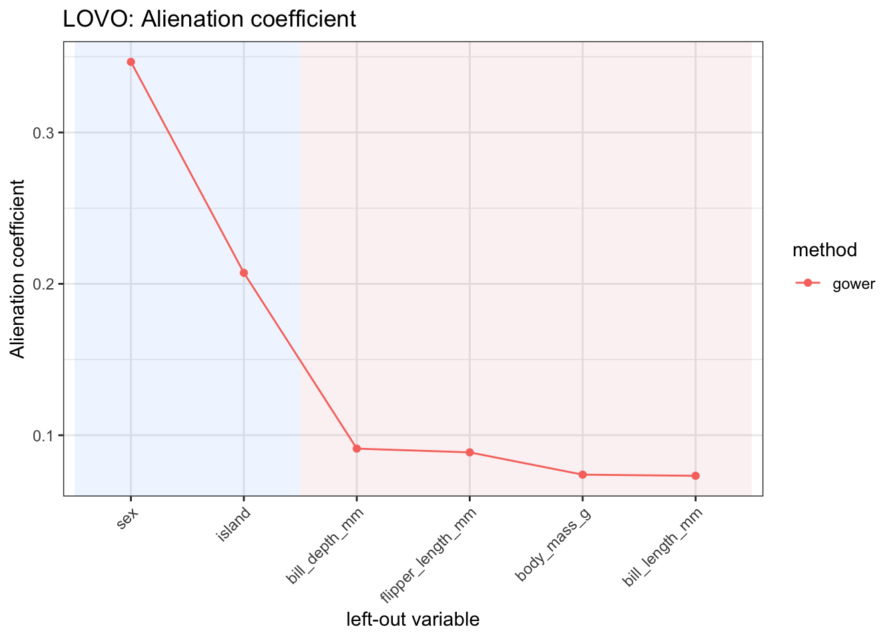
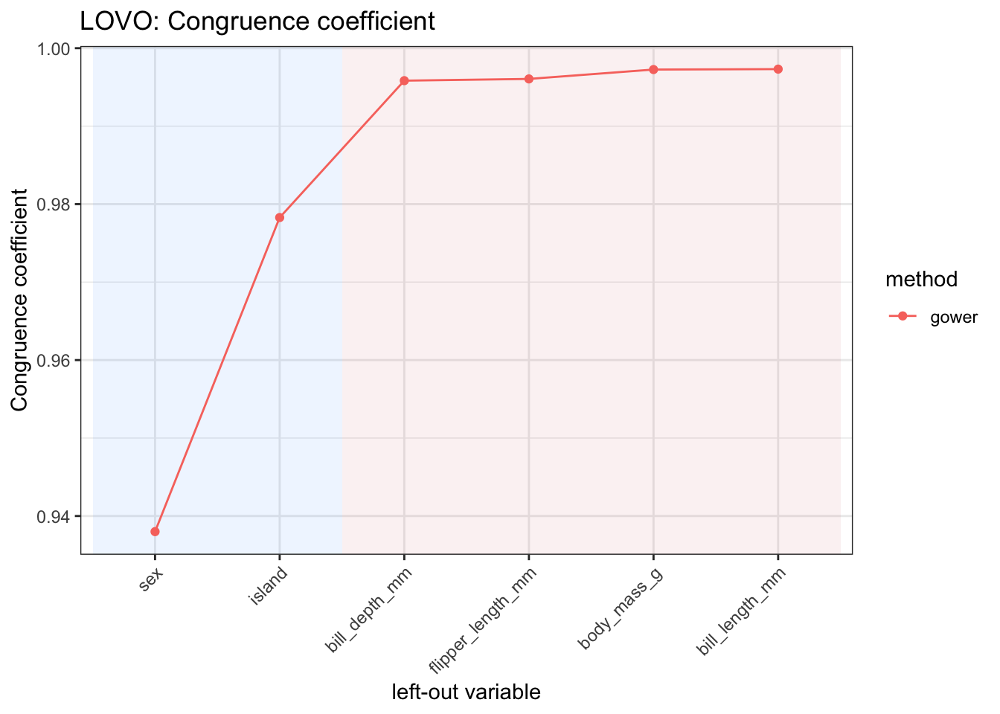
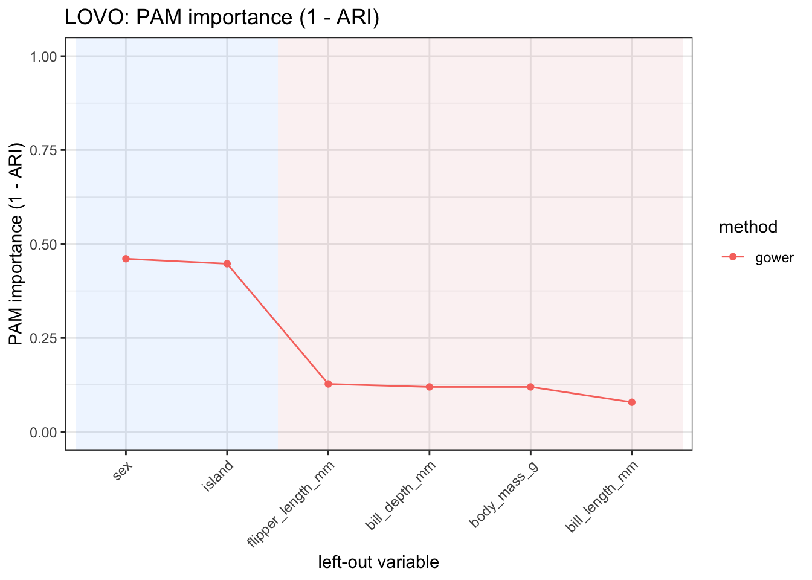
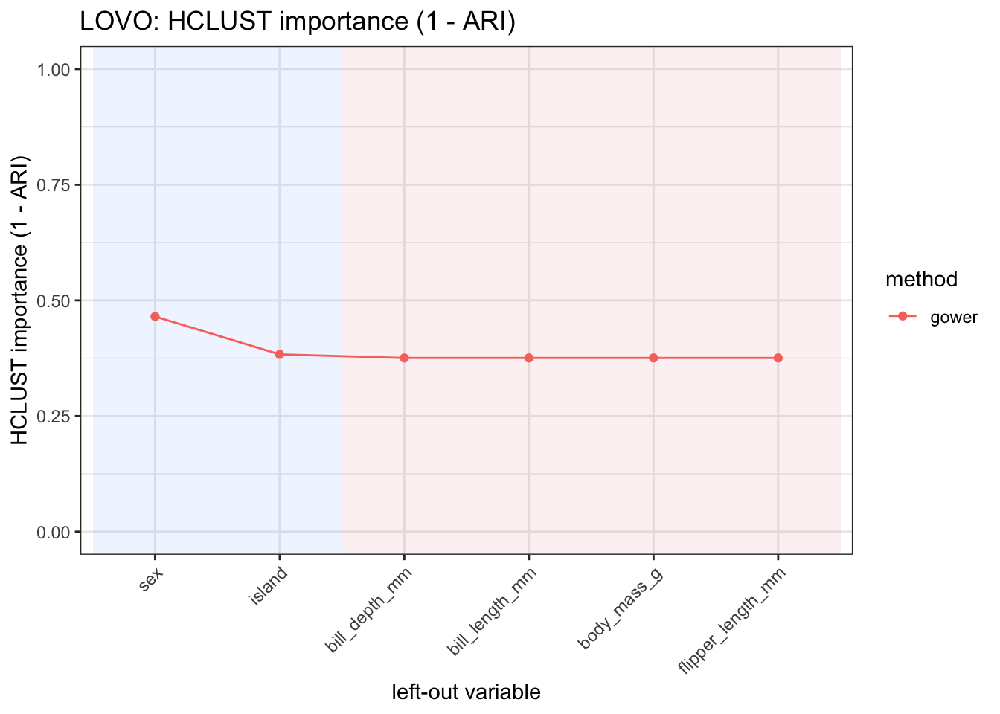
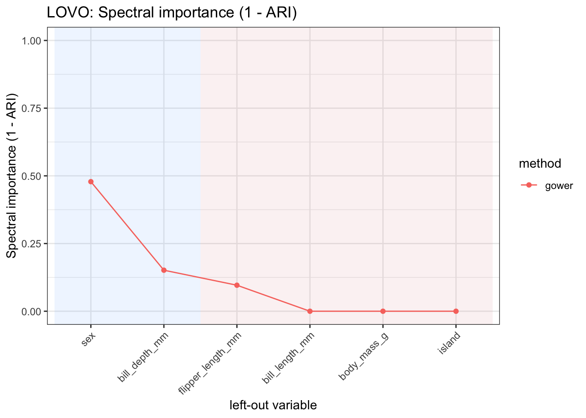
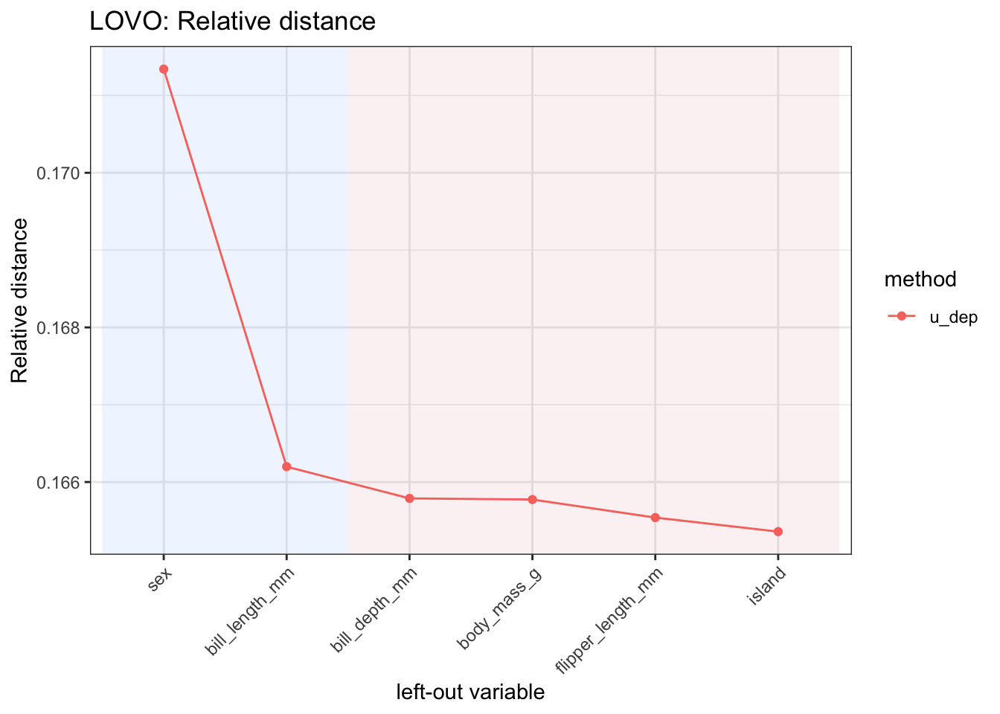
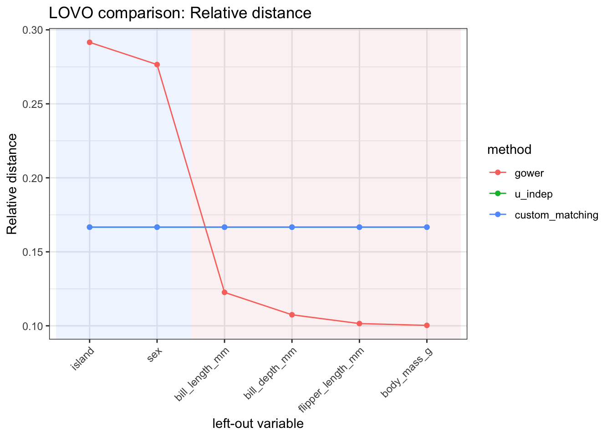
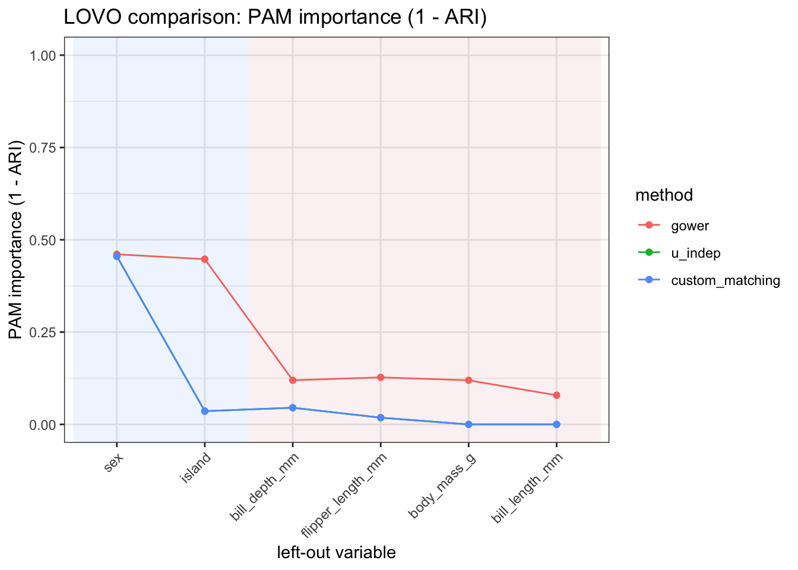

# Assessing variable contributions to distances

## 1 Setup

``` r

library(manydist)
library(dplyr)
library(tidyr)
library(kableExtra)
```

We use the `palmerpenguins` data for illustration.

``` r

penguins_small <- palmerpenguins::penguins |>
  dplyr::select(-year) |>
  tidyr::drop_na()
```

## 2 Leave-one-variable-out diagnostics

[`lovo_mdist()`](https://alfonsoiodicede.github.io/manydist_package/reference/lovo_mdist.md)
computes leave-one-variable-out diagnostics for assessing variable
contributions to a distance construction.

The function first computes the full dissimilarity matrix using all
predictors. Then, one predictor at a time, it removes a variable,
recomputes the dissimilarity matrix, and compares the reduced
dissimilarity with the full one.

Variables whose removal strongly changes the dissimilarity matrix, the
induced configuration, or the resulting clustering structure can be
interpreted as having a larger contribution to the distance
construction.

``` r

lovo_gower <- lovo_mdist(
  penguins_small,
  response = species,
  response_used = FALSE,
  preset = "gower"
)

lovo_gower
```

    MDistLOVO object
      preset : gower
      dims   : 2
      n_obs  : 333
      response used : FALSE
      top vars:
    # A tibble: 5 × 4
      variable          variable_type relative_distance mad_importance
      <chr>             <chr>                     <dbl>          <dbl>
    1 island            categorical               0.292         0.0853
    2 sex               categorical               0.277         0.0809
    3 bill_length_mm    numeric                   0.123         0.0359
    4 bill_depth_mm     numeric                   0.107         0.0314
    5 flipper_length_mm numeric                   0.102         0.0297

The result can be summarized as follows.

``` r

summary(lovo_gower)
```

    Summary of MDistLOVO
      preset : gower
      dims   : 2
      n_obs  : 333
      response used : FALSE

    Relative distance:
      range [0.1003, 0.2916], mean 0.1667

    Top by relative distance:
    # A tibble: 5 × 3
      variable          variable_type relative_distance
      <chr>             <chr>                     <dbl>
    1 island            categorical               0.292
    2 sex               categorical               0.277
    3 bill_length_mm    numeric                   0.123
    4 bill_depth_mm     numeric                   0.107
    5 flipper_length_mm numeric                   0.102

The main results are stored in the `$results` field.

``` r

lovo_gower$results |>
  kableExtra::kbl(format = "html", digits = 3) |>
  kableExtra::kable_styling(full_width = FALSE)
```

| variable | variable_type | mad_importance | cc_importance | mds_congruence | ac_importance | mad_normalized | relative_distance |
|:---|:---|---:|---:|---:|---:|---:|---:|
| island | categorical | 0.085 | 0.978 | 0.978 | 0.207 | 0.292 | 0.292 |
| bill_length_mm | numeric | 0.036 | 0.997 | 0.997 | 0.073 | 0.123 | 0.123 |
| bill_depth_mm | numeric | 0.031 | 0.996 | 0.996 | 0.091 | 0.107 | 0.107 |
| flipper_length_mm | numeric | 0.030 | 0.996 | 0.996 | 0.089 | 0.102 | 0.102 |
| body_mass_g | numeric | 0.029 | 0.997 | 0.997 | 0.074 | 0.100 | 0.100 |
| sex | categorical | 0.081 | 0.938 | 0.938 | 0.347 | 0.277 | 0.277 |

## 3 Interpreting the output

The output of
[`lovo_mdist()`](https://alfonsoiodicede.github.io/manydist_package/reference/lovo_mdist.md)
contains several diagnostics, each capturing a different aspect of the
change induced by removing a variable.

The main diagnostics can be interpreted as follows.

| metric | interpretation | contribution_direction |
|:---|:---|:---|
| mad_importance | Mean absolute difference between the full dissimilarity matrix and the leave-one-variable-out dissimilarity matrix. | Larger values indicate a larger contribution. |
| relative_distance | Normalized version of \`mad_importance\`; it reports the relative contribution of each variable. | Larger values indicate a larger contribution. |
| mds_congruence | Congruence between the MDS configuration obtained from the full distance and the one obtained after removing the variable. | Smaller values indicate a larger contribution. |
| cc_importance | Congruence coefficient between the full and reduced configurations. | Smaller values indicate a larger contribution. |
| ac_importance | Alienation coefficient between the full and reduced configurations. | Larger values indicate a larger contribution. |

The metrics are complementary. A variable may have a large effect on the
pairwise dissimilarities without substantially changing the geometric
configuration. Conversely, a variable may have a modest effect on the
average distances but still affect the configuration induced by the
distance matrix.

## 4 Visualising variable contributions

The relative contribution of each variable can be visualized with
`autoplot()`.

``` r

lovo_gower$autoplot(
  metric = "relative_distance",
  reorder = TRUE
)
```


Other metrics can be visualized by changing the `metric` argument. For
example, `ac_importance` displays the alienation coefficient.

``` r

lovo_gower$autoplot(
  metric = "ac_importance",
  reorder = TRUE
)
```



The congruence coefficient can also be displayed. Since this is an
agreement measure, smaller values indicate that removing the variable
produces a larger change in the induced configuration.

``` r

lovo_gower$autoplot(
  metric = "cc_importance",
  reorder = TRUE
)
```



## 5 Clustering-based LOVO diagnostics

[`lovo_mdist()`](https://alfonsoiodicede.github.io/manydist_package/reference/lovo_mdist.md)
can also assess how removing each variable affects cluster partitions
derived from the distance matrix.

To compute clustering-based diagnostics, the number of clusters must be
supplied through `cluster_k`. The clustering methods are controlled by
`cluster_methods`. Available options are `"pam"`, `"hclust"`, and
`"spectral"`.

In the following example, we compute clustering-based diagnostics with
three clusters.

``` r

lovo_gower_cluster <- lovo_mdist(
  penguins_small,
  response = species,
  response_used = FALSE,
  preset = "gower",
  cluster_k = 3,
  cluster_methods = c("pam", "hclust", "spectral")
)

lovo_gower_cluster
```

    MDistLOVO object
      preset : gower
      dims   : 2
      n_obs  : 333
      response used : FALSE
      cluster_k : 3
      cluster methods : pam, hclust, spectral
      hclust linkage : average
      clustering diagnostics : PAM HCLUST SPECTRAL
      top vars:
    # A tibble: 5 × 7
      variable         variable_type relative_distance mad_importance pam_importance
      <chr>            <chr>                     <dbl>          <dbl>          <dbl>
    1 island           categorical               0.292         0.0853         0.447
    2 sex              categorical               0.277         0.0809         0.461
    3 bill_length_mm   numeric                   0.123         0.0359         0.0789
    4 bill_depth_mm    numeric                   0.107         0.0314         0.120
    5 flipper_length_… numeric                   0.102         0.0297         0.127
    # ℹ 2 more variables: hclust_importance <dbl>, spectral_importance <dbl>

The corresponding results include ARI-based diagnostics for each
clustering method.

``` r

lovo_gower_cluster$results |>
  dplyr::select(
    variable,
    variable_type,
    ari_pam,
    pam_importance,
    ari_hclust,
    hclust_importance,
    ari_spectral,
    spectral_importance
  ) |>
  kableExtra::kbl(format = "html", digits = 3) |>
  kableExtra::kable_styling(full_width = FALSE)
```

| variable | variable_type | ari_pam | pam_importance | ari_hclust | hclust_importance | ari_spectral | spectral_importance |
|:---|:---|---:|---:|---:|---:|---:|---:|
| island | categorical | 0.553 | 0.447 | 0.617 | 0.383 | 1.000 | 0.000 |
| bill_length_mm | numeric | 0.921 | 0.079 | 0.624 | 0.376 | 1.000 | 0.000 |
| bill_depth_mm | numeric | 0.880 | 0.120 | 0.624 | 0.376 | 0.848 | 0.152 |
| flipper_length_mm | numeric | 0.873 | 0.127 | 0.624 | 0.376 | 0.904 | 0.096 |
| body_mass_g | numeric | 0.880 | 0.120 | 0.624 | 0.376 | 1.000 | 0.000 |
| sex | categorical | 0.539 | 0.461 | 0.535 | 0.465 | 0.521 | 0.479 |

The ARI columns compare the partition obtained from the full distance
matrix with the partition obtained after removing each variable. Since
ARI is an agreement measure, smaller values indicate a stronger change
in the clustering structure.

The corresponding importance columns are defined as `1 - ARI`.
Therefore, larger values of `pam_importance`, `hclust_importance`, and
`spectral_importance` indicate a larger contribution to the clustering
structure induced by the distance.

| metric | interpretation | contribution_direction |
|:---|:---|:---|
| ari_pam | ARI between PAM clusters from the full and reduced distances. | Smaller values indicate a larger contribution. |
| ari_hclust | ARI between hierarchical clusters from the full and reduced distances. | Smaller values indicate a larger contribution. |
| ari_spectral | ARI between spectral clusters from the full and reduced distances. | Smaller values indicate a larger contribution. |
| pam_importance | PAM-based importance, computed as \`1 - ari_pam\`. | Larger values indicate a larger contribution. |
| hclust_importance | Hierarchical-clustering importance, computed as \`1 - ari_hclust\`. | Larger values indicate a larger contribution. |
| spectral_importance | Spectral-clustering importance, computed as \`1 - ari_spectral\`. | Larger values indicate a larger contribution. |

For example, the PAM-based importance can be visualized as follows.

``` r

lovo_gower_cluster$autoplot(
  metric = "pam_importance",
  reorder = TRUE
)
```



The same diagnostic can be inspected for hierarchical clustering.

``` r

lovo_gower_cluster$autoplot(
  metric = "hclust_importance",
  reorder = TRUE
)
```



Or for spectral clustering.

``` r

lovo_gower_cluster$autoplot(
  metric = "spectral_importance",
  reorder = TRUE
)
```



The three cluster-based diagnostics need not rank variables in exactly
the same way. A variable may be important for the partition induced by
one clustering method and less important for another. This makes
clustering-based LOVO diagnostics useful for assessing whether variable
contributions are stable across clustering algorithms.

## 6 Response-aware LOVO diagnostics

When `response_used = FALSE`, the response column is removed before
computing distances. When `response_used = TRUE`, the response can be
used by response-aware distance specifications, but it is still not
treated as a predictor in the leave-one-variable-out loop.

``` r

lovo_response <- lovo_mdist(
  penguins_small,
  response = species,
  response_used = TRUE,
  preset = "u_dep"
)

lovo_response
```

    MDistLOVO object
      preset : u_dep
      dims   : 2
      n_obs  : 333
      response used : TRUE
      top vars:
    # A tibble: 5 × 4
      variable          variable_type relative_distance mad_importance
      <chr>             <chr>                     <dbl>          <dbl>
    1 sex               categorical               0.171           1.04
    2 bill_length_mm    numeric                   0.166           1.01
    3 bill_depth_mm     numeric                   0.166           1.00
    4 body_mass_g       numeric                   0.166           1.00
    5 flipper_length_mm numeric                   0.166           1.00

The response-aware diagnostics can be inspected in the same way.

``` r

lovo_response$results |>
  kableExtra::kbl(format = "html", digits = 3) |>
  kableExtra::kable_styling(full_width = FALSE)
```

| variable | variable_type | mad_importance | cc_importance | mds_congruence | ac_importance | mad_normalized | relative_distance |
|:---|:---|---:|---:|---:|---:|---:|---:|
| island | categorical | 1.000 | 0.979 | 0.979 | 0.205 | 0.165 | 0.165 |
| bill_length_mm | numeric | 1.005 | 0.995 | 0.995 | 0.100 | 0.166 | 0.166 |
| bill_depth_mm | numeric | 1.003 | 0.979 | 0.979 | 0.203 | 0.166 | 0.166 |
| flipper_length_mm | numeric | 1.001 | 0.998 | 0.998 | 0.058 | 0.166 | 0.166 |
| body_mass_g | numeric | 1.003 | 0.991 | 0.991 | 0.136 | 0.166 | 0.166 |
| sex | categorical | 1.036 | 0.913 | 0.913 | 0.407 | 0.171 | 0.171 |

For example, the relative-distance contribution can be visualized as
follows.

``` r

lovo_response$autoplot(
  metric = "relative_distance",
  reorder = TRUE
)
```



## 7 Comparing LOVO diagnostics across distance specifications

The function
[`compare_lovo_mdist()`](https://alfonsoiodicede.github.io/manydist_package/reference/compare_lovo_mdist.md)
compares leave-one-variable-out diagnostics across several distance
specifications.

Instead of running
[`lovo_mdist()`](https://alfonsoiodicede.github.io/manydist_package/reference/lovo_mdist.md)
separately for each specification, the user supplies a named list of
methods. Each element of the list contains arguments passed to
[`lovo_mdist()`](https://alfonsoiodicede.github.io/manydist_package/reference/lovo_mdist.md),
such as `preset`, `method_cat`, `method_num`, and `commensurable`.

For each distance specification,
[`compare_lovo_mdist()`](https://alfonsoiodicede.github.io/manydist_package/reference/compare_lovo_mdist.md)
computes the full distance, recomputes the leave-one-variable-out
distances, extracts the diagnostics, and combines the results into a
single `MDistLOVOCompare` object.

``` r

lovo_compare <- compare_lovo_mdist(
  penguins_small,
  response = "species",
  response_used = FALSE,
  methods = list(
    gower = list(preset = "gower"),
    u_indep = list(preset = "u_indep"),
    custom_matching = list(
      preset = "custom",
      method_cat = "matching",
      method_num = "std",
      commensurable = TRUE
    )
  )
)

lovo_compare
```

    MDistLOVOCompare object
      methods: gower, u_indep, custom_matching
      dims   : 2
      n_obs  : 333
      rows   : 18

    Top variables within each method:
    # A tibble: 9 × 5
      method          variable       variable_type relative_distance mad_importance
      <fct>           <chr>          <chr>                     <dbl>          <dbl>
    1 gower           island         categorical               0.292         0.0853
    2 gower           sex            categorical               0.277         0.0809
    3 gower           bill_length_mm numeric                   0.123         0.0359
    4 u_indep         island         categorical               0.167         1.00
    5 u_indep         bill_length_mm numeric                   0.167         1.00
    6 u_indep         bill_depth_mm  numeric                   0.167         1.00
    7 custom_matching island         categorical               0.167         1.00
    8 custom_matching bill_length_mm numeric                   0.167         1.00
    9 custom_matching bill_depth_mm  numeric                   0.167         1.00  

The combined results are stored in the `$results` field. The table
contains one row for each combination of distance specification and
left-out variable.

``` r

lovo_compare$results |>
  dplyr::select(
    method,
    variable,
    variable_type,
    relative_distance,
    mad_importance,
    mds_congruence,
    ac_importance
  ) |>
  kableExtra::kbl(format = "html", digits = 3) |>
  kableExtra::kable_styling(full_width = FALSE)
```

| method | variable | variable_type | relative_distance | mad_importance | mds_congruence | ac_importance |
|:---|:---|:---|---:|---:|---:|---:|
| gower | island | categorical | 0.292 | 0.085 | 0.978 | 0.207 |
| gower | bill_length_mm | numeric | 0.123 | 0.036 | 0.997 | 0.073 |
| gower | bill_depth_mm | numeric | 0.107 | 0.031 | 0.996 | 0.091 |
| gower | flipper_length_mm | numeric | 0.102 | 0.030 | 0.996 | 0.089 |
| gower | body_mass_g | numeric | 0.100 | 0.029 | 0.997 | 0.074 |
| gower | sex | categorical | 0.277 | 0.081 | 0.938 | 0.347 |
| u_indep | island | categorical | 0.167 | 1.000 | 0.992 | 0.123 |
| u_indep | bill_length_mm | numeric | 0.167 | 1.000 | 0.992 | 0.123 |
| u_indep | bill_depth_mm | numeric | 0.167 | 1.000 | 0.993 | 0.120 |
| u_indep | flipper_length_mm | numeric | 0.167 | 1.000 | 0.995 | 0.099 |
| u_indep | body_mass_g | numeric | 0.167 | 1.000 | 0.995 | 0.101 |
| u_indep | sex | categorical | 0.167 | 1.000 | 0.966 | 0.260 |
| custom_matching | island | categorical | 0.167 | 1.000 | 0.992 | 0.123 |
| custom_matching | bill_length_mm | numeric | 0.167 | 1.000 | 0.992 | 0.123 |
| custom_matching | bill_depth_mm | numeric | 0.167 | 1.000 | 0.993 | 0.120 |
| custom_matching | flipper_length_mm | numeric | 0.167 | 1.000 | 0.995 | 0.099 |
| custom_matching | body_mass_g | numeric | 0.167 | 1.000 | 0.995 | 0.101 |
| custom_matching | sex | categorical | 0.167 | 1.000 | 0.966 | 0.260 |

The summary reports the range and average of the main LOVO diagnostics
within each distance specification.

``` r

summary(lovo_compare)
```

    Summary of MDistLOVOCompare
      methods: gower, u_indep, custom_matching
      dims   : 2
      n_obs  : 333

    # A tibble: 3 × 13
      method       mad_min mad_max mad_mean rel_min rel_max rel_mean mds_min mds_max
      <fct>          <dbl>   <dbl>    <dbl>   <dbl>   <dbl>    <dbl>   <dbl>   <dbl>
    1 gower         0.0293  0.0853   0.0488   0.100   0.292    0.167   0.938   0.997
    2 u_indep       1.000   1.00     1.00     0.167   0.167    0.167   0.966   0.995
    3 custom_matc…  1.000   1.00     1.00     0.167   0.167    0.167   0.966   0.995
    # ℹ 4 more variables: mds_mean <dbl>, ac_min <dbl>, ac_max <dbl>, ac_mean <dbl>

The comparison object also has an `autoplot()` method. This makes it
possible to compare the contribution profiles induced by different
distance specifications.

``` r

lovo_compare$autoplot(
  metric = "relative_distance",
  reorder = TRUE
)
```



A comparison can also include clustering-based diagnostics by passing
`cluster_k` and, optionally, `cluster_methods`.

``` r

lovo_compare_cluster <- compare_lovo_mdist(
  penguins_small,
  response = "species",
  response_used = FALSE,
  cluster_k = 3,
  cluster_methods = c("pam", "hclust", "spectral"),
  methods = list(
    gower = list(preset = "gower"),
    u_indep = list(preset = "u_indep"),
    custom_matching = list(
      preset = "custom",
      method_cat = "matching",
      method_num = "std",
      commensurable = TRUE
    )
  )
)

lovo_compare_cluster
```

    MDistLOVOCompare object
      methods: gower, u_indep, custom_matching
      dims   : 2
      n_obs  : 333
      rows   : 18

    Top variables within each method:
    # A tibble: 9 × 8
      method  variable variable_type relative_distance mad_importance pam_importance
      <fct>   <chr>    <chr>                     <dbl>          <dbl>          <dbl>
    1 gower   island   categorical               0.292         0.0853         0.447
    2 gower   sex      categorical               0.277         0.0809         0.461
    3 gower   bill_le… numeric                   0.123         0.0359         0.0789
    4 u_indep island   categorical               0.167         1.00           0.0359
    5 u_indep bill_le… numeric                   0.167         1.00           0
    6 u_indep bill_de… numeric                   0.167         1.00           0.0452
    7 custom… island   categorical               0.167         1.00           0.0359
    8 custom… bill_le… numeric                   0.167         1.00           0
    9 custom… bill_de… numeric                   0.167         1.00           0.0452
    # ℹ 2 more variables: hclust_importance <dbl>, spectral_importance <dbl>

The resulting object includes the ARI-based diagnostics for the selected
clustering methods.

``` r

lovo_compare_cluster$results |>
  dplyr::select(
    method,
    variable,
    variable_type,
    pam_importance,
    hclust_importance,
    spectral_importance
  ) |>
  kableExtra::kbl(format = "html", digits = 3) |>
  kableExtra::kable_styling(full_width = FALSE)
```

| method | variable | variable_type | pam_importance | hclust_importance | spectral_importance |
|:---|:---|:---|---:|---:|---:|
| gower | island | categorical | 0.447 | 0.383 | 0.000 |
| gower | bill_length_mm | numeric | 0.079 | 0.376 | 0.000 |
| gower | bill_depth_mm | numeric | 0.120 | 0.376 | 0.152 |
| gower | flipper_length_mm | numeric | 0.127 | 0.376 | 0.096 |
| gower | body_mass_g | numeric | 0.120 | 0.376 | 0.000 |
| gower | sex | categorical | 0.461 | 0.465 | 0.479 |
| u_indep | island | categorical | 0.036 | 0.000 | 0.000 |
| u_indep | bill_length_mm | numeric | 0.000 | 0.000 | 0.000 |
| u_indep | bill_depth_mm | numeric | 0.045 | 0.000 | 0.018 |
| u_indep | flipper_length_mm | numeric | 0.018 | 0.000 | 0.000 |
| u_indep | body_mass_g | numeric | 0.000 | 0.000 | 0.000 |
| u_indep | sex | categorical | 0.455 | 0.405 | 0.435 |
| custom_matching | island | categorical | 0.036 | 0.000 | 0.000 |
| custom_matching | bill_length_mm | numeric | 0.000 | 0.000 | 0.000 |
| custom_matching | bill_depth_mm | numeric | 0.045 | 0.000 | 0.018 |
| custom_matching | flipper_length_mm | numeric | 0.018 | 0.000 | 0.000 |
| custom_matching | body_mass_g | numeric | 0.000 | 0.000 | 0.000 |
| custom_matching | sex | categorical | 0.455 | 0.405 | 0.435 |

For example, the following plot compares PAM-based cluster importance
across the selected distance specifications.

``` r

lovo_compare_cluster$autoplot(
  metric = "pam_importance",
  reorder = TRUE
)
```



The comparison is useful because variable contributions are not absolute
properties of the data alone. They also depend on the distance
specification. A variable that is highly influential under one distance
may have a smaller contribution under another specification, especially
when the two distances encode different assumptions about scaling,
variable type, commensurability, or association.

## 8 Summary

[`lovo_mdist()`](https://alfonsoiodicede.github.io/manydist_package/reference/lovo_mdist.md)
provides complementary diagnostics for assessing variable contributions
to distance construction.

Distance-based diagnostics measure how much the dissimilarity matrix
changes when a variable is removed. Configuration-based diagnostics
assess how much the induced MDS representation changes. Clustering-based
diagnostics compare the partitions obtained from the full and reduced
distances, using PAM, hierarchical clustering, or spectral clustering.

Together, these diagnostics help identify variables that play an
important role in the distance representation and in the downstream
structures derived from it.
