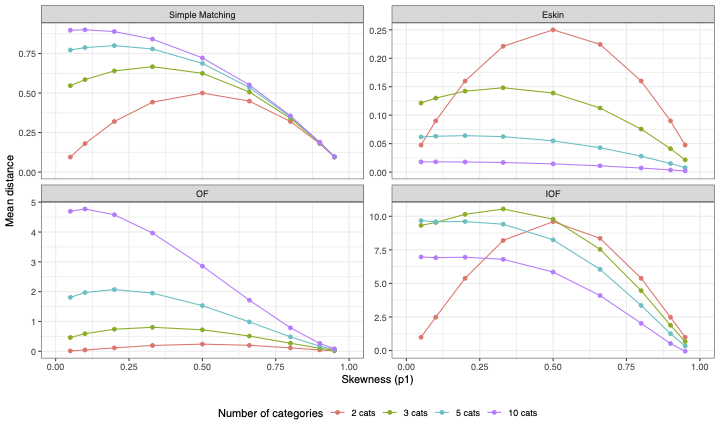
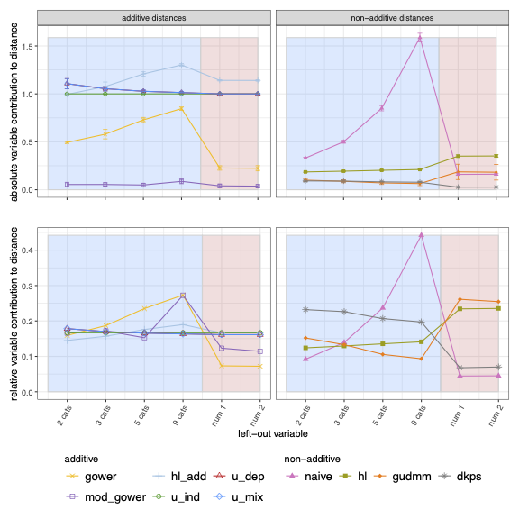
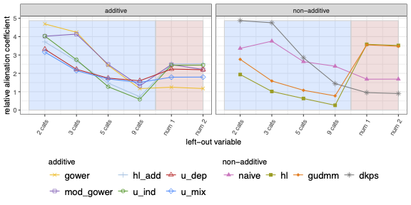
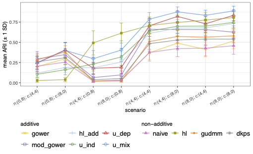
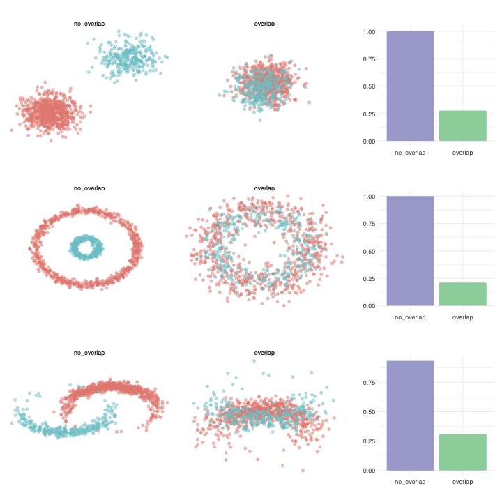
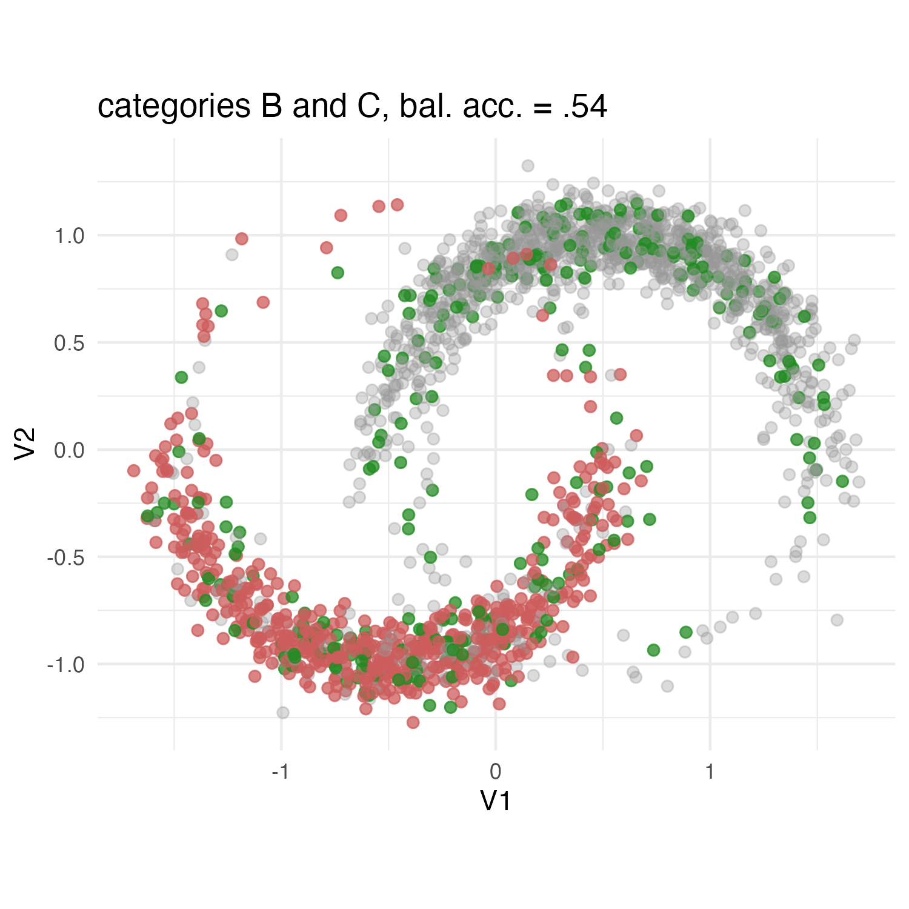
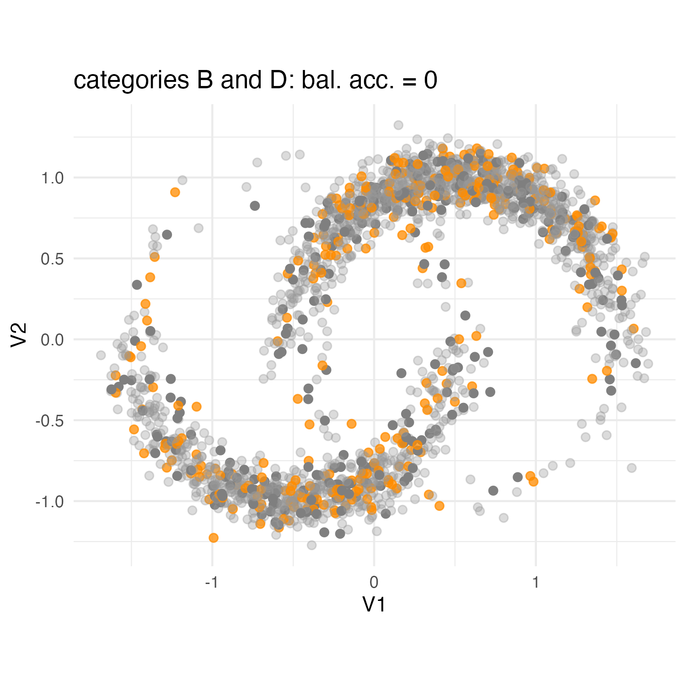
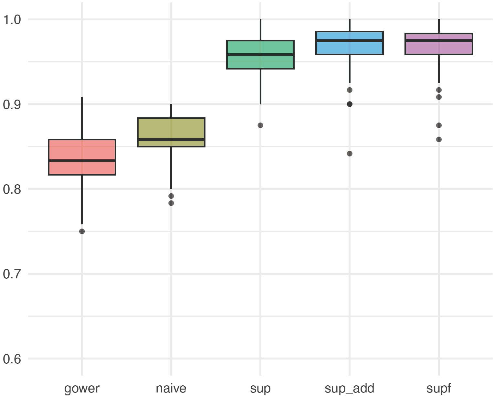

```{r}
#| include: false

library(tidyverse)
library(tidymodels)
library(ggrepel)
library(network)
library(sna)
library(GGally)
library(knitr)
library(kableExtra)
```

## Outline {.outline-slide}

::: {.outline-boxes}

::: {.outline-box .outline-1}
**1. Why distances need awareness**  
Mixed-type data and learning from dissimilarities
:::

::::{.fragment}
::: {.outline-box .outline-2}
**2. Scale/type-aware distances**  
Additivity, commensurability, and bias in mixed data
:::
::::

::::{.fragment}
::: {.outline-box .outline-3}
**3. Association-aware distances**  
Redundancy, correlations, and categorical associations
:::
::::

::::{.fragment}
::: {.outline-box .outline-4}
**4. Interaction- and response-aware extensions**  
Continuous–categorical relationships and supervised neighbourhoods
:::
::::

::::{.fragment}
::: {.outline-box .outline-5}
**5. Building distance-based pipelines: `manydist`**  
Distance construction, diagnostics, and learning workflows
:::
::::

:::


## Mixed-type data are everywhere

Most real data applications do not contain only numerical variables.

&nbsp;

::: {.callout-tip icon=false}
## tabular data
In socio-economic applications, observations are often described by a mixture of  
**measurements**, **counts**, **categories**, **ordered scales**.
:::

&nbsp;

::: {.columns}
::: {.column width="50%"}
### Numerical variables

- income
- age
- prices
- growth rates
- emissions
- employment rates
:::

::: {.column width="50%"}
### Categorical variables

- region
- education level
- occupation
- sector
- household type
- policy regime
:::
:::

## Mixed data are not just “different formats”

Continuous and categorical variables often describe **different aspects of the same phenomenon**.

&nbsp;

::: {.callout-note icon=false}
For example, income, education level, occupation, region, and sector are not independent descriptors:  
they are structurally related.
:::

&nbsp;

:::{.fragment .centered}
### the difficulty is to define a geometry that respects this structure
:::

## Why this matters for learning

Many statistical learning methods rely, explicitly or implicitly, on comparing observations.

&nbsp;

If the data are mixed-type, then comparison is not straightforward:

&nbsp;

::: {.columns}
::: {.column width="33%"}
### Scale

How do we compare variables measured in different units?
:::

::: {.column width="33%"}
### Type

How do we combine numerical differences with category mismatches?
:::

::: {.column width="33%"}
### Structure

How do we avoid counting associated information multiple times?
:::
:::

&nbsp;

:::{.fragment .centered}
### this is where distances become a modelling choice
:::


## Learning from dissimilarities


Many learning methods can operate directly on a dissimilarity matrix.

&nbsp;

### [Dimension reduction]{style="color:#2A9D8F"}: multidimensional scaling (MDS)^[@borg2005modern]

&nbsp;

### [Clustering methods]{style="color:#2A9D8F"}: hierarchical clustering (HC), partitioning around medoids (PAM)^[@kaufman2009finding], and spectral clustering^[@ng2002spectral]

&nbsp;

### [Prediction methods]{style="color:#2A9D8F"}: nearest-neighbour classification and nearest-neighbour averaging for regression

&nbsp;

:::{.fragment .centered}
### the [dissimilarity]{style="color:#E76F51"} measure of choice defines the [geometry]{style="color:#E76F51"} of the analysis
:::

## 

building pairwise dissimilarities: **intuition**

2 continuous variables: add up by-variable  (absolute value or squared) differences 

```{r}
toy_data <- tibble(
  X1 = c(5, 3, 7),     
  X2 = c(1, 4, 2),     
  X3   = factor(c("purple", "blue", "gold")), 
  X4   = factor(c("A", "B", "C")) 
)  
```


```{r}
toy_data |> 
  ggplot(aes(x=X1,y=X2,label=X4)) +
  geom_point(size=8) + geom_text(color="white") +
  geom_point(inherit.aes = FALSE,aes(x=X1,y=0),color="#2A9D8F",size=4,alpha=.001)+
  geom_point(inherit.aes = FALSE,aes(x=0,y=X2),color="forestgreen",size=4,alpha=.001)+theme_void()

```


## building pairwise dissimilarities: **intuition**

2 continuous variables: add up by-variable  (absolute value or squared) differences

```{r}
toy_data |> 
  ggplot(aes(x=X1,y=X2,label=X4)) +
  geom_point(size=8) + geom_text(color="white") +
  geom_point(inherit.aes = FALSE,aes(x=X1,y=0),color="#2A9D8F",size=4)+
  geom_point(inherit.aes = FALSE,aes(x=0,y=X2),color="forestgreen",size=4)+theme_void()
```


## building pairwise dissimilarities: **intuition**


2 continuous variables: add up by-variable  (absolute value or squared) differences 

```{r}
toy_data |> 
  ggplot(aes(x=X1,y=X2,label=X4)) +
  geom_point(size=8) + geom_text(color="white") +
  # geom_point(inherit.aes = FALSE,aes(x=X1,y=0),color="#2A9D8F",size=4)+
  # geom_point(inherit.aes = FALSE,aes(x=0,y=X2),color="forestgreen",size=4)+
  geom_line(data=toy_data |> filter(X4 %in%c("A","B")), 
               inherit.aes = FALSE,aes(x=X1,y=0),color="#2A9D8F",size=2)+
  geom_line(data=toy_data |> filter(X4 %in%c("A","B")), 
               inherit.aes = FALSE,aes(y=X2,x=0),color="forestgreen",size=2)+
  annotate("label",x=2, y=2,label="d(A,B)",size=10)+theme_void()
  
```


## building pairwise dissimilarities: **intuition**


2 continuous variables: add up by-variable  (absolute value or squared) differences 

```{r}
toy_data |> 
  ggplot(aes(x=X1,y=X2,label=X4)) +
  geom_point(size=8) + geom_text(color="white") +
  # geom_point(inherit.aes = FALSE,aes(x=X1,y=0),color="#2A9D8F",size=4)+
  # geom_point(inherit.aes = FALSE,aes(x=0,y=X2),color="forestgreen",size=4)+
  geom_line(data=toy_data |> filter(X4 %in%c("A","C")), 
               inherit.aes = FALSE,aes(x=X1,y=0),color="#2A9D8F",size=2)+
  geom_line(data=toy_data |> filter(X4 %in%c("A","C")), 
               inherit.aes = FALSE,aes(y=X2,x=0),color="forestgreen",size=2)+
  annotate("label",x=2, y=2,label="d(A,C)",size=10)+theme_void()
  
```


## building pairwise dissimilarities: **intuition**  


2 continuous variables: add up by-variable  (absolute value or squared) differences 

```{r}
toy_data |> 
  ggplot(aes(x=X1,y=X2,label=X4)) +
  geom_point(size=8) + geom_text(color="white") +
  # geom_point(inherit.aes = FALSE,aes(x=X1,y=0),color="#2A9D8F",size=4)+
  # geom_point(inherit.aes = FALSE,aes(x=0,y=X2),color="forestgreen",size=4)+
  geom_line(data=toy_data |> filter(X4 %in%c("B","C")), 
               inherit.aes = FALSE,aes(x=X1,y=0),color="#2A9D8F",size=2)+
  geom_line(data=toy_data |> filter(X4 %in%c("B","C")), 
               inherit.aes = FALSE,aes(y=X2,x=0),color="forestgreen",size=2)+
  annotate("label",x=2, y=2,label="d(B,C)",size=10)+theme_void()
  
```


## building pairwise dissimilarities: **intuition**


2 continuous and 1 categorical variables 

```{r}
toy_data |> 
  ggplot(aes(x=X1,y=X2,label=X4,color=as.character(X3))) +
  geom_point(size=8) + geom_text(color="white") +
  geom_point(inherit.aes = FALSE,aes(x=X1,y=0),color="#2A9D8F",size=4,alpha=.001)+
  geom_point(inherit.aes = FALSE,aes(x=0,y=X2),color="forestgreen",size=4,alpha=.001)+
  scale_color_identity()+theme_void()+
  theme(legend.position="none")


```

## building pairwise dissimilarities: **intuition**


one might consider [purple]{style="color:purple"} and [blue]{style="color:blue"}  *closer* than e.g. [purple]{style="color:purple"} and [yellow]{style="color:gold"}

```{r}
toy_data |> 
  ggplot(aes(x=X1,y=X2,label=X4,color=as.character(X3))) +
  geom_point(size=8) + geom_text(color="white") +
  geom_point(inherit.aes = FALSE,aes(x=X1,y=0),color="#2A9D8F",size=4,alpha=.001)+
  geom_point(inherit.aes = FALSE,aes(x=0,y=X2),color="forestgreen",size=4,alpha=.001)+
  scale_color_identity()+theme_void()+
  theme(legend.position="none")


```


## Desirable properties [^1]

::: {.callout-tip appearance="simple" icon=false}
## Multivariate Additivity

Let $\mathbf{x}_i=\left(x_{i1}, \dots, x_{iQ}\right)$ denote a $Q-$dimensional vector. A distance function $d\left(\mathbf{x}_i,\mathbf{x}_\ell\right)$ between observations $i$ and $\ell$ is multivariate [additive]{.text-coral} if

$$
      d\left(\mathbf{x}_i,\mathbf{x}_\ell\right)=\sum_{j=1}^{Q} d_j\left(\mathbf{x}_i,\mathbf{x}_\ell\right),
$$

  where $d_j\left(\mathbf{x}_i,\mathbf{x}_\ell\right)$ denotes the $j-$th variable specific distance.

:::

- **Manhattan** distance satisfies the additivity property; the **Euclidean** distance does not


[^1]: [@vdv_jcgs]

## Desirable properties

If additivity holds, by-variable distances are added together: they should be on equivalent scales

. . .

::: {.callout-note appearance="simple" icon=false}
## Commensurability

Let ${\boldsymbol X}_i =\left(X_{i1}, \dots, X_{iQ}\right)$ denote a $Q-$dimensional random variable corresponding to an observation $i$. Furthermore, let $d_{j}$ denote the distance function corresponding to the $j-$th variable. 

We have [commensurability]{.text-coral} if,
for all $j$, and $i \neq \ell$, 

$$
    E[d_{j}({ X}_{ij}, {X}_{\ell j})] = c,
$$

where $c$ is some constant. 
:::


## Desirable properties

If the multivariate distance function $d(\cdot,\cdot)$ satisfies additivity and commensurability, then 
*ad hoc* distance functions can be used for each variable and then aggregated.

:::{.columns}

::::{.column width=10%}
&nbsp;

then
::::

::::{.column width=90%}
>
>   one can pick the appropriate $d_{j}(\cdot,\cdot)$, given the nature of $X_{j}$ 
>
>    - [well suited in the mixed data case]{.text-coral} 
>
::::

:::

## Mixed-data setup

::: {.callout-tip appearance="simple" icon=false}
## a [mixed]{.text-teal} data set

-   $I$ observations described by $Q$ variables,  $Q_{n}$ numerical  and $Q_{c}$ categorical

-   the $I\times Q$ data matrix ${\bf X}=\left[{\bf X}_{n},{\bf X}_{c}\right]$ is column-wise partitioned
:::


A formulation for mixed distance between observations $i$ and $\ell$:

\begin{eqnarray}\label{genmixeddist_formula}
    d\left(\mathbf{x}_i,\mathbf{x}_\ell\right)&=& \sum_{j_n=1}^{Q_n} d_{j_n}\left(\mathbf{x}^n_i,\mathbf{x}^n_\ell\right)+ \sum_{j_c=1}^{Q_c} d_{j_c}\left(\mathbf{x}^c_i,\mathbf{x}^c_\ell\right)=\\
    &=& \sum_{j_n=1}^{Q_n} w_{j_n} \delta^n_{j_n}\left(\mathbf{x}^n_i,\mathbf{x}^n_\ell\right)+ \sum_{j_c=1}^{Q_c} w_{j_c}\delta^c_{j_c}\left(\mathbf{x}^c_i,\mathbf{x}^c_\ell\right)
\end{eqnarray}

:::{.columns}
::::{.column width=45%}

:::{.callout-note appearance="simple" icon=false}
## numeric case
- $\delta^n_{j_n}$ is a function quantifying the dissimilarity between observations on the $j_n-$th numerical variable

- $w_{j_n}$ is a  weight for the $j_n-$th variable.
:::
::::

::::{.column width=45%}
:::{.callout-important appearance="simple" icon=false}
## categorical case
 dissimilarity between the categories chosen by subjects $i$ and $\ell$ for categorical variable $j_c$

- $w_{j_c}$ is a  weight for the $j_c-$th variable
:::
::::
:::


## Distributions, scaling and bias: the numeric case

:::{.columns}

::::{.column width=40%}

::: {.callout-note appearance="simple" icon=false}

## Synthetic data

- $I=500$ observations from `normal`, `uniform`, `skewed`, and `bimodal` distributions

- `skewed` refers to a $\chi^2_{1/2}$ distribution 

- `bimodal`: $n/2$ draws from $\chi^2_{1/2}$, censored at $10$, and $n/2$ draws from $10-\chi^2_{1/2}$, censored at $0$

:::

::::

::::{.column width=60%}

```{r, fig.height=7}

tibble(
  normal  = c(1.13, 0.19, 0.84),
  uniform = c(1.15, 0.33, 0.67),
  skewed  = c(0.77, 0.09, 1.49),
  bimodal = c(1.06, 0.49, 0.50),
  scaling = c("std", "range", "robust")
) |> 
  pivot_longer(
    cols = 1:4,
    names_to = "distribution",
    values_to = "average_distance"
  ) |> 
  mutate(
    distribution = fct_inorder(distribution),
    scaling = fct_inorder(scaling)
  ) |> 
  ggplot(aes(
    x = distribution,
    y = average_distance,
    fill = distribution
  )) + 
  geom_col(alpha = 0.75, width = 0.7) +
  facet_grid(scaling ~ .) +
  scale_fill_manual(
    values = c(
      "normal"  = "#5B7F86",
      "uniform" = "#2A9D8F",
      "skewed"  = "#E76F51",
      "bimodal" = "#E9C46A"
    )
  ) +
  labs(
    x = NULL,
    y = "Expected distance"
  ) +
  theme_minimal(base_size = 16) +
  theme(
    legend.position = "none",
    strip.text = element_text(face = "bold", color = "#5B7F86"),
    axis.title.y = element_text(face = "bold", color = "#1F2D33"),
    axis.text.x = element_text(color = "#1F2D33"),
    axis.text.y = element_text(color = "#1F2D33"),
    panel.grid.major.x = element_blank(),
    panel.grid.minor = element_blank()
  )
```

::::

:::  

:::{.incremental}

as long as variables have the same underlying distribution and scaling, commensurability holds

- skewed variables may be under- or over-contributing to the distance, depending on the scaling (range and robust, respectively)

  - the contribution of a variable to the overall distance may be [biased]{.text-coral}
:::


## Categorical distances: the delta framework [^2]

::: {.callout-note appearance="simple" icon=false}
## From categories to distances

Let ${\bf Z}=[{\bf Z}_1,\ldots,{\bf Z}_{Q_c}]$ be the one-hot encoding of the categorical variables.

The pairwise categorical distance matrix can be written as

$${\bf D}_{c}={\bf Z}{\bf \Delta}{\bf Z}^{\sf T}= 
\left[\begin{array}{ccc} {\bf Z}_{1} & \dots & {\bf Z}_{Q_{c}} \end{array} \right]\left[\begin{array}{ccc}
{\bf\Delta}_1  & & \\ 
& \ddots &\\
& & {\bf\Delta}_{Q_{c}} \end{array} \right] \left[ \begin{array}{c}
{\bf Z}_{1}^{\sf T}\\
\vdots \\
{\bf Z}_{Q_{c}}^{\sf T}
\end{array} \right]$$
:::

- each ${\bf \Delta}_j$ defines the dissimilarity between the categories of variable \(j\)

- different choices of ${\bf \Delta}_j$ imply different categorical distance measures

- therefore, categorical distances can also suffer from scale and frequency-driven bias


[^2]: [@vdv_pr]


##

[**distributions, scaling and bias: the categorical case** ]{style="color:indianred"}

```{r}
#| echo: false
library(knitr)
library(kableExtra)

# Create the table data
data <- tibble(
  Distance = c(
    "Matching", "Eskin", "Occurrence frequency (OF)", "Inverse OF",
    "no scaling", "Hennig-Liao scaling",
    "St. dev. scaling", "Cat. dissim. scaling",
    "Total Variance", "Kullback-Leibler (Le & Ho)"
  ),
  `Cat. dissimilarity` = c(
    "$\\boldsymbol{\\Delta}_m = \\mathbf{1} \\mathbf{1}^{\\top} - \\mathbf{I}$",
    "$\\boldsymbol{\\Delta}_e = \\frac{2}{q^2}\\boldsymbol{\\Delta}_m$",
    "$\\boldsymbol{\\Delta}_{OF} = \\log^2(q)\\boldsymbol{\\Delta}_m$",
    "$\\boldsymbol{\\Delta}_{IOF} = \\log^2\\left(\\frac{I}{q}\\right) \\boldsymbol{\\Delta}_m$",
    "$\\boldsymbol{\\Delta}_{d}=2\\boldsymbol{\\Delta}_m$",
    "$\\boldsymbol{\\Delta}_{HL} = \\sqrt{\\frac{2q}{q-1}}\\boldsymbol{\\Delta}_m$",
    "$\\boldsymbol{\\Delta}_{s}=2\\sqrt{\\frac{q}{q-1}}\\boldsymbol{\\Delta}_m$",
    "$\\boldsymbol{\\Delta}_{cds}=\\frac{q}{q-1}\\boldsymbol{\\Delta}_m$",
    "$\\boldsymbol{\\Delta}_{tvd} = \\boldsymbol{\\Delta}_m$",
    "$\\boldsymbol{\\Delta}_{KL} = \\kappa\\boldsymbol{\\Delta}_m$"
  ),
  `$E[d(X_i, X_{\\ell})]$` = c(
    "$\\frac{q-1}{q}$", "$\\frac{2(q-1)}{q^3}$",
    "$\\log^2(q)\\frac{q-1}{q}$", "$\\log^2\\left(\\frac{I}{q}\\right)\\frac{q-1}{q}$",
    "$\\frac{2(q-1)}{q}$", "$\\sqrt{\\frac{2\\left(q-1\\right)}{q}}$",
    "$2\\sqrt{\\frac{(q-1)}{q}}$", "$1$", "$\\frac{q-1}{q}$",
    "$\\kappa\\frac{q-1}{q}$"
  ),
  `$q=2$` = c(
    "0.5", "0.250", "0.240", "9.601", "1", "1", "1.414", "1", "0.5", "8.305"
  ),
  `$q=5$` = c(
    "0.8", "0.064", "2.072", "9.610", "1.6", "1.265", "1.789", "1", "0.8", "13.288"
  )
)
```


:::{.columns}

::::{.column width=45%}
::: {.callout-note appearence="simple" icon="false"}
## flat frequency distribution 

`r data |> slice(1:4) |> kable(format = "html" ) |> kable_styling(font_size = 14)`
::::

:::

::::{.column width=55%}
::: {.callout-tip appearence="simple" icon="false"}
## skewed frequency distribution 


{width=80%, fig-align="center"}

- $q\in \{2,3,5,10\}$
- $p_1 \in \{0.05,0.1,0.2,0.33, 0.5,0.66, 0.8,0.9,0.95\}$
- $p_j = (1-p_1)/(q-1)$, with $j=2,\dots,q$,

:::
::::
:::

The expected distance increases with the heterogeneity of the distribution and  with the number of categories 


## Independence-based distances

::: {.callout-note appearance="simple" icon=false}
## [Independence-based]{.text-teal} pairwise distance

No inter-variable relations are considered.

- in the continuous case: **Euclidean** or **Manhattan** distances

- in the categorical case: **Hamming** / matching distance, among many others

- in the mixed-data case: **Gower** dissimilarity index

:::{.fragment .centered}
variable contributions may be balanced, but still treated as separate sources of information
:::

:::


. . .

::: {.callout-tip appearance="simple" icon=false}
## Beyond commensurability
commensurability makes variable contributions comparable across **scales** and data **types**.

- If variables are correlated or associated, the same information may contribute repeatedly to the distance: **redundancy**
:::


:::{.fragment .centered}
### the next step is to account for the **structure** among variables
:::


## by variable differences: **independence-based**


-  When variables are correlated or associated, shared information is
effectively counted multiple times 

- inflated dissimilarities may cause potential distortions in downstream unsupervised learning tasks.


```{r}
library(tidyverse)
library(ggrepel)

cars_sel <- c("Toyota Corolla", "Cadillac Fleetwood")

mtcars_tbl <- mtcars |>
  rownames_to_column("car") |>
  mutate(
    disp_z = as.numeric(scale(disp)),
    wt_z   = as.numeric(scale(wt))
  )

# standardized matrix (consistent baseline)
Z <- mtcars_tbl |> select(disp_z, wt_z) |> as.matrix()

# Euclidean distance between selected cars (on standardized data)
seg_eucl <- mtcars_tbl |>
  filter(car %in% cars_sel) |>
  summarise(
    x    = disp_z[car == cars_sel[1]],
    y    = wt_z[car == cars_sel[1]],
    xend = disp_z[car == cars_sel[2]],
    yend = wt_z[car == cars_sel[2]],
    dist = sqrt((xend - x)^2 + (yend - y)^2)
  )

# Mahalanobis whitening (orientation-preserving) on standardized data
S <- cov(Z)
eig <- eigen(S)
U <- eig$vectors
D <- diag(eig$values)

W_pca <- Z %*% U %*% diag(1 / sqrt(diag(D))) %*% t(U)

whitened_tbl <- mtcars_tbl |>
  mutate(
    w1 = W_pca[, 1],
    w2 = W_pca[, 2]
  )

# segment in whitened space (Euclidean here == Mahalanobis in original standardized space)
seg_mah <- whitened_tbl |>
  filter(car %in% cars_sel) |>
  summarise(
    x    = w1[car == cars_sel[1]],
    y    = w2[car == cars_sel[1]],
    xend = w1[car == cars_sel[2]],
    yend = w2[car == cars_sel[2]],
    dist = sqrt((xend - x)^2 + (yend - y)^2)
  )
```

```{r}
ggplot(mtcars_tbl, aes(x = disp, y = wt)) +
  geom_point(size = 2) +
  labs(
    x = "Displacement (cu. in.)",
    y = "Weight (1000 lbs)",
    title = "Redundant continuous variables: displacement and weight",
    subtitle = "Larger cars tend to have both higher displacement and weight"
  ) +
  theme_minimal(base_size = 10)
```


## by variable differences: **independence-based**


-  When variables are correlated or associated, shared information is
effectively counted multiple times 

- inflated dissimilarities may cause potential distortions in downstream unsupervised learning tasks.


```{r}
ggplot(mtcars_tbl, aes(x = disp_z, y = wt_z)) +
  geom_point(size = 2) +
  stat_ellipse(type = "norm", level = 0.68, linewidth = .5,alpha=.25,color="indianred") +
  coord_equal() +
  labs(
    x = "Displacement (z-score)",
    y = "Weight (z-score)",
    title = "Same data after standardization",
    subtitle = "Units removed, redundancy remains"
  ) +
  theme_minimal(base_size = 10)
```


## by variable differences: **independence-based**

The [Euclidean distance]{style="color:#2A9D8F"}   $\longrightarrow$  shared information is  over-counted

```{r}
ggplot(mtcars_tbl, aes(x = disp_z, y = wt_z)) +
  geom_point(size = 2, color = "grey70") +
  stat_ellipse(type = "norm", level = 0.68, linewidth = .5,alpha=.25,color="indianred") +
  geom_point(
    data = filter(mtcars_tbl, car %in% cars_sel),
    aes(color = car),
    size = 3
  ) +
  geom_segment(
    data = seg_eucl,
    aes(x = x, y = y, xend = xend, yend = yend),
    linewidth = 1,
    arrow = arrow(length = unit(0.15, "cm")),
    inherit.aes = FALSE
  ) +
  geom_text_repel(
    data = filter(mtcars_tbl, car %in% cars_sel),
    aes(label = car, color = car),
    size = 4,
    box.padding = 0.3,
    point.padding = 0.3,
    max.overlaps = Inf,
    show.legend = FALSE
  ) +
  geom_label(
    data = seg_eucl,
    aes(x = (x + xend)/2, y = (y + yend)/2, label = paste0("d_E = ", round(dist, 2))),
    inherit.aes = FALSE,
    label.size = 0,
    alpha = 0.85
  ) +
  coord_equal() +
  labs(
    x = "Displacement (z-score)",
    y = "Weight (z-score)",
    title = "Euclidean distance (standardized) overcounts redundant information",
    subtitle = "Differences along the shared 'size' direction are counted twice"
  ) +
  theme_minimal(base_size = 10) +
  theme(legend.position = "none")
```


## accounting for inter-variable relations: **association-based**

The [Mahalanobis distance]{style="color:#2A9D8F"}  $\longrightarrow$ shared information is not over-counted


```{r}
ggplot(whitened_tbl, aes(w1, w2)) +
  geom_point(size = 2, color = "grey70") +
  stat_ellipse(type = "norm", level = 0.68, linewidth = .5,alpha=.25,color="#2A9D8F") +
  geom_point(
    data = filter(whitened_tbl, car %in% cars_sel),
    aes(color = car),
    size = 4
  ) +
  geom_segment(
    data = seg_mah,
    aes(x = x, y = y, xend = xend, yend = yend),
    linewidth = 1,
    arrow = arrow(length = unit(0.15, "cm")),
    inherit.aes = FALSE
  ) +
  geom_text_repel(
    data = filter(whitened_tbl, car %in% cars_sel),
    aes(label = car, color = car),
    size = 4,
    box.padding = 0.35,
    point.padding = 0.3,
    max.overlaps = Inf,
    show.legend = FALSE
  ) +
  geom_label(
    data = seg_mah,
    aes(x = (x + xend)/2, y = (y + yend)/2, label = paste0("d_M = ", round(dist, 2))),
    inherit.aes = FALSE,
    label.size = 0,
    alpha = 0.85
  ) +
  labs(
    title = "Mahalanobis whitening",
    subtitle = "with preserved orientation (computed on standardized variables)",
    x = "whitened dim 1",
    y = "whitened dim 2"
  ) +
  coord_equal() +
  theme_minimal(base_size = 10) +
  theme(legend.position = "none")
```

:::{.fragment .centered}
this is an **association-based** distance for continuous data
:::

## 

**association-based** pairwise distance


:::{.callout-note  title="Association-based for continuous: <span style='color: #E76F51;'>Mahalanobis distance</span>" icon=false}
 
Let ${\bf X}_{con}$  be $n\times Q_{d}$ a data matrix of $n$ observations described by $Q_{d}$ continuous variables, and let $\bf S$ the sample covariance matrix, the Mahalanobis distance matrix is

$$
{\bf D}_{mah}
= \left[\operatorname{diag}({\bf G})\,{\bf 1}_{n}^{\sf T}
+ {\bf 1}_{n}\,\operatorname{diag}({\bf G})^{\sf T}
- 2{\bf G}\right]^{\odot 1/2}
$$
 where 
 
 - $[\cdot]^{\odot 1/2}$ denotes the element-wise square root  
 
 - ${\bf G}=({\bf C}{\bf X}_{con}){\bf S}^{-1}({\bf C}{\bf X}_{con})^{\sf T}$ is the Mahalanobis Gram matrix 
 
 - ${\bf C}={\bf I}_{n}-\tfrac{1}{n}{\bf 1}_{n}{\bf 1}_{n}^{\sf T}$ is the centering operator 
 
:::


## 

**association-based** pairwise distance


:::{.callout-tip title = "Association-based for categorical: <span style='color: #E76F51;'>total variation distance (TVD)</span>[@le2005association]" icon=false}
To  distance matrix ${\bf D}_{tvd}$ can also be defined via the  **delta framework** upon properly defining the block-diagonal matrix ${\bf \Delta}$

Let ${\bf X}_{cat}$ be $n\times Q_{c}$ a data matrix of $n$ observations described by $Q_{c}$ categorical variables.

 
$$
{\bf D} = {\bf Z}{\Delta}{\bf Z}^{\sf T} 
= \left[\begin{array}{ccc} {\bf Z}_{1} & \dots & {\bf Z}_{Q_{c}} \end{array} \right]\left[\begin{array}{ccc}
                                                                                          {\bf\Delta}_1  & & \\
                                                                                          & \ddots &\\
                                                                                          & & {\bf\Delta}_{Q_{c}} \end{array} \right] \left[ \begin{array}{c}
                                                                                                                                             {\bf Z}_{1}^{\sf T}\\
                                                                                                                                             \vdots \\
                                                                                                                                             {\bf Z}_{Q_{c}}^{\sf T}
                                                                                                                                             \end{array} \right]
$$
:::


- in the framework, setting ${\Delta}_j$ determines the categorical distance measure of choice (independent- or association-based)


## 

**association-based** pairwise distance


:::{.callout-tip title="Association-based for categorical: <span style='color: #E76F51;'>total variation distance (TVD)</span> [@le2005association] (2)" icon=false}

<!-- - In the [IB]{style="color: #2A9D8F"} case, the off-diagonal elements of ${\Delta}_j$ depend only on variable $j$.  -->

<!-- - In the [AB]{style="color: indianred"} case, they depend on the association of each category pair with all other categorical variables.  -->

Consider the empirical **joint probability** distributions stored in the off-diagonal blocks of  ${\bf P}$:

$$
{\bf P} = \frac{1}{n} 
\begin{bmatrix}
{\bf Z}_1^{\sf T}{\bf Z}_1 & {\bf Z}_1^{\sf T}{\bf Z}_2 & \cdots & {\bf Z}_1^{\sf T}{\bf Z}_{Q_c} \\
\vdots & \ddots & \vdots & \vdots \\
{\bf Z}_{Q_c}^{\sf T}{\bf Z}_1 & {\bf Z}_{Q_c}^{\sf T}{\bf Z}_2 & \cdots & {\bf Z}_{Q_c}^{\sf T}{\bf Z}_{Q_c}
\end{bmatrix}.
$$

The block matrix $\bf R$  refer to the **conditional probability** distributions for each variable $j$ given each variable $i$ ($i,j=1,\ldots,Q_c$, $i\neq j$),
stored in the block matrix

$$
{\bf R} = {\bf P}_z^{-1}({\bf P} - {\bf P}_z).
$$

where ${\bf P}_z = {\bf P} \odot {\bf I}_{Q^*}$, and ${\bf I}_{Q^*}$ is the $Q^*\times Q^*$ identity matrix.

:::


## 

**association-based** pairwise distance


:::{.callout-tip title="Association-based for categorical: <span style='color: #E76F51;'>total variation distance (TVD)</span>[@le2005association] (3)" icon=false}

Let ${\bf r}^{ji}_a$ and ${\bf r}^{ji}_b$ be the rows of ${\bf R}_{ji}$, the $(j,i)$th off-diagonal block of ${\bf R}$.

The category dissimilarity between $a$ and $b$ for variable $j$ based on the total variation distance (TVD) is defined as

$$
\delta^{j}_{tvd}(a,b)
= \sum_{i\neq j}^{Q_c} w_{ji}
\Phi^{ji}({\bf r}^{ji}_{a},{\bf r}^{ji}_{b})
= \sum_{i\neq j}^{Q_c} w_{ji}
\left[\frac{1}{2}\sum_{\ell=1}^{q_i}
|{\bf r}^{ji}_{a\ell}-{\bf r}^{ji}_{b\ell}|\right],
\label{ab_delta}
$$

where $w_{ji}=1/(Q_c-1)$ for equal weighting  (can be user-defined). 

 TVD-based dissimilarity matrix is, therefore, 

$$
{\bf D}_{tvd}= {\bf Z}{\Delta}^{(tvd)}{\bf Z}^{\sf T}.
$$

:::

## From distances to data representation

Different distance definitions induce different **distance-based representations** of the same data.

::: {.callout-tip appearance="simple" icon=false}
## Same data, different representation

Changing the distance changes the **global dissimilarity structure** on which downstream learning methods rely.
:::

::: {.callout-important appearance="simple" icon=false}
## [Leave-one-variable-out]{.text-coral} diagnostics

How can we measure the contribution of each variable to this structure?

- compare the dissimilarity matrix computed with and without the variable in question
:::

## LOVO-based benchmark: evaluated distances

The benchmark compares distance definitions that differ in how they treat
**scale**, **type**, **additivity**, and **association**.

:::{.columns}

::::{.column width="50%"}

::: {.callout-tip appearance="simple" icon=false}
## Additive distances

- `baseline`: Manhattan distance on the original numerical variables

- `gower`: classical Gower dissimilarity

- `mod_gower`: modified Gower coefficients [@LYNCLP:2024]

- `hl_add`: additive version of Hennig--Liao scaling [@HennigLiao2013]

- `u_ind`: unbiased independence-based distance

- `u_dep`: unbiased association-based distance

- `u_mix`: unbiased Manhattan and TVD
:::

::::

::::{.column width="50%"}

::: {.callout-important appearance="simple" icon=false}
## Non-additive distances

- `naive`: Euclidean distance on scaled numerical variables and one-hot-encoded

- `hl`: Hennig--Liao scaling with Euclidean distance 

- `gudmm`: generalized multi-aspect distance metric for mixed-type data [@mousavi2023generalized]

- `dkps`: distance using kernel product similarity [@GT:2024]
:::

::::

:::

## LOVO-based diagnostics: what is evaluated?

For each distance and each variable $X_j$, we compare the full-data representation ${\bf D}$ with the representation obtained after removing $X_j$, that is ${\bf D}_{-j}$.

:::{.columns}

::::{.column width="50%"}

::: {.callout-note appearance="simple" icon=false}
## 1. Distance level

Numeric comparision between ${\bf D}$ and  ${\bf D}_{-j}$.

&nbsp;


- **mean absolute difference** between distance matrices.
:::

::::

::::{.column width="50%"}

::: {.callout-tip appearance="simple" icon=false}
## 2. MDS level

Compute MDS from ${\bf D}$ and from ${\bf D}_{-j}$, then compare the resulting configurations.

&nbsp;


- **alienation coefficient** between MDS representations.
:::

::::

:::

:::{.fragment .centered}
### LOVO diagnostics assess how each variable contributes to the dissimilarity structure
:::


## LOVO diagnostics: distance-level effect

::: {.callout-note appearance="simple" icon=false}
## Mean absolute difference

Variables with larger values have a stronger effect on the global dissimilarity structure.
:::

{width=100%, fig-align="center"}


## LOVO diagnostics: MDS-level effect

::: {.callout-tip appearance="simple" icon=false}
## Alienation coefficient
Higher values indicate a larger effect of $X_j$ on the MDS representation.
:::

{width=100%, fig-align="center"}

:::{.fragment}
- commensurability balances expected distance contributions, not necessarily the role of variables in every downstream representation
:::


## From diagnostics to downstream learning

LOVO diagnostics show how variables affect the distance matrix and the MDS representation.

&nbsp;

But we also want to know whether distance biases affect a downstream learning task.

::: {.callout-important appearance="simple" icon=false}
## Unsupervised classification experiment

Use each distance matrix as input to PAM and evaluate how well the resulting partition recovers the known cluster structure.
:::

## Unsupervised classification experiment

::: {.callout-note appearance="simple" icon=false}
## Data generation

- \(n = 200\) observations from \(4\) equal-sized clusters
- data generated with `genRandomClust`
- each dataset contains \(8\) numerical and \(8\) categorical variables
- categorical variables are obtained by discretizing numerical variables into \(9\) categories
- scenarios vary the number of signal and noise variables within each type
- \(100\) datasets are generated for each scenario
:::

::: {.callout-tip appearance="simple" icon=false}
## Evaluation

For each mixed-data distance, PAM is applied to the dissimilarity matrix with \(K = 4\).  
Recovery of the true cluster labels is measured using the adjusted Rand index.
:::


## PAM-based clustering results

{width=82%, fig-align="center"}

:::{.fragment}
- `hl` performs well when categorical variables are noise, but poorly when numerical variables are noise
- `gower` tends to show the opposite pattern
- `u_mix` is comparatively stable in the mixed signal/noise scenarios
:::


## Interaction-aware distances

Association-aware distances account for relations **within** variable blocks:

- continuous--continuous relations;
- categorical--categorical relations.

::: {.callout-important appearance="simple" icon=false}
## Cross-type structure

In mixed data, categorical differences may be meaningful because they are reflected in the continuous variables.
:::

:::{.fragment .centered}
### the next step is to make distances [interaction-aware]{.text-coral}
:::

## How to measure interactions

Define $\Delta^{int}$ to account for continuous--categorical interactions and use it to augment $\Delta^{tvd}$.

The mixed dissimilarity becomes

$$
{\bf D}_{mix}^{(int)}
=
{\bf D}_{mah}
+
{\bf D}_{cat}^{(int)}.
$$

where

$$
{\bf D}_{cat}^{(int)}={\bf Z}\tilde{\Delta}{\bf Z}^\top
$$

and

$$
\tilde{\Delta} = (1-\alpha)\Delta^{tvd} + \alpha \Delta^{int},
\qquad
\alpha=\frac{1}{Q_c}.
$$

## What is $\Delta^{int}$?

The entry $\delta_{int}^{j}(a,b)$ measures how much the continuous variables help discriminate between observations choosing category $a$ and those choosing category $b$ for categorical variable $j$.

. . .

::: {.callout-tip appearance="simple" icon=false}
## Category-pair classification problem

For each pair $(a,b)$:

- use the continuous variables as predictors;
- classify observations belonging to categories $a$ and $b$;
- use a nearest-neighbour rule in the continuous space.
:::

## Computing $\Delta^{int}_{j}$

For each categorical variable $j$ and each pair of categories $(a,b)$:

1. use ${\bf D}_{mah}$ to identify neighbours in the continuous space;
2. consider a proportion of neighbours, say $\hat{\pi}_{nn}=0.1$;
3. classify observations using a prior-corrected decision rule;
4. compute balanced accuracy.

$$
\delta_{int}^{j}(a,b)
=
\frac{1}{2}
\left(
\frac{\texttt{true } a}{\texttt{true } a + \texttt{false } a}
+
\frac{\texttt{true } b}{\texttt{true } b + \texttt{false } b}
\right).
$$

## Well separated or not?

{fig-align="center" width="70%"}

:::{.fragment .centered}
### high separability $\Rightarrow$ high interaction dissimilarity
:::

## Building $\Delta^{int}_{j}$

For categorical variable $j$ with $q_j$ categories, compute  
$\frac{q_j(q_j -1)}{2}$ category-pair quantities.

::: columns
::: {.column width="55%"}
:::

::: {.column width="45%"}
$$
\Delta_{int} =
\begin{pmatrix}
0 & \cdot & \cdot & \cdot \\
\cdot & 0 & \cdot & \cdot \\
\cdot & \cdot & 0 &  \cdot\\
\cdot & \cdot & \cdot & 0
\end{pmatrix}
$$
:::
:::

## Building $\Delta^{int}_{j}$

::: columns
::: {.column width="55%"}
{width=100%}
:::

::: {.column width="45%"}
$$
\Delta_{int} =
\begin{pmatrix}
0 & \color{#E76F51}{0.94} & \cdot & \cdot \\
\color{#E76F51}{0.94} & 0 & \cdot & \cdot \\
\cdot & \cdot & 0 &  \cdot\\
\cdot & \cdot & \cdot & 0
\end{pmatrix}
$$
:::
:::

## Building $\Delta^{int}_{j}$

::: columns
::: {.column width="55%"}
{width=100%}
:::

::: {.column width="45%"}
$$
\Delta_{int} =
\begin{pmatrix}
0 & 0.94 & \color{#E76F51}{0.40} & \cdot \\
0.94 & 0 & \cdot & \cdot \\
\color{#E76F51}{0.40} & \cdot & 0 &  \cdot\\
\cdot & \cdot & \cdot & 0
\end{pmatrix}
$$
:::
:::

## Building $\Delta^{int}_{j}$

::: columns
::: {.column width="55%"}
{width=100%}
:::

::: {.column width="45%"}
$$
\Delta_{int} =
\begin{pmatrix}
0 & 0.94 & 0.40 & \color{#E76F51}{0.39} \\
0.94 & 0 & \cdot & \cdot \\
0.40 & \cdot & 0 &  \cdot\\
\color{#E76F51}{0.39} & \cdot & \cdot & 0
\end{pmatrix}
$$
:::
:::

## Building $\Delta^{int}_{j}$

::: columns
::: {.column width="55%"}
{width=100%}
:::

::: {.column width="45%"}
$$
\Delta_{int} =
\begin{pmatrix}
0 & 0.94 & 0.40 & 0.39 \\
0.94 & 0 & \color{#E76F51}{0.54} & \cdot \\
0.40 & \color{#E76F51}{0.54} & 0 & \cdot  \\
0.39 & \cdot & \cdot  & 0
\end{pmatrix}
$$
:::
:::

## Building $\Delta^{int}_{j}$

::: columns
::: {.column width="55%"}
{width=100%}
:::

::: {.column width="45%"}
$$
\Delta_{int} =
\begin{pmatrix}
0 & 0.94 & 0.40 & 0.39 \\
0.94 & 0 & 0.54 & \color{#E76F51}{0.55} \\
0.40 & 0.54 & 0 & \cdot  \\
0.39 & \color{#E76F51}{0.55} & \cdot  & 0
\end{pmatrix}
$$
:::
:::

## Building $\Delta^{int}_{j}$

::: columns
::: {.column width="55%"}
{width=100%}
:::

::: {.column width="45%"}
$$
\Delta_{int} =
\begin{pmatrix}
0 & 0.94 & 0.40 & 0.39 \\
0.94 & 0 & 0.54 & 0.55 \\
0.40 & 0.54 & 0 & \color{#E76F51}{0}  \\
0.39 & 0.55 & \color{#E76F51}{0}  & 0
\end{pmatrix}
$$
:::
:::

:::{.fragment .centered}
### the interaction matrix summarizes category-pair separability in the continuous space
:::

## Why this interaction is asymmetric

We model the joint structure as

$$
f({\bf x}_{con},{\bf x}_{cat})
=
f({\bf x}_{con})
f({\bf x}_{cat}\mid {\bf x}_{con}).
$$

::: {.callout-note appearance="simple" icon=false}
The interaction term asks how categorical distinctions are reflected in the continuous geometry.
:::

## Spectral clustering: a graph partitioning problem

::: {.callout-note appearance="simple" icon=false}

## Graph representation

A graph representation of the data matrix ${\bf X}$: the aim is to cut it into $K$ groups, or clusters.

```{r, warning=FALSE, message=FALSE, fig.align="center", out.width="35%"}

set.seed(123)

net <- rgraph(4, mode = "graph", tprob = .75)

net <- network(net, directed = FALSE)

network.vertex.names(net) <- letters[1:4]

ggnet2(
  net,
  size = 12,
  color = "#2A9D8F",
  label = TRUE,
  label.size = 8,
  label.color = "white",
  edge.label = c("w_ac", "w_cb", "w_bd", "w_cd"),
  edge.label.color = "#E76F51",
  edge.label.size = 12
)
```
:::
  
  
::: {.callout-note appearance=“simple” icon=false}
## The affinity matrix ${\bf A}$

The elements ${\bf w}_{ij}$ of ${\bf A}$ are high when observations $i$ and $j$ are likely to belong to the same group, and low otherwise.


```{r}
tib_graph <- tibble(
  . = letters[1:4],
  a = c("0", "0", "w_ca", "0"),
  b = c("0", "0", "w_cb", "w_db"),
  c = c("w_ac", "w_cb", "0", "w_dc"),
  d = c("0", "w_bd", "w_cd", "0")
)

tib_graph |> 
  kbl(align = "c") |> 
  kable_styling(full_width = FALSE, font_size = 16) |> 
  kable_minimal() |>   
  column_spec(
    c(1:5),
    border_right = TRUE,
    border_left = TRUE
  ) |> 
  column_spec(
    c(2:5),
    color = "#E76F51"
  )
```

:::  


## Spectral clustering: making the graph easy to cut

An approximate solution to the graph partitioning problem:

::: {.callout-note appearance="simple" icon=false}
## From distances to affinities

Start from the pairwise distance matrix ${\bf D}$ and build the affinity matrix

$$
{\bf A}
=
\exp\left(-\frac{{\bf D}^{2}}{2\sigma^{2}}\right),
\qquad a_{ii}=0.
$$

The parameter $\sigma$ controls the neighbourhood scale.
:::

::: {.callout-tip appearance="simple" icon=false}
## Normalized graph Laplacian

The normalized affinity matrix is

$$
{\bf L}
=
{\bf D}_{r}^{-1/2}
{\bf A}
{\bf D}_{r}^{-1/2}
=
{\bf Q}{\Lambda}{\bf Q}^{\sf T},
$$

where ${\bf D}_{r}=\operatorname{diag}({\bf r})$, ${\bf r}={\bf A}{\bf 1}$, ${\bf 1}$ is an $n$-dimensional vector of ones.
:::


::: {.callout-important appearance="simple" icon=false}
## Spectral embedding

The spectral clustering solution is obtained by applying $K$-means to the rows of  
${\bf \tilde Q}$, the matrix containing the first $K$ eigenvectors of ${\bf L}$.
:::

## Why spectral clustering here?

::: {.callout-tip appearance="simple" icon=false}
Interaction-aware distances can encode local connectivity and non-convex structure.
:::

{width=45%}
{width=45%}

## Experiment: interaction-driven clusters

::: {.callout-note appearance="simple" icon=false}
## Design

- $n=500$ and $n=1000$
- six continuous variables: $V_1,\ldots,V_6$
- three categorical variables: $C_1,C_2,C_3$
- $V_4,V_5,V_6$ generated independently from $N(0,1)$
- $V_1,V_2,V_3$ generated conditionally on $C_1$ and $C_2$
:::

::: {.callout-important appearance="simple" icon=false}
## Main feature

The clusters are not defined by continuous variables alone or categorical variables alone,  
but by their **cross-type interaction**.
:::


## Interaction-aware spectral clustering results

{width=100%, fig-align="center"}

:::{.fragment}
- when the cluster structure is interaction-driven, `ab_dis_int` clearly outperforms all competitors
- `ab_dis` without interactions, Gower, modified Gower, and the naive distance remain close to chance-level separation
- the result supports the need to explicitly encode continuous--categorical interactions
:::


## Response-aware distances for KNN

KNN is usually described as a lazy learner:

- store the training data;
- compute distances from a new observation to the training observations;
- predict from the responses of the nearest neighbours.

::: {.callout-note appearance="simple" icon=false}
## Reframing KNN

The distance is not just a preprocessing choice.  
It determines the neighbourhoods used for classification or regression.
:::

:::{.fragment .centered}
### in supervised learning, the response can help define these neighbourhoods
:::


## Response-aware mixed distance

For mixed-type predictors, use a supervised distance with two components:

$$
D_{il}
=
D^n({\bf x}^n_i,{\bf x}^n_l)
+
D^c({\bf x}^c_i,{\bf x}^c_l).
$$

::: {.columns}
::: {.column width="50%"}

::: {.callout-note appearance="simple" icon=false}
## Numerical part

Use discriminant information from $y$  
to weight numerical differences.
:::

:::

::: {.column width="50%"}

::: {.callout-tip appearance="simple" icon=false}
## Categorical part

Use the association between categories and $y$  
to define category dissimilarities.
:::

:::
:::


## Numerical part: discriminant weighting

For continuous predictors, use the response to weight directions or variables.

::: {.callout-note appearance="simple" icon=false}
## Single-variable discriminant weighting

For numerical variable $j$, define the Fisher score

$$
\sigma_j = \frac{B_j}{W_j},
$$

where $B_j$ and $W_j$ are the between- and within-group variances.
:::

Then a supervised Manhattan-type distance is

$$
D^n({\bf x}^n_i,{\bf x}^n_l)
=
\sum_{j=1}^{Q_n}
\sqrt{\sigma_j}
\left|x^n_{ij}-x^n_{lj}\right|.
$$

## Categorical part: supervised TVD

For categorical predictors, compare categories through their response profiles.

Let ${\bf Z}_y$ be the indicator matrix of the response.  
The supervised profile matrix is

$$
{\bf R}_s
=
{\bf P}_d^{-1}
{\bf Z}^{\sf T}{\bf Z}_y.
$$

The supervised category dissimilarity is

$$
\delta_s^j(a,b)
=
\frac{1}{2}
\sum_{\ell=1}^{q_y}
\left|
{\bf r}_{a\ell}^{j y}
-
{\bf r}_{b\ell}^{j y}
\right|.
$$

:::{.fragment .centered}
### categories are close if they show similar response distributions
:::


## Response-aware KNN: Carseats example

::: {.callout-note appearance="simple" icon=false}
## Data

The `Carseats` data are used to predict whether sales are high.

- 7 numerical predictors
- 3 categorical predictors
- categorical predictors with 2 or 3 categories
- binary response: high vs. low sales
:::

::: {.callout-tip appearance="simple" icon=false}
## Compared distances

- `gower`: robust Manhattan + matching
- `naive`: Euclidean on scaled numerical variables and dummies
- `sup`: supervised numerical weighting + supervised TVD
- `sup_add`: additive supervised version
- `supf`: full supervised version
:::


## Response-aware KNN: Carseats results

{width=82%, fig-align="center"}

:::{.fragment}
- response-aware distances improve nearest-neighbour classification accuracy
- `sup`, `sup_add`, and `supf` are clearly above `gower` and `naive`
- the response helps define neighbourhoods that better reflect the class structure
:::


## Building distance-based pipelines: `manydist`

::: {.callout-tip appearance="simple" icon=false}
## Main idea

`manydist` provides tools to construct, diagnose, and use distances for continuous, categorical, and mixed-type data.
:::

::: {.columns}
::: {.column width="50%"}

### Distance construction

- `mdist()`, recipe step: `step_mdist()`
- presets and custom specifications
- response-aware distances

:::

::: {.column width="50%"}

### model specifications

- `lovo_mdist()`
- `nearest_neighbor_dist()`
- `pam_dist()`
- `spectral_dist()`

:::
:::

## Main references {.refs}
